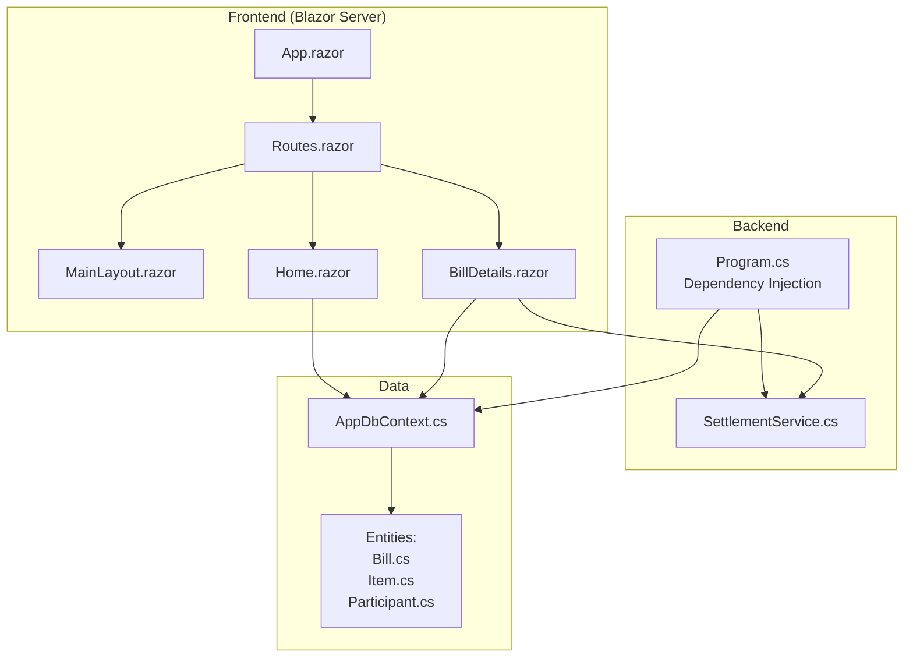
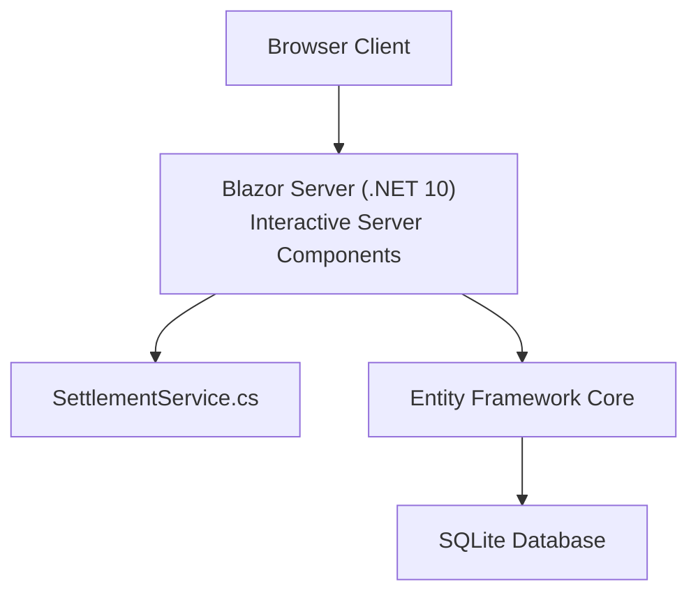
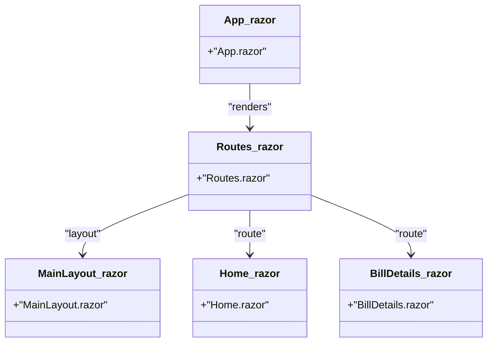
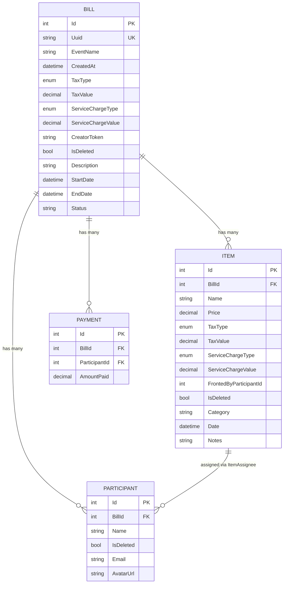
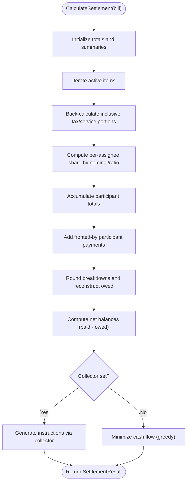
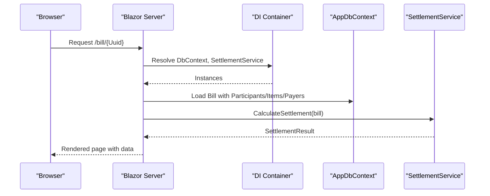
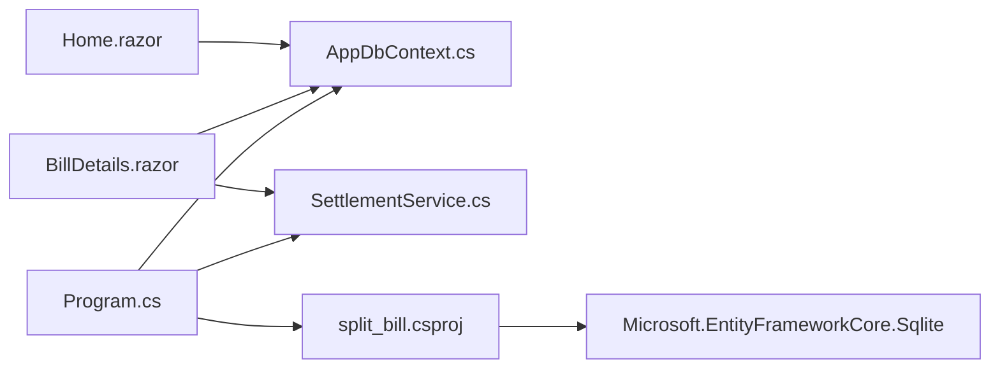

# Architecture Overview

<cite>
**Referenced Files in This Document**
- [Program.cs](file://Program.cs)
- [split_bill.csproj](file://split_bill.csproj)
- [appsettings.json](file://appsettings.json)
- [Components/App.razor](file://Components/App.razor)
- [Components/Routes.razor](file://Components/Routes.razor)
- [Components/Layout/MainLayout.razor](file://Components/Layout/MainLayout.razor)
- [Components/Pages/Home.razor](file://Components/Pages/Home.razor)
- [Components/Pages/BillDetails.razor](file://Components/Pages/BillDetails.razor)
- [Data/AppDbContext.cs](file://Data/AppDbContext.cs)
- [Data/Entities/Bill.cs](file://Data/Entities/Bill.cs)
- [Data/Entities/Item.cs](file://Data/Entities/Item.cs)
- [Data/Entities/Participant.cs](file://Data/Entities/Participant.cs)
- [Services/SettlementService.cs](file://Services/SettlementService.cs)
- [plan.md](file://plan.md)
</cite>

## Table of Contents
1. [Introduction](#introduction)
2. [Project Structure](#project-structure)
3. [Core Components](#core-components)
4. [Architecture Overview](#architecture-overview)
5. [Detailed Component Analysis](#detailed-component-analysis)
6. [Dependency Analysis](#dependency-analysis)
7. [Performance Considerations](#performance-considerations)
8. [Troubleshooting Guide](#troubleshooting-guide)
9. [Conclusion](#conclusion)
10. [Appendices](#appendices)

## Introduction
This document describes the layered architecture of SplitBill, a Blazor Server application that enables collaborative bill splitting with real-time updates. The system follows a clear separation of concerns:
- Frontend: Blazor Server interactive components with Razor components and pages
- Backend: Service layer encapsulating business logic (settlement calculations)
- Data: Entity Framework Core with SQLite for persistence
- Integration: Local storage and JavaScript interop for lightweight session authorization

The architecture emphasizes simplicity, scalability potential, and maintainability through dependency injection, layered services, and a clean data model.

## Project Structure
The solution is organized into distinct layers:
- Components: Blazor Server UI (layouts, pages, routing)
- Data: Entity model and DbContext
- Services: Business logic (settlement calculations)
- Root: Application bootstrap, project configuration, and settings



**Diagram sources**
- [Program.cs:10-16](file://Program.cs#L10-L16)
- [Components/App.razor:1-27](file://Components/App.razor#L1-L27)
- [Components/Routes.razor:1-7](file://Components/Routes.razor#L1-L7)
- [Components/Layout/MainLayout.razor:1-12](file://Components/Layout/MainLayout.razor#L1-L12)
- [Components/Pages/Home.razor:1-325](file://Components/Pages/Home.razor#L1-L325)
- [Components/Pages/BillDetails.razor:1-800](file://Components/Pages/BillDetails.razor#L1-L800)
- [Data/AppDbContext.cs:1-71](file://Data/AppDbContext.cs#L1-L71)
- [Data/Entities/Bill.cs:1-38](file://Data/Entities/Bill.cs#L1-L38)
- [Data/Entities/Item.cs:1-28](file://Data/Entities/Item.cs#L1-L28)
- [Data/Entities/Participant.cs:1-21](file://Data/Entities/Participant.cs#L1-L21)
- [Services/SettlementService.cs:1-314](file://Services/SettlementService.cs#L1-L314)

**Section sources**
- [Program.cs:1-73](file://Program.cs#L1-L73)
- [split_bill.csproj:1-34](file://split_bill.csproj#L1-L34)
- [Components/App.razor:1-27](file://Components/App.razor#L1-L27)
- [Components/Routes.razor:1-7](file://Components/Routes.razor#L1-L7)
- [Components/Layout/MainLayout.razor:1-12](file://Components/Layout/MainLayout.razor#L1-L12)
- [Components/Pages/Home.razor:1-325](file://Components/Pages/Home.razor#L1-L325)
- [Components/Pages/BillDetails.razor:1-800](file://Components/Pages/BillDetails.razor#L1-L800)
- [Data/AppDbContext.cs:1-71](file://Data/AppDbContext.cs#L1-L71)
- [Data/Entities/Bill.cs:1-38](file://Data/Entities/Bill.cs#L1-L38)
- [Data/Entities/Item.cs:1-28](file://Data/Entities/Item.cs#L1-L28)
- [Data/Entities/Participant.cs:1-21](file://Data/Entities/Participant.cs#L1-L21)
- [Services/SettlementService.cs:1-314](file://Services/SettlementService.cs#L1-L314)

## Core Components
- Blazor Server entry and DI registration
  - Registers interactive server components, Entity Framework with SQLite, and the settlement service
  - Configures development lifecycle to drop/create schema and sets server URL
- Data layer
  - AppDbContext defines DbSet<T> for Bill, Participant, Item, ItemAssignee, Payer
  - Applies soft-delete filters and cascade deletes on parent-child relationships
- Service layer
  - SettlementService computes totals, tax/service breakdowns, per-person owed/paid, and transfer instructions
- Frontend pages
  - Home.razor: landing page and bill creation flow
  - BillDetails.razor: interactive bill editor, settlement summary, and real-time calculations

**Section sources**
- [Program.cs:10-16](file://Program.cs#L10-L16)
- [Program.cs:27-53](file://Program.cs#L27-L53)
- [Data/AppDbContext.cs:12-16](file://Data/AppDbContext.cs#L12-L16)
- [Data/AppDbContext.cs:26-34](file://Data/AppDbContext.cs#L26-L34)
- [Data/AppDbContext.cs:36-69](file://Data/AppDbContext.cs#L36-L69)
- [Services/SettlementService.cs:55-232](file://Services/SettlementService.cs#L55-L232)
- [Components/Pages/Home.razor:257-288](file://Components/Pages/Home.razor#L257-L288)
- [Components/Pages/BillDetails.razor:1-800](file://Components/Pages/BillDetails.razor#L1-L800)

## Architecture Overview
SplitBill employs a layered architecture:
- Presentation layer: Blazor Server interactive components render UI and orchestrate user actions
- Service layer: SettlementService encapsulates business rules for bill settlement
- Data access layer: AppDbContext manages entities and relationships with EF Core
- Persistence: SQLite database file managed by EF Core migrations and development initialization



**Diagram sources**
- [Program.cs:10-16](file://Program.cs#L10-L16)
- [Program.cs:13-14](file://Program.cs#L13-L14)
- [Services/SettlementService.cs:1-314](file://Services/SettlementService.cs#L1-L314)
- [Data/AppDbContext.cs:1-71](file://Data/AppDbContext.cs#L1-L71)
- [plan.md:25-30](file://plan.md#L25-L30)

## Detailed Component Analysis

### Blazor Server Frontend Architecture
- Routing and layout
  - Routes.razor configures route discovery and layout assignment
  - MainLayout.razor provides a shared layout scaffold
  - App.razor wires head outlet, static assets, and script loading for interactive rendering
- Pages
  - Home.razor handles bill creation, persists a new Bill with Uuid and CreatorToken, and navigates to the bill details page
  - BillDetails.razor loads a bill by Uuid, determines creator/viewer access via local storage interop, and renders expenses, members, and settlement summary
- Component hierarchy
  - App.razor hosts Routes.razor
  - Routes.razor renders MainLayout.razor and page content
  - Pages consume injected services and DbContext for data operations



**Diagram sources**
- [Components/App.razor:1-27](file://Components/App.razor#L1-L27)
- [Components/Routes.razor:1-7](file://Components/Routes.razor#L1-L7)
- [Components/Layout/MainLayout.razor:1-12](file://Components/Layout/MainLayout.razor#L1-L12)
- [Components/Pages/Home.razor:1-325](file://Components/Pages/Home.razor#L1-L325)
- [Components/Pages/BillDetails.razor:1-800](file://Components/Pages/BillDetails.razor#L1-L800)

**Section sources**
- [Components/App.razor:1-27](file://Components/App.razor#L1-L27)
- [Components/Routes.razor:1-7](file://Components/Routes.razor#L1-L7)
- [Components/Layout/MainLayout.razor:1-12](file://Components/Layout/MainLayout.razor#L1-L12)
- [Components/Pages/Home.razor:1-325](file://Components/Pages/Home.razor#L1-L325)
- [Components/Pages/BillDetails.razor:1-800](file://Components/Pages/BillDetails.razor#L1-L800)

### Data Access Layer (Entity Framework)
- AppDbContext
  - Defines strongly typed DbSets for Bill, Participant, Item, ItemAssignee, Payer
  - Applies global query filters for soft-deleted records
  - Configures cascading deletes for parent-child relationships
- Entities
  - Bill: event metadata, tax/service configuration, creator token, and navigation to Participants, Items, Payers
  - Item: pricing, tax/service configuration, fronted-by participant, and assignees
  - Participant: personal info and assigned items/payments



**Diagram sources**
- [Data/AppDbContext.cs:12-16](file://Data/AppDbContext.cs#L12-L16)
- [Data/AppDbContext.cs:26-34](file://Data/AppDbContext.cs#L26-L34)
- [Data/AppDbContext.cs:36-69](file://Data/AppDbContext.cs#L36-L69)
- [Data/Entities/Bill.cs:1-38](file://Data/Entities/Bill.cs#L1-L38)
- [Data/Entities/Item.cs:1-28](file://Data/Entities/Item.cs#L1-L28)
- [Data/Entities/Participant.cs:1-21](file://Data/Entities/Participant.cs#L1-L21)

**Section sources**
- [Data/AppDbContext.cs:1-71](file://Data/AppDbContext.cs#L1-L71)
- [Data/Entities/Bill.cs:1-38](file://Data/Entities/Bill.cs#L1-L38)
- [Data/Entities/Item.cs:1-28](file://Data/Entities/Item.cs#L1-L28)
- [Data/Entities/Participant.cs:1-21](file://Data/Entities/Participant.cs#L1-L21)

### Service Layer (SettlementService)
- Responsibilities
  - Compute food subtotal, tax, and service breakdowns
  - Distribute charges proportionally by consumption
  - Aggregate per-person totals and balances
  - Generate minimal transfer instructions using a greedy algorithm
- Inputs/Outputs
  - Input: Bill entity graph (Participants, Items, Payers)
  - Output: SettlementResult with summaries and transfer instructions



**Diagram sources**
- [Services/SettlementService.cs:55-232](file://Services/SettlementService.cs#L55-L232)
- [Services/SettlementService.cs:261-306](file://Services/SettlementService.cs#L261-L306)

**Section sources**
- [Services/SettlementService.cs:1-314](file://Services/SettlementService.cs#L1-L314)

### Dependency Injection Patterns
- Registration
  - Interactive server components registered for Blazor
  - AppDbContext registered with SQLite provider
  - SettlementService registered as scoped
- Resolution
  - Pages inject DbContext and SettlementService for data and business logic
  - DI ensures single DbContext instance per request and consistent service lifetime



**Diagram sources**
- [Program.cs:10-16](file://Program.cs#L10-L16)
- [Components/Pages/BillDetails.razor:1-11](file://Components/Pages/BillDetails.razor#L1-L11)
- [Services/SettlementService.cs:55-232](file://Services/SettlementService.cs#L55-L232)
- [Data/AppDbContext.cs:1-71](file://Data/AppDbContext.cs#L1-L71)

**Section sources**
- [Program.cs:10-16](file://Program.cs#L10-L16)
- [Components/Pages/BillDetails.razor:1-11](file://Components/Pages/BillDetails.razor#L1-L11)

### Data Flow Between Layers
- Creation flow
  - Home.razor creates a Bill record, persists via DbContext, stores CreatorToken in localStorage, and navigates to BillDetails
- Viewing and editing flow
  - BillDetails.razor loads the Bill graph, determines access mode via JS interop, and computes settlement via SettlementService
- Persistence strategy
  - SQLite database file managed by EF Core; development initializes schema automatically

```mermaid
sequenceDiagram
participant User as "User"
participant Home as "Home.razor"
participant Ctx as "AppDbContext"
participant Details as "BillDetails.razor"
participant Svc as "SettlementService"
User->>Home : Click "Create New Bill"
Home->>Ctx : Add(Bill) + SaveChangesAsync()
Home->>Home : Store CreatorToken in localStorage
Home->>Details : Navigate to /bill/{Uuid}
Details->>Ctx : Load Bill with related entities
Details->>Svc : CalculateSettlement(bill)
Svc-->>Details : SettlementResult
Details-->>User : Rendered UI with totals and transfers
```

**Diagram sources**
- [Components/Pages/Home.razor:257-288](file://Components/Pages/Home.razor#L257-L288)
- [Data/AppDbContext.cs:1-71](file://Data/AppDbContext.cs#L1-L71)
- [Components/Pages/BillDetails.razor:1-800](file://Components/Pages/BillDetails.razor#L1-L800)
- [Services/SettlementService.cs:55-232](file://Services/SettlementService.cs#L55-L232)

**Section sources**
- [Components/Pages/Home.razor:257-288](file://Components/Pages/Home.razor#L257-L288)
- [Components/Pages/BillDetails.razor:1-800](file://Components/Pages/BillDetails.razor#L1-L800)
- [Services/SettlementService.cs:55-232](file://Services/SettlementService.cs#L55-L232)
- [Data/AppDbContext.cs:1-71](file://Data/AppDbContext.cs#L1-L71)

### Real-time Update Mechanisms
- Current implementation
  - Uses Blazor Interactive Server rendering; updates occur on postbacks and navigation
  - Settlement recomputes on demand when bill data changes
- Scalability note
  - The implementation plan indicates a future SignalR WebSocket path for real-time collaboration; current code does not include SignalR hubs or hubs

**Section sources**
- [plan.md:25-30](file://plan.md#L25-L30)
- [Program.cs:10-11](file://Program.cs#L10-L11)

### Separation of Concerns and Architectural Patterns
- Separation of concerns
  - UI concerns in Blazor components
  - Business logic in SettlementService
  - Data concerns in AppDbContext and entities
- Patterns
  - Service Layer: centralized calculation logic
  - Soft-delete pattern: global filters applied to entities
  - Cascade delete pattern: parent-child deletion behavior configured

**Section sources**
- [Data/AppDbContext.cs:26-34](file://Data/AppDbContext.cs#L26-L34)
- [Data/AppDbContext.cs:36-69](file://Data/AppDbContext.cs#L36-L69)
- [Services/SettlementService.cs:55-232](file://Services/SettlementService.cs#L55-L232)

## Dependency Analysis
- External dependencies
  - Microsoft.EntityFrameworkCore.Sqlite for ORM and database provider
  - EF Core tools for design-time support
- Internal dependencies
  - Pages depend on DbContext and SettlementService
  - SettlementService depends on entity models
  - Program.cs registers DI bindings and configures runtime behavior



**Diagram sources**
- [Components/Pages/Home.razor:1-325](file://Components/Pages/Home.razor#L1-L325)
- [Components/Pages/BillDetails.razor:1-800](file://Components/Pages/BillDetails.razor#L1-L800)
- [Data/AppDbContext.cs:1-71](file://Data/AppDbContext.cs#L1-L71)
- [Services/SettlementService.cs:1-314](file://Services/SettlementService.cs#L1-L314)
- [Program.cs:1-73](file://Program.cs#L1-L73)
- [split_bill.csproj:10-20](file://split_bill.csproj#L10-L20)

**Section sources**
- [split_bill.csproj:10-20](file://split_bill.csproj#L10-L20)
- [Program.cs:1-73](file://Program.cs#L1-L73)

## Performance Considerations
- Data access
  - Use filtered queries via global query filters to avoid deleted records
  - Consider indexing on frequently queried columns (e.g., Bill.Uuid)
- Computation
  - SettlementService performs in-memory aggregations; keep datasets reasonable for interactive responsiveness
  - Consider caching computed results per session if repeated reads are frequent
- Rendering
  - Blazor Interactive Server re-renders components on postbacks; minimize unnecessary re-renders by structuring state efficiently
- Persistence
  - SQLite is suitable for small to medium workloads; consider connection pooling and file locking considerations in multi-user environments

## Troubleshooting Guide
- Development schema initialization
  - On startup, the app attempts to delete existing SQLite database files and recreates schema; ensure no process holds the file lock
- Navigation and routing
  - Routes.razor uses Router with Found/NotFound handling; verify route templates and layout assignments
- Authentication/authorization
  - Creator access relies on localStorage interop; confirm token storage and retrieval on the client side
- Database connectivity
  - Ensure SQLite provider is configured and the connection string points to a writable location

**Section sources**
- [Program.cs:27-53](file://Program.cs#L27-L53)
- [Components/Routes.razor:1-7](file://Components/Routes.razor#L1-L7)
- [Components/Pages/Home.razor:281-287](file://Components/Pages/Home.razor#L281-L287)
- [appsettings.json:1-10](file://appsettings.json#L1-L10)

## Conclusion
SplitBill’s architecture cleanly separates presentation, business logic, and data concerns. Blazor Server delivers an interactive UI, EF Core provides straightforward data access, and a dedicated service encapsulates complex settlement computations. While the current implementation focuses on interactive server rendering, the plan outlines a future direction toward real-time collaboration via SignalR, enabling scalable, collaborative experiences.

## Appendices
- Deployment topology
  - Single-instance hosting is suitable for small teams; consider load balancing and shared storage for multi-instance deployments
- Scalability considerations
  - Introduce SignalR for real-time updates
  - Add caching for computed settlements
  - Optimize database indexes and consider connection pooling
  - Externalize SQLite to a managed database for higher concurrency