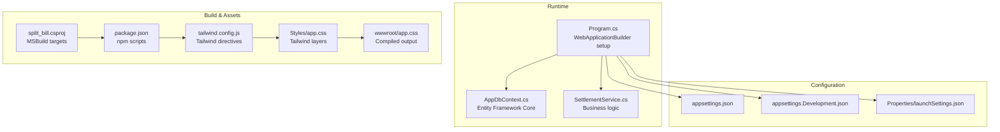
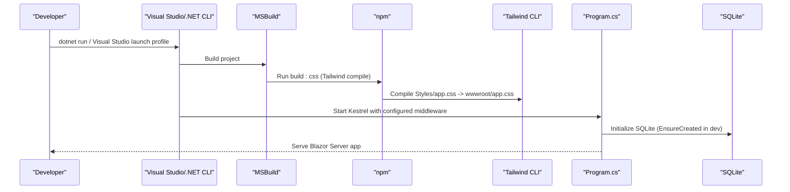
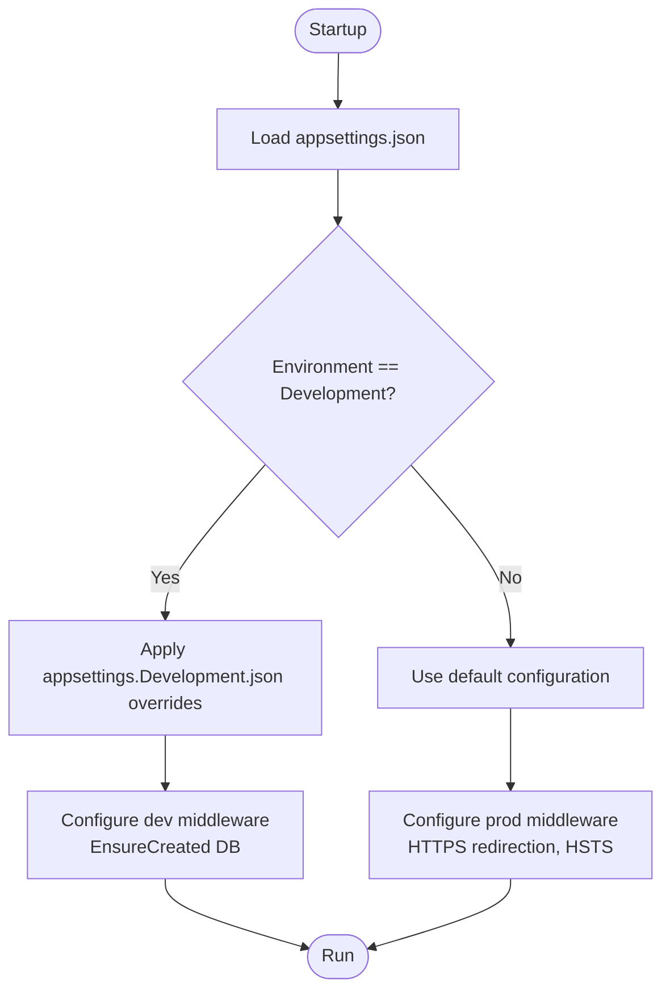
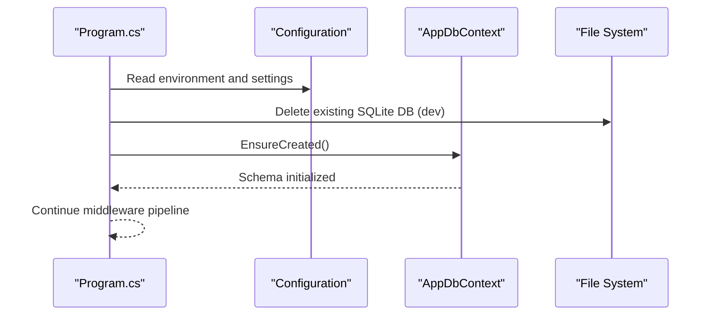
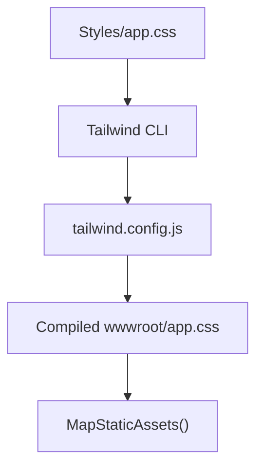
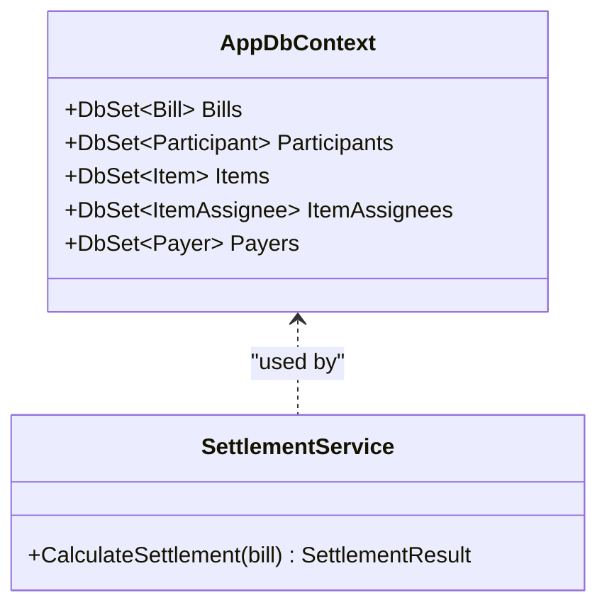
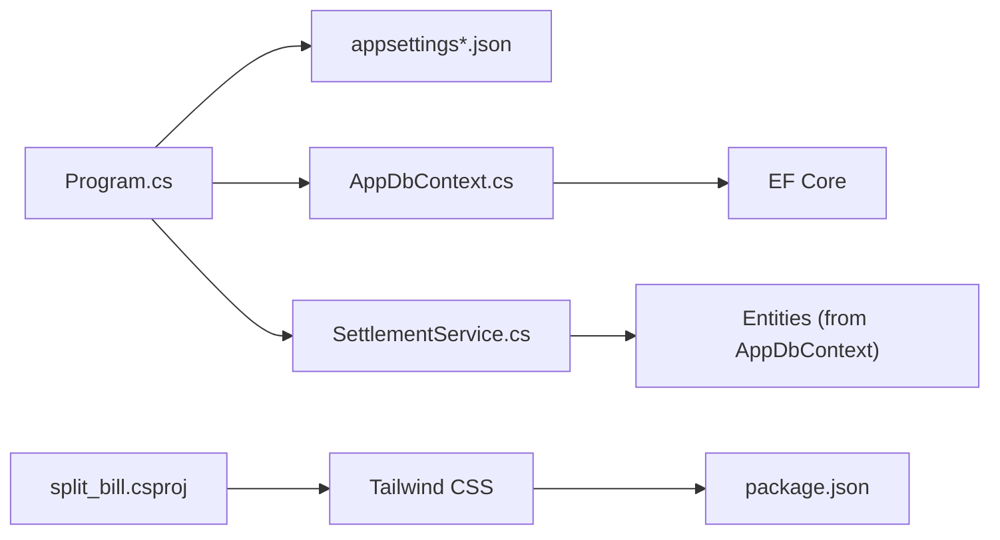

# Configuration and Deployment

<cite>
**Referenced Files in This Document**
- [Program.cs](file://Program.cs)
- [appsettings.json](file://appsettings.json)
- [appsettings.Development.json](file://appsettings.Development.json)
- [Properties/launchSettings.json](file://Properties/launchSettings.json)
- [split_bill.csproj](file://split_bill.csproj)
- [package.json](file://package.json)
- [tailwind.config.js](file://tailwind.config.js)
- [Styles/app.css](file://Styles/app.css)
- [Data/AppDbContext.cs](file://Data/AppDbContext.cs)
- [Services/SettlementService.cs](file://Services/SettlementService.cs)
</cite>

## Table of Contents
1. [Introduction](#introduction)
2. [Project Structure](#project-structure)
3. [Core Components](#core-components)
4. [Architecture Overview](#architecture-overview)
5. [Detailed Component Analysis](#detailed-component-analysis)
6. [Dependency Analysis](#dependency-analysis)
7. [Performance Considerations](#performance-considerations)
8. [Troubleshooting Guide](#troubleshooting-guide)
9. [Conclusion](#conclusion)
10. [Appendices](#appendices)

## Introduction
This document explains how SplitBill manages configuration and deployment across environments. It covers application settings, environment-specific configuration files, database connectivity, asset compilation with Tailwind CSS, and runtime behavior differences between development and production. It also outlines production deployment considerations, security hardening, performance optimization, and practical guidance for containerization, cloud hosting, monitoring, and CI/CD automation.

## Project Structure
SplitBill is a .NET 10 Blazor Server application with embedded static assets and a client-side CSS pipeline powered by Tailwind CSS. Configuration is driven by ASP.NET Core’s built-in configuration system and environment-specific JSON files. The project compiles Tailwind CSS during the build phase via npm scripts and maps static assets for serving.

**Diagram sources**
- [Program.cs:1-73](file://Program.cs#L1-L73)
- [Data/AppDbContext.cs:1-71](file://Data/AppDbContext.cs#L1-L71)
- [Services/SettlementService.cs:1-314](file://Services/SettlementService.cs#L1-L314)
- [appsettings.json:1-10](file://appsettings.json#L1-L10)
- [appsettings.Development.json:1-9](file://appsettings.Development.json#L1-L9)
- [Properties/launchSettings.json:1-24](file://Properties/launchSettings.json#L1-L24)
- [split_bill.csproj:1-34](file://split_bill.csproj#L1-L34)
- [package.json:1-20](file://package.json#L1-L20)
- [tailwind.config.js:1-22](file://tailwind.config.js#L1-L22)
- [Styles/app.css:1-70](file://Styles/app.css#L1-L70)

**Section sources**
- [Program.cs:1-73](file://Program.cs#L1-L73)
- [split_bill.csproj:1-34](file://split_bill.csproj#L1-L34)
- [package.json:1-20](file://package.json#L1-L20)
- [tailwind.config.js:1-22](file://tailwind.config.js#L1-L22)
- [Styles/app.css:1-70](file://Styles/app.css#L1-L70)
- [appsettings.json:1-10](file://appsettings.json#L1-L10)
- [appsettings.Development.json:1-9](file://appsettings.Development.json#L1-L9)
- [Properties/launchSettings.json:1-24](file://Properties/launchSettings.json#L1-L24)

## Core Components
- Application entrypoint and middleware pipeline
  - Initializes services, configures Entity Framework with SQLite, sets a preferred Kestrel URL, and applies environment-aware middleware.
  - See [Program.cs:7-23](file://Program.cs#L7-L23), [Program.cs:56-72](file://Program.cs#L56-L72).
- Configuration system
  - Uses ASP.NET Core configuration with default and environment-specific JSON files.
  - See [appsettings.json:1-10](file://appsettings.json#L1-L10), [appsettings.Development.json:1-9](file://appsettings.Development.json#L1-L9).
- Launch profiles
  - Defines development URLs and environment variables for local runs.
  - See [Properties/launchSettings.json:1-24](file://Properties/launchSettings.json#L1-L24).
- Asset pipeline
  - MSBuild target triggers Tailwind CSS compilation before build when node_modules exists.
  - NPM scripts compile Tailwind CSS from Styles/app.css to wwwroot/app.css.
  - Tailwind configuration scans Razor components and wwwroot for content.
  - See [split_bill.csproj:29-31](file://split_bill.csproj#L29-L31), [package.json:6-10](file://package.json#L6-L10), [tailwind.config.js:1-22](file://tailwind.config.js#L1-L22), [Styles/app.css:1-3](file://Styles/app.css#L1-L3).

**Section sources**
- [Program.cs:7-23](file://Program.cs#L7-L23)
- [Program.cs:56-72](file://Program.cs#L56-L72)
- [appsettings.json:1-10](file://appsettings.json#L1-L10)
- [appsettings.Development.json:1-9](file://appsettings.Development.json#L1-L9)
- [Properties/launchSettings.json:1-24](file://Properties/launchSettings.json#L1-L24)
- [split_bill.csproj:29-31](file://split_bill.csproj#L29-L31)
- [package.json:6-10](file://package.json#L6-L10)
- [tailwind.config.js:1-22](file://tailwind.config.js#L1-L22)
- [Styles/app.css:1-3](file://Styles/app.css#L1-L3)

## Architecture Overview
The runtime architecture integrates configuration-driven middleware, a Blazor Server rendering pipeline, and an EF Core data layer backed by SQLite. Static assets are compiled from Tailwind sources and served as part of the web root.

**Diagram sources**
- [Program.cs:18-53](file://Program.cs#L18-L53)
- [split_bill.csproj:29-31](file://split_bill.csproj#L29-L31)
- [package.json:8-9](file://package.json#L8-L9)
- [tailwind.config.js:1-22](file://tailwind.config.js#L1-L22)
- [Styles/app.css:1-3](file://Styles/app.css#L1-L3)

## Detailed Component Analysis

### Configuration Management
- Default configuration
  - Logging levels and allowed hosts are defined in the default settings file.
  - See [appsettings.json:1-10](file://appsettings.json#L1-L10).
- Development overrides
  - Development-specific logging configuration is provided separately.
  - See [appsettings.Development.json:1-9](file://appsettings.Development.json#L1-L9).
- Environment variables and launch profiles
  - Local development profiles set the ASP.NET Core environment variable and preferred URLs.
  - See [Properties/launchSettings.json:1-24](file://Properties/launchSettings.json#L1-L24).
- Runtime behavior
  - Middleware selection differs by environment (exception handler, HSTS, HTTPS redirection).
  - See [Program.cs:56-66](file://Program.cs#L56-L66).

**Diagram sources**
- [Program.cs:27-53](file://Program.cs#L27-L53)
- [Program.cs:56-66](file://Program.cs#L56-L66)
- [appsettings.json:1-10](file://appsettings.json#L1-L10)
- [appsettings.Development.json:1-9](file://appsettings.Development.json#L1-L9)

**Section sources**
- [appsettings.json:1-10](file://appsettings.json#L1-L10)
- [appsettings.Development.json:1-9](file://appsettings.Development.json#L1-L9)
- [Properties/launchSettings.json:1-24](file://Properties/launchSettings.json#L1-L24)
- [Program.cs:27-53](file://Program.cs#L27-L53)
- [Program.cs:56-66](file://Program.cs#L56-L66)

### Database Connectivity and Schema Initialization
- Provider and connection
  - Entity Framework Core uses SQLite with a hardcoded connection string pointing to a local database file.
  - See [Program.cs:13-14](file://Program.cs#L13-L14), [Data/AppDbContext.cs:1-20](file://Data/AppDbContext.cs#L1-L20).
- Development initialization
  - On startup in development, the application attempts to remove existing database files and creates the schema.
  - See [Program.cs:26-53](file://Program.cs#L26-L53).
- Production considerations
  - For production, replace the SQLite connection string with a secure provider and connection string managed via configuration or environment variables.
  - Add connection pooling, health checks, and migrations management appropriate to your chosen database.

**Diagram sources**
- [Program.cs:26-53](file://Program.cs#L26-L53)
- [Data/AppDbContext.cs:1-20](file://Data/AppDbContext.cs#L1-L20)

**Section sources**
- [Program.cs:13-14](file://Program.cs#L13-L14)
- [Program.cs:26-53](file://Program.cs#L26-L53)
- [Data/AppDbContext.cs:1-20](file://Data/AppDbContext.cs#L1-L20)

### Asset Compilation and Delivery
- Build-time compilation
  - An MSBuild target executes an npm script to compile Tailwind CSS before building.
  - See [split_bill.csproj:29-31](file://split_bill.csproj#L29-L31).
- NPM scripts
  - Tailwind CLI compiles Styles/app.css into wwwroot/app.css.
  - See [package.json:6-10](file://package.json#L6-L10).
- Tailwind configuration
  - Content scanning includes Razor components and wwwroot resources; theme extensions define fonts and utilities.
  - See [tailwind.config.js:1-22](file://tailwind.config.js#L1-L22), [Styles/app.css:1-3](file://Styles/app.css#L1-L3).
- Static asset serving
  - The application maps static assets for delivery.
  - See [Program.cs](file://Program.cs#L68).

**Diagram sources**
- [package.json:8-9](file://package.json#L8-L9)
- [tailwind.config.js:1-22](file://tailwind.config.js#L1-L22)
- [Styles/app.css:1-3](file://Styles/app.css#L1-L3)
- [Program.cs](file://Program.cs#L68)

**Section sources**
- [split_bill.csproj:29-31](file://split_bill.csproj#L29-L31)
- [package.json:6-10](file://package.json#L6-L10)
- [tailwind.config.js:1-22](file://tailwind.config.js#L1-L22)
- [Styles/app.css:1-3](file://Styles/app.css#L1-L3)
- [Program.cs](file://Program.cs#L68)

### Business Logic and Data Layer
- Data model and relationships
  - The context defines entity sets and query filters; cascading deletes are configured for related entities.
  - See [Data/AppDbContext.cs:12-70](file://Data/AppDbContext.cs#L12-L70).
- Settlement calculations
  - The settlement service computes totals, taxes, service charges, participant balances, and transfer instructions.
  - See [Services/SettlementService.cs:55-232](file://Services/SettlementService.cs#L55-L232).

**Diagram sources**
- [Data/AppDbContext.cs:12-16](file://Data/AppDbContext.cs#L12-L16)
- [Services/SettlementService.cs:55-55](file://Services/SettlementService.cs#L55-L55)

**Section sources**
- [Data/AppDbContext.cs:12-70](file://Data/AppDbContext.cs#L12-L70)
- [Services/SettlementService.cs:55-232](file://Services/SettlementService.cs#L55-L232)

## Dependency Analysis
- Internal dependencies
  - Program.cs depends on configuration, EF Core, and services.
  - AppDbContext depends on EF Core and entity models.
  - SettlementService depends on entity models and performs calculations.
- External dependencies
  - SQLite provider and design tools for EF Core.
  - Tailwind CSS toolchain via npm.

**Diagram sources**
- [Program.cs:1-73](file://Program.cs#L1-L73)
- [Data/AppDbContext.cs:1-71](file://Data/AppDbContext.cs#L1-L71)
- [Services/SettlementService.cs:1-314](file://Services/SettlementService.cs#L1-L314)
- [split_bill.csproj:1-34](file://split_bill.csproj#L1-L34)
- [package.json:1-20](file://package.json#L1-L20)

**Section sources**
- [Program.cs:1-73](file://Program.cs#L1-L73)
- [Data/AppDbContext.cs:1-71](file://Data/AppDbContext.cs#L1-L71)
- [Services/SettlementService.cs:1-314](file://Services/SettlementService.cs#L1-L314)
- [split_bill.csproj:1-34](file://split_bill.csproj#L1-L34)
- [package.json:1-20](file://package.json#L1-L20)

## Performance Considerations
- Database
  - SQLite is suitable for development and small-scale deployments but may require migration to a managed database for higher concurrency and reliability in production.
  - Consider connection pooling, read replicas, and migrations management if moving to SQL Server or PostgreSQL.
- Middleware
  - Enable response caching for static assets and avoid unnecessary middleware in production.
  - Use HTTPS enforcement and HSTS appropriately for production.
- Assets
  - Precompile and minify CSS and JS in production builds.
  - Consider CDN delivery for static assets.
- Blazor Server
  - Optimize SignalR transport and consider server scaling or migrating to Blazor WebAssembly or hybrid patterns if scalability demands increase.

## Troubleshooting Guide
- Development database initialization failures
  - Symptom: Startup errors related to database creation or file locks.
  - Action: Verify write permissions to the application directory and ensure no process holds the database file open.
  - Reference: [Program.cs:26-53](file://Program.cs#L26-L53)
- Missing compiled CSS
  - Symptom: Blank or unstyled pages after build.
  - Action: Ensure node_modules exists so the MSBuild target invokes the npm script; confirm Tailwind CLI runs and writes to wwwroot/app.css.
  - References: [split_bill.csproj:29-31](file://split_bill.csproj#L29-L31), [package.json:8-9](file://package.json#L8-L9), [tailwind.config.js:1-22](file://tailwind.config.js#L1-L22)
- Static assets not served
  - Symptom: Missing styles or scripts.
  - Action: Confirm static asset mapping is enabled and files exist under wwwroot.
  - Reference: [Program.cs](file://Program.cs#L68)
- Environment mismatch
  - Symptom: Unexpected middleware behavior or logging levels.
  - Action: Verify ASPNETCORE_ENVIRONMENT and launch settings.
  - Reference: [Properties/launchSettings.json:1-24](file://Properties/launchSettings.json#L1-L24)

**Section sources**
- [Program.cs:26-53](file://Program.cs#L26-L53)
- [split_bill.csproj:29-31](file://split_bill.csproj#L29-L31)
- [package.json:8-9](file://package.json#L8-L9)
- [tailwind.config.js:1-22](file://tailwind.config.js#L1-L22)
- [Program.cs](file://Program.cs#L68)
- [Properties/launchSettings.json:1-24](file://Properties/launchSettings.json#L1-L24)

## Conclusion
SplitBill’s configuration and deployment rely on ASP.NET Core’s flexible configuration system, environment-specific settings, and a straightforward asset pipeline using Tailwind CSS. For production, focus on replacing the SQLite connection with a robust database, enforcing HTTPS and HSTS, optimizing static asset delivery, and establishing CI/CD automation with environment-specific secrets and configuration.

## Appendices

### Build and Deployment Checklist
- Build-time steps
  - Ensure node_modules exists so Tailwind compiles automatically during build.
  - Confirm npm scripts and Tailwind configuration are present.
  - References: [split_bill.csproj:29-31](file://split_bill.csproj#L29-L31), [package.json:6-10](file://package.json#L6-L10), [tailwind.config.js:1-22](file://tailwind.config.js#L1-L22)
- Runtime configuration
  - Set ASPNETCORE_ENVIRONMENT to Production for production deployments.
  - Provide database connection string via configuration or environment variables.
  - References: [appsettings.json:1-10](file://appsettings.json#L1-L10), [Program.cs:13-14](file://Program.cs#L13-L14)
- Security hardening
  - Enforce HTTPS redirection and configure HSTS in production.
  - Use anti-forgery tokens and restrict allowed hosts.
  - References: [Program.cs:56-66](file://Program.cs#L56-L66), [appsettings.json:8-8](file://appsettings.json#L8-L8)
- Monitoring and observability
  - Integrate structured logging and consider adding health checks and metrics endpoints.
  - Reference: [appsettings.json:2-7](file://appsettings.json#L2-L7)

### CI/CD Pipeline Guidance
- Build stage
  - Restore packages, run tests, and build the project.
  - Ensure the Tailwind CSS build target executes by verifying node_modules presence.
  - References: [split_bill.csproj:29-31](file://split_bill.csproj#L29-L31), [package.json:6-10](file://package.json#L6-L10)
- Test stage
  - Execute unit tests targeting the solution.
  - Reference: [split_bill.Tests](file://split_bill.Tests)
- Deploy stage
  - Publish the application for the target runtime.
  - For containerized deployments, expose the appropriate port and mount persistent storage for the database if using SQLite.
  - For managed databases, inject connection strings via environment variables or secret managers.
- Secrets management
  - Store sensitive configuration (e.g., connection strings) in environment variables or secret stores; avoid committing secrets to source control.

[No sources needed since this section provides general guidance]