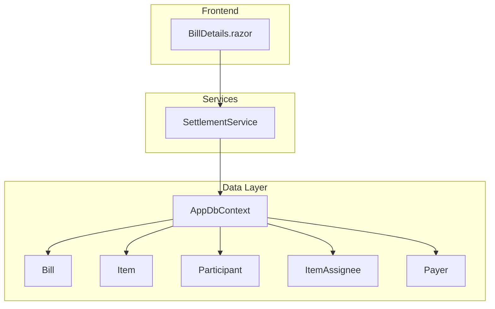
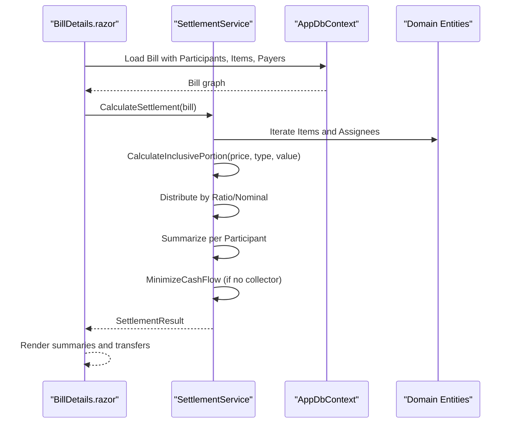
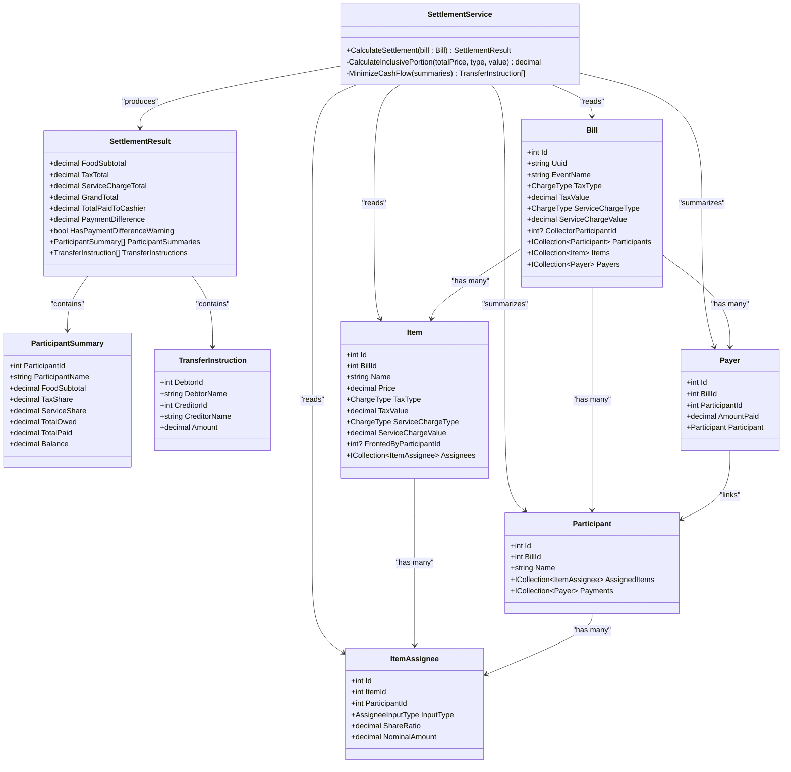
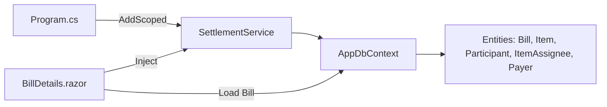

# Business Logic Services

<cite>
**Referenced Files in This Document**
- [SettlementService.cs](file://Services/SettlementService.cs)
- [AppDbContext.cs](file://Data/AppDbContext.cs)
- [Bill.cs](file://Data/Entities/Bill.cs)
- [Item.cs](file://Data/Entities/Item.cs)
- [Participant.cs](file://Data/Entities/Participant.cs)
- [ItemAssignee.cs](file://Data/Entities/ItemAssignee.cs)
- [Payer.cs](file://Data/Entities/Payer.cs)
- [Program.cs](file://Program.cs)
- [BillDetails.razor](file://Components/Pages/BillDetails.razor)
- [SettlementServiceTests.cs](file://split_bill.Tests/SettlementServiceTests.cs)
</cite>

## Table of Contents
1. [Introduction](#introduction)
2. [Project Structure](#project-structure)
3. [Core Components](#core-components)
4. [Architecture Overview](#architecture-overview)
5. [Detailed Component Analysis](#detailed-component-analysis)
6. [Dependency Analysis](#dependency-analysis)
7. [Performance Considerations](#performance-considerations)
8. [Troubleshooting Guide](#troubleshooting-guide)
9. [Conclusion](#conclusion)
10. [Appendices](#appendices)

## Introduction
This document explains SplitBill’s business logic services with a focus on SettlementService. It covers the mathematical algorithms for fair expense distribution, including ratio-based calculations, inclusive tax and service handling, and payment reconciliation. It documents service interfaces, method signatures, parameter requirements, business rule enforcement, edge case handling, calculation accuracy validation, integration patterns with data and frontend components, performance considerations, and error handling strategies.

## Project Structure
The solution is a Blazor Server application with an embedded SQLite database. The business logic resides in a dedicated service class, while data access is handled by an Entity Framework Core context. Frontend pages consume the service to compute and present settlement results.

**Diagram sources**
- [Program.cs:16](file://Program.cs#L16)
- [AppDbContext.cs:12-16](file://Data/AppDbContext.cs#L12-L16)
- [BillDetails.razor:6-7](file://Components/Pages/BillDetails.razor#L6-L7)

**Section sources**
- [Program.cs:13-16](file://Program.cs#L13-L16)
- [AppDbContext.cs:12-16](file://Data/AppDbContext.cs#L12-L16)

## Core Components
- SettlementService: Computes participant balances, tax/service breakdowns, and transfer instructions for cash reconciliation.
- Data Entities: Bill, Item, Participant, ItemAssignee, Payer define the domain model and relationships.
- AppDbContext: Configures EF Core mappings, indexes, filters, and cascading deletes.
- Frontend Integration: BillDetails.razor injects and invokes SettlementService to render summaries and transfer instructions.

Key responsibilities:
- Compute inclusive tax/service portions from total prices.
- Distribute item costs among assignees using ratio or nominal inputs.
- Aggregate participant totals and reconcile against payments.
- Generate transfer instructions either via a designated collector or via a greedy minimization algorithm.

**Section sources**
- [SettlementService.cs:55-232](file://Services/SettlementService.cs#L55-L232)
- [BillDetails.razor:1242-1243](file://Components/Pages/BillDetails.razor#L1242-L1243)

## Architecture Overview
SettlementService orchestrates calculations based on the Bill domain model. It reads active items and participants, computes inclusive tax/service shares, distributes item costs according to assignee input types, aggregates balances, and produces transfer instructions.

**Diagram sources**
- [BillDetails.razor:1242-1243](file://Components/Pages/BillDetails.razor#L1242-L1243)
- [SettlementService.cs:55-232](file://Services/SettlementService.cs#L55-L232)

## Detailed Component Analysis

### SettlementService
SettlementService exposes a single public method to compute settlement outcomes and returns a structured result with participant summaries and transfer instructions.

- Method signature
  - CalculateSettlement(Bill): SettlementResult
- Inputs
  - Bill with navigation properties: Participants, Items, Payers
  - Items may override global tax/service settings
  - ItemAssignee defines per-item sharing via Ratio or Nominal
- Outputs
  - SettlementResult containing:
    - Grand totals (FoodSubtotal, TaxTotal, ServiceChargeTotal, GrandTotal)
    - Payment reconciliation (TotalPaidToCashier, PaymentDifference, HasPaymentDifferenceWarning)
    - ParticipantSummaries with per-participant breakdowns and balances
    - TransferInstructions for cash reconciliation

Mathematical algorithms and business rules:
- Inclusive tax/service portion calculation
  - Percentage inclusive: portion = price × rate / (100 + rate)
  - Fixed inclusive: portion = min(fixed, price)
- Item cost distribution
  - Nominal assignees receive their specified nominal amount
  - Remaining amount is distributed proportionally by share ratios
- Breakdown per participant
  - FoodSubtotal, TaxShare, ServiceShare computed from each assignee’s shareOfTotal
  - Rounded breakdowns reconstructed to TotalOwed to preserve consistency
- Payment reconciliation
  - TotalPaidToCashier sums payer amounts
  - PaymentDifference = TotalPaidToCashier − GrandTotal
  - Warning threshold when difference ≥ 1.0
- Transfer instructions
  - If a CollectorParticipantId is set, all balances settle to the collector
  - Otherwise, a greedy minimization algorithm reduces the number of transfers

Edge cases and validations:
- Deleted entities are excluded from calculations
- Zero or negative values are handled safely in ratios and portions
- Rounding occurs at two stages: per-participant breakdowns and final balances
- Consistency enforced by reconstructing TotalOwed from rounded breakdowns

Integration with data layer:
- Uses LINQ to filter active entities and compute sums
- Assumes relationships are loaded (participants, items, assignees, payers)

Integration with frontend:
- Called during page load to compute settlement
- Results drive UI rendering of summaries and transfer instructions

**Section sources**
- [SettlementService.cs:55-232](file://Services/SettlementService.cs#L55-L232)
- [SettlementService.cs:243-259](file://Services/SettlementService.cs#L243-L259)
- [SettlementService.cs:261-306](file://Services/SettlementService.cs#L261-L306)
- [BillDetails.razor:1242-1243](file://Components/Pages/BillDetails.razor#L1242-L1243)

#### Class Diagram

**Diagram sources**
- [SettlementService.cs:43-314](file://Services/SettlementService.cs#L43-L314)
- [Bill.cs:12-37](file://Data/Entities/Bill.cs#L12-L37)
- [Item.cs:5-27](file://Data/Entities/Item.cs#L5-L27)
- [ItemAssignee.cs:9-21](file://Data/Entities/ItemAssignee.cs#L9-L21)
- [Participant.cs:5-19](file://Data/Entities/Participant.cs#L5-L19)
- [Payer.cs:3-12](file://Data/Entities/Payer.cs#L3-L12)

### Data Entities and Relationships
- Bill: Contains global tax/service settings, optional collector, and navigation to Participants, Items, Payers.
- Item: Per-item price and optional per-item tax/service overrides; links to Assignees and optional FrontedBy participant.
- ItemAssignee: Defines how an item’s cost is split per participant (Ratio or Nominal).
- Participant: Person participating in the bill; linked to AssignedItems and Payments.
- Payer: Records payments made by participants; linked to Participant.

Entity relationships and constraints:
- Cascade deletes on Bill-Participants, Bill-Items, Bill-Payers, Item-Assignees, Participant-AssignedItems, Participant-Payments.
- Soft-deleted entities filtered out via query filters.

**Section sources**
- [AppDbContext.cs:18-70](file://Data/AppDbContext.cs#L18-L70)
- [Bill.cs:12-37](file://Data/Entities/Bill.cs#L12-L37)
- [Item.cs:5-27](file://Data/Entities/Item.cs#L5-L27)
- [ItemAssignee.cs:3-7](file://Data/Entities/ItemAssignee.cs#L3-L7)
- [Participant.cs:5-19](file://Data/Entities/Participant.cs#L5-L19)
- [Payer.cs:3-12](file://Data/Entities/Payer.cs#L3-L12)

### Frontend Integration Pattern
- BillDetails.razor loads the Bill graph (including Participants, Items with Assignees, and Payers).
- On load, it calls Settlement.CalculateSettlement(bill) and renders:
  - Grand totals and payment reconciliation
  - Per-participant summaries
  - Transfer instructions (directed to collector or minimized)

**Section sources**
- [BillDetails.razor:1233-1257](file://Components/Pages/BillDetails.razor#L1233-L1257)
- [BillDetails.razor:1242-1243](file://Components/Pages/BillDetails.razor#L1242-L1243)

### Mathematical Algorithms

#### Inclusive Tax/Service Portion Calculation
- Percentage inclusive: portion = price × rate / (100 + rate)
- Fixed inclusive: portion = min(fixed, price)
- Applied per item to derive food, tax, and service portions for breakdowns.

**Section sources**
- [SettlementService.cs:243-259](file://Services/SettlementService.cs#L243-L259)

#### Item Cost Distribution
- Nominal assignees: receive their specified nominal amount.
- Remaining amount: price − sum(nominal) is distributed proportionally by share ratios.
- Each assignee’s shareOfTotal contributes to their breakdown and TotalOwed.

**Section sources**
- [SettlementService.cs:122-158](file://Services/SettlementService.cs#L122-L158)

#### Cash Reconciliation and Transfer Instructions
- Collector-driven: all balances settle to the collector participant.
- Greedy minimization: minimize transfers by pairing largest debits with largest credits until balanced.

**Section sources**
- [SettlementService.cs:188-230](file://Services/SettlementService.cs#L188-L230)
- [SettlementService.cs:261-306](file://Services/SettlementService.cs#L261-L306)

### Example Scenarios

- Expense recording and participant assignment
  - Add an item with price and assignees (ratio or nominal).
  - SettlementService computes per-person shares and updates balances accordingly.
  - FrontedBy participant adds to their TotalPaid.

- Settlement execution
  - With a CollectorParticipantId: all balances settle to the collector.
  - Without a collector: greedy minimization produces minimal transfers.

- Payment reconciliation
  - TotalPaidToCashier is compared to GrandTotal; PaymentDifference indicates discrepancies.

**Section sources**
- [BillDetails.razor:1384-1424](file://Components/Pages/BillDetails.razor#L1384-L1424)
- [SettlementService.cs:55-232](file://Services/SettlementService.cs#L55-L232)

### Error Handling and Edge Cases
- Deleted entities are excluded from calculations.
- Zero or negative values are handled safely in ratios and portions.
- Rounding is applied consistently to avoid discrepancies between “Total” and “Food+Tax+Service.”
- Payment difference warnings are surfaced when the absolute difference is ≥ 1.0.

Validation examples from tests:
- No participants: returns empty summaries and instructions, with payment difference warning.
- Mixed splits (nominal and ratio): balances and transfers computed correctly.

**Section sources**
- [SettlementService.cs:59-86](file://Services/SettlementService.cs#L59-L86)
- [SettlementService.cs:171-184](file://Services/SettlementService.cs#L171-L184)
- [SettlementServiceTests.cs:19-51](file://split_bill.Tests/SettlementServiceTests.cs#L19-L51)
- [SettlementServiceTests.cs:53-157](file://split_bill.Tests/SettlementServiceTests.cs#L53-L157)

## Dependency Analysis
- Service registration: SettlementService is registered as a scoped service.
- Data access: AppDbContext provides DbSet access and entity configurations.
- Frontend: BillDetails.razor injects both AppDbContext and SettlementService.

**Diagram sources**
- [Program.cs:16](file://Program.cs#L16)
- [BillDetails.razor:6-7](file://Components/Pages/BillDetails.razor#L6-L7)
- [AppDbContext.cs:12-16](file://Data/AppDbContext.cs#L12-L16)

**Section sources**
- [Program.cs:13-16](file://Program.cs#L13-L16)
- [BillDetails.razor:6-7](file://Components/Pages/BillDetails.razor#L6-L7)

## Performance Considerations
- Time complexity
  - O(N_items + N_assignees + N_participants) for the main loop and summarization.
  - Greedy minimization is O(N_participants log N_participants) due to sorting creditors/debtors.
- Memory complexity
  - Linear in the number of active participants and assignees.
- Optimizations
  - Pre-filter deleted entities to reduce iteration overhead.
  - Early exit when no participants are present.
  - Efficient LINQ queries for sums and groupings.
- Scalability
  - Current implementation is suitable for typical group sizes.
  - For very large groups, consider batching or caching intermediate results.

[No sources needed since this section provides general guidance]

## Troubleshooting Guide
Common issues and resolutions:
- Unexpected payment differences
  - Verify TotalPaidToCashier equals GrandTotal; investigate rounding and tax/service inclusion.
- Imbalanced transfers
  - Confirm whether a CollectorParticipantId is set; otherwise, greedy minimization may produce multiple transfers.
- Incorrect participant balances
  - Check assignee input types (Ratio vs Nominal) and ensure FrontedBy participant is correctly recorded.
- Missing summaries or instructions
  - Ensure active participants/items exist and are not marked deleted.

Validation references:
- Payment difference warning threshold and reconciliation checks.
- Greedy minimization logic for transfer generation.

**Section sources**
- [SettlementService.cs:37-84](file://Services/SettlementService.cs#L37-L84)
- [SettlementService.cs:188-230](file://Services/SettlementService.cs#L188-L230)
- [SettlementService.cs:261-306](file://Services/SettlementService.cs#L261-L306)

## Conclusion
SettlementService implements a robust, mathematically sound algorithm for distributing expenses fairly, handling inclusive taxes and service charges, reconciling payments, and minimizing cash movements. Its integration with the data layer and frontend enables real-time computation and presentation of settlement outcomes. The design emphasizes correctness, readability, and maintainability, with clear separation of concerns and comprehensive test coverage.

[No sources needed since this section summarizes without analyzing specific files]

## Appendices

### API Reference: SettlementService
- CalculateSettlement(Bill bill): SettlementResult
  - Parameters: bill with Participants, Items, Payers populated
  - Returns: SettlementResult with totals, summaries, and transfer instructions

**Section sources**
- [SettlementService.cs:55-55](file://Services/SettlementService.cs#L55-L55)

### Data Model Reference
- Bill
  - Fields: Id, Uuid, EventName, TaxType/TaxValue, ServiceChargeType/ServiceChargeValue, CollectorParticipantId, Participants, Items, Payers
- Item
  - Fields: Id, BillId, Name, Price, TaxType/TaxValue, ServiceChargeType/ServiceChargeValue, FrontedByParticipantId, Assignees
- ItemAssignee
  - Fields: Id, ItemId, ParticipantId, InputType (Ratio/Nominal), ShareRatio, NominalAmount
- Participant
  - Fields: Id, BillId, Name, AssignedItems, Payments
- Payer
  - Fields: Id, BillId, ParticipantId, AmountPaid, Participant

**Section sources**
- [Bill.cs:12-37](file://Data/Entities/Bill.cs#L12-L37)
- [Item.cs:5-27](file://Data/Entities/Item.cs#L5-L27)
- [ItemAssignee.cs:3-7](file://Data/Entities/ItemAssignee.cs#L3-L7)
- [Participant.cs:5-19](file://Data/Entities/Participant.cs#L5-L19)
- [Payer.cs:3-12](file://Data/Entities/Payer.cs#L3-L12)