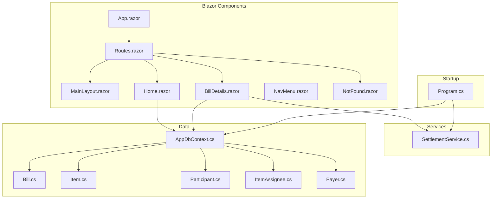
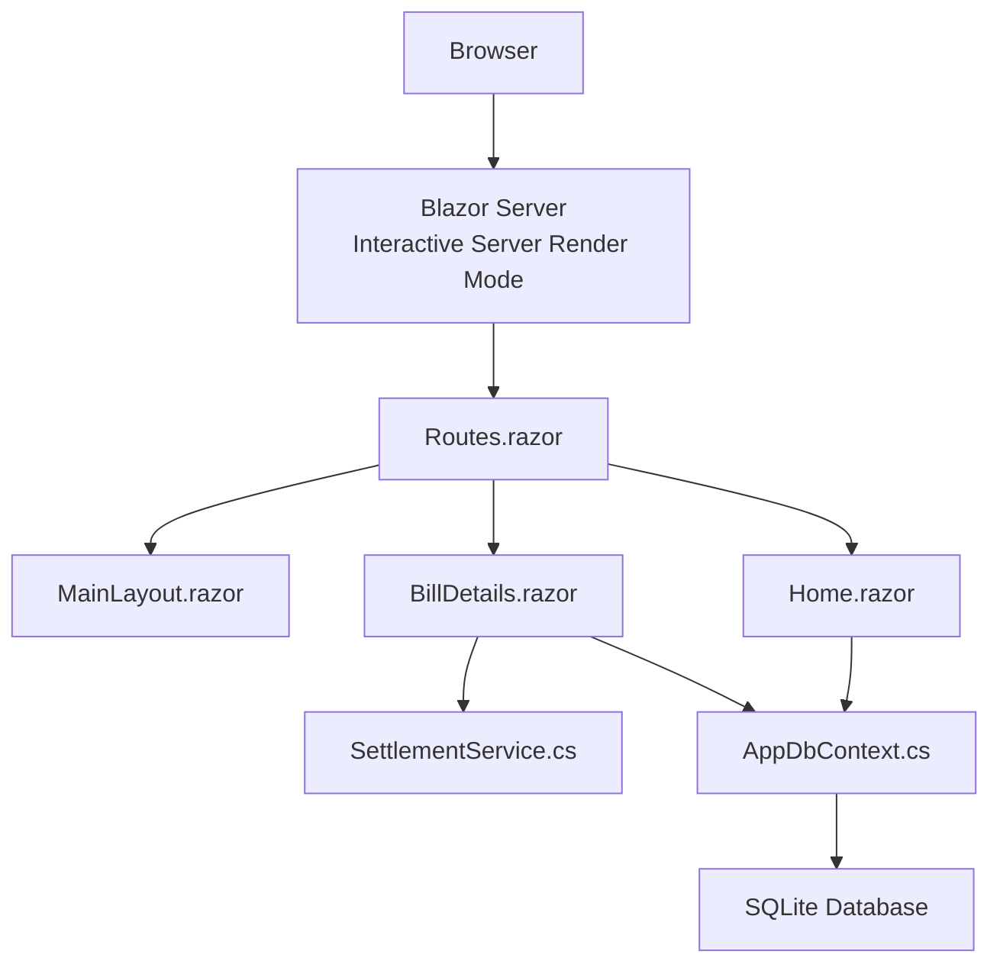
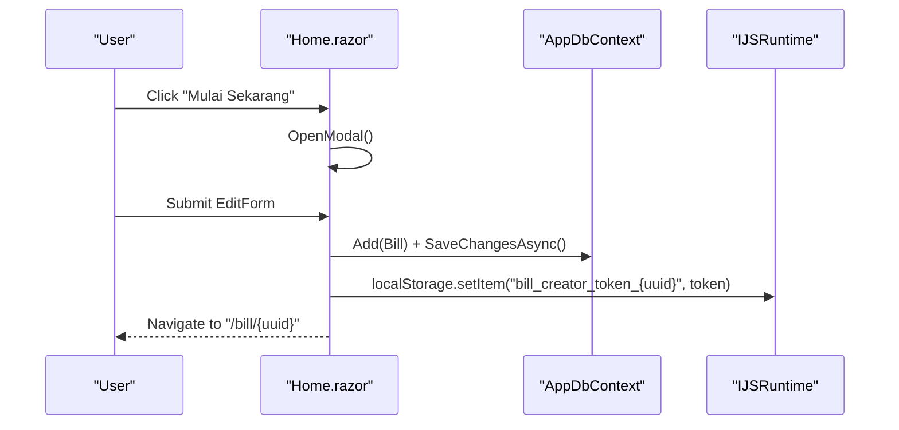
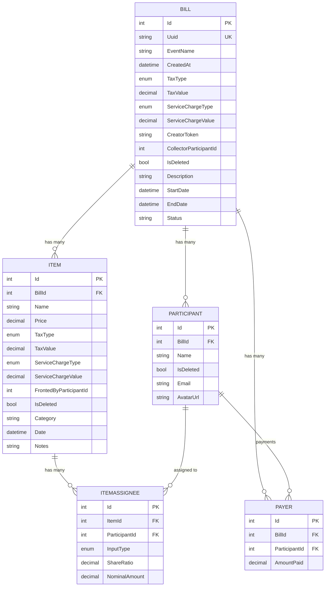
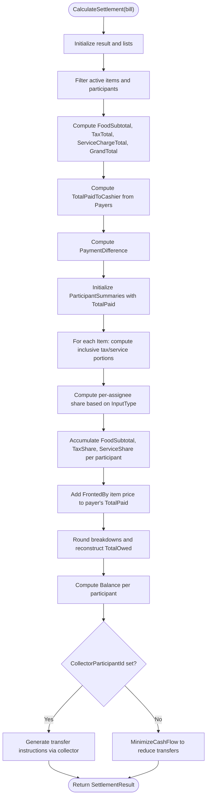
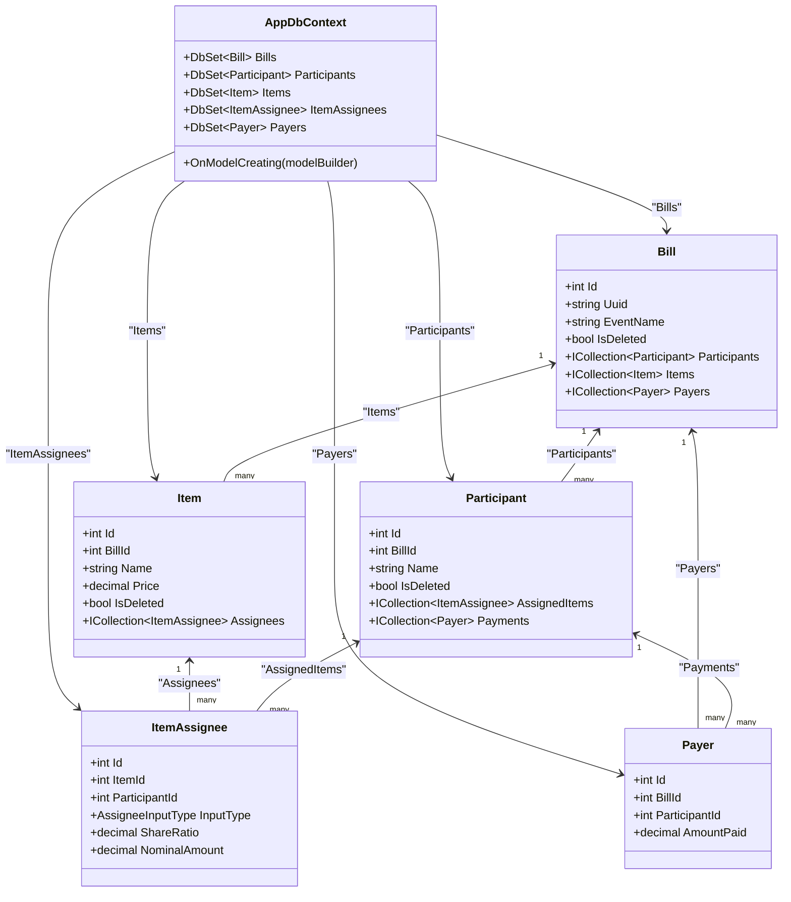
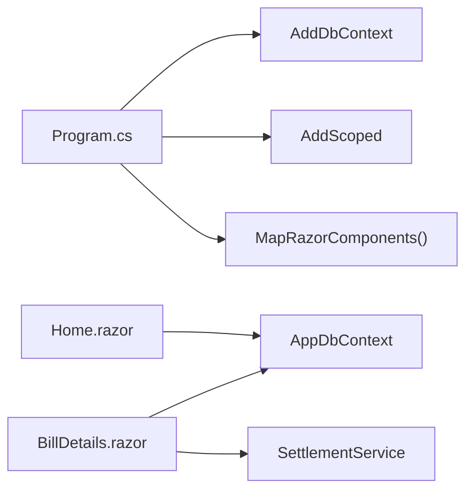

# Core Components

<cite>
**Referenced Files in This Document**
- [App.razor](file://Components/App.razor)
- [MainLayout.razor](file://Components/Layout/MainLayout.razor)
- [NavMenu.razor](file://Components/Layout/NavMenu.razor)
- [Routes.razor](file://Components/Routes.razor)
- [NotFound.razor](file://Components/Pages/NotFound.razor)
- [Home.razor](file://Components/Pages/Home.razor)
- [BillDetails.razor](file://Components/Pages/BillDetails.razor)
- [Program.cs](file://Program.cs)
- [AppDbContext.cs](file://Data/AppDbContext.cs)
- [SettlementService.cs](file://Services/SettlementService.cs)
- [Bill.cs](file://Data/Entities/Bill.cs)
- [Item.cs](file://Data/Entities/Item.cs)
- [Participant.cs](file://Data/Entities/Participant.cs)
- [ItemAssignee.cs](file://Data/Entities/ItemAssignee.cs)
- [Payer.cs](file://Data/Entities/Payer.cs)
</cite>

## Table of Contents
1. [Introduction](#introduction)
2. [Project Structure](#project-structure)
3. [Core Components](#core-components)
4. [Architecture Overview](#architecture-overview)
5. [Detailed Component Analysis](#detailed-component-analysis)
6. [Dependency Analysis](#dependency-analysis)
7. [Performance Considerations](#performance-considerations)
8. [Troubleshooting Guide](#troubleshooting-guide)
9. [Conclusion](#conclusion)

## Introduction
This document explains SplitBill’s core Blazor Server components and backend services. It covers the component hierarchy starting from the application root, layout and routing, page components, and the backend services responsible for financial calculations and data access. It also documents component lifecycle, state management, data binding patterns, component composition, event handling, and integration between frontend components and backend services. Finally, it addresses component reusability, styling approaches, and responsive design implementation.

## Project Structure
SplitBill follows a conventional Blazor Server project layout:
- Components: Application root, routes, layouts, and pages
- Data: Entity models and the EF Core DbContext
- Services: Business logic services (e.g., SettlementService)
- Program.cs: Application startup and DI registration
- wwwroot: Static assets and styles

**Diagram sources**
- [App.razor:1-27](file://Components/App.razor#L1-L27)
- [Routes.razor:1-7](file://Components/Routes.razor#L1-L7)
- [MainLayout.razor:1-12](file://Components/Layout/MainLayout.razor#L1-L12)
- [Home.razor:1-325](file://Components/Pages/Home.razor#L1-L325)
- [BillDetails.razor:1-1511](file://Components/Pages/BillDetails.razor#L1-L1511)
- [Program.cs:1-73](file://Program.cs#L1-L73)
- [AppDbContext.cs:1-71](file://Data/AppDbContext.cs#L1-L71)
- [SettlementService.cs:1-314](file://Services/SettlementService.cs#L1-L314)
- [Bill.cs:1-38](file://Data/Entities/Bill.cs#L1-L38)
- [Item.cs:1-28](file://Data/Entities/Item.cs#L1-L28)
- [Participant.cs:1-21](file://Data/Entities/Participant.cs#L1-L21)
- [ItemAssignee.cs:1-22](file://Data/Entities/ItemAssignee.cs#L1-L22)
- [Payer.cs:1-12](file://Data/Entities/Payer.cs#L1-L12)

**Section sources**
- [App.razor:1-27](file://Components/App.razor#L1-L27)
- [Routes.razor:1-7](file://Components/Routes.razor#L1-L7)
- [Program.cs:1-73](file://Program.cs#L1-L73)

## Core Components
This section focuses on the Blazor Server component hierarchy and the backend services that power SplitBill.

- Application Root and Rendering
  - App.razor defines the HTML shell, head resources, interactive rendering mode, and mounts the Routes component.
  - Routes.razor configures route discovery and applies MainLayout as the default layout for matched routes.
  - MainLayout.razor provides the global wrapper around page content and error UI.

- Page Components
  - Home.razor is the landing page with navigation, hero section, features, and a modal for creating a new bill session. It injects the database context and uses JavaScript interop for local storage.
  - BillDetails.razor is the primary page for managing expenses, participants, and settlement. It handles loading states, filtering, modals, and displays settlement results computed by SettlementService.

- Backend Services and Data Access
  - Program.cs registers services, configures the SQLite DbContext, and sets up the HTTP pipeline including static assets and interactive server components.
  - AppDbContext.cs defines the EF Core model with indices, soft-deleted filters, and cascading deletes.
  - SettlementService.cs encapsulates the mathematical calculation of totals, tax/service breakdowns, participant shares, and transfer instructions.

**Section sources**
- [App.razor:1-27](file://Components/App.razor#L1-L27)
- [Routes.razor:1-7](file://Components/Routes.razor#L1-L7)
- [MainLayout.razor:1-12](file://Components/Layout/MainLayout.razor#L1-L12)
- [Home.razor:1-325](file://Components/Pages/Home.razor#L1-L325)
- [BillDetails.razor:1-1511](file://Components/Pages/BillDetails.razor#L1-L1511)
- [Program.cs:1-73](file://Program.cs#L1-L73)
- [AppDbContext.cs:1-71](file://Data/AppDbContext.cs#L1-L71)
- [SettlementService.cs:1-314](file://Services/SettlementService.cs#L1-L314)

## Architecture Overview
The system uses Blazor Server with Interactive Server render mode. Components are rendered server-side and streamed to the browser. Data access is handled by EF Core against SQLite. Business logic for settlement calculations resides in a dedicated service.

**Diagram sources**
- [App.razor:1-27](file://Components/App.razor#L1-L27)
- [Routes.razor:1-7](file://Components/Routes.razor#L1-L7)
- [MainLayout.razor:1-12](file://Components/Layout/MainLayout.razor#L1-L12)
- [Home.razor:1-325](file://Components/Pages/Home.razor#L1-L325)
- [BillDetails.razor:1-1511](file://Components/Pages/BillDetails.razor#L1-L1511)
- [SettlementService.cs:1-314](file://Services/SettlementService.cs#L1-L314)
- [AppDbContext.cs:1-71](file://Data/AppDbContext.cs#L1-L71)
- [Program.cs:1-73](file://Program.cs#L1-L73)

## Detailed Component Analysis

### Component Hierarchy and Lifecycle
- App.razor
  - Declares base href, preloads resources, and mounts interactive components.
  - Uses HeadOutlet and Routes with Interactive Server render mode.
- Routes.razor
  - Uses Router with Found/NotFound handling and applies MainLayout as default.
- MainLayout.razor
  - Inherits LayoutComponentBase and renders @Body inside a minimal wrapper.
- NotFound.razor
  - Simple page under the MainLayout for 404 handling.
- Home.razor
  - Lifecycle: OnInitializedAsync is not overridden; state is managed locally with @onclick handlers and EditForm submission.
  - Data binding: Two-way binding via @bind on form inputs; validation via EditForm/DataAnnotationsValidator.
  - Event handling: @onclick for modal open/close and form submission; @oninput for live search-like behavior.
  - Persistence: Creates a new Bill entity, saves via DbContext, stores a creator token in localStorage via IJSRuntime, and navigates to the bill details page.
- BillDetails.razor
  - Lifecycle: Implements OnInit/OnAfterRender for loading and settlement computation; uses lazy initialization and reactive updates.
  - State management: Local state for UI toggles (activeTab, expandedItems), filters (searchQuery, selectedCategoryFilter), and modal visibility.
  - Data binding: @bind for inputs; @onclick for selection and actions; computed values bound to the UI.
  - Event handling: @onclick for tab switching, item expansion, adding/removing members/expenses, and copy/share actions.
  - Integration: Injects AppDbContext and SettlementService; computes settlement results and passes them to the UI.

**Diagram sources**
- [Home.razor:237-301](file://Components/Pages/Home.razor#L237-L301)
- [AppDbContext.cs:1-71](file://Data/AppDbContext.cs#L1-L71)
- [Program.cs:1-73](file://Program.cs#L1-L73)

**Section sources**
- [App.razor:1-27](file://Components/App.razor#L1-L27)
- [Routes.razor:1-7](file://Components/Routes.razor#L1-L7)
- [MainLayout.razor:1-12](file://Components/Layout/MainLayout.razor#L1-L12)
- [NotFound.razor:1-5](file://Components/Pages/NotFound.razor#L1-L5)
- [Home.razor:1-325](file://Components/Pages/Home.razor#L1-L325)
- [BillDetails.razor:1-1511](file://Components/Pages/BillDetails.razor#L1-L1511)

### Data Models and Relationships
The data model centers around a Bill with associated Participants, Items, ItemAssignees, and Payers. Soft deletion is supported via query filters.

**Diagram sources**
- [Bill.cs:1-38](file://Data/Entities/Bill.cs#L1-L38)
- [Participant.cs:1-21](file://Data/Entities/Participant.cs#L1-L21)
- [Item.cs:1-28](file://Data/Entities/Item.cs#L1-L28)
- [ItemAssignee.cs:1-22](file://Data/Entities/ItemAssignee.cs#L1-L22)
- [Payer.cs:1-12](file://Data/Entities/Payer.cs#L1-L12)
- [AppDbContext.cs:18-70](file://Data/AppDbContext.cs#L18-L70)

**Section sources**
- [Bill.cs:1-38](file://Data/Entities/Bill.cs#L1-L38)
- [Participant.cs:1-21](file://Data/Entities/Participant.cs#L1-L21)
- [Item.cs:1-28](file://Data/Entities/Item.cs#L1-L28)
- [ItemAssignee.cs:1-22](file://Data/Entities/ItemAssignee.cs#L1-L22)
- [Payer.cs:1-12](file://Data/Entities/Payer.cs#L1-L12)
- [AppDbContext.cs:1-71](file://Data/AppDbContext.cs#L1-L71)

### SettlementService: Mathematical Calculations
SettlementService computes:
- Grand totals and tax/service breakdowns
- Per-participant owed amounts and balances
- Transfer instructions to minimize cash flow

Key behaviors:
- Back-calculates inclusive tax/service portions from item prices
- Distributes item costs among assignees using either nominal or ratio-based sharing
- Rounds breakdowns and reconstructs totals to maintain UI consistency
- Generates transfer instructions either via a designated collector or via a minimization algorithm

**Diagram sources**
- [SettlementService.cs:55-232](file://Services/SettlementService.cs#L55-L232)
- [SettlementService.cs:261-306](file://Services/SettlementService.cs#L261-L306)

**Section sources**
- [SettlementService.cs:1-314](file://Services/SettlementService.cs#L1-L314)

### Data Access Patterns with AppDbContext
- Registration and lifetime: Scoped AppDbContext registered in Program.cs with SQLite provider.
- Query filters: Soft-deleted entities are excluded globally via query filters.
- Indexes: Unique index on Bill.Uuid for fast lookup.
- Relationships: Defined with cascading deletes for bills, items, participants, and payments.
- Usage: Both Home.razor and BillDetails.razor inject AppDbContext to load/save entities.

**Diagram sources**
- [AppDbContext.cs:6-71](file://Data/AppDbContext.cs#L6-L71)
- [Bill.cs:12-37](file://Data/Entities/Bill.cs#L12-L37)
- [Participant.cs:5-20](file://Data/Entities/Participant.cs#L5-L20)
- [Item.cs:5-27](file://Data/Entities/Item.cs#L5-L27)
- [ItemAssignee.cs:9-21](file://Data/Entities/ItemAssignee.cs#L9-L21)
- [Payer.cs:3-12](file://Data/Entities/Payer.cs#L3-L12)

**Section sources**
- [Program.cs:13-16](file://Program.cs#L13-L16)
- [AppDbContext.cs:1-71](file://Data/AppDbContext.cs#L1-L71)
- [Home.razor:4-6](file://Components/Pages/Home.razor#L4-L6)
- [BillDetails.razor:6-8](file://Components/Pages/BillDetails.razor#L6-L8)

### Component Composition, Event Handling, and Integration
- Composition
  - Routes.razor composes MainLayout and page components.
  - MainLayout.razor wraps page content with a consistent shell.
  - Home.razor composes a modal dialog and form for creating bills.
  - BillDetails.razor composes tabs, lists, modals, and summary cards.
- Event handling
  - @onclick for navigation, modal toggling, and destructive actions.
  - @bind for two-way data binding on forms and inputs.
  - @oninput for live filtering and currency formatting.
- Integration
  - Home.razor integrates with IJSRuntime to persist creator tokens.
  - BillDetails.razor integrates with SettlementService for calculations and AppDbContext for persistence.

**Section sources**
- [Routes.razor:1-7](file://Components/Routes.razor#L1-L7)
- [MainLayout.razor:1-12](file://Components/Layout/MainLayout.razor#L1-L12)
- [Home.razor:174-301](file://Components/Pages/Home.razor#L174-L301)
- [BillDetails.razor:1-1511](file://Components/Pages/BillDetails.razor#L1-L1511)
- [SettlementService.cs:1-314](file://Services/SettlementService.cs#L1-L314)
- [AppDbContext.cs:1-71](file://Data/AppDbContext.cs#L1-L71)

### Styling Approaches and Responsive Design
- Utility-first CSS: Tailwind classes dominate layout and typography.
- Responsive breakpoints: Flex and grid classes adapt to mobile/tablet/desktop.
- Theming: A theme script is loaded from wwwroot/js; color utilities and gradients are used for avatars and highlights.
- Animations: CSS animations and transitions enhance interactions (e.g., modal slides, floating cards).
- Example patterns:
  - Sticky navbars, max widths, and padding for content areas.
  - Grid layouts for feature cards and summary metrics.
  - Responsive typography and spacing for headings and paragraphs.

**Section sources**
- [Home.razor:1-325](file://Components/Pages/Home.razor#L1-L325)
- [BillDetails.razor:1-1511](file://Components/Pages/BillDetails.razor#L1-L1511)
- [App.razor:1-27](file://Components/App.razor#L1-L27)

## Dependency Analysis
- Startup and DI
  - Program.cs registers:
    - Interactive server components
    - AppDbContext with SQLite
    - SettlementService as scoped
    - Static assets and Razor components endpoint
- Component dependencies
  - Home.razor depends on AppDbContext and IJSRuntime
  - BillDetails.razor depends on AppDbContext, SettlementService, and NavigationManager
- Data dependencies
  - AppDbContext depends on EF Core and enforces soft-delete filters and cascading deletes
- Service dependencies
  - SettlementService depends on entity models and performs pure calculations

**Diagram sources**
- [Program.cs:10-16](file://Program.cs#L10-L16)
- [Program.cs:69-70](file://Program.cs#L69-L70)
- [Home.razor:4-6](file://Components/Pages/Home.razor#L4-L6)
- [BillDetails.razor:6-8](file://Components/Pages/BillDetails.razor#L6-L8)
- [SettlementService.cs:1-314](file://Services/SettlementService.cs#L1-L314)
- [AppDbContext.cs:1-71](file://Data/AppDbContext.cs#L1-L71)

**Section sources**
- [Program.cs:1-73](file://Program.cs#L1-L73)
- [Home.razor:1-325](file://Components/Pages/Home.razor#L1-L325)
- [BillDetails.razor:1-1511](file://Components/Pages/BillDetails.razor#L1-L1511)
- [AppDbContext.cs:1-71](file://Data/AppDbContext.cs#L1-L71)
- [SettlementService.cs:1-314](file://Services/SettlementService.cs#L1-L314)

## Performance Considerations
- Database queries
  - Use filtered queries via query filters to avoid deleted records.
  - Consider indexing frequently queried columns (e.g., Bill.Uuid) to speed up lookups.
- Calculation cost
  - SettlementService loops through items and assignees; keep bill sizes reasonable or paginate where appropriate.
  - Minimize repeated rounding errors by computing totals first, then reconstructing breakdowns.
- Rendering
  - Avoid unnecessary re-renders by consolidating state updates and using reactive UI patterns.
  - Lazy-load heavy lists and defer expensive computations until needed.

## Troubleshooting Guide
- 404 handling
  - NotFound.razor uses MainLayout and displays a friendly message; ensure NotFound route is configured in Routes.razor.
- Database initialization
  - In development, the app attempts to delete existing SQLite files and ensures schema creation; verify file permissions and paths.
- Interactive rendering
  - Ensure blazor.web.js is mapped and static assets are served; check MapStaticAssets and MapRazorComponents configuration.
- Validation and forms
  - Home.razor uses EditForm with DataAnnotationsValidator; confirm validation attributes and error messages appear as expected.
- Local storage
  - Home.razor writes creator tokens to localStorage; verify browser support and privacy settings.

**Section sources**
- [NotFound.razor:1-5](file://Components/Pages/NotFound.razor#L1-L5)
- [Program.cs:27-53](file://Program.cs#L27-L53)
- [App.razor:22-24](file://Components/App.razor#L22-L24)
- [Program.cs:68-70](file://Program.cs#L68-L70)
- [Home.razor:194-196](file://Components/Pages/Home.razor#L194-L196)
- [Home.razor:281-287](file://Components/Pages/Home.razor#L281-L287)

## Conclusion
SplitBill’s architecture cleanly separates presentation (Blazor components), business logic (SettlementService), and data access (AppDbContext). The component hierarchy, from App.razor through Routes and MainLayout to page components, enables a consistent user experience. State management relies on local component state and injected services, while data binding and event handling provide responsive interactions. The mathematical settlement engine ensures fair distribution and minimal transfers. With proper indexing, cautious rendering, and robust error handling, the system scales effectively for shared expense tracking.