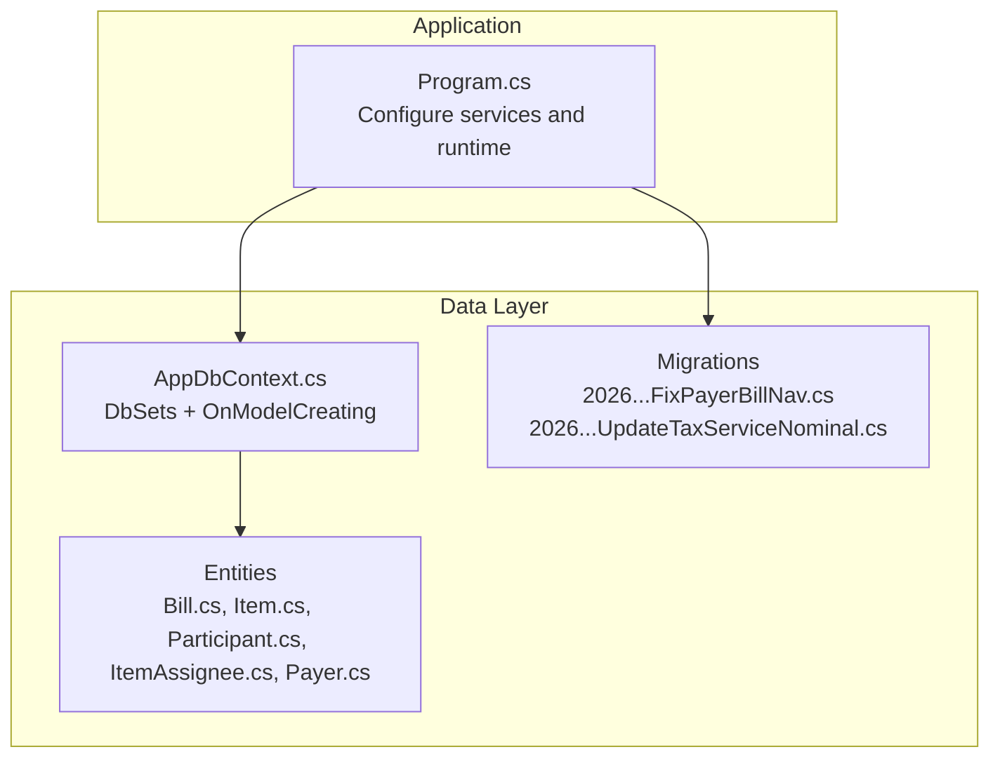
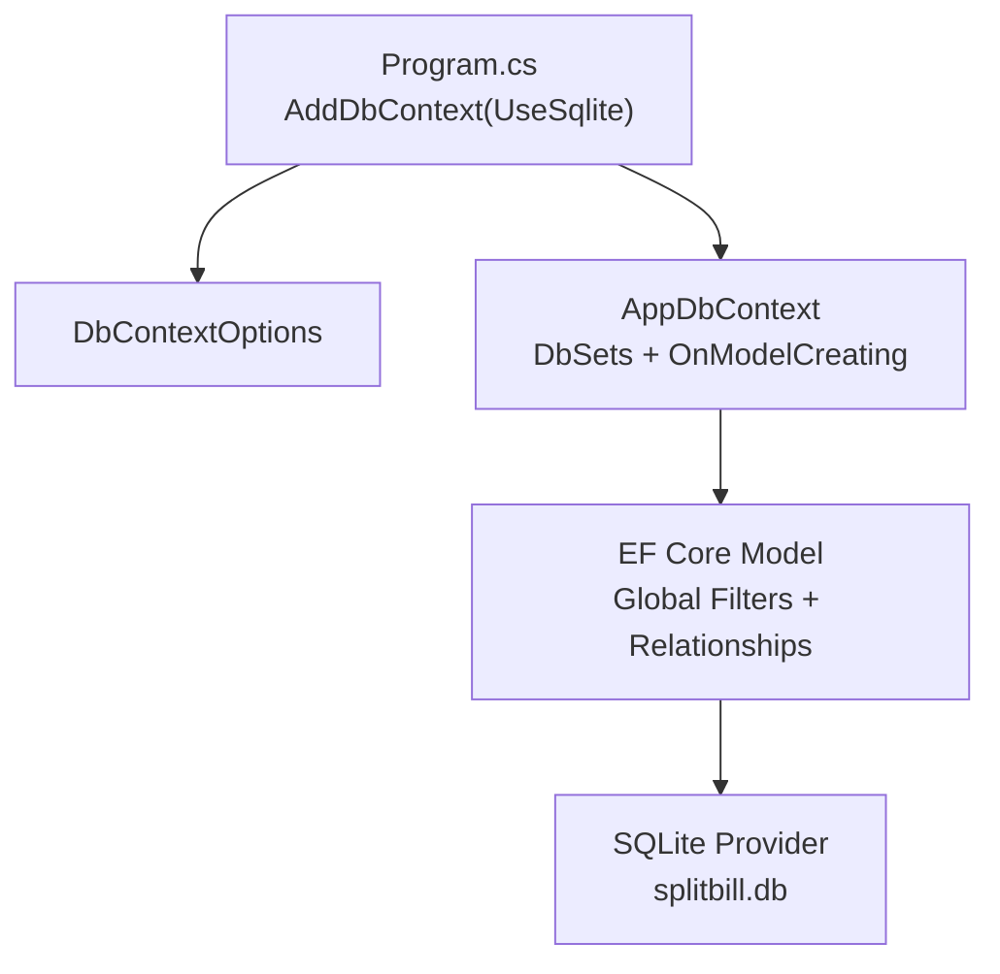
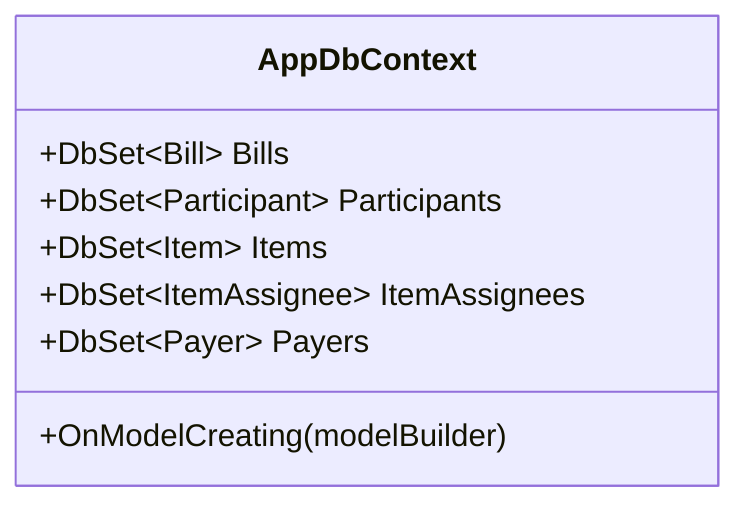
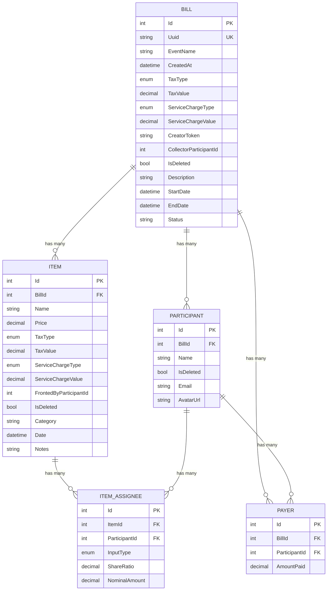
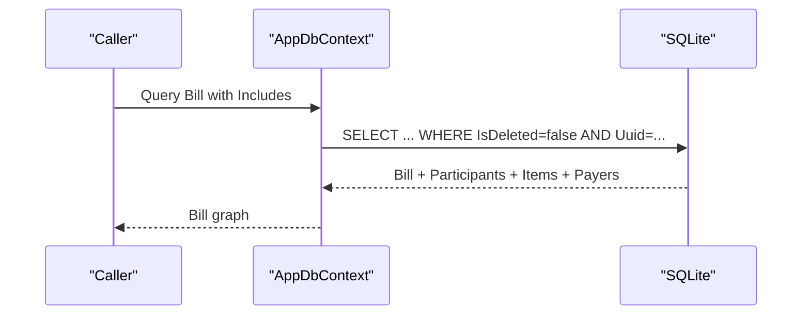
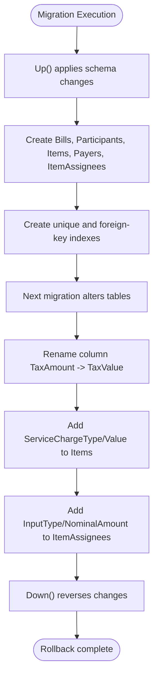
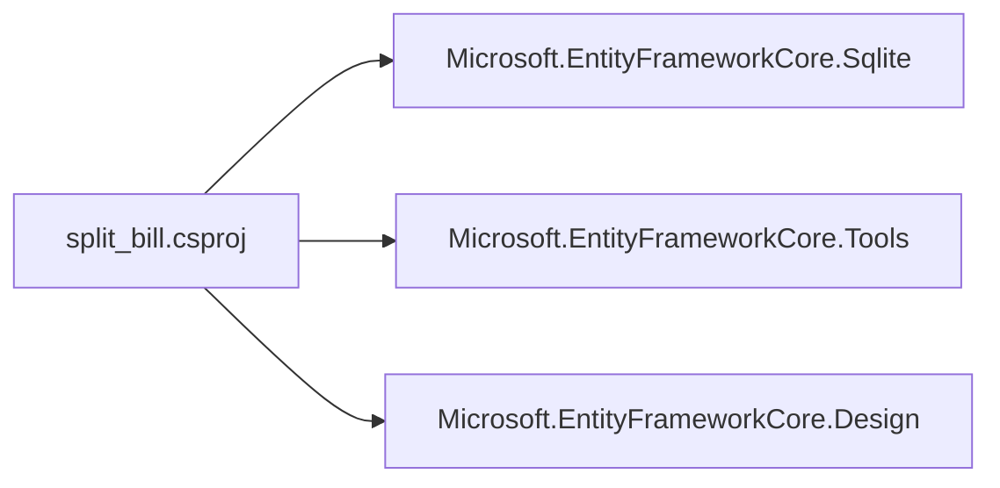

# Data Layer

<cite>
**Referenced Files in This Document**
- [AppDbContext.cs](file://Data/AppDbContext.cs)
- [Bill.cs](file://Data/Entities/Bill.cs)
- [Item.cs](file://Data/Entities/Item.cs)
- [Participant.cs](file://Data/Entities/Participant.cs)
- [ItemAssignee.cs](file://Data/Entities/ItemAssignee.cs)
- [Payer.cs](file://Data/Entities/Payer.cs)
- [20260602123128_FixPayerBillNav.cs](file://Migrations/20260602123128_FixPayerBillNav.cs)
- [20260603040137_UpdateTaxServiceNominal.cs](file://Migrations/20260603040137_UpdateTaxServiceNominal.cs)
- [Program.cs](file://Program.cs)
- [split_bill.csproj](file://split_bill.csproj)
- [SettlementService.cs](file://Services/SettlementService.cs)
- [SettlementServiceTests.cs](file://split_bill.Tests/SettlementServiceTests.cs)
</cite>

## Table of Contents
1. [Introduction](#introduction)
2. [Project Structure](#project-structure)
3. [Core Components](#core-components)
4. [Architecture Overview](#architecture-overview)
5. [Detailed Component Analysis](#detailed-component-analysis)
6. [Dependency Analysis](#dependency-analysis)
7. [Performance Considerations](#performance-considerations)
8. [Troubleshooting Guide](#troubleshooting-guide)
9. [Conclusion](#conclusion)
10. [Appendices](#appendices)

## Introduction
This document describes the data layer architecture of SplitBill, focusing on the Entity Framework configuration, database connection management, entity model, relationships, and operational patterns. It also covers migrations, schema evolution, validation and constraints, performance considerations, and testing strategies grounded in the repository’s source files.

## Project Structure
The data layer is organized around:
- A central DbContext that exposes DbSet<T> for domain entities
- Strongly-typed entity classes modeling bills, items, participants, assignees, and payers
- EF Core migrations driving schema creation and evolution
- Application startup wiring SQLite provider and development-time schema initialization

**Diagram sources**
- [Program.cs:13-14](file://Program.cs#L13-L14)
- [AppDbContext.cs:12-16](file://Data/AppDbContext.cs#L12-L16)
- [20260602123128_FixPayerBillNav.cs:14-212](file://Migrations/20260602123128_FixPayerBillNav.cs#L14-L212)
- [20260603040137_UpdateTaxServiceNominal.cs:11-51](file://Migrations/20260603040137_UpdateTaxServiceNominal.cs#L11-L51)

**Section sources**
- [Program.cs:13-14](file://Program.cs#L13-L14)
- [split_bill.csproj:10-19](file://split_bill.csproj#L10-L19)

## Core Components
- AppDbContext: Central EF Core context exposing DbSets for Bills, Participants, Items, ItemAssignees, and Payers. Configures global query filters for soft-deleted records and establishes cascade-delete relationships among related entities.
- Entities: Strongly typed models with scalar properties, navigation properties, and enums for charge types and assignee input modes.
- Migrations: Two migrations define the evolving schema, including index creation, column additions/removals, and foreign key constraints.

Key configuration highlights:
- SQLite provider configured via UseSqlite in Program.cs
- Development mode deletes existing database files and ensures schema creation
- Global query filters exclude soft-deleted rows from queries by default

**Section sources**
- [AppDbContext.cs:12-16](file://Data/AppDbContext.cs#L12-L16)
- [AppDbContext.cs:18-70](file://Data/AppDbContext.cs#L18-L70)
- [Program.cs:27-53](file://Program.cs#L27-L53)

## Architecture Overview
The data access stack integrates DI registration, EF Core model configuration, and runtime schema initialization.

**Diagram sources**
- [Program.cs:13-14](file://Program.cs#L13-L14)
- [AppDbContext.cs:8-10](file://Data/AppDbContext.cs#L8-L10)
- [AppDbContext.cs:18-70](file://Data/AppDbContext.cs#L18-L70)

## Detailed Component Analysis

### AppDbContext Configuration
- Constructor accepts DbContextOptions<AppDbContext> and delegates to base.
- DbSet properties expose domain collections.
- OnModelCreating:
  - Unique index on Bill.Uuid
  - Global query filter to exclude IsDeleted=true for Bill, Participant, and Item
  - Cascade-delete relationships:
    - Bill 1..* —→ Participants and Items
    - Bill 1..* —→ Payers (no inverse navigation on Payer)
    - Item 1..* —→ ItemAssignees
    - Participant 1..* —→ ItemAssignees and Payers

**Diagram sources**
- [AppDbContext.cs:6-16](file://Data/AppDbContext.cs#L6-L16)
- [AppDbContext.cs:18-70](file://Data/AppDbContext.cs#L18-L70)

**Section sources**
- [AppDbContext.cs:8-10](file://Data/AppDbContext.cs#L8-L10)
- [AppDbContext.cs:18-70](file://Data/AppDbContext.cs#L18-L70)

### Entity Relationship Model
Entity definitions and relationships:

**Diagram sources**
- [Bill.cs:12-37](file://Data/Entities/Bill.cs#L12-L37)
- [Participant.cs:5-20](file://Data/Entities/Participant.cs#L5-L20)
- [Item.cs:5-27](file://Data/Entities/Item.cs#L5-L27)
- [ItemAssignee.cs:9-21](file://Data/Entities/ItemAssignee.cs#L9-L21)
- [Payer.cs:3-11](file://Data/Entities/Payer.cs#L3-L11)

**Section sources**
- [Bill.cs:12-37](file://Data/Entities/Bill.cs#L12-L37)
- [Participant.cs:5-20](file://Data/Entities/Participant.cs#L5-L20)
- [Item.cs:5-27](file://Data/Entities/Item.cs#L5-L27)
- [ItemAssignee.cs:9-21](file://Data/Entities/ItemAssignee.cs#L9-L21)
- [Payer.cs:3-11](file://Data/Entities/Payer.cs#L3-L11)

### Data Access Patterns and Query Optimization
- Soft deletion via global query filters ensures deleted entities are excluded from queries automatically.
- Unique index on Bill.Uuid supports fast lookup by event identifier.
- Cascade deletes maintain referential integrity during parent deletions.
- Relationships are configured with foreign keys and cascading behavior to enforce referential integrity at the database level.

Common operations supported by the model:
- Load a bill with participants, items, and payers
- Add/remove participants and items with cascade semantics
- Track item assignees per participant
- Record payments per participant per bill

**Diagram sources**
- [AppDbContext.cs:22-30](file://Data/AppDbContext.cs#L22-L30)
- [AppDbContext.cs:35-51](file://Data/AppDbContext.cs#L35-L51)

**Section sources**
- [AppDbContext.cs:22-30](file://Data/AppDbContext.cs#L22-L30)
- [AppDbContext.cs:35-51](file://Data/AppDbContext.cs#L35-L51)

### Database Migrations and Schema Evolution
Two migrations define the evolving schema:

- Initial migration creates Bills, Participants, Items, Payers, and ItemAssignees tables with primary keys, foreign keys, and indexes. Notably:
  - Unique index on Bill.Uuid
  - Composite foreign keys and indexes for Participants, Items, ItemAssignees, and Payers
  - Indexes on foreign key columns for efficient joins

- Subsequent migration:
  - Renames Items.TaxAmount to TaxValue
  - Adds ServiceChargeType and ServiceChargeValue to Items
  - Adds TaxType to Items
  - Introduces InputType and NominalAmount to ItemAssignees

**Diagram sources**
- [20260602123128_FixPayerBillNav.cs:12-193](file://Migrations/20260602123128_FixPayerBillNav.cs#L12-L193)
- [20260603040137_UpdateTaxServiceNominal.cs:11-51](file://Migrations/20260603040137_UpdateTaxServiceNominal.cs#L11-L51)

**Section sources**
- [20260602123128_FixPayerBillNav.cs:14-212](file://Migrations/20260602123128_FixPayerBillNav.cs#L14-L212)
- [20260603040137_UpdateTaxServiceNominal.cs:11-51](file://Migrations/20260603040137_UpdateTaxServiceNominal.cs#L11-L51)

### Data Validation Rules and Business Constraints
- Charge types are represented by enums; values are persisted as integers. Business logic validates inclusive tax/service calculations and enforces rounding thresholds for balances and transfers.
- SettlementService performs inclusive tax/service portion calculations and enforces:
  - Minimum balance threshold for transfer instructions
  - Rounded monetary amounts for consistency
- Soft-deletion flag IsDeleted is respected globally via query filters.

**Section sources**
- [SettlementService.cs:243-259](file://Services/SettlementService.cs#L243-L259)
- [SettlementService.cs:199-229](file://Services/SettlementService.cs#L199-L229)
- [AppDbContext.cs:26-30](file://Data/AppDbContext.cs#L26-L30)

### Transaction Management and Bulk Operations
- The repository pattern is not explicitly implemented in the provided files; however, EF Core transactions can be used at the application layer when performing multiple writes within a single operation scope.
- Bulk operations (insert/update/delete) are typically executed within a DbContext scope; cascade deletes are handled by EF Core based on the configured relationships.

[No sources needed since this section provides general guidance]

### Data Seeding and Testing Strategies
- Development startup deletes existing database files and ensures schema creation, effectively seeding the schema on first run.
- Tests instantiate entities and call SettlementService to validate settlement computations without requiring a live database.

**Section sources**
- [Program.cs:27-53](file://Program.cs#L27-L53)
- [SettlementServiceTests.cs:19-51](file://split_bill.Tests/SettlementServiceTests.cs#L19-L51)
- [SettlementServiceTests.cs:53-157](file://split_bill.Tests/SettlementServiceTests.cs#L53-L157)

## Dependency Analysis
External dependencies relevant to the data layer:
- Microsoft.EntityFrameworkCore.Sqlite for SQLite provider
- Microsoft.EntityFrameworkCore.Tools and Microsoft.EntityFrameworkCore.Design for scaffolding and design-time support

**Diagram sources**
- [split_bill.csproj:11-19](file://split_bill.csproj#L11-L19)

**Section sources**
- [split_bill.csproj:11-19](file://split_bill.csproj#L11-L19)

## Performance Considerations
- Indexes:
  - Unique index on Bill.Uuid for fast lookups
  - Foreign key indexes on Participants(BillId), Items(BillId), ItemAssignees(ItemId, ParticipantId), Payers(BillId, ParticipantId)
- Soft deletion:
  - Global filters reduce accidental retrieval of deleted rows
- Cascade deletes:
  - Reduce orphaned records but may increase write cost during parent deletions
- Recommendations (general guidance):
  - Consider adding composite indexes for frequent join/filter combinations
  - Monitor slow query logs and add filtered indexes if needed
  - Use projection queries to limit selected columns for read-heavy operations

**Section sources**
- [AppDbContext.cs:22-24](file://Data/AppDbContext.cs#L22-L24)
- [20260602123128_FixPayerBillNav.cs:147-192](file://Migrations/20260602123128_FixPayerBillNav.cs#L147-L192)

## Troubleshooting Guide
- Database initialization in development:
  - Startup attempts to delete existing database files and ensure schema creation; if a file is locked, deletion is skipped
- Query returns unexpected empty results:
  - Verify IsDeleted flags and global query filters; confirm entities are not marked deleted
- Foreign key constraint errors:
  - Ensure parent entities (Bill) exist before creating children (Participant, Item, Payer)
  - Confirm cascade behavior aligns with intended data lifecycle

**Section sources**
- [Program.cs:27-53](file://Program.cs#L27-L53)
- [AppDbContext.cs:26-30](file://Data/AppDbContext.cs#L26-L30)
- [AppDbContext.cs:35-51](file://Data/AppDbContext.cs#L35-L51)

## Conclusion
SplitBill’s data layer leverages EF Core with SQLite, a clean entity model, and migrations to evolve schema safely. Global query filters and cascade deletes simplify data integrity and lifecycle management. The settlement service demonstrates practical usage of the model for financial computations. The architecture supports scalable growth through targeted indexing and transactional patterns.

## Appendices

### Appendix A: Entity Property Reference
- Bill: identifiers, timestamps, tax/service charge configuration, creator token, optional collector, soft delete, and descriptive metadata
- Participant: belongs to a bill, contact info, soft delete, and associations to assignees and payments
- Item: belongs to a bill, pricing and tax/service charge configuration, fronting participant, soft delete, and descriptive metadata
- ItemAssignee: assigns an item to a participant via ratio or nominal input
- Payer: records payments made by a participant toward a bill

**Section sources**
- [Bill.cs:12-37](file://Data/Entities/Bill.cs#L12-L37)
- [Participant.cs:5-20](file://Data/Entities/Participant.cs#L5-L20)
- [Item.cs:5-27](file://Data/Entities/Item.cs#L5-L27)
- [ItemAssignee.cs:9-21](file://Data/Entities/ItemAssignee.cs#L9-L21)
- [Payer.cs:3-11](file://Data/Entities/Payer.cs#L3-L11)