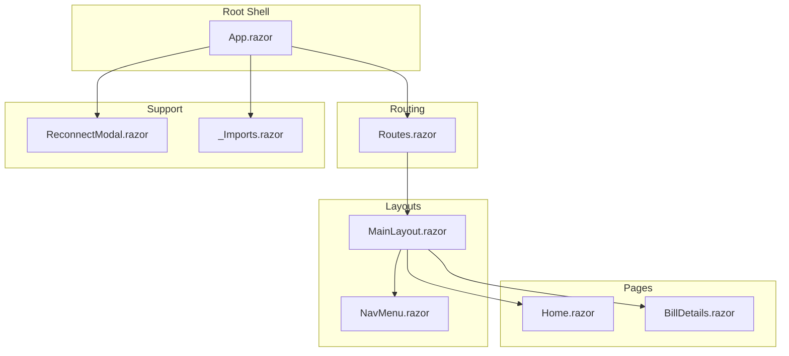
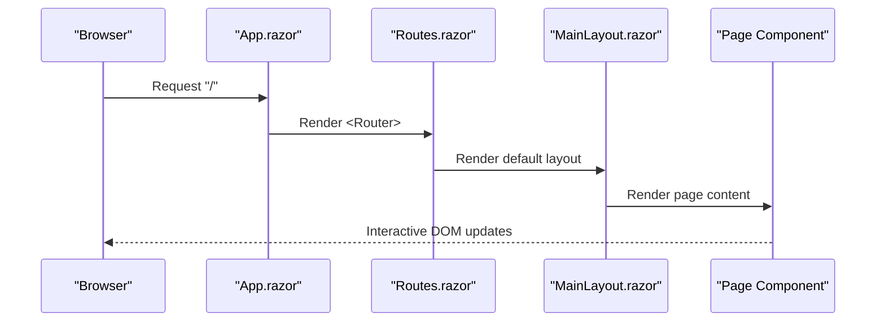
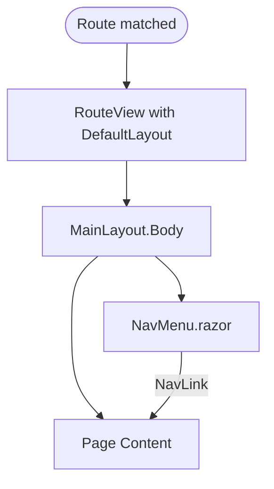
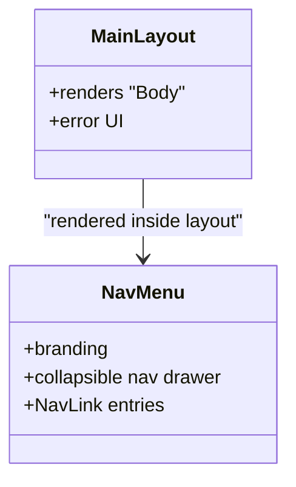
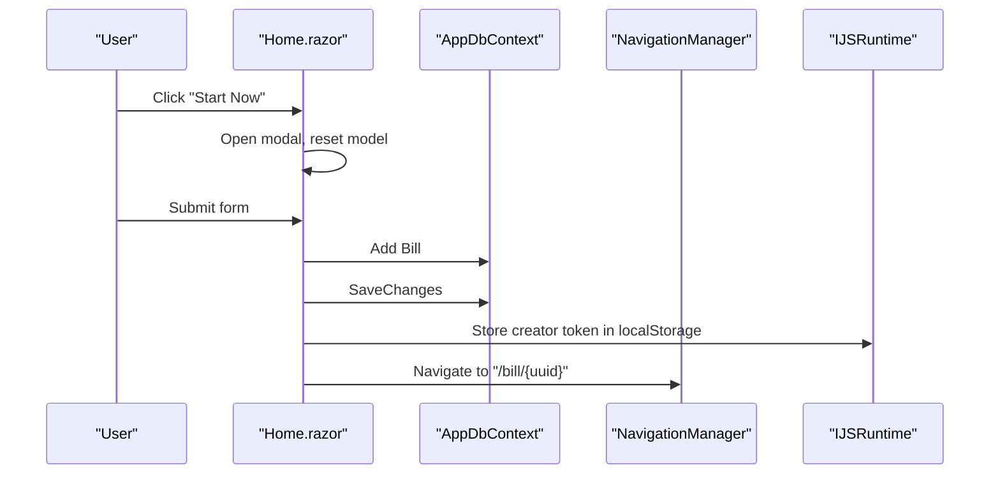
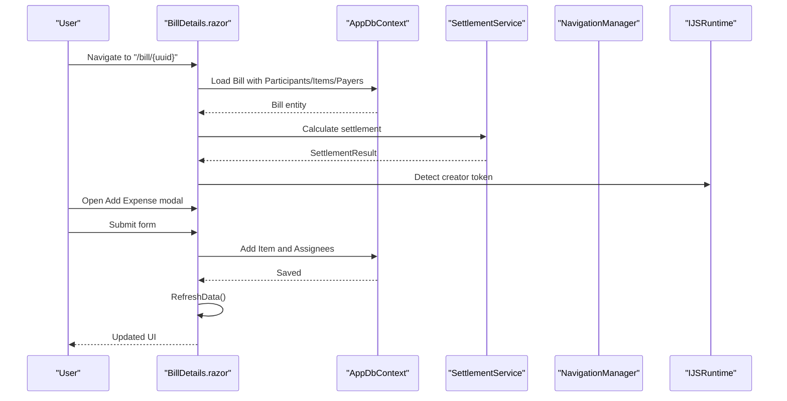
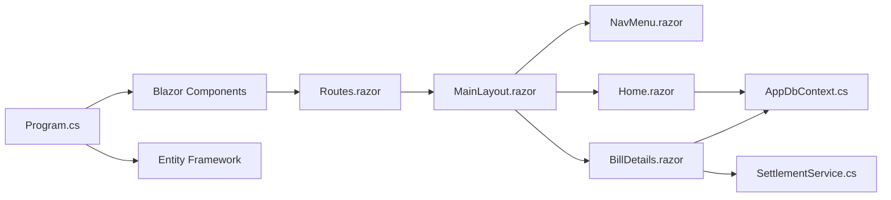

# Frontend Components

<cite>
**Referenced Files in This Document**
- [App.razor](file://Components/App.razor)
- [Routes.razor](file://Components/Routes.razor)
- [MainLayout.razor](file://Components/Layout/MainLayout.razor)
- [MainLayout.razor.css](file://Components/Layout/MainLayout.razor.css)
- [NavMenu.razor](file://Components/Layout/NavMenu.razor)
- [NavMenu.razor.css](file://Components/Layout/NavMenu.razor.css)
- [Home.razor](file://Components/Pages/Home.razor)
- [BillDetails.razor](file://Components/Pages/BillDetails.razor)
- [ReconnectModal.razor](file://Components/Layout/ReconnectModal.razor)
- [_Imports.razor](file://Components/_Imports.razor)
- [Program.cs](file://Program.cs)
- [split_bill.csproj](file://split_bill.csproj)
- [SettlementService.cs](file://Services/SettlementService.cs)
- [AppDbContext.cs](file://Data/AppDbContext.cs)
</cite>

## Table of Contents
1. [Introduction](#introduction)
2. [Project Structure](#project-structure)
3. [Core Components](#core-components)
4. [Architecture Overview](#architecture-overview)
5. [Detailed Component Analysis](#detailed-component-analysis)
6. [Dependency Analysis](#dependency-analysis)
7. [Performance Considerations](#performance-considerations)
8. [Troubleshooting Guide](#troubleshooting-guide)
9. [Conclusion](#conclusion)
10. [Appendices](#appendices)

## Introduction
This document explains SplitBill’s frontend component architecture built with Blazor Server. It covers the component hierarchy starting from the root App shell, routing and layouts, page components, state management, styling, composition patterns, responsiveness, and testing and debugging strategies. The goal is to help developers understand how pages render, how navigation works, and how interactive UIs are structured and maintained.

## Project Structure
The frontend is organized around a small set of core components:
- Root shell and routing: App.razor, Routes.razor
- Layouts: MainLayout.razor and NavMenu.razor
- Pages: Home.razor and BillDetails.razor
- Connectivity and reconnection: ReconnectModal.razor
- Global imports: _Imports.razor
- Application bootstrap: Program.cs
- Build integration: split_bill.csproj
- Domain services and data: SettlementService.cs, AppDbContext.cs

**Diagram sources**
- [App.razor:1-27](file://Components/App.razor#L1-L27)
- [Routes.razor:1-7](file://Components/Routes.razor#L1-L7)
- [MainLayout.razor:1-12](file://Components/Layout/MainLayout.razor#L1-L12)
- [NavMenu.razor:1-31](file://Components/Layout/NavMenu.razor#L1-L31)
- [Home.razor:1-325](file://Components/Pages/Home.razor#L1-L325)
- [BillDetails.razor:1-1583](file://Components/Pages/BillDetails.razor#L1-L1583)
- [ReconnectModal.razor:1-32](file://Components/Layout/ReconnectModal.razor#L1-L32)
- [_Imports.razor:1-12](file://Components/_Imports.razor#L1-L12)

**Section sources**
- [App.razor:1-27](file://Components/App.razor#L1-L27)
- [Routes.razor:1-7](file://Components/Routes.razor#L1-L7)
- [MainLayout.razor:1-12](file://Components/Layout/MainLayout.razor#L1-L12)
- [NavMenu.razor:1-31](file://Components/Layout/NavMenu.razor#L1-L31)
- [Home.razor:1-325](file://Components/Pages/Home.razor#L1-L325)
- [BillDetails.razor:1-1583](file://Components/Pages/BillDetails.razor#L1-L1583)
- [ReconnectModal.razor:1-32](file://Components/Layout/ReconnectModal.razor#L1-L32)
- [_Imports.razor:1-12](file://Components/_Imports.razor#L1-L12)

## Core Components
- App.razor: The HTML document shell that loads assets, sets up head and body, mounts Routes, and renders the reconnect modal and scripts.
- Routes.razor: Declares router assembly, found route handling, default layout, and focus-on-navigate behavior.
- MainLayout.razor: Provides the global layout scaffold with a body outlet and error UI.
- NavMenu.razor: Supplies the top branding and collapsible navigation links.
- Home.razor: Landing page with hero, features, footer, and a modal form to create a new bill session.
- BillDetails.razor: The primary interactive page for managing a bill session, including expenses, members, summary, payments, and modals.
- ReconnectModal.razor: Handles interactive server reconnection UX.
- _Imports.razor: Centralizes commonly used namespaces for Razor components.

**Section sources**
- [App.razor:1-27](file://Components/App.razor#L1-L27)
- [Routes.razor:1-7](file://Components/Routes.razor#L1-L7)
- [MainLayout.razor:1-12](file://Components/Layout/MainLayout.razor#L1-L12)
- [NavMenu.razor:1-31](file://Components/Layout/NavMenu.razor#L1-L31)
- [Home.razor:1-325](file://Components/Pages/Home.razor#L1-L325)
- [BillDetails.razor:1-1583](file://Components/Pages/BillDetails.razor#L1-L1583)
- [ReconnectModal.razor:1-32](file://Components/Layout/ReconnectModal.razor#L1-L32)
- [_Imports.razor:1-12](file://Components/_Imports.razor#L1-L12)

## Architecture Overview
The Blazor Server rendering pipeline starts at App.razor, which hosts the Router. Found routes render via RouteView inside MainLayout. The NavMenu composes the left-side navigation. Page components (Home, BillDetails) encapsulate domain-specific UI and logic.

**Diagram sources**
- [App.razor:1-27](file://Components/App.razor#L1-L27)
- [Routes.razor:1-7](file://Components/Routes.razor#L1-L7)
- [MainLayout.razor:1-12](file://Components/Layout/MainLayout.razor#L1-L12)

## Detailed Component Analysis

### Routing and Layout Composition
- Router assembly and found route handling are declared in Routes.razor. It uses RouteView with a default layout and focuses on the first heading after navigation.
- MainLayout.razor inherits LayoutComponentBase and renders the page body. It also defines a global error UI element.
- NavMenu.razor provides branding and a collapsible navigation list with NavLink entries. It uses CSS to toggle visibility on small screens and styles for dark theme and active states.

**Diagram sources**
- [Routes.razor:1-7](file://Components/Routes.razor#L1-L7)
- [MainLayout.razor:1-12](file://Components/Layout/MainLayout.razor#L1-L12)
- [NavMenu.razor:1-31](file://Components/Layout/NavMenu.razor#L1-L31)

**Section sources**
- [Routes.razor:1-7](file://Components/Routes.razor#L1-L7)
- [MainLayout.razor:1-12](file://Components/Layout/MainLayout.razor#L1-L12)
- [NavMenu.razor:1-31](file://Components/Layout/NavMenu.razor#L1-L31)

### MainLayout and Navigation Menu
- MainLayout.razor sets the global page container and error UI. It does not define a sidebar; NavMenu is a separate component rendered inside the page body.
- NavMenu.razor uses a checkbox hack to toggle a collapsible navigation drawer on mobile and applies dark-themed styles. It includes brand identity and links to internal pages.

**Diagram sources**
- [MainLayout.razor:1-12](file://Components/Layout/MainLayout.razor#L1-L12)
- [NavMenu.razor:1-31](file://Components/Layout/NavMenu.razor#L1-L31)

**Section sources**
- [MainLayout.razor:1-12](file://Components/Layout/MainLayout.razor#L1-L12)
- [MainLayout.razor.css:1-99](file://Components/Layout/MainLayout.razor.css#L1-L99)
- [NavMenu.razor:1-31](file://Components/Layout/NavMenu.razor#L1-L31)
- [NavMenu.razor.css:1-106](file://Components/Layout/NavMenu.razor.css#L1-L106)

### Home Page (Home.razor)
- Purpose: Entry point for new sessions. Presents hero, features, and a modal to create a new bill.
- State management: Uses local component state (boolean flags, model class) and interacts with DI services for DB context, navigation, and JS interop.
- Interaction patterns: Click handlers open/close modal, form submission persists a new Bill entity and navigates to the newly created bill route.
- Styling: Extensive Tailwind-based layout for responsive sections, animations, and illustrations.

**Diagram sources**
- [Home.razor:237-301](file://Components/Pages/Home.razor#L237-L301)
- [AppDbContext.cs:1-71](file://Data/AppDbContext.cs#L1-L71)

**Section sources**
- [Home.razor:1-325](file://Components/Pages/Home.razor#L1-L325)

### BillDetails Page (BillDetails.razor)
- Purpose: Full-featured bill session management with tabs for Expenses, Members, and Summary.
- Routing: Parameterized route captures the bill UUID.
- State management: Local reactive state for UI flags, filters, and forms; fetches and refreshes data asynchronously; uses a service to compute settlement results.
- Interaction patterns: Modal dialogs for adding expenses, members, editing group info, and recording payments; tab switching, search/filtering, expandable item rows, and creator-only actions.
- Lifecycle hooks: OnParametersSetAsync to refresh data when route parameters change; OnAfterRenderAsync to detect creator role via JS interop.
- Styling: Tailwind utilities for responsive grids, cards, and modals; custom animations and scrollbars.

**Diagram sources**
- [BillDetails.razor:1013-1583](file://Components/Pages/BillDetails.razor#L1013-L1583)
- [SettlementService.cs:55-232](file://Services/SettlementService.cs#L55-L232)
- [AppDbContext.cs:1-71](file://Data/AppDbContext.cs#L1-L71)

**Section sources**
- [BillDetails.razor:1-1583](file://Components/Pages/BillDetails.razor#L1-L1583)
- [SettlementService.cs:1-314](file://Services/SettlementService.cs#L1-L314)
- [AppDbContext.cs:1-71](file://Data/AppDbContext.cs#L1-L71)

### Component Lifecycle Hooks, Parameters, and Events
- Parameters: BillDetails exposes a [Parameter] string Uuid to receive the route parameter.
- Lifecycle:
  - OnParametersSetAsync: Triggers data refresh when parameters change.
  - OnAfterRenderAsync: Runs once on first render to detect creator role via JS interop.
- Events: Click handlers, form bindings (@bind), and change events drive state updates and persistence.

**Section sources**
- [BillDetails.razor:1013-1152](file://Components/Pages/BillDetails.razor#L1013-L1152)

### Styling Approaches: TailwindCSS and CSS Modules
- TailwindCSS: Used extensively for layout, spacing, colors, shadows, and responsive breakpoints across components.
- CSS Modules: MainLayout.razor.css and NavMenu.razor.css apply scoped styles for layout and navigation, including media queries for responsive behavior and theme toggles.
- Inline styles and animations: Both Home.razor and BillDetails.razor include inline <style> blocks for component-scoped animations and custom scrollbars.

**Section sources**
- [MainLayout.razor.css:1-99](file://Components/Layout/MainLayout.razor.css#L1-L99)
- [NavMenu.razor.css:1-106](file://Components/Layout/NavMenu.razor.css#L1-L106)
- [Home.razor:303-325](file://Components/Pages/Home.razor#L303-L325)
- [BillDetails.razor:988-1011](file://Components/Pages/BillDetails.razor#L988-L1011)

### Component Composition Patterns and Reusability
- Composition: MainLayout composes NavMenu and page content; pages compose modals and partial sections.
- Reusability: Shared UI patterns (cards, lists, modals) are repeated across pages. SettlementService encapsulates settlement computation for reuse by BillDetails.
- Parameterization: Route parameters enable dynamic page behavior (e.g., bill UUID).
- DI: Services injected via Program.cs (e.g., AppDbContext, SettlementService) promote testability and separation of concerns.

**Section sources**
- [Program.cs:1-73](file://Program.cs#L1-L73)
- [SettlementService.cs:1-314](file://Services/SettlementService.cs#L1-L314)

### Responsive Design Implementation
- Mobile-first Tailwind utilities: Responsive variants for flex, grid, padding, and typography adapt to screen sizes.
- Collapsible navigation: NavMenu uses a checkbox-driven drawer for small screens.
- Media queries: CSS media queries in layout and navigation styles adjust layout and spacing.

**Section sources**
- [MainLayout.razor.css:39-77](file://Components/Layout/MainLayout.razor.css#L39-L77)
- [NavMenu.razor.css:92-106](file://Components/Layout/NavMenu.razor.css#L92-L106)

### Testing Strategies and Debugging Techniques
- Component testing: The repository includes a dedicated tests project split_bill.Tests with unit tests and service tests. Tests can target services like SettlementService and isolated logic.
- Debugging:
  - Use browser DevTools to inspect Blazor interactive server components and network requests.
  - Leverage OnAfterRenderAsync for JS interop checks and localStorage state verification.
  - Use logging and exception handling in Program.cs for startup and error pages.
  - For routing issues, verify Routes.razor assembly and NotFound handling.

**Section sources**
- [Program.cs:57-72](file://Program.cs#L57-L72)
- [split_bill.csproj:1-34](file://split_bill.csproj#L1-L34)

## Dependency Analysis
- Runtime dependencies:
  - Blazor interactive server components are registered in Program.cs.
  - Entity Framework with SQLite is configured for data access.
  - Tailwind compilation is integrated via npm build step.
- Component dependencies:
  - Routes depends on MainLayout as default layout.
  - Pages depend on shared services (AppDbContext, SettlementService).
  - NavMenu is rendered inside MainLayout and linked to page content.

**Diagram sources**
- [Program.cs:1-73](file://Program.cs#L1-L73)
- [Routes.razor:1-7](file://Components/Routes.razor#L1-L7)
- [MainLayout.razor:1-12](file://Components/Layout/MainLayout.razor#L1-L12)
- [NavMenu.razor:1-31](file://Components/Layout/NavMenu.razor#L1-L31)
- [Home.razor:1-325](file://Components/Pages/Home.razor#L1-L325)
- [BillDetails.razor:1-1583](file://Components/Pages/BillDetails.razor#L1-L1583)
- [AppDbContext.cs:1-71](file://Data/AppDbContext.cs#L1-L71)
- [SettlementService.cs:1-314](file://Services/SettlementService.cs#L1-L314)

**Section sources**
- [Program.cs:1-73](file://Program.cs#L1-L73)
- [split_bill.csproj:29-31](file://split_bill.csproj#L29-L31)

## Performance Considerations
- Lazy loading and minimal re-rendering: Prefer local state updates and targeted refreshes (e.g., RefreshData) to avoid unnecessary DB roundtrips.
- Filtering and sorting: Apply filtering client-side on smaller datasets; consider pagination for large lists.
- Rendering cost: Avoid heavy computations in render methods; cache derived values (e.g., settlement totals) until data changes.
- Assets: Ensure Tailwind CSS is built during build to reduce runtime overhead.

## Troubleshooting Guide
- Navigation exceptions: Blazor disables throw navigation exceptions; check Program.cs for navigation behavior and error pages.
- Reconnection: ReconnectModal.razor provides UI feedback for interactive server reconnection attempts.
- Startup errors: Program.cs configures error pages and HTTPS/HSTS; verify middleware order and static asset mapping.

**Section sources**
- [Program.cs:57-72](file://Program.cs#L57-L72)
- [ReconnectModal.razor:1-32](file://Components/Layout/ReconnectModal.razor#L1-L32)

## Conclusion
SplitBill’s frontend leverages Blazor Server to deliver a responsive, interactive UI with clear component boundaries. Routes.razor and MainLayout.razor establish a consistent layout and navigation foundation, while Home.razor and BillDetails.razor encapsulate distinct user journeys. State is managed locally with DI-backed services for persistence and computation. TailwindCSS and scoped CSS modules provide flexible styling, and the tests project supports maintainability and reliability.

## Appendices
- Build integration: Tailwind compilation hook ensures CSS generation during build.
- Imports: _Imports.razor centralizes common namespaces for components.

**Section sources**
- [split_bill.csproj:29-31](file://split_bill.csproj#L29-L31)
- [_Imports.razor:1-12](file://Components/_Imports.razor#L1-L12)