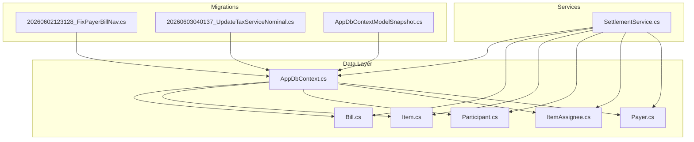
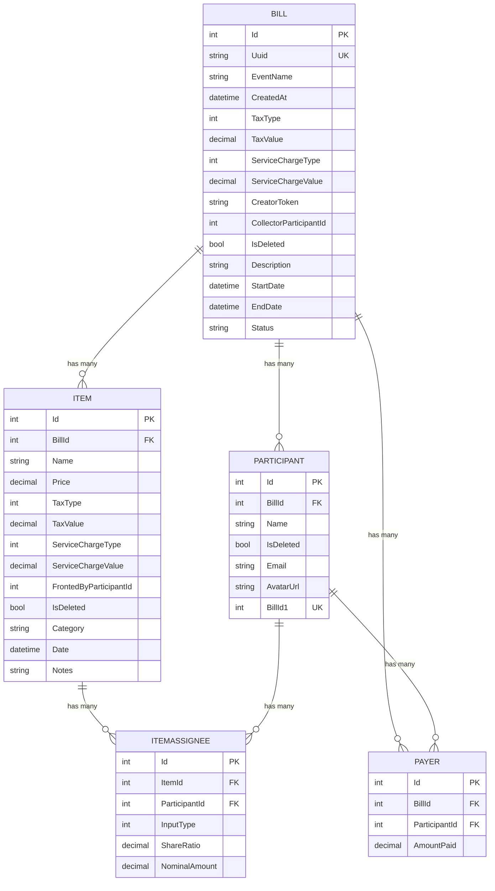
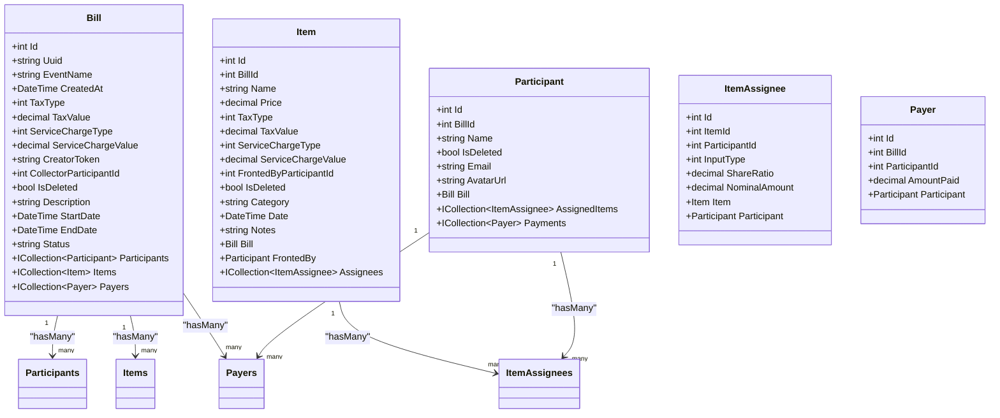
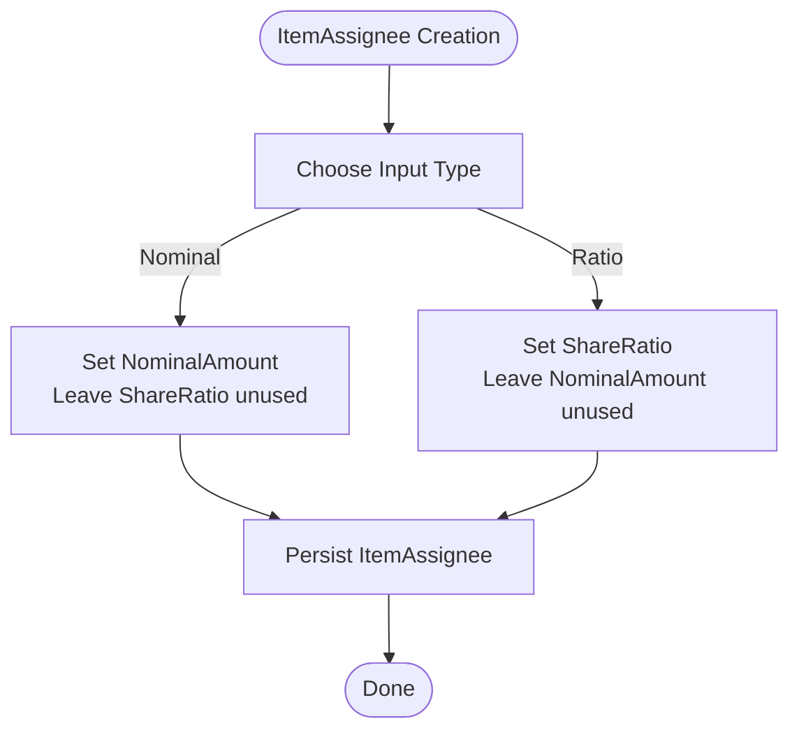
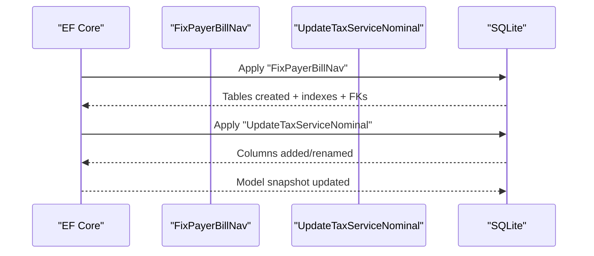
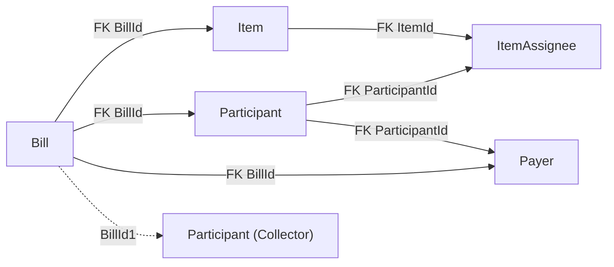

# Database Design

<cite>
**Referenced Files in This Document**
- [Bill.cs](file://Data/Entities/Bill.cs)
- [Item.cs](file://Data/Entities/Item.cs)
- [Participant.cs](file://Data/Entities/Participant.cs)
- [ItemAssignee.cs](file://Data/Entities/ItemAssignee.cs)
- [Payer.cs](file://Data/Entities/Payer.cs)
- [AppDbContext.cs](file://Data/AppDbContext.cs)
- [20260602123128_FixPayerBillNav.cs](file://Migrations/20260602123128_FixPayerBillNav.cs)
- [20260602123128_FixPayerBillNav.Designer.cs](file://Migrations/20260602123128_FixPayerBillNav.Designer.cs)
- [20260603040137_UpdateTaxServiceNominal.cs](file://Migrations/20260603040137_UpdateTaxServiceNominal.cs)
- [20260603040137_UpdateTaxServiceNominal.Designer.cs](file://Migrations/20260603040137_UpdateTaxServiceNominal.Designer.cs)
- [AppDbContextModelSnapshot.cs](file://Migrations/AppDbContextModelSnapshot.cs)
- [SettlementService.cs](file://Services/SettlementService.cs)
</cite>

## Table of Contents
1. [Introduction](#introduction)
2. [Project Structure](#project-structure)
3. [Core Components](#core-components)
4. [Architecture Overview](#architecture-overview)
5. [Detailed Component Analysis](#detailed-component-analysis)
6. [Dependency Analysis](#dependency-analysis)
7. [Performance Considerations](#performance-considerations)
8. [Troubleshooting Guide](#troubleshooting-guide)
9. [Conclusion](#conclusion)
10. [Appendices](#appendices)

## Introduction
This document describes the database design for SplitBill, focusing on the core entities and their relationships: Bill, Item, Participant, ItemAssignee, and Payer. It documents field definitions, data types, primary/foreign keys, constraints, and the many-to-many relationship between Items and Participants through ItemAssignee. It also covers Entity Framework configuration, relationship mapping, migration history, data validation rules, business constraints, and query optimization strategies.

## Project Structure
The database design is implemented using Entity Framework Core with SQLite. The entities are defined under Data/Entities, and the database context is configured in Data/AppDbContext. Migrations under Migrations define the evolving schema, and Services consume the model for settlement calculations.

**Diagram sources**
- [AppDbContext.cs:12-70](file://Data/AppDbContext.cs#L12-L70)
- [20260602123128_FixPayerBillNav.cs:14-214](file://Migrations/20260602123128_FixPayerBillNav.cs#L14-L214)
- [20260603040137_UpdateTaxServiceNominal.cs:11-82](file://Migrations/20260603040137_UpdateTaxServiceNominal.cs#L11-L82)
- [AppDbContextModelSnapshot.cs:20-286](file://Migrations/AppDbContextModelSnapshot.cs#L20-L286)
- [SettlementService.cs:55-232](file://Services/SettlementService.cs#L55-L232)

**Section sources**
- [AppDbContext.cs:12-70](file://Data/AppDbContext.cs#L12-L70)
- [20260602123128_FixPayerBillNav.cs:14-214](file://Migrations/20260602123128_FixPayerBillNav.cs#L14-L214)
- [20260603040137_UpdateTaxServiceNominal.cs:11-82](file://Migrations/20260603040137_UpdateTaxServiceNominal.cs#L11-L82)
- [AppDbContextModelSnapshot.cs:20-286](file://Migrations/AppDbContextModelSnapshot.cs#L20-L286)
- [SettlementService.cs:55-232](file://Services/SettlementService.cs#L55-L232)

## Core Components
This section defines each entity’s fields, data types, and constraints derived from both the entity classes and EF Core migrations.

- Bill
  - Fields: Id (int, PK), Uuid (string, unique), EventName (string), CreatedAt (DateTime), TaxType (enum), TaxValue (decimal), ServiceChargeType (enum), ServiceChargeValue (decimal), CreatorToken (string), CollectorParticipantId (int?), Collector (navigation), IsDeleted (bool), Description (string), StartDate (DateTime?), EndDate (DateTime?), Status (string)
  - Constraints: Unique index on Uuid; soft-delete filter on IsDeleted
  - Relationships: One-to-many with Participants, Items, Payers; one-to-one with Collector via Participant (BillId1)

- Item
  - Fields: Id (int, PK), BillId (int, FK), Name (string), Price (decimal), TaxType (enum), TaxValue (decimal), ServiceChargeType (enum), ServiceChargeValue (decimal), FrontedByParticipantId (int?), FrontedBy (navigation), IsDeleted (bool), Category (string), Date (DateTime), Notes (string)
  - Constraints: FK to Bill; indexes on BillId and FrontedById; soft-delete filter on IsDeleted
  - Relationships: Many-to-one with Bill; many-to-many with Participants via ItemAssignee; optional many-to-one with Participant via FrontedBy

- Participant
  - Fields: Id (int, PK), BillId (int, FK), Name (string), IsDeleted (bool), Email (string), AvatarUrl (string)
  - Constraints: FK to Bill; unique index on BillId1; soft-delete filter on IsDeleted
  - Relationships: Many-to-one with Bill; many-to-many with Items via ItemAssignee; many-to-one with Bill via Collector (BillId1); many-to-one with Payers

- ItemAssignee
  - Fields: Id (int, PK), ItemId (int, FK), ParticipantId (int, FK), InputType (enum), ShareRatio (decimal), NominalAmount (decimal)
  - Constraints: FKs to Item and Participant; indexes on ItemId and ParticipantId
  - Relationships: Many-to-one with Item and Participant; composite many-to-many via junction

- Payer
  - Fields: Id (int, PK), BillId (int, FK), ParticipantId (int, FK), AmountPaid (decimal)
  - Constraints: FKs to Bill and Participant; indexes on BillId and ParticipantId
  - Relationships: Many-to-one with Bill and Participant

Validation and business constraints observed:
- Soft-deletion via IsDeleted filters on Bill, Participant, and Item
- Unique Bill.Uuid enforced at database level
- Enum types for tax/service types stored as integers
- Nominal vs ratio sharing in ItemAssignee
- FrontedByParticipantId indicates who paid for an item

**Section sources**
- [Bill.cs:12-37](file://Data/Entities/Bill.cs#L12-L37)
- [Item.cs:5-27](file://Data/Entities/Item.cs#L5-L27)
- [Participant.cs:5-20](file://Data/Entities/Participant.cs#L5-L20)
- [ItemAssignee.cs:9-21](file://Data/Entities/ItemAssignee.cs#L9-L21)
- [Payer.cs:3-12](file://Data/Entities/Payer.cs#L3-L12)
- [20260602123128_FixPayerBillNav.Designer.cs:23-182](file://Migrations/20260602123128_FixPayerBillNav.Designer.cs#L23-L182)
- [20260603040137_UpdateTaxServiceNominal.Designer.cs:70-144](file://Migrations/20260603040137_UpdateTaxServiceNominal.Designer.cs#L70-L144)

## Architecture Overview
The database follows a hierarchical structure centered around Bill, with Items linked to Bills, Participants linked to Bills, and a many-to-many relationship between Items and Participants mediated by ItemAssignee. Payers record payments made by Participants toward a Bill.

**Diagram sources**
- [AppDbContext.cs:18-70](file://Data/AppDbContext.cs#L18-L70)
- [20260602123128_FixPayerBillNav.Designer.cs:23-182](file://Migrations/20260602123128_FixPayerBillNav.Designer.cs#L23-L182)
- [20260603040137_UpdateTaxServiceNominal.Designer.cs:70-197](file://Migrations/20260603040137_UpdateTaxServiceNominal.Designer.cs#L70-L197)

## Detailed Component Analysis

### Entity Relationship Mapping
Entity Framework configuration establishes foreign keys, cascade deletes, and navigation properties. Notable mappings:
- Bill to Participants: one-to-many with cascade delete
- Bill to Items: one-to-many with cascade delete
- Bill to Payers: one-to-many with cascade delete (no reverse navigation)
- Item to ItemAssignees: one-to-many with cascade delete
- Participant to ItemAssignees: one-to-many with cascade delete
- Participant to Payers: one-to-many with cascade delete
- Unique index on Bill.Uuid
- Soft-delete filters on Bill, Participant, and Item

**Diagram sources**
- [AppDbContext.cs:18-70](file://Data/AppDbContext.cs#L18-L70)
- [Bill.cs:34-36](file://Data/Entities/Bill.cs#L34-L36)
- [Item.cs:24-26](file://Data/Entities/Item.cs#L24-L26)
- [Participant.cs:17-19](file://Data/Entities/Participant.cs#L17-L19)
- [ItemAssignee.cs:19-20](file://Data/Entities/ItemAssignee.cs#L19-L20)
- [Payer.cs:11](file://Data/Entities/Payer.cs#L11)

**Section sources**
- [AppDbContext.cs:18-70](file://Data/AppDbContext.cs#L18-L70)
- [Bill.cs:34-36](file://Data/Entities/Bill.cs#L34-L36)
- [Item.cs:24-26](file://Data/Entities/Item.cs#L24-L26)
- [Participant.cs:17-19](file://Data/Entities/Participant.cs#L17-L19)
- [ItemAssignee.cs:19-20](file://Data/Entities/ItemAssignee.cs#L19-L20)
- [Payer.cs:11](file://Data/Entities/Payer.cs#L11)

### Many-to-Many Relationship Between Items and Participants (ItemAssignee)
The many-to-many relationship is implemented via a junction table ItemAssignee with:
- Composite primary key (Id)
- Foreign keys: ItemId → Item.Id, ParticipantId → Participant.Id
- Additional fields: InputType (enum), ShareRatio (decimal), NominalAmount (decimal)

**Diagram sources**
- [ItemAssignee.cs:14-16](file://Data/Entities/ItemAssignee.cs#L14-L16)
- [20260603040137_UpdateTaxServiceNominal.cs:39-51](file://Migrations/20260603040137_UpdateTaxServiceNominal.cs#L39-L51)

**Section sources**
- [ItemAssignee.cs:14-16](file://Data/Entities/ItemAssignee.cs#L14-L16)
- [20260603040137_UpdateTaxServiceNominal.cs:39-51](file://Migrations/20260603040137_UpdateTaxServiceNominal.cs#L39-L51)

### Sample Data Structures
Representative rows for each table based on migrations and entity definitions:

- Bills
  - Id: integer, autoincrement
  - Uuid: unique string
  - EventName: string
  - CreatedAt: datetime
  - TaxType/TaxValue: enums and decimals
  - ServiceChargeType/ServiceChargeValue: enums and decimals
  - CreatorToken: string
  - CollectorParticipantId: nullable integer
  - IsDeleted: boolean

- Items
  - Id: integer, autoincrement
  - BillId: integer (FK)
  - Name: string
  - Price: decimal
  - TaxType/TaxValue: enums and decimals
  - ServiceChargeType/ServiceChargeValue: enums and decimals
  - FrontedByParticipantId: nullable integer
  - IsDeleted: boolean
  - Category/Date/Notes: string/datetime/string

- Participants
  - Id: integer, autoincrement
  - BillId: integer (FK)
  - Name: string
  - IsDeleted: boolean
  - Email/AvatarUrl: string/string
  - BillId1: unique integer (BillId1)

- ItemAssignees
  - Id: integer, autoincrement
  - ItemId: integer (FK)
  - ParticipantId: integer (FK)
  - InputType: enum
  - ShareRatio: decimal
  - NominalAmount: decimal

- Payers
  - Id: integer, autoincrement
  - BillId: integer (FK)
  - ParticipantId: integer (FK)
  - AmountPaid: decimal

**Section sources**
- [20260602123128_FixPayerBillNav.Designer.cs:23-182](file://Migrations/20260602123128_FixPayerBillNav.Designer.cs#L23-L182)
- [20260603040137_UpdateTaxServiceNominal.Designer.cs:70-197](file://Migrations/20260603040137_UpdateTaxServiceNominal.Designer.cs#L70-L197)
- [Bill.cs:12-37](file://Data/Entities/Bill.cs#L12-L37)
- [Item.cs:5-27](file://Data/Entities/Item.cs#L5-L27)
- [Participant.cs:5-20](file://Data/Entities/Participant.cs#L5-L20)
- [ItemAssignee.cs:9-21](file://Data/Entities/ItemAssignee.cs#L9-L21)
- [Payer.cs:3-12](file://Data/Entities/Payer.cs#L3-L12)

### Migration History
- Initial schema creation (FixPayerBillNav):
  - Creates Bills, Participants, Items, Payers, ItemAssignees tables
  - Adds unique index on Bill.Uuid
  - Adds indexes on foreign keys
  - Establishes cascade delete relationships
  - Introduces BillId1 for the Collector relationship

- Tax and service updates (UpdateTaxServiceNominal):
  - Renames Items.TaxAmount to TaxValue
  - Adds TaxType and ServiceChargeType to Items
  - Adds ServiceChargeValue to Items
  - Adds InputType and NominalAmount to ItemAssignees

**Diagram sources**
- [20260602123128_FixPayerBillNav.cs:14-214](file://Migrations/20260602123128_FixPayerBillNav.cs#L14-L214)
- [20260603040137_UpdateTaxServiceNominal.cs:11-82](file://Migrations/20260603040137_UpdateTaxServiceNominal.cs#L11-L82)
- [AppDbContextModelSnapshot.cs:15-286](file://Migrations/AppDbContextModelSnapshot.cs#L15-L286)

**Section sources**
- [20260602123128_FixPayerBillNav.cs:14-214](file://Migrations/20260602123128_FixPayerBillNav.cs#L14-L214)
- [20260603040137_UpdateTaxServiceNominal.cs:11-82](file://Migrations/20260603040137_UpdateTaxServiceNominal.cs#L11-L82)
- [AppDbContextModelSnapshot.cs:15-286](file://Migrations/AppDbContextModelSnapshot.cs#L15-L286)

### Data Validation Rules and Business Constraints
- Soft deletion: IsDeleted filters ensure deleted records are excluded from queries by default
- Unique Bill.Uuid: prevents duplicate bill identifiers
- Enum storage: ChargeType and AssigneeInputType stored as integers
- Sharing model: ItemAssignee supports either NominalAmount or ShareRatio, not both simultaneously for a single assignment
- Fronted-by: Items can optionally record who paid for them via FrontedByParticipantId
- Collector: Bill can designate a collector participant via BillId1

**Section sources**
- [AppDbContext.cs:22-34](file://Data/AppDbContext.cs#L22-L34)
- [20260602123128_FixPayerBillNav.Designer.cs:64](file://Migrations/20260602123128_FixPayerBillNav.Designer.cs#L64)
- [ItemAssignee.cs:14-16](file://Data/Entities/ItemAssignee.cs#L14-L16)
- [20260603040137_UpdateTaxServiceNominal.cs:39-51](file://Migrations/20260603040137_UpdateTaxServiceNominal.cs#L39-L51)

### Data Lifecycle Management
- Soft deletion: IsDeleted flag prevents physical removal; query filters exclude deleted records
- Cascade deletes: Deleting a Bill cascades to Participants, Items, and Payers; deleting an Item cascades to ItemAssignees
- Indexes: Foreign key indexes optimize joins and filtering
- Snapshot: ModelSnapshot reflects current model state for EF tooling

**Section sources**
- [AppDbContext.cs:26-34](file://Data/AppDbContext.cs#L26-L34)
- [AppDbContext.cs:35-69](file://Data/AppDbContext.cs#L35-L69)
- [20260602123128_FixPayerBillNav.Designer.cs:147-182](file://Migrations/20260602123128_FixPayerBillNav.Designer.cs#L147-L182)

### Query Optimization Strategies
- Use Include/ThenInclude to eagerly load related collections (Participants, Items, Payers) when rendering bill details
- Filter by Bill.Uuid for fast lookup
- Leverage indexes on BillId, ParticipantId, and ItemId for joins
- Avoid N+1 queries by batching related loads
- Consider projection to DTOs for settlement calculations to minimize data transfer

[No sources needed since this section provides general guidance]

## Dependency Analysis
The following diagram shows how entities depend on each other and how EF Core maps relationships.

**Diagram sources**
- [AppDbContext.cs:35-69](file://Data/AppDbContext.cs#L35-L69)
- [20260602123128_FixPayerBillNav.Designer.cs:220-250](file://Migrations/20260602123128_FixPayerBillNav.Designer.cs#L220-L250)

**Section sources**
- [AppDbContext.cs:35-69](file://Data/AppDbContext.cs#L35-L69)
- [20260602123128_FixPayerBillNav.Designer.cs:220-250](file://Migrations/20260602123128_FixPayerBillNav.Designer.cs#L220-L250)

## Performance Considerations
- Prefer filtered queries using Bill.Uuid and soft-delete filters to reduce result sets
- Use explicit joins and projections for settlement computations to avoid loading unnecessary data
- Batch operations for bulk inserts/updates of Items and ItemAssignees
- Monitor query plans for expensive joins on BillId and ParticipantId

[No sources needed since this section provides general guidance]

## Troubleshooting Guide
Common issues and resolutions:
- Deleted records not appearing: Ensure query filters are not bypassed; soft-delete IsDeleted must remain true for visibility
- Duplicate Bill.Uuid errors: Enforce uniqueness at application level before insert/update
- Missing cascade deletes: Verify EF configuration and migration state match
- Unexpected null navigations: Confirm foreign keys are populated and not orphaned

**Section sources**
- [AppDbContext.cs:26-34](file://Data/AppDbContext.cs#L26-L34)
- [20260602123128_FixPayerBillNav.Designer.cs:64](file://Migrations/20260602123128_FixPayerBillNav.Designer.cs#L64)
- [AppDbContext.cs:35-69](file://Data/AppDbContext.cs#L35-L69)

## Conclusion
The SplitBill database design centers on a clean Bill-centric model with robust many-to-many relationships via ItemAssignee. Soft deletion, unique identifiers, and explicit indexes support reliable operation. Entity Framework configuration enforces referential integrity and cascade behavior, while migrations track schema evolution. SettlementService demonstrates practical usage of the model for financial reconciliation.

## Appendices

### Appendix A: Entity Field Reference
- Bill: Id, Uuid, EventName, CreatedAt, TaxType, TaxValue, ServiceChargeType, ServiceChargeValue, CreatorToken, CollectorParticipantId, IsDeleted, Description, StartDate, EndDate, Status
- Item: Id, BillId, Name, Price, TaxType, TaxValue, ServiceChargeType, ServiceChargeValue, FrontedByParticipantId, IsDeleted, Category, Date, Notes
- Participant: Id, BillId, Name, IsDeleted, Email, AvatarUrl, BillId1
- ItemAssignee: Id, ItemId, ParticipantId, InputType, ShareRatio, NominalAmount
- Payer: Id, BillId, ParticipantId, AmountPaid

**Section sources**
- [Bill.cs:12-37](file://Data/Entities/Bill.cs#L12-L37)
- [Item.cs:5-27](file://Data/Entities/Item.cs#L5-L27)
- [Participant.cs:5-20](file://Data/Entities/Participant.cs#L5-L20)
- [ItemAssignee.cs:9-21](file://Data/Entities/ItemAssignee.cs#L9-L21)
- [Payer.cs:3-12](file://Data/Entities/Payer.cs#L3-L12)