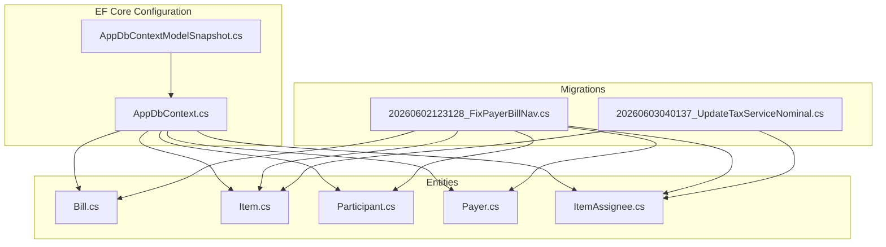
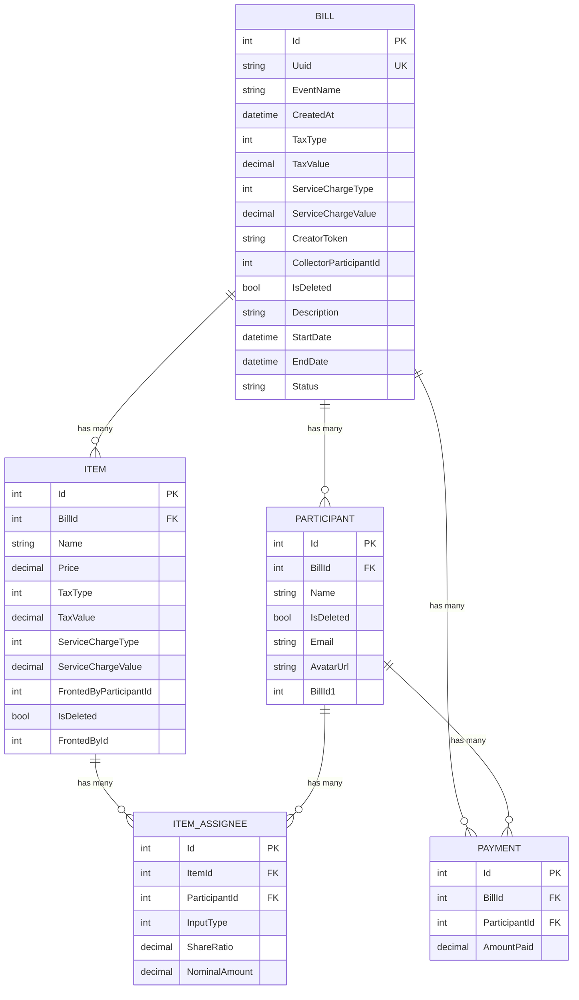
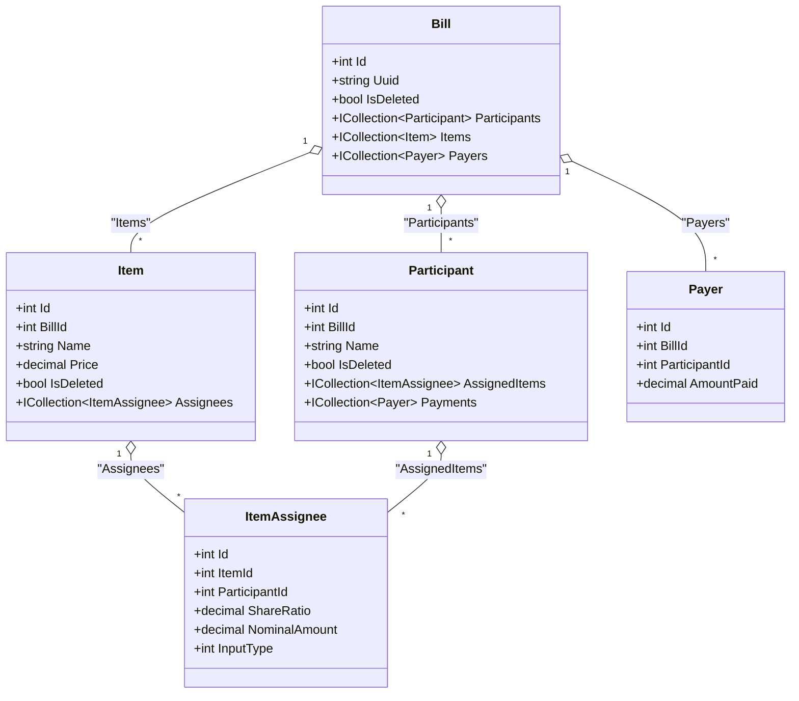
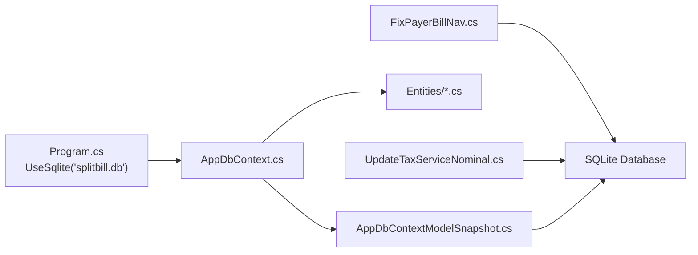

# Database Schema

<cite>
**Referenced Files in This Document**
- [AppDbContext.cs](file://Data/AppDbContext.cs)
- [Bill.cs](file://Data/Entities/Bill.cs)
- [Item.cs](file://Data/Entities/Item.cs)
- [Participant.cs](file://Data/Entities/Participant.cs)
- [ItemAssignee.cs](file://Data/Entities/ItemAssignee.cs)
- [Payer.cs](file://Data/Entities/Payer.cs)
- [FixPayerBillNav.cs](file://Migrations/20260602123128_FixPayerBillNav.cs)
- [UpdateTaxServiceNominal.cs](file://Migrations/20260603040137_UpdateTaxServiceNominal.cs)
- [AppDbContextModelSnapshot.cs](file://Migrations/AppDbContextModelSnapshot.cs)
- [Program.cs](file://Program.cs)
- [appsettings.json](file://appsettings.json)
</cite>

## Table of Contents
1. [Introduction](#introduction)
2. [Project Structure](#project-structure)
3. [Core Components](#core-components)
4. [Architecture Overview](#architecture-overview)
5. [Detailed Component Analysis](#detailed-component-analysis)
6. [Dependency Analysis](#dependency-analysis)
7. [Performance Considerations](#performance-considerations)
8. [Troubleshooting Guide](#troubleshooting-guide)
9. [Conclusion](#conclusion)

## Introduction
This document describes the database schema for SplitBill, focusing on the Entity Framework configuration and generated tables. It covers table structures, column definitions, primary keys, foreign keys, indexes, soft-deletion query filters, cascade delete behaviors, and the many-to-many relationship implementation between Items and Participants via the ItemAssignee junction table. It also documents migration history and the database provider settings.

## Project Structure
The database schema is defined by:
- Entity classes under Data/Entities representing domain objects
- AppDbContext.cs configuring Entity Framework mappings and query filters
- Migrations defining the initial schema and subsequent changes
- Model snapshot reflecting the current model state
- Application configuration specifying the SQLite provider

**Diagram sources**
- [AppDbContext.cs:18-70](file://Data/AppDbContext.cs#L18-L70)
- [AppDbContextModelSnapshot.cs:15-287](file://Migrations/AppDbContextModelSnapshot.cs#L15-L287)
- [FixPayerBillNav.cs:12-193](file://Migrations/20260602123128_FixPayerBillNav.cs#L12-L193)
- [UpdateTaxServiceNominal.cs:11-52](file://Migrations/20260603040137_UpdateTaxServiceNominal.cs#L11-L52)

**Section sources**
- [AppDbContext.cs:6-16](file://Data/AppDbContext.cs#L6-L16)
- [Program.cs:13-14](file://Program.cs#L13-L14)

## Core Components
- AppDbContext: Defines DbSet properties and Fluent API configurations for all entities, including unique indexes, soft-delete filters, and cascade deletes.
- Entities: Bill, Item, Participant, Payer, and ItemAssignee define the domain model and navigation properties.
- Migrations: FixPayerBillNav creates the initial schema; UpdateTaxServiceNominal adds tax/service charge fields and nominal share support.
- Model Snapshot: Reflects the current EF model state and indexes.

Key schema highlights:
- Unique index on Bill.Uuid for bill access
- Soft-deletion filters on Bill, Participant, and Item
- Cascade deletes for Bill -> Participants, Items, Payers
- Many-to-many via ItemAssignees with cascade deletes
- SQLite provider configured in Program.cs

**Section sources**
- [AppDbContext.cs:22-24](file://Data/AppDbContext.cs#L22-L24)
- [AppDbContext.cs:26-33](file://Data/AppDbContext.cs#L26-L33)
- [AppDbContext.cs:35-51](file://Data/AppDbContext.cs#L35-L51)
- [AppDbContext.cs:53-69](file://Data/AppDbContext.cs#L53-L69)
- [FixPayerBillNav.cs:14-151](file://Migrations/20260602123128_FixPayerBillNav.cs#L14-L151)
- [UpdateTaxServiceNominal.cs:13-51](file://Migrations/20260603040137_UpdateTaxServiceNominal.cs#L13-L51)

## Architecture Overview
The schema follows a central Bill hub with Participants, Items, Payers, and ItemAssignees as related entities. Cascade deletes ensure referential integrity during removal of parent records.

**Diagram sources**
- [AppDbContext.cs:22-69](file://Data/AppDbContext.cs#L22-L69)
- [AppDbContextModelSnapshot.cs:20-141](file://Migrations/AppDbContextModelSnapshot.cs#L20-L141)
- [FixPayerBillNav.cs:14-145](file://Migrations/20260602123128_FixPayerBillNav.cs#L14-L145)
- [UpdateTaxServiceNominal.cs:13-51](file://Migrations/20260603040137_UpdateTaxServiceNominal.cs#L13-L51)

## Detailed Component Analysis

### Bill
- Columns: Id (PK), Uuid (unique), EventName, CreatedAt, TaxType/TaxValue, ServiceChargeType/ServiceChargeValue, CreatorToken, CollectorParticipantId, IsDeleted, plus redesign fields Description, StartDate, EndDate, Status.
- Indexes: Unique index on Uuid.
- Query Filter: Soft-deleted bills excluded.
- Relationships:
  - One-to-many with Participants (Cascade delete)
  - One-to-many with Items (Cascade delete)
  - One-to-one with Collector participant via BillId1 (no explicit Bill navigation on Payer)
  - One-to-many with Payers (Cascade delete)

**Section sources**
- [Bill.cs:14-37](file://Data/Entities/Bill.cs#L14-L37)
- [AppDbContext.cs:22-24](file://Data/AppDbContext.cs#L22-L24)
- [AppDbContext.cs:26-27](file://Data/AppDbContext.cs#L26-L27)
- [AppDbContext.cs:35-51](file://Data/AppDbContext.cs#L35-L51)
- [AppDbContextModelSnapshot.cs:20-64](file://Migrations/AppDbContextModelSnapshot.cs#L20-L64)
- [FixPayerBillNav.cs:14-34](file://Migrations/20260602123128_FixPayerBillNav.cs#L14-L34)

### Participant
- Columns: Id (PK), BillId (FK), Name, IsDeleted, plus redesign fields Email, AvatarUrl.
- Query Filter: Soft-deleted participants excluded.
- Relationships:
  - Belongs to Bill (Cascade delete)
  - One-to-one with Collector via BillId1 (no explicit Bill navigation on Payer)
  - Many-to-many with Items via ItemAssignees (Cascade delete)
  - Many-to-many with Payers (Cascade delete)

**Section sources**
- [Participant.cs:7-20](file://Data/Entities/Participant.cs#L7-L20)
- [AppDbContext.cs:29-30](file://Data/AppDbContext.cs#L29-L30)
- [AppDbContext.cs:59-69](file://Data/AppDbContext.cs#L59-L69)
- [AppDbContextModelSnapshot.cs:143-170](file://Migrations/AppDbContextModelSnapshot.cs#L143-L170)
- [FixPayerBillNav.cs:36-61](file://Migrations/20260602123128_FixPayerBillNav.cs#L36-L61)

### Item
- Columns: Id (PK), BillId (FK), Name, Price, TaxType/TaxValue, ServiceChargeType/ServiceChargeValue, FrontedByParticipantId, IsDeleted, plus redesign fields Category, Date, Notes.
- Query Filter: Soft-deleted items excluded.
- Relationships:
  - Belongs to Bill (Cascade delete)
  - Many-to-many with Participants via ItemAssignees (Cascade delete)

**Section sources**
- [Item.cs:7-27](file://Data/Entities/Item.cs#L7-L27)
- [AppDbContext.cs:32-33](file://Data/AppDbContext.cs#L32-L33)
- [AppDbContext.cs:53-57](file://Data/AppDbContext.cs#L53-L57)
- [AppDbContextModelSnapshot.cs:67-111](file://Migrations/AppDbContextModelSnapshot.cs#L67-L111)
- [FixPayerBillNav.cs:63-91](file://Migrations/20260602123128_FixPayerBillNav.cs#L63-L91)

### Payer
- Columns: Id (PK), BillId (FK), ParticipantId (FK), AmountPaid.
- Relationship: Bill-Payer is one-to-many with cascade delete; Participant-Payment is one-to-many with cascade delete.
- Note: No explicit Bill navigation property on Payer in the entity; AppDbContext configures the relationship without a reverse navigation.

**Section sources**
- [Payer.cs:5-12](file://Data/Entities/Payer.cs#L5-L12)
- [AppDbContext.cs:47-51](file://Data/AppDbContext.cs#L47-L51)
- [AppDbContext.cs:65-69](file://Data/AppDbContext.cs#L65-L69)
- [AppDbContextModelSnapshot.cs:172-194](file://Migrations/AppDbContextModelSnapshot.cs#L172-L194)
- [FixPayerBillNav.cs:94-118](file://Migrations/20260602123128_FixPayerBillNav.cs#L94-L118)

### ItemAssignee (Junction Table)
- Columns: Id (PK), ItemId (FK), ParticipantId (FK), InputType, ShareRatio, NominalAmount.
- Relationships:
  - Item-ItemAssignee is one-to-many (Cascade delete)
  - Participant-ItemAssignee is one-to-many (Cascade delete)
- Purpose: Implements many-to-many between Items and Participants with support for ratio or nominal share inputs.

**Section sources**
- [ItemAssignee.cs:11-21](file://Data/Entities/ItemAssignee.cs#L11-L21)
- [AppDbContext.cs:53-63](file://Data/AppDbContext.cs#L53-L63)
- [AppDbContextModelSnapshot.cs:113-141](file://Migrations/AppDbContextModelSnapshot.cs#L113-L141)
- [FixPayerBillNav.cs:120-145](file://Migrations/20260602123128_FixPayerBillNav.cs#L120-L145)
- [UpdateTaxServiceNominal.cs:39-51](file://Migrations/20260603040137_UpdateTaxServiceNominal.cs#L39-L51)

### Soft Deletion Filters
Soft deletion is implemented via query filters on Bill, Participant, and Item, ensuring deleted rows are excluded from LINQ queries by default.

**Section sources**
- [AppDbContext.cs:26-33](file://Data/AppDbContext.cs#L26-L33)
- [AppDbContextModelSnapshot.cs:20-64](file://Migrations/AppDbContextModelSnapshot.cs#L20-L64)
- [AppDbContextModelSnapshot.cs:143-170](file://Migrations/AppDbContextModelSnapshot.cs#L143-L170)
- [AppDbContextModelSnapshot.cs:67-111](file://Migrations/AppDbContextModelSnapshot.cs#L67-L111)

### Cascade Delete Behaviors
Cascade deletes are configured for:
- Bill -> Participants, Items, Payers
- Item -> ItemAssignees
- Participant -> ItemAssignees, Payments

This ensures that removing a parent record removes related children automatically.

**Section sources**
- [AppDbContext.cs:35-51](file://Data/AppDbContext.cs#L35-L51)
- [AppDbContext.cs:53-69](file://Data/AppDbContext.cs#L53-L69)
- [AppDbContextModelSnapshot.cs:196-262](file://Migrations/AppDbContextModelSnapshot.cs#L196-L262)

### Unique Index on Bill.Uuid
A unique index on Bill.Uuid enables fast and unique access to bills by UUID.

**Section sources**
- [AppDbContext.cs:22-24](file://Data/AppDbContext.cs#L22-L24)
- [AppDbContextModelSnapshot.cs:61](file://Migrations/AppDbContextModelSnapshot.cs#L61)
- [FixPayerBillNav.cs:147-151](file://Migrations/20260602123128_FixPayerBillNav.cs#L147-L151)

### Many-to-Many Relationship: Items ↔ Participants via ItemAssignees
- The many-to-many is implemented using the ItemAssignees table with composite foreign keys to Items and Participants.
- Both Item and Participant expose collections through ItemAssignees.
- Cascade deletes ensure child assignments are removed when either parent is deleted.

**Diagram sources**
- [AppDbContext.cs:35-69](file://Data/AppDbContext.cs#L35-L69)
- [AppDbContextModelSnapshot.cs:196-262](file://Migrations/AppDbContextModelSnapshot.cs#L196-L262)
- [ItemAssignee.cs:11-21](file://Data/Entities/ItemAssignee.cs#L11-L21)

## Dependency Analysis
Entity Framework configuration and migrations define the schema and relationships.

**Diagram sources**
- [Program.cs:13-14](file://Program.cs#L13-L14)
- [AppDbContext.cs:18-70](file://Data/AppDbContext.cs#L18-L70)
- [AppDbContextModelSnapshot.cs:15-287](file://Migrations/AppDbContextModelSnapshot.cs#L15-L287)
- [FixPayerBillNav.cs:12-193](file://Migrations/20260602123128_FixPayerBillNav.cs#L12-L193)
- [UpdateTaxServiceNominal.cs:11-52](file://Migrations/20260603040137_UpdateTaxServiceNominal.cs#L11-L52)

**Section sources**
- [Program.cs:13-14](file://Program.cs#L13-L14)
- [AppDbContext.cs:18-70](file://Data/AppDbContext.cs#L18-L70)
- [AppDbContextModelSnapshot.cs:15-287](file://Migrations/AppDbContextModelSnapshot.cs#L15-L287)

## Performance Considerations
- Unique index on Bill.Uuid optimizes lookups by UUID.
- Foreign key indexes exist on BillId, ParticipantId, ItemId, and FrontedById to speed up joins and filtering.
- Soft-deletion filters reduce result sets but require appropriate indexes for performance.
- Consider adding indexes for frequently filtered or joined columns if query performance degrades.

[No sources needed since this section provides general guidance]

## Troubleshooting Guide
- SQLite provider configuration: Ensure the connection string points to a valid path and the database file is writable.
- Soft-deletion behavior: Deleted entities are hidden by default; confirm IsDeleted flags when querying.
- Cascade deletes: Removing a Bill cascades to Participants, Items, and Payers; removing an Item cascades to ItemAssignees; removing a Participant cascades to ItemAssignees and Payers.
- Migration conflicts: If schema mismatches occur, regenerate the model snapshot and apply migrations accordingly.

**Section sources**
- [Program.cs:13-14](file://Program.cs#L13-L14)
- [AppDbContext.cs:26-33](file://Data/AppDbContext.cs#L26-L33)
- [AppDbContext.cs:35-69](file://Data/AppDbContext.cs#L35-L69)
- [AppDbContextModelSnapshot.cs:15-287](file://Migrations/AppDbContextModelSnapshot.cs#L15-L287)

## Conclusion
The SplitBill database schema centers on the Bill entity with Participants, Items, Payers, and ItemAssignees forming a cohesive model. Soft deletion, unique indexing on Bill.Uuid, and cascade deletes ensure data integrity and efficient access patterns. The migration history shows the evolution from a simpler schema to one supporting tax/service charges and flexible sharing via ItemAssignees.