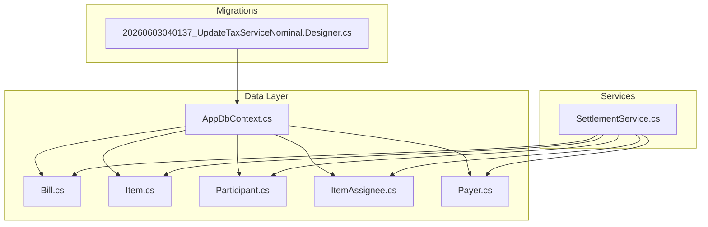
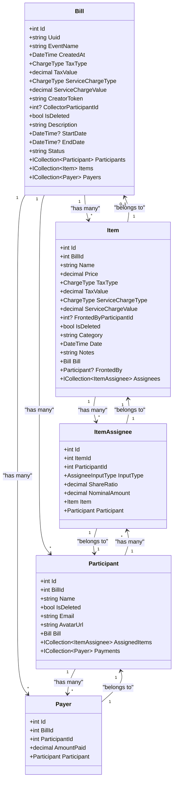
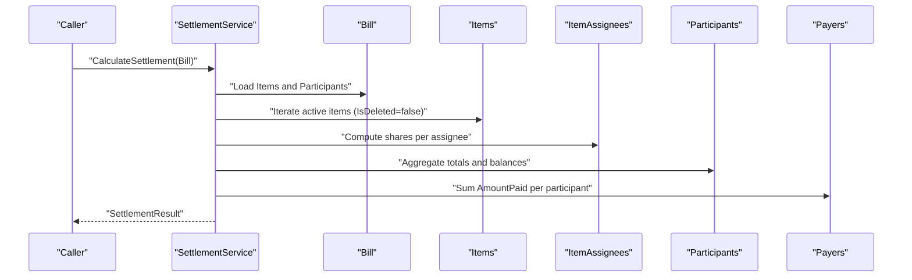
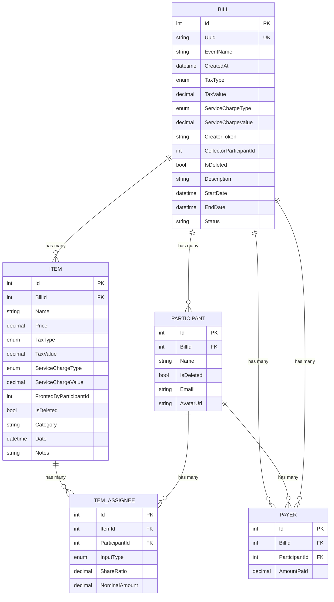
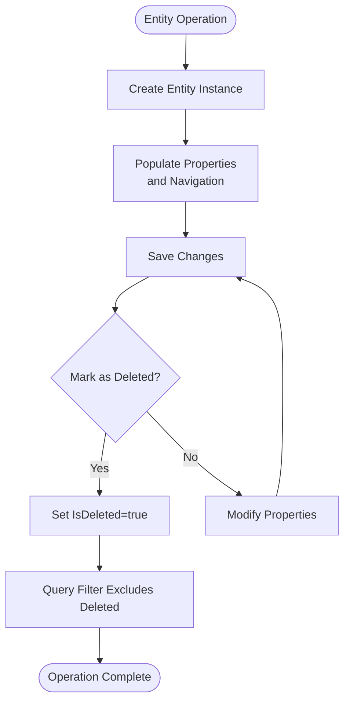
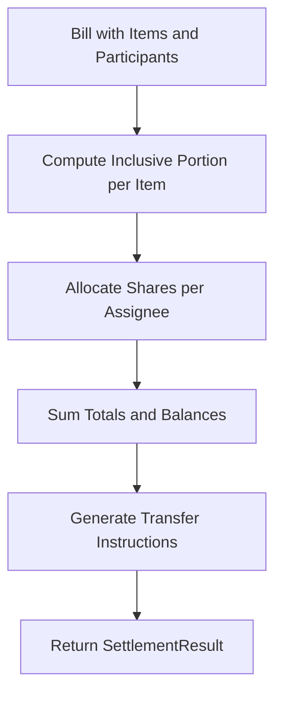
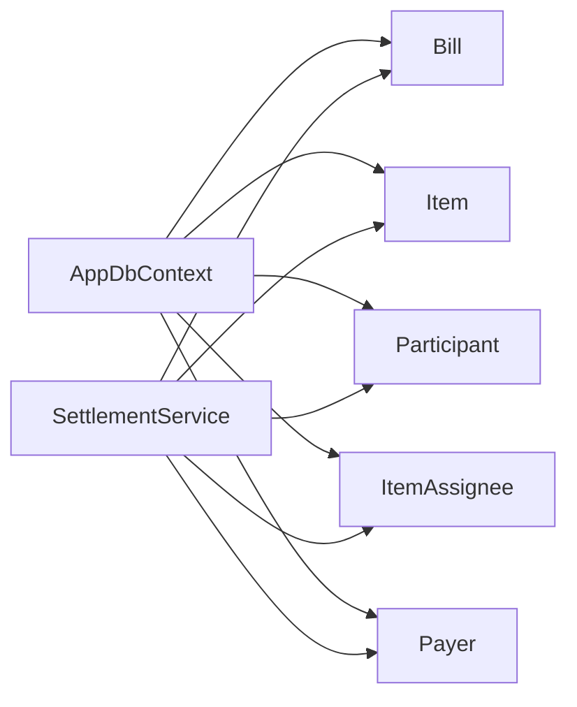

# Entity Models

<cite>
**Referenced Files in This Document**
- [Bill.cs](file://Data/Entities/Bill.cs)
- [Item.cs](file://Data/Entities/Item.cs)
- [Participant.cs](file://Data/Entities/Participant.cs)
- [ItemAssignee.cs](file://Data/Entities/ItemAssignee.cs)
- [Payer.cs](file://Data/Entities/Payer.cs)
- [AppDbContext.cs](file://Data/AppDbContext.cs)
- [20260603040137_UpdateTaxServiceNominal.Designer.cs](file://Migrations/20260603040137_UpdateTaxServiceNominal.Designer.cs)
- [SettlementService.cs](file://Services/SettlementService.cs)
- [SettlementServiceTests.cs](file://split_bill.Tests/SettlementServiceTests.cs)
</cite>

## Table of Contents
1. [Introduction](#introduction)
2. [Project Structure](#project-structure)
3. [Core Components](#core-components)
4. [Architecture Overview](#architecture-overview)
5. [Detailed Component Analysis](#detailed-component-analysis)
6. [Dependency Analysis](#dependency-analysis)
7. [Performance Considerations](#performance-considerations)
8. [Troubleshooting Guide](#troubleshooting-guide)
9. [Conclusion](#conclusion)

## Introduction
This document provides comprehensive entity model documentation for SplitBill’s core data entities. It covers the Bill, Item, Participant, ItemAssignee, and Payer entities, detailing their properties, data types, navigation relationships, foreign key mappings, and lifecycle management via the IsDeleted flag. It also explains cascade delete configurations, common usage patterns, and business logic enforced during settlement calculations.

## Project Structure
The entity models reside under Data/Entities and are configured in Data/AppDbContext. Migrations define database schema and constraints, while Services/SettlementService orchestrates settlement calculations using these entities.

**Diagram sources**
- [AppDbContext.cs:12-70](file://Data/AppDbContext.cs#L12-L70)
- [20260603040137_UpdateTaxServiceNominal.Designer.cs:18-292](file://Migrations/20260603040137_UpdateTaxServiceNominal.Designer.cs#L18-L292)
- [SettlementService.cs:43-232](file://Services/SettlementService.cs#L43-L232)

**Section sources**
- [AppDbContext.cs:12-70](file://Data/AppDbContext.cs#L12-L70)
- [20260603040137_UpdateTaxServiceNominal.Designer.cs:18-292](file://Migrations/20260603040137_UpdateTaxServiceNominal.Designer.cs#L18-L292)

## Core Components
This section summarizes each entity’s purpose, properties, and relationships.

- Bill
  - Purpose: Represents a group event with participants, items, and payments.
  - Key properties: Id, Uuid (unique), EventName, CreatedAt, TaxType/TaxValue, ServiceChargeType/ServiceChargeValue, CreatorToken, CollectorParticipantId, IsDeleted, plus redesign fields (Description, StartDate, EndDate, Status).
  - Navigation: Participants, Items, Payers; optional Collector navigation.
  - Lifecycle: Soft-deleted via IsDeleted; query-filtered by EF Core.

- Item
  - Purpose: Represents a consumable purchased within a Bill.
  - Key properties: Id, BillId, Name, Price, TaxType/TaxValue, ServiceChargeType/ServiceChargeValue, FrontedByParticipantId, IsDeleted, plus redesign fields (Category, Date, Notes).
  - Navigation: Bill, FrontedBy, Assignees.
  - Lifecycle: Soft-deleted via IsDeleted; query-filtered by EF Core.

- Participant
  - Purpose: Represents a person participating in a Bill.
  - Key properties: Id, BillId, Name, IsDeleted, plus redesign fields (Email, AvatarUrl).
  - Navigation: Bill, AssignedItems, Payments.
  - Lifecycle: Soft-deleted via IsDeleted; query-filtered by EF Core.

- ItemAssignee
  - Purpose: Defines how an Item’s cost is split among Participants.
  - Key properties: Id, ItemId, ParticipantId, InputType (Ratio/Nominal), ShareRatio, NominalAmount.
  - Navigation: Item, Participant.

- Payer
  - Purpose: Records payments made by a Participant toward a Bill.
  - Key properties: Id, BillId, ParticipantId, AmountPaid.
  - Navigation: Participant (no explicit Bill navigation in entity).

**Section sources**
- [Bill.cs:12-37](file://Data/Entities/Bill.cs#L12-L37)
- [Item.cs:5-27](file://Data/Entities/Item.cs#L5-L27)
- [Participant.cs:5-20](file://Data/Entities/Participant.cs#L5-L20)
- [ItemAssignee.cs:9-21](file://Data/Entities/ItemAssignee.cs#L9-L21)
- [Payer.cs:3-12](file://Data/Entities/Payer.cs#L3-L12)

## Architecture Overview
The entities form a hierarchical structure centered around Bill. Items belong to a Bill and are assigned to Participants via ItemAssignee. Participants can pay toward a Bill via Payer entries. The AppDbContext configures cascading deletes and query filters for soft deletion.

**Diagram sources**
- [Bill.cs:12-37](file://Data/Entities/Bill.cs#L12-L37)
- [Item.cs:5-27](file://Data/Entities/Item.cs#L5-L27)
- [Participant.cs:5-20](file://Data/Entities/Participant.cs#L5-L20)
- [ItemAssignee.cs:9-21](file://Data/Entities/ItemAssignee.cs#L9-L21)
- [Payer.cs:3-12](file://Data/Entities/Payer.cs#L3-L12)

## Detailed Component Analysis

### Bill
- Properties and types
  - Identity: Id (int)
  - Unique identifier: Uuid (string)
  - Event metadata: EventName (string), CreatedAt (DateTime)
  - Charges: TaxType/TaxValue (ChargeType, decimal), ServiceChargeType/ServiceChargeValue (ChargeType, decimal)
  - Creator: CreatorToken (string)
  - Collector: CollectorParticipantId (int?), optional Collector navigation
  - Soft delete: IsDeleted (bool)
  - Redesign fields: Description (string), StartDate/EndDate (DateTime?), Status (string)
- Navigation
  - Participants (ICollection<Participant>)
  - Items (ICollection<Item>)
  - Payers (ICollection<Payer>)
- Lifecycle
  - Soft-deleted via IsDeleted; filtered out by query filter in AppDbContext.
- Constraints and indices
  - Uuid is unique (EF Core index).
- Business rules
  - Status defaults to “ONGOING”.
  - TaxType and ServiceChargeType default to Percentage.
  - CollectorParticipantId links to a Participant who collects payments.

**Section sources**
- [Bill.cs:12-37](file://Data/Entities/Bill.cs#L12-L37)
- [AppDbContext.cs:22-27](file://Data/AppDbContext.cs#L22-L27)
- [AppDbContext.cs:29-33](file://Data/AppDbContext.cs#L29-L33)

### Item
- Properties and types
  - Identity: Id (int)
  - Parent: BillId (int)
  - Details: Name (string), Price (decimal)
  - Charges: TaxType/TaxValue, ServiceChargeType/ServiceChargeValue (defaults defined)
  - Fronting: FrontedByParticipantId (int?)
  - Soft delete: IsDeleted (bool)
  - Redesign fields: Category (string), Date (DateTime), Notes (string)
- Navigation
  - Bill (Bill)
  - FrontedBy (Participant?)
  - Assignees (ICollection<ItemAssignee>)
- Lifecycle
  - Soft-deleted via IsDeleted; filtered out by query filter in AppDbContext.
- Business rules
  - Defaults for tax/service charge types/values are defined in the entity.
  - Category defaults to “Food”; Date defaults to Today.

**Section sources**
- [Item.cs:5-27](file://Data/Entities/Item.cs#L5-L27)
- [AppDbContext.cs:32-33](file://Data/AppDbContext.cs#L32-L33)

### Participant
- Properties and types
  - Identity: Id (int)
  - Parent: BillId (int)
  - Profile: Name (string), Email (string), AvatarUrl (string)
  - Soft delete: IsDeleted (bool)
- Navigation
  - Bill (Bill)
  - AssignedItems (ICollection<ItemAssignee>)
  - Payments (ICollection<Payer>)
- Lifecycle
  - Soft-deleted via IsDeleted; filtered out by query filter in AppDbContext.
- Business rules
  - Email and AvatarUrl are redesign fields.

**Section sources**
- [Participant.cs:5-20](file://Data/Entities/Participant.cs#L5-L20)
- [AppDbContext.cs:29-30](file://Data/AppDbContext.cs#L29-L30)

### ItemAssignee
- Properties and types
  - Identity: Id (int)
  - Links: ItemId (int), ParticipantId (int)
  - Allocation: InputType (AssigneeInputType), ShareRatio (decimal), NominalAmount (decimal)
- Navigation
  - Item (Item)
  - Participant (Participant)
- Business rules
  - InputType determines whether ShareRatio or NominalAmount applies.
  - Settlement logic computes shares based on these two modes.

**Section sources**
- [ItemAssignee.cs:9-21](file://Data/Entities/ItemAssignee.cs#L9-L21)
- [SettlementService.cs:123-157](file://Services/SettlementService.cs#L123-L157)

### Payer
- Properties and types
  - Identity: Id (int)
  - Links: BillId (int), ParticipantId (int)
  - Payment: AmountPaid (decimal)
- Navigation
  - Participant (Participant)
  - No explicit Bill navigation in entity.
- Business rules
  - AmountPaid contributes to participant totals and settlement balances.

**Section sources**
- [Payer.cs:3-12](file://Data/Entities/Payer.cs#L3-L12)

## Architecture Overview

**Diagram sources**
- [SettlementService.cs:55-232](file://Services/SettlementService.cs#L55-L232)
- [AppDbContext.cs:29-33](file://Data/AppDbContext.cs#L29-L33)

## Detailed Component Analysis

### Entity Relationships and Foreign Keys
- Bill
  - HasMany Participants, Items, Payers
  - Cascade delete enabled for Participants, Items, Payers
- Item
  - BelongsTo Bill
  - HasMany Assignees
  - Optional FrontedBy navigation
- ItemAssignee
  - BelongsTo Item and Participant
- Participant
  - BelongsTo Bill
  - HasMany AssignedItems and Payments
- Payer
  - BelongsTo Participant
  - BillId is foreign key; no explicit Bill navigation in entity

**Diagram sources**
- [AppDbContext.cs:35-69](file://Data/AppDbContext.cs#L35-L69)
- [20260603040137_UpdateTaxServiceNominal.Designer.cs:23-265](file://Migrations/20260603040137_UpdateTaxServiceNominal.Designer.cs#L23-L265)

**Section sources**
- [AppDbContext.cs:35-69](file://Data/AppDbContext.cs#L35-L69)
- [20260603040137_UpdateTaxServiceNominal.Designer.cs:23-265](file://Migrations/20260603040137_UpdateTaxServiceNominal.Designer.cs#L23-L265)

### Lifecycle Management: Creation, Modification, Soft Deletion
- Creation
  - Entities are instantiated and populated with required fields.
  - Defaults are applied in entity constructors (e.g., CreatedAt, ChargeType defaults).
- Modification
  - Properties are updated as needed; navigation collections are managed accordingly.
- Soft Deletion
  - IsDeleted flag is set to true to mark records as deleted.
  - AppDbContext applies query filters to exclude IsDeleted=true records from queries.
- Cascade Delete
  - Deleting a Bill cascades to Participants, Items, and Payers.
  - Deleting an Item cascades to ItemAssignees.
  - Deleting a Participant cascades to ItemAssignees and Payers.

**Diagram sources**
- [AppDbContext.cs:26-33](file://Data/AppDbContext.cs#L26-L33)

**Section sources**
- [AppDbContext.cs:26-33](file://Data/AppDbContext.cs#L26-L33)

### Validation Attributes and Data Constraints
- Explicit validation attributes are not present in the entity classes themselves.
- Database constraints are defined in migrations:
  - Bill: Uuid is unique; CreatorToken and EventName are required.
  - Item: Name is required; BillId is required.
  - Participant: Name is required; BillId is required.
  - Payer: BillId and ParticipantId are required; AmountPaid stored as decimal.
- These constraints enforce referential integrity and non-null values at the persistence level.

**Section sources**
- [20260603040137_UpdateTaxServiceNominal.Designer.cs:35-60](file://Migrations/20260603040137_UpdateTaxServiceNominal.Designer.cs#L35-L60)
- [20260603040137_UpdateTaxServiceNominal.Designer.cs:88-105](file://Migrations/20260603040137_UpdateTaxServiceNominal.Designer.cs#L88-L105)
- [20260603040137_UpdateTaxServiceNominal.Designer.cs:161-163](file://Migrations/20260603040137_UpdateTaxServiceNominal.Designer.cs#L161-L163)
- [20260603040137_UpdateTaxServiceNominal.Designer.cs:181-188](file://Migrations/20260603040137_UpdateTaxServiceNominal.Designer.cs#L181-L188)

### Business Logic and Calculation Patterns
- SettlementService enforces:
  - Inclusive tax and service charge calculations.
  - Item price distribution using either NominalAmount or ShareRatio per assignee.
  - FrontedByParticipantId inclusion in participant totals.
  - Payment difference computation and transfer instruction generation.
- Tests demonstrate typical entity composition and expected outcomes.

**Diagram sources**
- [SettlementService.cs:55-232](file://Services/SettlementService.cs#L55-L232)

**Section sources**
- [SettlementService.cs:55-232](file://Services/SettlementService.cs#L55-L232)
- [SettlementServiceTests.cs:23-104](file://split_bill.Tests/SettlementServiceTests.cs#L23-L104)

## Dependency Analysis
- AppDbContext defines:
  - DbSet<T> for each entity.
  - Query filters for soft deletion.
  - Cascade delete configurations for parent-child relationships.
- Migrations define:
  - Indexes (e.g., Bill.Uuid unique).
  - Required fields and foreign keys.
- SettlementService depends on:
  - Active entities (non-deleted) for calculations.
  - Navigation properties to compute balances and transfers.

**Diagram sources**
- [AppDbContext.cs:12-70](file://Data/AppDbContext.cs#L12-L70)
- [SettlementService.cs:55-232](file://Services/SettlementService.cs#L55-L232)

**Section sources**
- [AppDbContext.cs:12-70](file://Data/AppDbContext.cs#L12-L70)
- [SettlementService.cs:55-232](file://Services/SettlementService.cs#L55-L232)

## Performance Considerations
- Soft deletion reduces row churn and maintains historical data.
- Cascade deletes simplify cleanup but can impact write performance for large hierarchies.
- Query filters ensure filtered reads; consider indexing frequently queried columns (already present for Uuid).
- SettlementService iterates active entities; ensure Items and Participants are loaded efficiently to minimize N+1 scenarios.

## Troubleshooting Guide
- Unexpected missing records
  - Verify IsDeleted is false; AppDbContext filters deleted records.
- Missing navigation relationships
  - Ensure foreign keys are set (BillId, ItemId, ParticipantId).
  - Confirm AddRange/Attach patterns are used when attaching related entities.
- Settlement discrepancies
  - Validate ItemAssignee InputType and values (ShareRatio vs NominalAmount).
  - Confirm inclusive tax/service calculations align with ChargeType and values.

**Section sources**
- [AppDbContext.cs:26-33](file://Data/AppDbContext.cs#L26-L33)
- [SettlementService.cs:123-157](file://Services/SettlementService.cs#L123-L157)

## Conclusion
SplitBill’s entity model centers on Bill with robust relationships to Items, Participants, ItemAssignees, and Payers. Soft deletion and cascade deletes streamline lifecycle management, while migrations enforce essential constraints. SettlementService encapsulates business logic for fair cost allocation and payment reconciliation. Together, these components provide a clear, maintainable foundation for expense sharing.