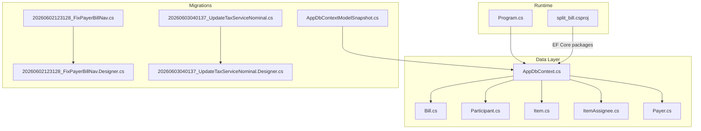
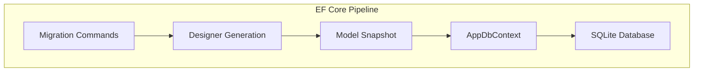
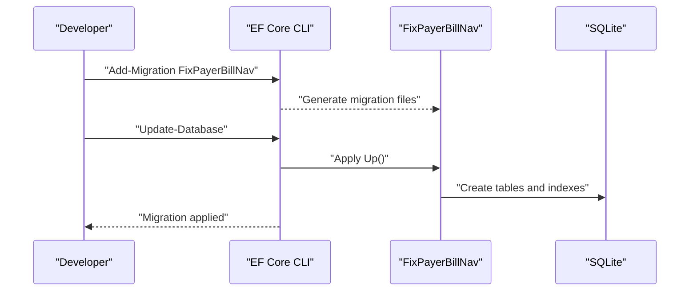
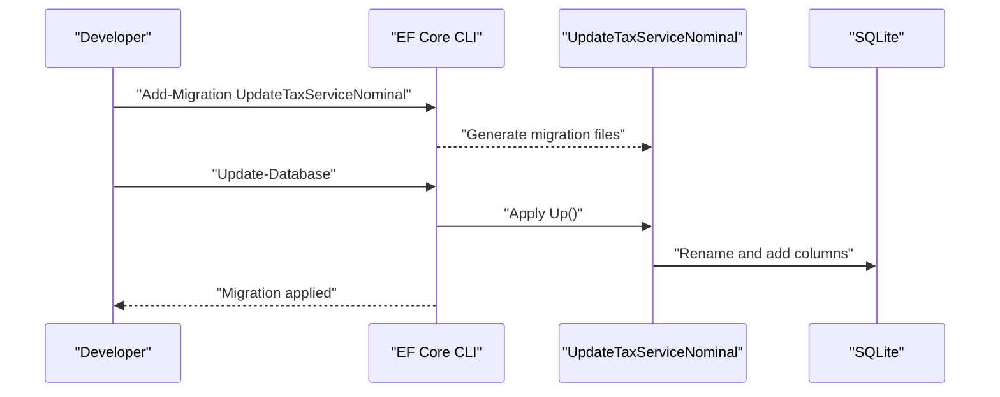
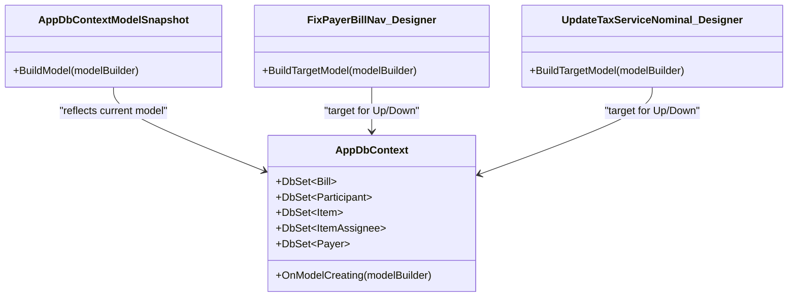
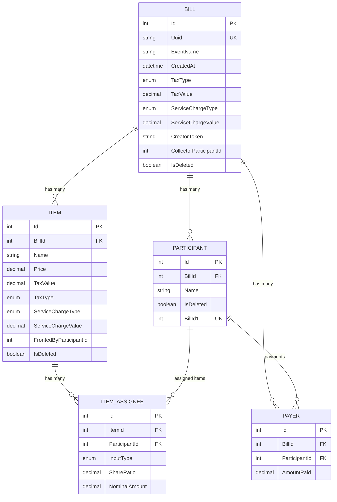
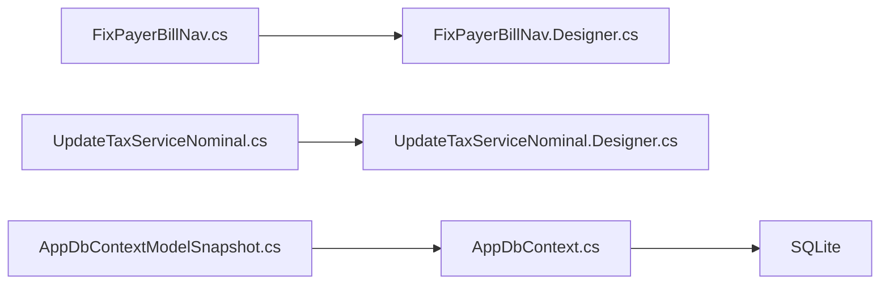

# Migration Management

<cite>
**Referenced Files in This Document**
- [20260602123128_FixPayerBillNav.cs](file://Migrations/20260602123128_FixPayerBillNav.cs)
- [20260602123128_FixPayerBillNav.Designer.cs](file://Migrations/20260602123128_FixPayerBillNav.Designer.cs)
- [20260603040137_UpdateTaxServiceNominal.cs](file://Migrations/202603040137_UpdateTaxServiceNominal.cs)
- [20260603040137_UpdateTaxServiceNominal.Designer.cs](file://Migrations/202603040137_UpdateTaxServiceNominal.Designer.cs)
- [AppDbContextModelSnapshot.cs](file://Migrations/AppDbContextModelSnapshot.cs)
- [AppDbContext.cs](file://Data/AppDbContext.cs)
- [Bill.cs](file://Data/Entities/Bill.cs)
- [Item.cs](file://Data/Entities/Item.cs)
- [Participant.cs](file://Data/Entities/Participant.cs)
- [ItemAssignee.cs](file://Data/Entities/ItemAssignee.cs)
- [Payer.cs](file://Data/Entities/Payer.cs)
- [Program.cs](file://Program.cs)
- [split_bill.csproj](file://split_bill.csproj)
- [plan.md](file://plan.md)
</cite>

## Table of Contents
1. [Introduction](#introduction)
2. [Project Structure](#project-structure)
3. [Core Components](#core-components)
4. [Architecture Overview](#architecture-overview)
5. [Detailed Component Analysis](#detailed-component-analysis)
6. [Dependency Analysis](#dependency-analysis)
7. [Performance Considerations](#performance-considerations)
8. [Troubleshooting Guide](#troubleshooting-guide)
9. [Conclusion](#conclusion)
10. [Appendices](#appendices)

## Introduction
This document explains SplitBill’s database migration management strategy and provides a practical guide to evolving the schema safely. It focuses on two migrations that refined payer-bill navigation and introduced tax/service nominal configuration:
- FixPayerBillNav: Establishes the foundational schema for bills, participants, items, payers, and assignees, including navigation and constraints.
- UpdateTaxServiceNominal: Renames and extends fields to support flexible tax and service charge modeling with nominal amounts and input types.

It covers migration file structure, designer code generation, model snapshots, commands, update and rollback procedures, best practices, conflict resolution, and testing strategies tailored for SQLite and EF Core.

## Project Structure
SplitBill organizes migrations under a dedicated folder and maintains a model snapshot that captures the current model state. The application configures SQLite and ensures the database is created during development.

**Diagram sources**
- [AppDbContext.cs:12-16](file://Data/AppDbContext.cs#L12-L16)
- [20260602123128_FixPayerBillNav.cs:14-212](file://Migrations/20260602123128_FixPayerBillNav.cs#L14-L212)
- [20260603040137_UpdateTaxServiceNominal.cs:11-81](file://Migrations/202603040137_UpdateTaxServiceNominal.cs#L11-L81)
- [AppDbContextModelSnapshot.cs:15-287](file://Migrations/AppDbContextModelSnapshot.cs#L15-L287)
- [Program.cs:13-14](file://Program.cs#L13-L14)
- [split_bill.csproj:10-19](file://split_bill.csproj#L10-L19)

**Section sources**
- [Program.cs:13-14](file://Program.cs#L13-L14)
- [split_bill.csproj:10-19](file://split_bill.csproj#L10-L19)

## Core Components
- Migrations
  - FixPayerBillNav: Creates tables, foreign keys, and indexes; establishes navigation relationships.
  - UpdateTaxServiceNominal: Renames a column, adds new columns for tax/service types and values, and introduces nominal configuration for assignees.
- Designer files
  - Generated per migration to capture target model state for up/down operations.
- Model snapshot
  - Captures the current model state for EF Core to compare against migrations and avoid conflicts.
- Database context
  - Defines entity sets and fluent configurations; includes a deliberate change to payer navigation.

Key runtime configuration initializes SQLite and ensures schema creation in development.

**Section sources**
- [20260602123128_FixPayerBillNav.cs:12-212](file://Migrations/20260602123128_FixPayerBillNav.cs#L12-L212)
- [20260603040137_UpdateTaxServiceNominal.cs:11-81](file://Migrations/202603040137_UpdateTaxServiceNominal.cs#L11-L81)
- [20260602123128_FixPayerBillNav.Designer.cs:18-275](file://Migrations/20260602123128_FixPayerBillNav.Designer.cs#L18-L275)
- [20260603040137_UpdateTaxServiceNominal.Designer.cs:18-290](file://Migrations/202603040137_UpdateTaxServiceNominal.Designer.cs#L18-L290)
- [AppDbContextModelSnapshot.cs:15-287](file://Migrations/AppDbContextModelSnapshot.cs#L15-L287)
- [AppDbContext.cs:12-16](file://Data/AppDbContext.cs#L12-L16)
- [AppDbContext.cs:48-51](file://Data/AppDbContext.cs#L48-L51)
- [Program.cs:27-52](file://Program.cs#L27-L52)

## Architecture Overview
The migration architecture centers on EF Core’s SQLite provider. Migrations define schema changes, designer files encode target model states, and the model snapshot reflects the current model. At runtime, the application connects to SQLite and creates the database in development.

**Diagram sources**
- [20260602123128_FixPayerBillNav.Designer.cs:13-14](file://Migrations/20260602123128_FixPayerBillNav.Designer.cs#L13-L14)
- [20260603040137_UpdateTaxServiceNominal.Designer.cs:13-14](file://Migrations/202603040137_UpdateTaxServiceNominal.Designer.cs#L13-L14)
- [AppDbContextModelSnapshot.cs:12-13](file://Migrations/AppDbContextModelSnapshot.cs#L12-L13)
- [AppDbContext.cs:8-10](file://Data/AppDbContext.cs#L8-L10)
- [Program.cs:13-14](file://Program.cs#L13-L14)

## Detailed Component Analysis

### FixPayerBillNav Migration
Purpose:
- Initialize the core schema for bills, participants, items, payers, and assignees.
- Define primary keys, foreign keys, cascading deletes, and indexes.
- Establish navigation relationships between entities.

Key operations:
- Create tables: Bills, Participants, Items, Payers, ItemAssignees.
- Define foreign keys and cascade rules.
- Create unique and non-unique indexes.
- Build navigation metadata for relationships.

Rollback:
- Drops tables in reverse dependency order to remove schema changes safely.

**Diagram sources**
- [20260602123128_FixPayerBillNav.cs:12-193](file://Migrations/20260602123128_FixPayerBillNav.cs#L12-L193)
- [20260602123128_FixPayerBillNav.Designer.cs:18-275](file://Migrations/20260602123128_FixPayerBillNav.Designer.cs#L18-L275)

**Section sources**
- [20260602123128_FixPayerBillNav.cs:12-212](file://Migrations/20260602123128_FixPayerBillNav.cs#L12-L212)
- [20260602123128_FixPayerBillNav.Designer.cs:18-275](file://Migrations/20260602123128_FixPayerBillNav.Designer.cs#L18-L275)

### UpdateTaxServiceNominal Migration
Purpose:
- Rename the tax amount column on items to align with unified tax terminology.
- Introduce tax/service type/value fields at the item level.
- Add input type and nominal amount fields to assignees to support ratio or nominal sharing modes.

Key operations:
- Rename column “TaxAmount” to “TaxValue”.
- Add “ServiceChargeType”, “ServiceChargeValue”, “TaxType” to Items.
- Add “InputType” and “NominalAmount” to ItemAssignees.

Rollback:
- Drops newly added columns and renames the column back to its previous name.

**Diagram sources**
- [20260603040137_UpdateTaxServiceNominal.cs:11-52](file://Migrations/202603040137_UpdateTaxServiceNominal.cs#L11-L52)
- [20260603040137_UpdateTaxServiceNominal.Designer.cs:18-290](file://Migrations/202603040137_UpdateTaxServiceNominal.Designer.cs#L18-L290)

**Section sources**
- [20260603040137_UpdateTaxServiceNominal.cs:11-81](file://Migrations/202603040137_UpdateTaxServiceNominal.cs#L11-L81)
- [20260603040137_UpdateTaxServiceNominal.Designer.cs:18-290](file://Migrations/202603040137_UpdateTaxServiceNominal.Designer.cs#L18-L290)

### Model Snapshot and Designer Files
- Model snapshot: Encodes the current model state for comparison with migrations to prevent divergence.
- Designer files: Contain the target model for each migration, enabling deterministic apply/rollback.

**Diagram sources**
- [AppDbContext.cs:12-16](file://Data/AppDbContext.cs#L12-L16)
- [AppDbContextModelSnapshot.cs:12-13](file://Migrations/AppDbContextModelSnapshot.cs#L12-L13)
- [20260602123128_FixPayerBillNav.Designer.cs:13-14](file://Migrations/20260602123128_FixPayerBillNav.Designer.cs#L13-L14)
- [20260603040137_UpdateTaxServiceNominal.Designer.cs:13-14](file://Migrations/202603040137_UpdateTaxServiceNominal.Designer.cs#L13-L14)

**Section sources**
- [AppDbContextModelSnapshot.cs:15-287](file://Migrations/AppDbContextModelSnapshot.cs#L15-L287)
- [20260602123128_FixPayerBillNav.Designer.cs:18-275](file://Migrations/20260602123128_FixPayerBillNav.Designer.cs#L18-L275)
- [20260603040137_UpdateTaxServiceNominal.Designer.cs:18-290](file://Migrations/202603040137_UpdateTaxServiceNominal.Designer.cs#L18-L290)

### Data Model Overview
The entities and relationships are configured in the database context and reflected in the model snapshot and migrations.

**Diagram sources**
- [AppDbContext.cs:22-70](file://Data/AppDbContext.cs#L22-L70)
- [AppDbContextModelSnapshot.cs:20-286](file://Migrations/AppDbContextModelSnapshot.cs#L20-L286)
- [Bill.cs:14-37](file://Data/Entities/Bill.cs#L14-L37)
- [Item.cs:7-27](file://Data/Entities/Item.cs#L7-L27)
- [Participant.cs:6-20](file://Data/Entities/Participant.cs#L6-L20)
- [ItemAssignee.cs:9-21](file://Data/Entities/ItemAssignee.cs#L9-L21)
- [Payer.cs:3-12](file://Data/Entities/Payer.cs#L3-L12)

**Section sources**
- [AppDbContext.cs:18-70](file://Data/AppDbContext.cs#L18-L70)
- [AppDbContextModelSnapshot.cs:15-287](file://Migrations/AppDbContextModelSnapshot.cs#L15-L287)
- [Bill.cs:12-37](file://Data/Entities/Bill.cs#L12-L37)
- [Item.cs:5-27](file://Data/Entities/Item.cs#L5-L27)
- [Participant.cs:5-20](file://Data/Entities/Participant.cs#L5-L20)
- [ItemAssignee.cs:9-21](file://Data/Entities/ItemAssignee.cs#L9-L21)
- [Payer.cs:3-12](file://Data/Entities/Payer.cs#L3-L12)

## Dependency Analysis
- Migration-to-designer relationship: Each migration has a corresponding designer that defines the target model for that migration.
- Model snapshot-to-context relationship: The snapshot reflects the current model state and is used by EF Core to detect pending migrations.
- Runtime-to-migrations relationship: The application uses SQLite and applies migrations via EF Core commands; in development, the database is ensured created automatically.

**Diagram sources**
- [20260602123128_FixPayerBillNav.cs:9-10](file://Migrations/20260602123128_FixPayerBillNav.cs#L9-L10)
- [20260603040137_UpdateTaxServiceNominal.cs:8-9](file://Migrations/202603040137_UpdateTaxServiceNominal.cs#L8-L9)
- [20260602123128_FixPayerBillNav.Designer.cs:13-14](file://Migrations/20260602123128_FixPayerBillNav.Designer.cs#L13-L14)
- [20260603040137_UpdateTaxServiceNominal.Designer.cs:13-14](file://Migrations/202603040137_UpdateTaxServiceNominal.Designer.cs#L13-L14)
- [AppDbContextModelSnapshot.cs:12-13](file://Migrations/AppDbContextModelSnapshot.cs#L12-L13)
- [AppDbContext.cs:8-10](file://Data/AppDbContext.cs#L8-L10)

**Section sources**
- [20260602123128_FixPayerBillNav.cs:9-10](file://Migrations/20260602123128_FixPayerBillNav.cs#L9-L10)
- [20260603040137_UpdateTaxServiceNominal.cs:8-9](file://Migrations/202603040137_UpdateTaxServiceNominal.cs#L8-L9)
- [AppDbContextModelSnapshot.cs:12-13](file://Migrations/AppDbContextModelSnapshot.cs#L12-L13)
- [AppDbContext.cs:8-10](file://Data/AppDbContext.cs#L8-L10)

## Performance Considerations
- Indexes: Both migrations create indexes on foreign keys and unique identifiers to optimize queries. Ensure indexes align with query patterns.
- Cascading deletes: Cascade rules reduce orphaned records but can increase write costs; evaluate impact on bulk operations.
- SQLite limitations: Keep migrations minimal and additive where possible; avoid heavy schema restructuring in production.
- Model snapshot maintenance: Keep the snapshot updated alongside migrations to prevent unnecessary diffs and improve migration detection accuracy.

## Troubleshooting Guide
Common issues and resolutions:
- Migration conflicts
  - Symptom: EF Core reports pending model changes or divergent snapshots.
  - Resolution: Regenerate the model snapshot after merging migrations; ensure all team members rebase and regenerate their snapshots.
- Rollback failures
  - Symptom: Down operation fails due to dependencies.
  - Resolution: Apply down operations in reverse chronological order; confirm foreign key constraints allow deletion.
- Data loss risk
  - Symptom: Column rename or drop removes data unexpectedly.
  - Resolution: Back up the database before applying destructive changes; use safe rename patterns and preserve defaults when extending schema.
- Production deployment
  - Symptom: Migration fails in production environment.
  - Resolution: Test migrations in a staging environment mirroring production; ensure database connectivity and permissions; apply migrations during maintenance windows.

**Section sources**
- [20260602123128_FixPayerBillNav.cs:196-212](file://Migrations/20260602123128_FixPayerBillNav.cs#L196-L212)
- [20260603040137_UpdateTaxServiceNominal.cs:55-81](file://Migrations/202603040137_UpdateTaxServiceNominal.cs#L55-L81)

## Conclusion
SplitBill’s migration strategy leverages EF Core migrations, designer files, and a model snapshot to manage schema evolution safely. The FixPayerBillNav and UpdateTaxServiceNominal migrations demonstrate how to establish relationships, introduce flexible tax/service configurations, and maintain backward compatibility. Following the best practices and procedures outlined here will help ensure reliable, repeatable, and safe database updates across environments.

## Appendices

### Migration Commands and Procedures
- Add a new migration
  - Command: Add the migration using the EF Core CLI.
  - Files generated: A new migration class and its designer file.
- Update database
  - Command: Apply pending migrations to the database.
- Rollback migrations
  - Command: Revert to a specific migration or roll back the last migration.
- Regenerate model snapshot
  - Command: Recreate the model snapshot to reflect the current model.

**Section sources**
- [20260602123128_FixPayerBillNav.cs:12-212](file://Migrations/20260602123128_FixPayerBillNav.cs#L12-L212)
- [20260603040137_UpdateTaxServiceNominal.cs:11-81](file://Migrations/202603040137_UpdateTaxServiceNominal.cs#L11-L81)

### Adding New Migrations and Applying Them
Step-by-step guide:
1. Modify the model in the database context or entities.
2. Generate a new migration using the EF Core CLI.
3. Review the generated migration and designer files for correctness.
4. Apply the migration to local development database.
5. Test in a staging environment before production deployment.
6. Deploy to production during a maintenance window.
7. Verify successful application and monitor logs.

**Section sources**
- [AppDbContext.cs:18-70](file://Data/AppDbContext.cs#L18-L70)
- [Program.cs:27-52](file://Program.cs#L27-L52)

### Best Practices for Managing Schema Changes
- Keep migrations small and focused.
- Avoid renaming or dropping columns when possible; prefer additive changes.
- Use enums and explicit defaults for new fields.
- Maintain indexes aligned with query workloads.
- Test migrations in isolated environments before production.
- Document rationale for each migration in commit messages and planning documents.

**Section sources**
- [plan.md:1-157](file://plan.md#L1-L157)

### Handling Production Deployments and Backward Compatibility
- Use feature flags or gradual rollout where applicable.
- Ensure database backups before applying migrations.
- Validate migration scripts in staging with production-like data volumes.
- Monitor application logs post-deployment for errors.
- Prepare rollback plans and test them.

**Section sources**
- [Program.cs:13-14](file://Program.cs#L13-L14)
- [split_bill.csproj:10-19](file://split_bill.csproj#L10-L19)

### Testing Strategies for Database Changes
- Unit tests: Validate entity configurations and relationships.
- Integration tests: Execute migrations against a temporary database and verify schema and data.
- Snapshot verification: Confirm the model snapshot matches the intended model after changes.
- CI/CD: Include migration checks in automated pipelines.

**Section sources**
- [AppDbContextModelSnapshot.cs:15-287](file://Migrations/AppDbContextModelSnapshot.cs#L15-L287)
- [plan.md:150-156](file://plan.md#L150-L156)