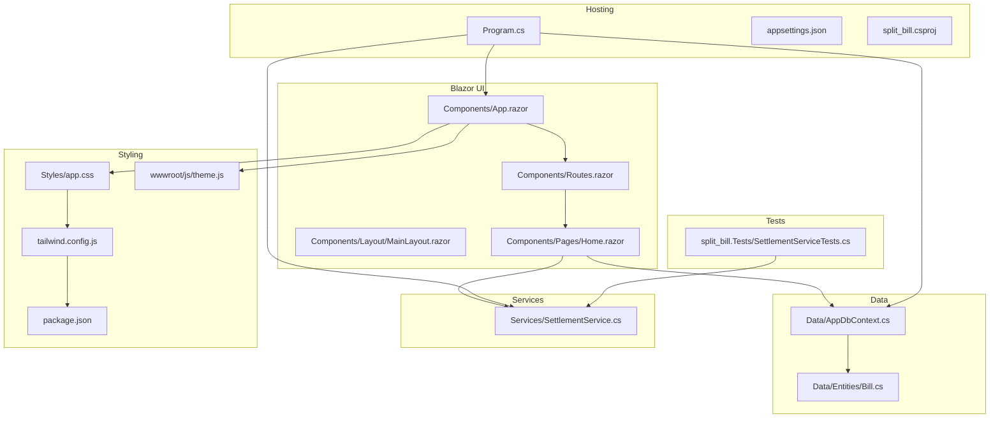
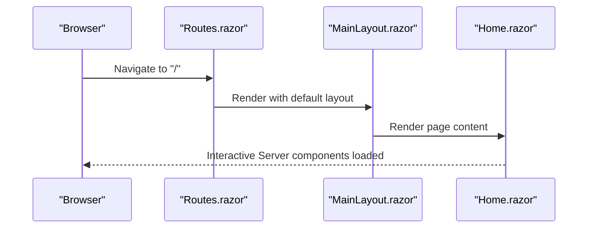
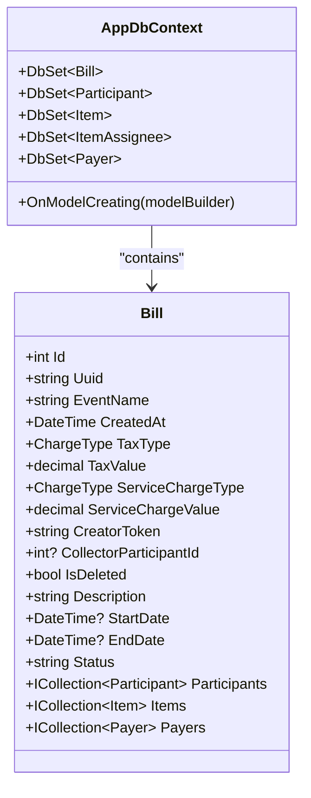
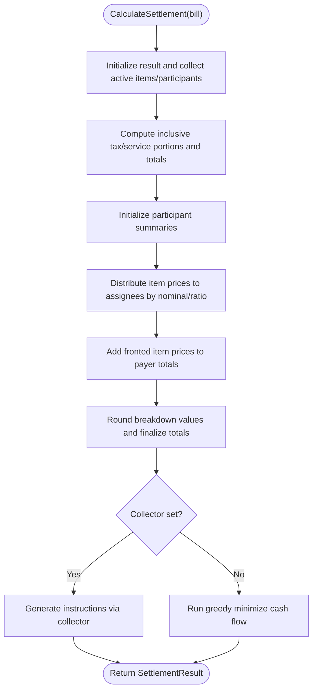
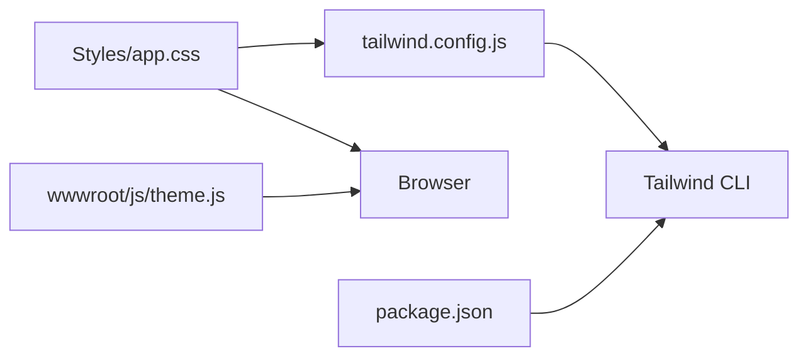
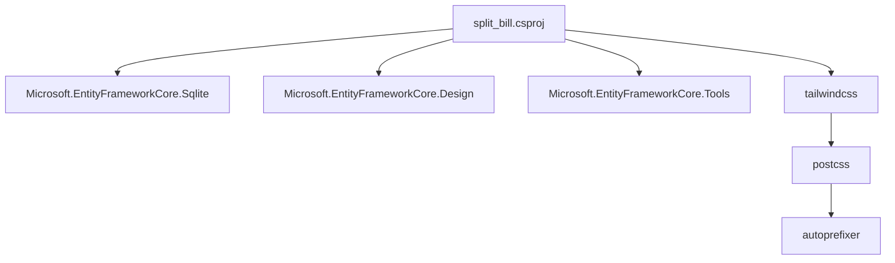

# Development Guidelines

<cite>
**Referenced Files in This Document**
- [Program.cs](file://Program.cs)
- [split_bill.csproj](file://split_bill.csproj)
- [appsettings.json](file://appsettings.json)
- [plan.md](file://plan.md)
- [Styles/app.css](file://Styles/app.css)
- [Components/App.razor](file://Components/App.razor)
- [Components/Routes.razor](file://Components/Routes.razor)
- [Components/Layout/MainLayout.razor](file://Components/Layout/MainLayout.razor)
- [Components/Pages/Home.razor](file://Components/Pages/Home.razor)
- [Data/AppDbContext.cs](file://Data/AppDbContext.cs)
- [Data/Entities/Bill.cs](file://Data/Entities/Bill.cs)
- [Services/SettlementService.cs](file://Services/SettlementService.cs)
- [package.json](file://package.json)
- [tailwind.config.js](file://tailwind.config.js)
- [wwwroot/js/theme.js](file://wwwroot/js/theme.js)
- [split_bill.Tests/SettlementServiceTests.cs](file://split_bill.Tests/SettlementServiceTests.cs)
</cite>

## Table of Contents
1. [Introduction](#introduction)
2. [Project Structure](#project-structure)
3. [Core Components](#core-components)
4. [Architecture Overview](#architecture-overview)
5. [Detailed Component Analysis](#detailed-component-analysis)
6. [Dependency Analysis](#dependency-analysis)
7. [Performance Considerations](#performance-considerations)
8. [Troubleshooting Guide](#troubleshooting-guide)
9. [Development Workflow](#development-workflow)
10. [Adding New Features and Maintaining Compatibility](#adding-new-features-and-maintaining-compatibility)
11. [Debugging Techniques](#debugging-techniques)
12. [Conclusion](#conclusion)

## Introduction
This document provides comprehensive development guidelines for contributing to SplitBill. It covers coding standards for C#, Blazor components, and CSS styling; project structure conventions; naming patterns; code organization principles; development workflow including branch management, pull requests, and code review standards; guidance for adding new features and modifying existing functionality while maintaining backward compatibility; and practical debugging, performance optimization, and troubleshooting advice.

## Project Structure
SplitBill follows a layered, feature-oriented structure:
- Application entrypoint and hosting configuration
- Blazor Server components and pages organized by feature
- Data layer with Entity Framework Core and SQLite
- Services encapsulating business logic
- Styling with Tailwind CSS and JavaScript-based theme management
- Tests separated into a dedicated test project



**Diagram sources**
- [Program.cs:1-73](file://Program.cs#L1-L73)
- [Components/App.razor:1-27](file://Components/App.razor#L1-L27)
- [Components/Routes.razor:1-7](file://Components/Routes.razor#L1-L7)
- [Components/Layout/MainLayout.razor:1-12](file://Components/Layout/MainLayout.razor#L1-L12)
- [Components/Pages/Home.razor:1-325](file://Components/Pages/Home.razor#L1-L325)
- [Data/AppDbContext.cs:1-71](file://Data/AppDbContext.cs#L1-L71)
- [Data/Entities/Bill.cs:1-38](file://Data/Entities/Bill.cs#L1-L38)
- [Services/SettlementService.cs:1-314](file://Services/SettlementService.cs#L1-L314)
- [Styles/app.css:1-70](file://Styles/app.css#L1-L70)
- [tailwind.config.js:1-22](file://tailwind.config.js#L1-L22)
- [wwwroot/js/theme.js:1-36](file://wwwroot/js/theme.js#L1-L36)
- [package.json:1-20](file://package.json#L1-L20)
- [split_bill.Tests/SettlementServiceTests.cs](file://split_bill.Tests/SettlementServiceTests.cs)

**Section sources**
- [Program.cs:1-73](file://Program.cs#L1-L73)
- [split_bill.csproj:1-34](file://split_bill.csproj#L1-L34)
- [Components/App.razor:1-27](file://Components/App.razor#L1-L27)
- [Components/Routes.razor:1-7](file://Components/Routes.razor#L1-L7)
- [Components/Layout/MainLayout.razor:1-12](file://Components/Layout/MainLayout.razor#L1-L12)
- [Components/Pages/Home.razor:1-325](file://Components/Pages/Home.razor#L1-L325)
- [Data/AppDbContext.cs:1-71](file://Data/AppDbContext.cs#L1-L71)
- [Data/Entities/Bill.cs:1-38](file://Data/Entities/Bill.cs#L1-L38)
- [Services/SettlementService.cs:1-314](file://Services/SettlementService.cs#L1-L314)
- [Styles/app.css:1-70](file://Styles/app.css#L1-L70)
- [tailwind.config.js:1-22](file://tailwind.config.js#L1-L22)
- [wwwroot/js/theme.js:1-36](file://wwwroot/js/theme.js#L1-L36)
- [package.json:1-20](file://package.json#L1-L20)
- [split_bill.Tests/SettlementServiceTests.cs](file://split_bill.Tests/SettlementServiceTests.cs)

## Core Components
- Application bootstrap and middleware pipeline
- Blazor routing and layout
- Data context and entity model
- Business logic service for settlement calculations
- Styling and theme management
- Test coverage for core logic

Key implementation patterns:
- Dependency injection registration for DbContext and services
- Interactive Server components with SignalR
- Soft-deleted entities with global query filters
- Tailwind CSS with custom animations and utilities
- Local storage-backed session tokens for creator/viewer modes

**Section sources**
- [Program.cs:1-73](file://Program.cs#L1-L73)
- [Components/Routes.razor:1-7](file://Components/Routes.razor#L1-L7)
- [Components/Layout/MainLayout.razor:1-12](file://Components/Layout/MainLayout.razor#L1-L12)
- [Data/AppDbContext.cs:1-71](file://Data/AppDbContext.cs#L1-L71)
- [Data/Entities/Bill.cs:1-38](file://Data/Entities/Bill.cs#L1-L38)
- [Services/SettlementService.cs:1-314](file://Services/SettlementService.cs#L1-L314)
- [Styles/app.css:1-70](file://Styles/app.css#L1-L70)
- [tailwind.config.js:1-22](file://tailwind.config.js#L1-L22)
- [wwwroot/js/theme.js:1-36](file://wwwroot/js/theme.js#L1-L36)

## Architecture Overview
The system is a Blazor Server application using Entity Framework Core with SQLite for persistence. The settlement engine computes fair splits and minimal transfer instructions. Styling leverages Tailwind CSS with a JavaScript-driven theme manager.

```mermaid
graph TB
Browser["Browser Client"]
Blazor[".NET 10 Blazor Server App"]
SignalR["SignalR WebSocket"]
EF["Entity Framework Core"]
SQLite["SQLite Database"]
Tailwind["Tailwind CSS"]
ThemeJS["theme.js"]
Browser --> Blazor
Blazor <- --> SignalR
Blazor --> EF
EF --> SQLite
Blazor --> Tailwind
Tailwind --> ThemeJS
```

**Diagram sources**
- [plan.md:25-30](file://plan.md#L25-L30)
- [Program.cs:10-11](file://Program.cs#L10-L11)
- [Data/AppDbContext.cs:1-71](file://Data/AppDbContext.cs#L1-L71)
- [Styles/app.css:1-3](file://Styles/app.css#L1-L3)
- [tailwind.config.js:1-22](file://tailwind.config.js#L1-L22)
- [wwwroot/js/theme.js:1-36](file://wwwroot/js/theme.js#L1-L36)

## Detailed Component Analysis

### Blazor Routing and Layout
- Routes are configured with a fallback to a NotFound page and a default layout.
- The main layout wraps the body content and provides a global error UI area.



**Diagram sources**
- [Components/Routes.razor:1-7](file://Components/Routes.razor#L1-L7)
- [Components/Layout/MainLayout.razor:1-12](file://Components/Layout/MainLayout.razor#L1-L12)
- [Components/Pages/Home.razor:1-325](file://Components/Pages/Home.razor#L1-L325)

**Section sources**
- [Components/Routes.razor:1-7](file://Components/Routes.razor#L1-L7)
- [Components/Layout/MainLayout.razor:1-12](file://Components/Layout/MainLayout.razor#L1-L12)

### Data Layer and Entity Model
- AppDbContext configures soft-delete filters and cascade deletes.
- Bill entity supports flexible tax and service charge types and includes extended metadata fields.



**Diagram sources**
- [Data/AppDbContext.cs:1-71](file://Data/AppDbContext.cs#L1-L71)
- [Data/Entities/Bill.cs:1-38](file://Data/Entities/Bill.cs#L1-L38)

**Section sources**
- [Data/AppDbContext.cs:1-71](file://Data/AppDbContext.cs#L1-L71)
- [Data/Entities/Bill.cs:1-38](file://Data/Entities/Bill.cs#L1-L38)

### Settlement Service
- Calculates inclusive tax/service portions, distributes item costs to participants, and generates transfer instructions.
- Supports a collector participant or a greedy minimization algorithm.



**Diagram sources**
- [Services/SettlementService.cs:55-232](file://Services/SettlementService.cs#L55-L232)

**Section sources**
- [Services/SettlementService.cs:1-314](file://Services/SettlementService.cs#L1-L314)

### Styling and Theme Management
- Tailwind directives are applied in a single stylesheet with custom animations and utilities.
- Tailwind content scanning includes Blazor components and wwwroot assets.
- A JavaScript module manages theme persistence and initialization.



**Diagram sources**
- [Styles/app.css:1-70](file://Styles/app.css#L1-L70)
- [tailwind.config.js:1-22](file://tailwind.config.js#L1-L22)
- [package.json:1-20](file://package.json#L1-L20)
- [wwwroot/js/theme.js:1-36](file://wwwroot/js/theme.js#L1-L36)

**Section sources**
- [Styles/app.css:1-70](file://Styles/app.css#L1-L70)
- [tailwind.config.js:1-22](file://tailwind.config.js#L1-L22)
- [package.json:1-20](file://package.json#L1-L20)
- [wwwroot/js/theme.js:1-36](file://wwwroot/js/theme.js#L1-L36)

## Dependency Analysis
- The project targets .NET 10 with interactive server components.
- Entity Framework Core packages are included for SQLite and design-time support.
- Tailwind CSS is integrated via npm scripts and executed during build.
- Tests target the settlement service to validate algorithmic correctness.



**Diagram sources**
- [split_bill.csproj:10-20](file://split_bill.csproj#L10-L20)
- [package.json:14-18](file://package.json#L14-L18)

**Section sources**
- [split_bill.csproj:1-34](file://split_bill.csproj#L1-L34)
- [package.json:1-20](file://package.json#L1-L20)

## Performance Considerations
- Prefer batch operations and avoid N+1 queries by leveraging navigation properties and eager loading where appropriate.
- Use soft-delete filters to prevent accidental data retrieval; ensure queries account for deleted records only when intended.
- Keep UI updates minimal; avoid unnecessary re-renders by structuring state and parameters efficiently in Blazor components.
- Optimize Tailwind builds by limiting content globs to relevant paths and enabling purge in production.
- Cache static assets and leverage browser caching headers for improved load times.

## Troubleshooting Guide
Common issues and resolutions:
- Database initialization in development: The host clears and recreates the SQLite database on startup when in development. If encountering schema errors, verify the database file deletion and EnsureCreated execution.
- Tailwind CSS not updating: Ensure the Tailwind build script runs during build and that content paths in the configuration match component locations.
- Theme not persisting: Confirm local storage keys and theme initialization logic in the theme manager.
- Navigation exceptions: The project disables throwing navigation exceptions; handle navigation gracefully and use the NotFound route for invalid paths.

**Section sources**
- [Program.cs:27-53](file://Program.cs#L27-L53)
- [tailwind.config.js:4-11](file://tailwind.config.js#L4-L11)
- [wwwroot/js/theme.js:1-36](file://wwwroot/js/theme.js#L1-L36)
- [Components/Routes.razor:1-7](file://Components/Routes.razor#L1-L7)

## Development Workflow
Branching and collaboration:
- Use feature branches prefixed with feature/, fix/, or chore/ for isolated work.
- Keep commits focused and descriptive; reference issues by number in commit messages.
- Open pull requests targeting main with a clear summary and acceptance criteria aligned with the verification plan.

Code review standards:
- Ensure new features include unit tests and pass existing tests.
- Validate UI responsiveness and cross-browser compatibility.
- Confirm adherence to naming conventions and folder structure.
- Review performance implications and accessibility considerations.

Verification plan alignment:
- Automated tests: Run dotnet test to validate settlement logic and other services.
- Manual verification: Use dotnet watch or dotnet run to test interactive components, bill creation, and settlement computations.

**Section sources**
- [plan.md:148-157](file://plan.md#L148-L157)
- [split_bill.Tests/SettlementServiceTests.cs](file://split_bill.Tests/SettlementServiceTests.cs)

## Adding New Features and Maintaining Compatibility
Guidelines for extending SplitBill:
- Follow the established folder structure: add Blazor components to Components/Pages or Components/Layout as appropriate; place new services under Services; add entities to Data/Entities and update AppDbContext; introduce styles in Styles and integrate with Tailwind.
- Maintain backward compatibility by avoiding breaking changes to persisted entities and APIs; use optional fields and default values when evolving models.
- Respect soft-delete semantics and global query filters; ensure new features honor IsDeleted and related filters.
- Keep UI consistent with existing patterns: use Tailwind utilities, shared layouts, and component composition.
- Document new features and update tests accordingly.

## Debugging Techniques
Effective debugging practices:
- Enable detailed logging via appsettings.json and inspect logs during development.
- Use browser developer tools to inspect Blazor interactivity, network requests, and console errors.
- Leverage breakpoints in Blazor components and services; step through settlement calculations to validate intermediate values.
- Validate Tailwind CSS generation by checking compiled output in wwwroot and ensuring content globs capture all relevant Razor components.

**Section sources**
- [appsettings.json:1-10](file://appsettings.json#L1-L10)
- [Styles/app.css:1-70](file://Styles/app.css#L1-L70)
- [tailwind.config.js:4-11](file://tailwind.config.js#L4-L11)

## Conclusion
These guidelines consolidate SplitBill’s architecture, coding standards, and operational practices. By adhering to the conventions outlined here—folder structure, naming patterns, dependency management, testing, and review processes—you can contribute effectively while preserving system stability and performance.