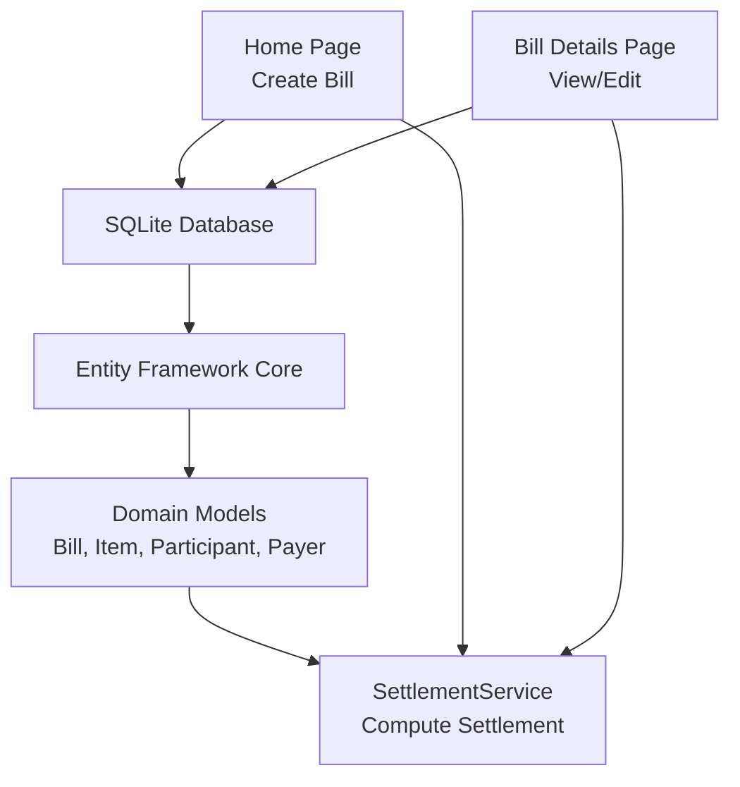
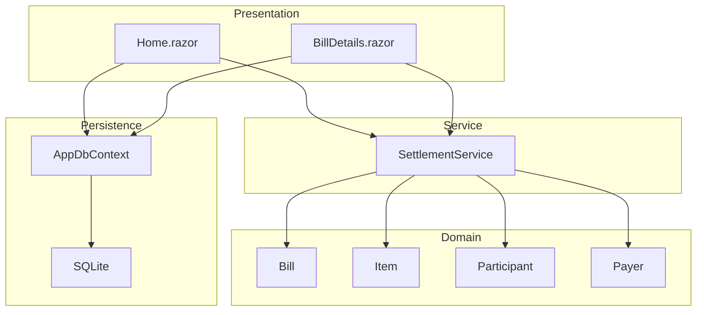
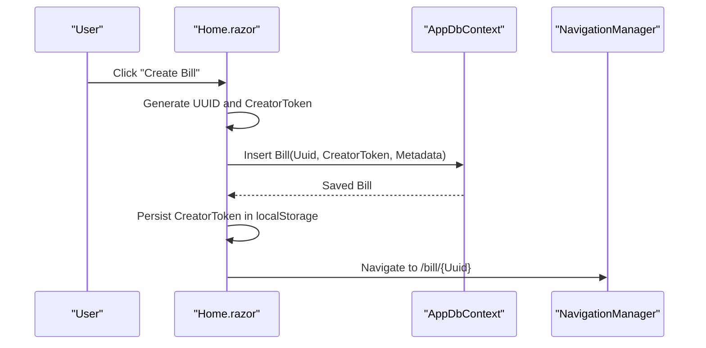
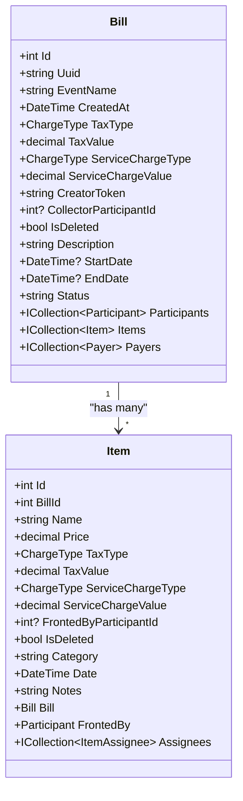
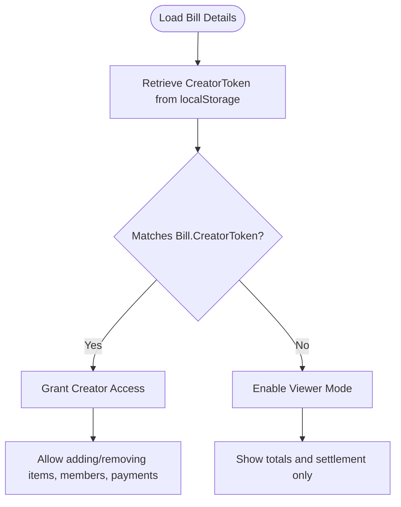
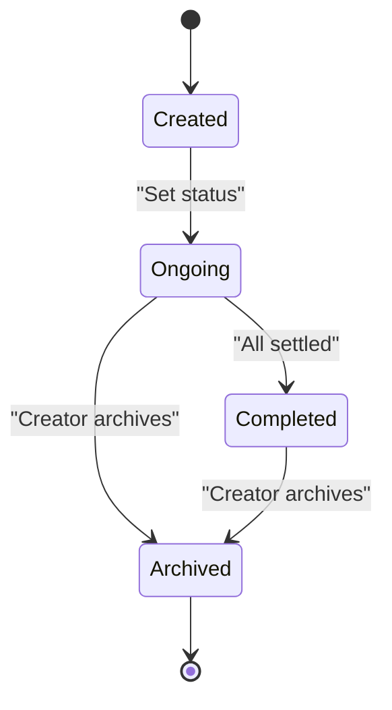
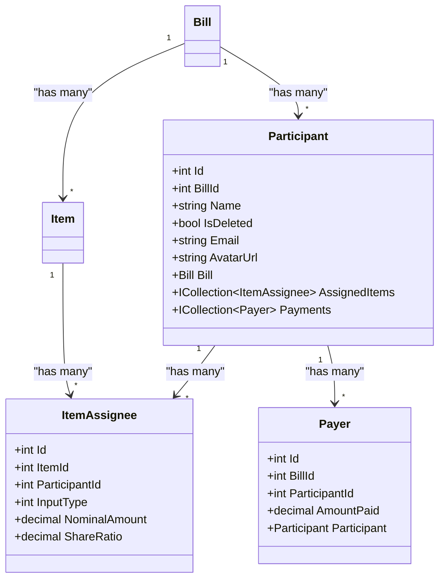
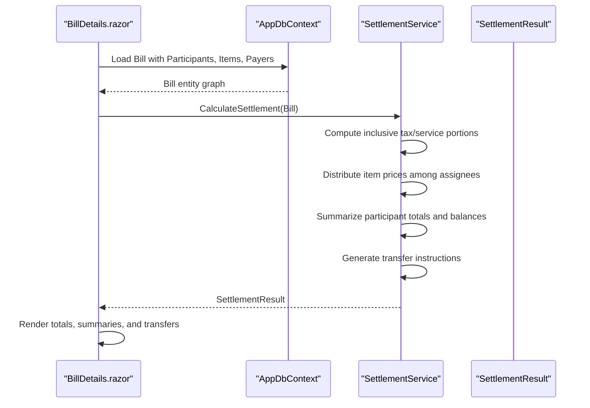
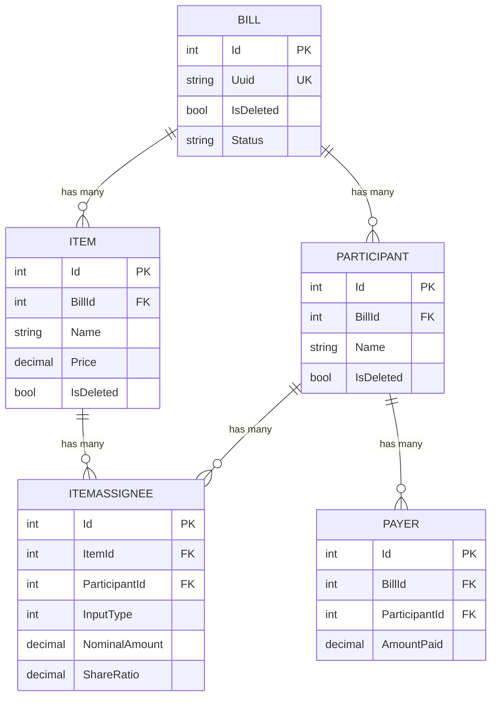

# Bill Management

<cite>
**Referenced Files in This Document**
- [Bill.cs](file://Data/Entities/Bill.cs)
- [Participant.cs](file://Data/Entities/Participant.cs)
- [Item.cs](file://Data/Entities/Item.cs)
- [Payer.cs](file://Data/Entities/Payer.cs)
- [AppDbContext.cs](file://Data/AppDbContext.cs)
- [SettlementService.cs](file://Services/SettlementService.cs)
- [BillDetails.razor](file://Components/Pages/BillDetails.razor)
- [Home.razor](file://Components/Pages/Home.razor)
- [Program.cs](file://Program.cs)
- [20260603040137_UpdateTaxServiceNominal.cs](file://Migrations/20260603040137_UpdateTaxServiceNominal.cs)
- [20260603040137_UpdateTaxServiceNominal.Designer.cs](file://Migrations/20260603040137_UpdateTaxServiceNominal.Designer.cs)
- [SettlementServiceTests.cs](file://split_bill.Tests/SettlementServiceTests.cs)
- [plan.md](file://plan.md)
</cite>

## Table of Contents
1. [Introduction](#introduction)
2. [Project Structure](#project-structure)
3. [Core Components](#core-components)
4. [Architecture Overview](#architecture-overview)
5. [Detailed Component Analysis](#detailed-component-analysis)
6. [Dependency Analysis](#dependency-analysis)
7. [Performance Considerations](#performance-considerations)
8. [Troubleshooting Guide](#troubleshooting-guide)
9. [Conclusion](#conclusion)
10. [Appendices](#appendices)

## Introduction
This document explains the bill management system with a focus on the bill creation workflow, metadata management, tax and service charge configurations, status tracking, access control, lifecycle from creation to archiving, UUID-based identification, sharing, and collaborative editing. It also details how bills integrate with the settlement calculation system, including participant relationships, tax service configurations, and practical setup scenarios.

## Project Structure
The system is a Blazor Server application backed by an Entity Framework Core context and a SQLite database. The core domain entities define bills, participants, items, and payments. A dedicated service computes settlement results and transfer instructions. UI pages orchestrate bill creation, editing, and viewing experiences.

**Diagram sources**
- [Program.cs:13-16](file://Program.cs#L13-L16)
- [AppDbContext.cs:12-16](file://Data/AppDbContext.cs#L12-L16)
- [SettlementService.cs:55-232](file://Services/SettlementService.cs#L55-L232)
- [Home.razor:257-288](file://Components/Pages/Home.razor#L257-L288)
- [BillDetails.razor:1236-1247](file://Components/Pages/BillDetails.razor#L1236-L1247)

**Section sources**
- [Program.cs:13-16](file://Program.cs#L13-L16)
- [AppDbContext.cs:12-16](file://Data/AppDbContext.cs#L12-L16)
- [Home.razor:257-288](file://Components/Pages/Home.razor#L257-L288)
- [BillDetails.razor:1236-1247](file://Components/Pages/BillDetails.razor#L1236-L1247)

## Core Components
- Bill: Root entity with UUID, event metadata, tax/service charge settings, creator token, optional collector, soft-deletion flag, and lifecycle status.
- Item: Expense entries with pricing, tax/service charge overrides, fronted-by participant, category/date/notes, and assignees.
- Participant: Group member with optional contact metadata and associations to items and payments.
- Payer: Records cash payments made by participants toward the bill.
- AppDbContext: Configures entity sets, indexes, filters, and cascading deletes.
- SettlementService: Computes totals, participant shares, balances, and transfer instructions.

**Section sources**
- [Bill.cs:12-37](file://Data/Entities/Bill.cs#L12-L37)
- [Item.cs:5-27](file://Data/Entities/Item.cs#L5-L27)
- [Participant.cs:5-20](file://Data/Entities/Participant.cs#L5-L20)
- [Payer.cs:3-12](file://Data/Entities/Payer.cs#L3-L12)
- [AppDbContext.cs:12-70](file://Data/AppDbContext.cs#L12-L70)
- [SettlementService.cs:43-314](file://Services/SettlementService.cs#L43-L314)

## Architecture Overview
The system follows a layered architecture:
- Presentation Layer: Blazor Server pages handle user interactions and render views.
- Domain Layer: Strongly typed entities encapsulate business rules.
- Persistence Layer: Entity Framework Core manages CRUD and relationships.
- Service Layer: SettlementService encapsulates settlement computation logic.

**Diagram sources**
- [Home.razor:257-288](file://Components/Pages/Home.razor#L257-L288)
- [BillDetails.razor:1236-1247](file://Components/Pages/BillDetails.razor#L1236-L1247)
- [AppDbContext.cs:12-70](file://Data/AppDbContext.cs#L12-L70)
- [SettlementService.cs:55-232](file://Services/SettlementService.cs#L55-L232)

## Detailed Component Analysis

### Bill Creation Workflow
- UUID Generation: The home page generates a short unique identifier for the bill session.
- Creator Token: A secure token is generated and stored with the bill to enable creator privileges.
- Local Storage: The creator token is persisted in the browser’s local storage for subsequent authorizations.
- Navigation: After creation, the user is navigated to the bill details page.

**Diagram sources**
- [Home.razor:257-288](file://Components/Pages/Home.razor#L257-L288)
- [AppDbContext.cs:12-16](file://Data/AppDbContext.cs#L12-L16)

**Section sources**
- [Home.razor:257-288](file://Components/Pages/Home.razor#L257-L288)
- [plan.md:75-85](file://plan.md#L75-L85)

### Metadata Management and Tax/Service Charges
- Bill-level tax and service charge defaults apply to all items unless overridden.
- Item-level tax/service charge can override bill defaults; percentages and fixed amounts are supported.
- Additional bill metadata includes event name, description, start/end dates, and status.

**Diagram sources**
- [Bill.cs:12-37](file://Data/Entities/Bill.cs#L12-L37)
- [Item.cs:5-27](file://Data/Entities/Item.cs#L5-L27)

**Section sources**
- [Bill.cs:12-37](file://Data/Entities/Bill.cs#L12-L37)
- [Item.cs:5-27](file://Data/Entities/Item.cs#L5-L27)
- [20260603040137_UpdateTaxServiceNominal.cs:11-52](file://Migrations/20260603040137_UpdateTaxServiceNominal.cs#L11-L52)

### Status Tracking Mechanisms
- Status field supports ongoing, completed, and archived states.
- The UI reflects current status and allows creators to update it.

**Section sources**
- [Bill.cs:31](file://Data/Entities/Bill.cs#L31)
- [BillDetails.razor:1008-1014](file://Components/Pages/BillDetails.razor#L1008-L1014)

### Access Control Features
- Creator token enables privileged actions (add/edit/remove items, participants, payments).
- Viewer mode restricts edits; users can still view totals and settlement instructions.
- Authorization is performed via JavaScript interop retrieving the stored token.

**Diagram sources**
- [BillDetails.razor:1212-1230](file://Components/Pages/BillDetails.razor#L1212-L1230)
- [plan.md:75-85](file://plan.md#L75-L85)

**Section sources**
- [BillDetails.razor:1212-1230](file://Components/Pages/BillDetails.razor#L1212-L1230)
- [plan.md:75-85](file://plan.md#L75-L85)

### Bill Lifecycle: From Creation to Archiving
- Creation: Short UUID and creator token generated; persisted to database.
- Collaboration: Shareable link; viewers see computed totals and settlement.
- Editing: Creators add/remove items, participants, and payments; UI updates automatically.
- Archiving: Status can be set to archived by creators.

**Diagram sources**
- [Bill.cs:31](file://Data/Entities/Bill.cs#L31)
- [BillDetails.razor:1008-1014](file://Components/Pages/BillDetails.razor#L1008-L1014)

**Section sources**
- [Home.razor:257-288](file://Components/Pages/Home.razor#L257-L288)
- [BillDetails.razor:1008-1014](file://Components/Pages/BillDetails.razor#L1008-L1014)

### Sharing Mechanisms and Collaborative Editing
- Share Link: Users copy the current URL; recipients open the same page.
- Creator Privileges: Creator token grants editing rights; otherwise, read-only.
- Real-time Updates: Settlement recalculates after each edit.

**Section sources**
- [BillDetails.razor:1586-1598](file://Components/Pages/BillDetails.razor#L1586-L1598)
- [BillDetails.razor:1212-1230](file://Components/Pages/BillDetails.razor#L1212-L1230)

### Participant Relationships and Assignments
- Participants belong to a bill and can be linked to items as assignees.
- ItemAssignee supports either ratio-based or nominal splits.
- Payments are recorded per participant.

**Diagram sources**
- [Participant.cs:5-20](file://Data/Entities/Participant.cs#L5-L20)
- [Item.cs:24-26](file://Data/Entities/Item.cs#L24-L26)
- [Payer.cs:3-12](file://Data/Entities/Payer.cs#L3-L12)
- [20260603040137_UpdateTaxServiceNominal.Designer.cs:116-144](file://Migrations/20260603040137_UpdateTaxServiceNominal.Designer.cs#L116-L144)

**Section sources**
- [Participant.cs:5-20](file://Data/Entities/Participant.cs#L5-L20)
- [Payer.cs:3-12](file://Data/Entities/Payer.cs#L3-L12)
- [20260603040137_UpdateTaxServiceNominal.Designer.cs:216-233](file://Migrations/20260603040137_UpdateTaxServiceNominal.Designer.cs#L216-L233)

### Settlement Calculation Integration
- SettlementService aggregates items, applies inclusive tax/service calculations, distributes costs among assignees, accounts for fronted payments, and produces transfer instructions.
- Supports a collector-based flow or a minimized cash-flow algorithm when no collector is designated.

**Diagram sources**
- [BillDetails.razor:1236-1247](file://Components/Pages/BillDetails.razor#L1236-L1247)
- [SettlementService.cs:55-232](file://Services/SettlementService.cs#L55-L232)

**Section sources**
- [SettlementService.cs:55-232](file://Services/SettlementService.cs#L55-L232)
- [SettlementServiceTests.cs:19-51](file://split_bill.Tests/SettlementServiceTests.cs#L19-L51)
- [SettlementServiceTests.cs:53-157](file://split_bill.Tests/SettlementServiceTests.cs#L53-L157)

### Practical Setup Scenarios and Common Patterns
- Scenario 1: Equal split across participants for a single item.
- Scenario 2: Mixed percentage and fixed tax/service charges across multiple items.
- Scenario 3: Nominal split for one participant and ratio split for others within an item.
- Scenario 4: Adding a collector to centralize fund collection and distribution.

These patterns are validated by unit tests and demonstrated in the UI through modal forms for adding expenses, members, and payments.

**Section sources**
- [SettlementServiceTests.cs:53-157](file://split_bill.Tests/SettlementServiceTests.cs#L53-L157)
- [BillDetails.razor:829-952](file://Components/Pages/BillDetails.razor#L829-L952)
- [BillDetails.razor:954-976](file://Components/Pages/BillDetails.razor#L954-L976)
- [BillDetails.razor:1024-1056](file://Components/Pages/BillDetails.razor#L1024-L1056)

## Dependency Analysis
- Entity relationships: Bill to Participants and Items; Item to Assignees; Participant to Payments; Payers link to Participants.
- Query filters: Soft-delete filters applied at the context level.
- Indexes: Unique index on Bill.Uuid; cascade deletes configured for related entities.

**Diagram sources**
- [AppDbContext.cs:22-70](file://Data/AppDbContext.cs#L22-L70)
- [20260603040137_UpdateTaxServiceNominal.Designer.cs:23-114](file://Migrations/20260603040137_UpdateTaxServiceNominal.Designer.cs#L23-L114)

**Section sources**
- [AppDbContext.cs:22-70](file://Data/AppDbContext.cs#L22-L70)
- [20260603040137_UpdateTaxServiceNominal.Designer.cs:23-114](file://Migrations/20260603040137_UpdateTaxServiceNominal.Designer.cs#L23-L114)

## Performance Considerations
- Database queries: Eager load related collections (participants, items with assignees, payers with participants) to minimize round trips.
- Settlement computation: Complexity proportional to number of items and assignees; keep item counts reasonable for interactive responsiveness.
- UI updates: Debounce input formatting and avoid unnecessary re-renders by updating only changed segments.

## Troubleshooting Guide
- Missing bill details: Ensure the UUID exists and is not marked deleted; verify the unique index on Uuid.
- Settlement discrepancies: Confirm inclusive tax/service calculations and that item prices include taxes/services.
- Access denied: Verify the creator token in local storage matches the stored token; check JS interop for token retrieval.
- Payment differences: Review TotalPaidToCashier versus GrandTotal; investigate rounding behavior in settlement summaries.

**Section sources**
- [AppDbContext.cs:22-28](file://Data/AppDbContext.cs#L22-L28)
- [SettlementService.cs:55-84](file://Services/SettlementService.cs#L55-L84)
- [BillDetails.razor:1212-1230](file://Components/Pages/BillDetails.razor#L1212-L1230)

## Conclusion
The bill management system provides a robust foundation for collaborative expense tracking. It supports flexible tax/service configurations, precise settlement computations, creator/viewer access control, and a seamless sharing mechanism. The modular design enables straightforward extension for advanced features such as enhanced filtering, export capabilities, and richer reporting.

## Appendices
- Example configurations:
  - Default bill-level tax/service: percentage-based inclusive calculations.
  - Item-level overrides: specify item-specific tax/service types/values.
  - Split modes: equal ratio or explicit nominal amounts per participant.
- Collector role: designate a participant to collect funds centrally and distribute balances.