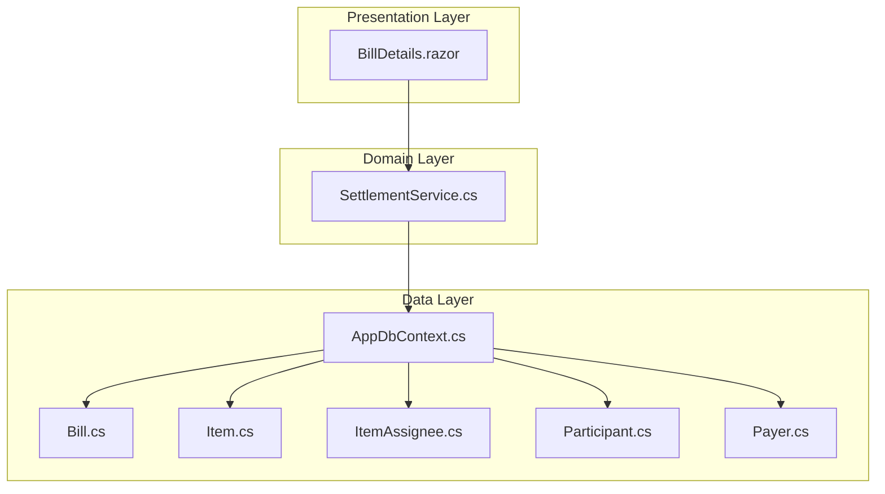
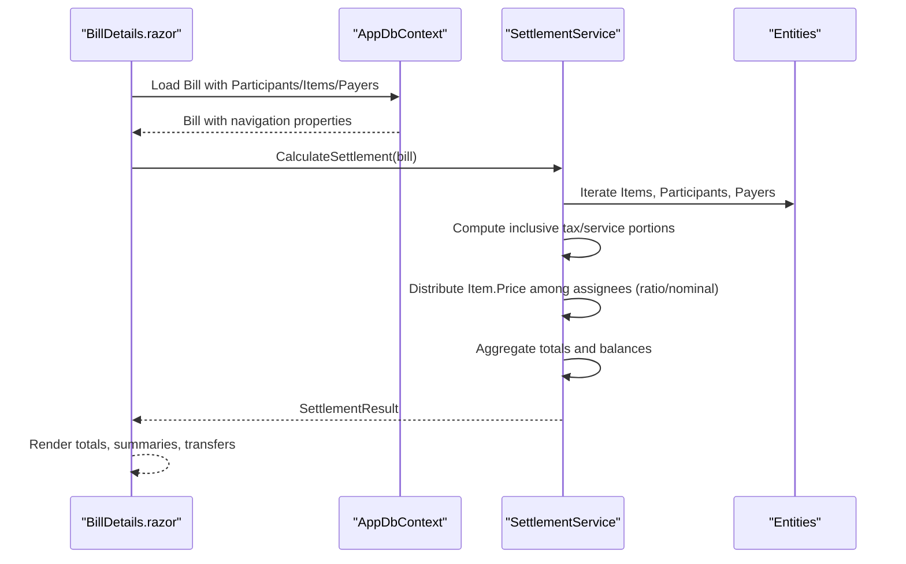
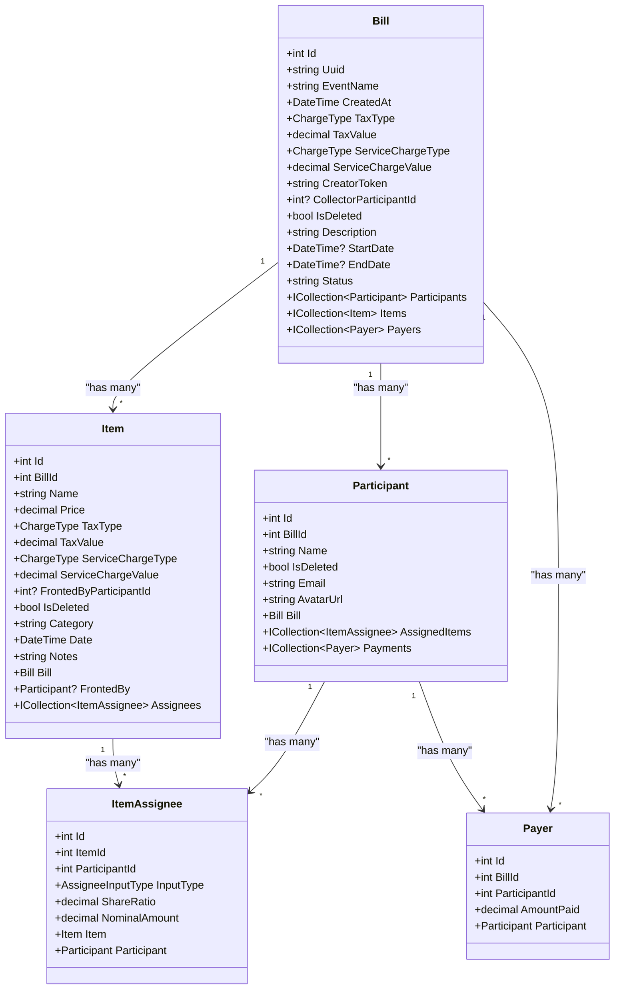
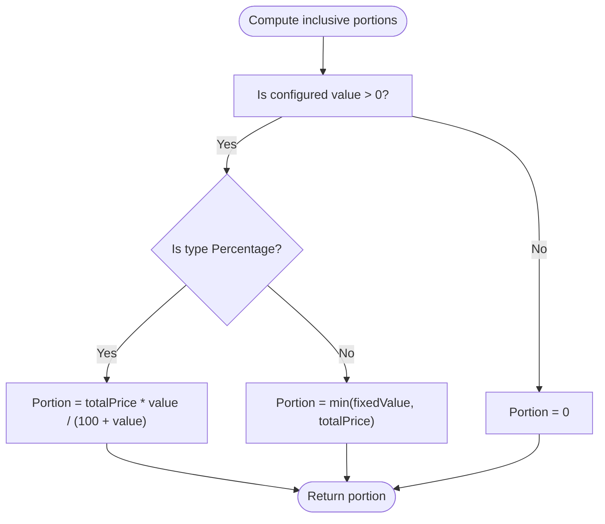
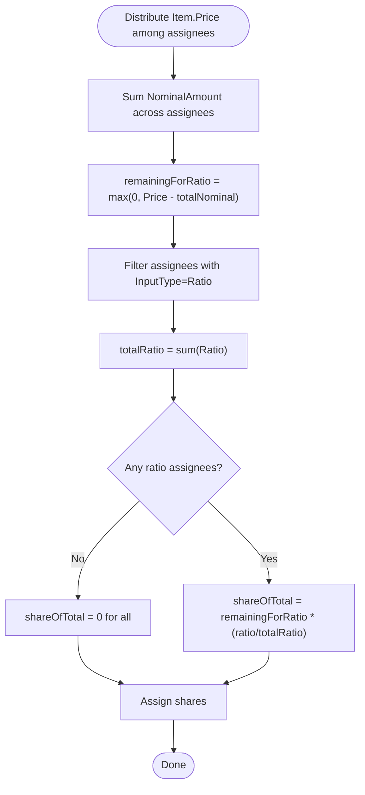
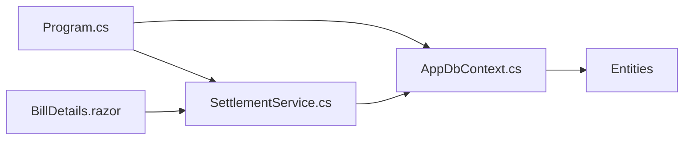
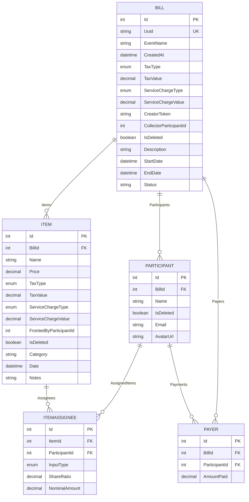

# Expense Recording

<cite>
**Referenced Files in This Document**
- [Bill.cs](file://Data/Entities/Bill.cs)
- [Item.cs](file://Data/Entities/Item.cs)
- [ItemAssignee.cs](file://Data/Entities/ItemAssignee.cs)
- [Participant.cs](file://Data/Entities/Participant.cs)
- [Payer.cs](file://Data/Entities/Payer.cs)
- [AppDbContext.cs](file://Data/AppDbContext.cs)
- [SettlementService.cs](file://Services/SettlementService.cs)
- [BillDetails.razor](file://Components/Pages/BillDetails.razor)
- [Program.cs](file://Program.cs)
- [SettlementServiceTests.cs](file://split_bill.Tests/SettlementServiceTests.cs)
</cite>

## Table of Contents
1. [Introduction](#introduction)
2. [Project Structure](#project-structure)
3. [Core Components](#core-components)
4. [Architecture Overview](#architecture-overview)
5. [Detailed Component Analysis](#detailed-component-analysis)
6. [Dependency Analysis](#dependency-analysis)
7. [Performance Considerations](#performance-considerations)
8. [Troubleshooting Guide](#troubleshooting-guide)
9. [Conclusion](#conclusion)
10. [Appendices](#appendices)

## Introduction
This document explains the expense recording system used to track shared expenses, calculate inclusive pricing with taxes and service charges, distribute costs among participants, and compute balances and transfers. It covers:
- How items are created and managed
- Pricing and tax calculation methodology (inclusive price handling)
- Assignment logic for distributing costs (ratio-based vs fixed amount)
- Fronted payment tracking
- Linking expenses to participants via ItemAssignee entities
- Tax and service charge configurations
- Automatic breakdown calculations
- Examples and edge cases

## Project Structure
The system is a Blazor Server application with a data layer built on Entity Framework Core and a settlement service that computes balances and transfer instructions.

**Diagram sources**
- [Program.cs:13-16](file://Program.cs#L13-L16)
- [AppDbContext.cs:12-16](file://Data/AppDbContext.cs#L12-L16)
- [BillDetails.razor:6-10](file://Components/Pages/BillDetails.razor#L6-L10)
- [SettlementService.cs:55-232](file://Services/SettlementService.cs#L55-L232)

**Section sources**
- [Program.cs:1-73](file://Program.cs#L1-L73)
- [AppDbContext.cs:1-71](file://Data/AppDbContext.cs#L1-L71)

## Core Components
- Bill: Represents a trip/session with tax and service charge settings, participants, items, and payers.
- Item: Represents a single expense with price, tax/service configuration, and who fronted the payment.
- ItemAssignee: Links an item to participants with either a ratio or a fixed nominal amount.
- Participant: A person participating in the bill.
- Payer: Records cash payments made by a participant toward the bill.
- AppDbContext: EF Core context with entity sets and query filters.
- SettlementService: Computes totals, breakdowns, participant balances, and transfer instructions.

**Section sources**
- [Bill.cs:12-37](file://Data/Entities/Bill.cs#L12-L37)
- [Item.cs:5-27](file://Data/Entities/Item.cs#L5-L27)
- [ItemAssignee.cs:9-21](file://Data/Entities/ItemAssignee.cs#L9-L21)
- [Participant.cs:5-20](file://Data/Entities/Participant.cs#L5-L20)
- [Payer.cs:3-12](file://Data/Entities/Payer.cs#L3-L12)
- [AppDbContext.cs:6-71](file://Data/AppDbContext.cs#L6-L71)
- [SettlementService.cs:43-314](file://Services/SettlementService.cs#L43-L314)

## Architecture Overview
The system follows a layered architecture:
- Presentation: Blazor Server page renders bills, items, participants, and settlement results.
- Domain: SettlementService encapsulates business logic for pricing, tax/service inclusion, assignment distribution, and transfer computation.
- Data: AppDbContext manages entities and relationships with soft-delete filters.

**Diagram sources**
- [BillDetails.razor:1233-1244](file://Components/Pages/BillDetails.razor#L1233-L1244)
- [SettlementService.cs:55-232](file://Services/SettlementService.cs#L55-L232)
- [AppDbContext.cs:18-71](file://Data/AppDbContext.cs#L18-L71)

## Detailed Component Analysis

### Data Model and Relationships
The entities define the core domain model for bills, items, participants, assignees, and payments.

**Diagram sources**
- [Bill.cs:12-37](file://Data/Entities/Bill.cs#L12-L37)
- [Item.cs:5-27](file://Data/Entities/Item.cs#L5-L27)
- [ItemAssignee.cs:9-21](file://Data/Entities/ItemAssignee.cs#L9-L21)
- [Participant.cs:5-20](file://Data/Entities/Participant.cs#L5-L20)
- [Payer.cs:3-12](file://Data/Entities/Payer.cs#L3-L12)

**Section sources**
- [AppDbContext.cs:18-71](file://Data/AppDbContext.cs#L18-L71)
- [Bill.cs:6-10](file://Data/Entities/Bill.cs#L6-L10)
- [ItemAssignee.cs:3-7](file://Data/Entities/ItemAssignee.cs#L3-L7)

### Pricing and Tax Calculation Methodology
- Item.Price is the inclusive total paid to the cashier (includes tax and service).
- Taxes and service charges are configured per-item or per-bill and are used to back-calculate the breakdown portions.
- Inclusive tax/service portions are computed differently depending on whether the configuration is percentage or fixed amount.
- The service charge is treated similarly to tax in the inclusive back-calculation.

Key behaviors:
- Back-calculate inclusive tax/service portions from Item.Price using the configured type/value.
- Compute food subtotal as Item.Price minus inclusive tax/service portions.
- Breakdown ratios are derived from the inclusive totals to allocate tax/service shares per participant.

**Diagram sources**
- [SettlementService.cs:243-259](file://Services/SettlementService.cs#L243-L259)

**Section sources**
- [SettlementService.cs:46-81](file://Services/SettlementService.cs#L46-L81)
- [SettlementService.cs:234-259](file://Services/SettlementService.cs#L234-L259)

### Assignment Logic: Ratio-Based vs Fixed Amount
- Each item’s assignees define how the inclusive Item.Price is distributed.
- Two input modes are supported:
  - Ratio: ShareRatio weights among participants sharing the item.
  - Nominal: NominalAmount specifies the exact amount owed by a participant for this item.
- Distribution steps:
  - Sum all nominal amounts for the item.
  - Remaining amount equals Item.Price minus total nominal.
  - Ratio-based shares are proportional to ShareRatio among remaining participants.
  - If no ratio participants remain, remaining share is zero.

**Diagram sources**
- [SettlementService.cs:123-158](file://Services/SettlementService.cs#L123-L158)
- [ItemAssignee.cs:14-16](file://Data/Entities/ItemAssignee.cs#L14-L16)

**Section sources**
- [SettlementService.cs:122-158](file://Services/SettlementService.cs#L122-L158)
- [ItemAssignee.cs:3-7](file://Data/Entities/ItemAssignee.cs#L3-L7)

### Fronted Payment Tracking
- Items can record who paid for them via FrontedByParticipantId.
- The settlement aggregates the inclusive Item.Price paid by the fronted participant into their TotalPaid.
- This ensures fronters are credited for the full inclusive amount they paid.

**Section sources**
- [Item.cs:15-16](file://Data/Entities/Item.cs#L15-L16)
- [SettlementService.cs:160-169](file://Services/SettlementService.cs#L160-L169)
- [BillDetails.razor:295-314](file://Components/Pages/BillDetails.razor#L295-L314)

### Linking Expenses to Participants via ItemAssignee
- Each ItemAssignee links an Item to a Participant with either:
  - InputType=Ratio and ShareRatio
  - InputType=Nominal and NominalAmount
- Assignees are used to distribute the inclusive Item.Price among participants.

**Section sources**
- [ItemAssignee.cs:9-21](file://Data/Entities/ItemAssignee.cs#L9-L21)
- [SettlementService.cs:105-158](file://Services/SettlementService.cs#L105-L158)

### Tax and Service Charge Configurations
- Per-item and per-bill tax/service charge types and values are supported.
- Types:
  - Percentage: computed as a proportion of the inclusive total.
  - Fixed: deducted directly up to the inclusive total.
- Back-calculation ensures the inclusive total reflects the configured charges.

**Section sources**
- [Bill.cs:18-21](file://Data/Entities/Bill.cs#L18-L21)
- [Item.cs:11-14](file://Data/Entities/Item.cs#L11-L14)
- [SettlementService.cs:234-259](file://Services/SettlementService.cs#L234-L259)

### Automatic Breakdown Calculations
- The settlement computes:
  - FoodSubtotal, TaxTotal, ServiceChargeTotal (breakdown totals)
  - GrandTotal (sum of inclusive Item.Price)
  - Per-participant breakdowns (FoodSubtotal, TaxShare, ServiceShare)
  - TotalOwed (sum of shares per participant)
  - TotalPaid (sum of payments and inclusive amounts fronted)
  - Balance (TotalPaid - TotalOwed)
- Results are rounded to whole numbers for display consistency.

**Section sources**
- [SettlementService.cs:29-41](file://Services/SettlementService.cs#L29-L41)
- [SettlementService.cs:62-84](file://Services/SettlementService.cs#L62-L84)
- [SettlementService.cs:172-184](file://Services/SettlementService.cs#L172-L184)

### Transfer Instructions and Cash Flow Minimization
- If a Collector is set, transfers go through the collector:
  - Debtors pay the collector
  - Collector distributes to creditors
- Otherwise, peer-to-peer transfers are minimized using a greedy algorithm that reduces the number of transactions.

**Section sources**
- [SettlementService.cs:188-232](file://Services/SettlementService.cs#L188-L232)
- [SettlementService.cs:261-306](file://Services/SettlementService.cs#L261-L306)
- [BillDetails.razor:492-603](file://Components/Pages/BillDetails.razor#L492-L603)

### Example Scenarios and Edge Cases
- Equal splits across multiple participants:
  - Each participant pays an equal share of the inclusive total.
- Mixed ratio and nominal assignments:
  - Nominal amounts are honored first; remaining inclusive amount is split by ratio.
- Fixed tax and percentage service charge:
  - Back-calculate inclusive portions separately and sum to inclusive total.
- No participants:
  - Settlement returns empty summaries and warnings if payments differ from grand total.
- Collector set:
  - Transfer instructions route through the collector.

**Section sources**
- [SettlementServiceTests.cs:19-51](file://split_bill.Tests/SettlementServiceTests.cs#L19-L51)
- [SettlementServiceTests.cs:53-157](file://split_bill.Tests/SettlementServiceTests.cs#L53-L157)

## Dependency Analysis
- Program.cs registers the database and settlement service.
- AppDbContext defines entity sets and cascade deletes.
- BillDetails.razor loads data and invokes the settlement service to render results.

**Diagram sources**
- [Program.cs:13-16](file://Program.cs#L13-L16)
- [AppDbContext.cs:12-16](file://Data/AppDbContext.cs#L12-L16)
- [BillDetails.razor:6-10](file://Components/Pages/BillDetails.razor#L6-L10)

**Section sources**
- [Program.cs:1-73](file://Program.cs#L1-L73)
- [AppDbContext.cs:18-71](file://Data/AppDbContext.cs#L18-L71)

## Performance Considerations
- Queries load bills with related collections; consider pagination or lazy loading for large datasets.
- Settlement computations iterate items and participants; keep bills reasonably sized for interactive performance.
- Rounding occurs during rendering; ensure consistent rounding policies across UI and service.

## Troubleshooting Guide
- Inconsistent totals vs breakdown:
  - Ensure inclusive totals are used for distribution; the service reconstructs rounded totals from breakdowns to maintain consistency.
- Unexpected zero balances:
  - Verify that payments and fronted amounts are recorded; confirm participant counts and assignees.
- Collector not set:
  - Transfers are peer-to-peer; set a collector to centralize fund collection and distribution.
- Soft-deleted records:
  - Query filters exclude deleted entities; ensure deletion flags are respected when updating data.

**Section sources**
- [AppDbContext.cs:26-34](file://Data/AppDbContext.cs#L26-L34)
- [SettlementService.cs:172-184](file://Services/SettlementService.cs#L172-L184)

## Conclusion
The expense recording system models inclusive pricing with configurable taxes and service charges, supports flexible assignment mechanisms (ratio and nominal), tracks fronted payments, and computes participant balances and transfer instructions. The separation of concerns between presentation, domain logic, and data access enables maintainable and extensible expense management.

## Appendices

### Data Model ER Diagram

**Diagram sources**
- [AppDbContext.cs:22-69](file://Data/AppDbContext.cs#L22-L69)
- [Bill.cs:12-37](file://Data/Entities/Bill.cs#L12-L37)
- [Item.cs:5-27](file://Data/Entities/Item.cs#L5-L27)
- [ItemAssignee.cs:9-21](file://Data/Entities/ItemAssignee.cs#L9-L21)
- [Participant.cs:5-20](file://Data/Entities/Participant.cs#L5-L20)
- [Payer.cs:3-12](file://Data/Entities/Payer.cs#L3-L12)