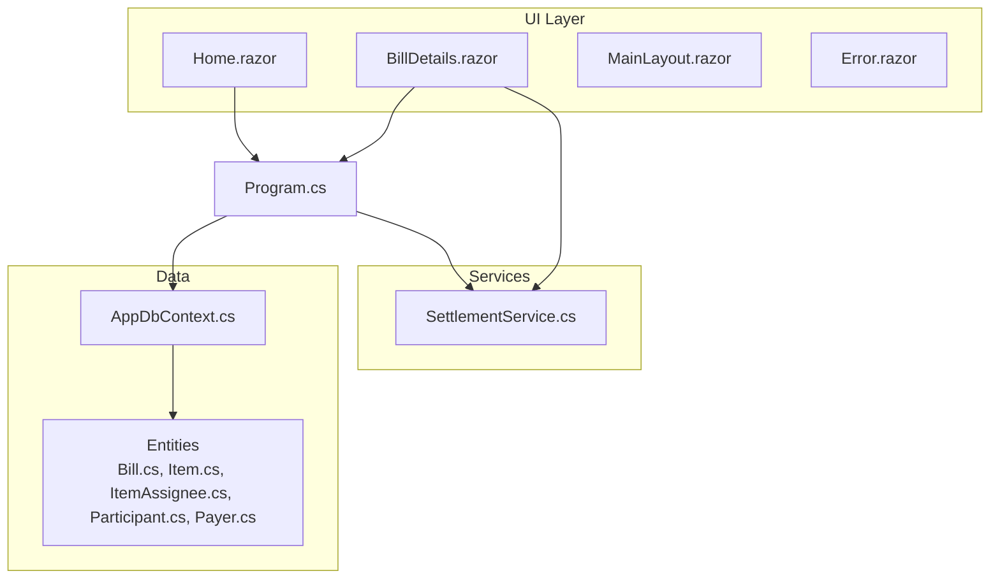
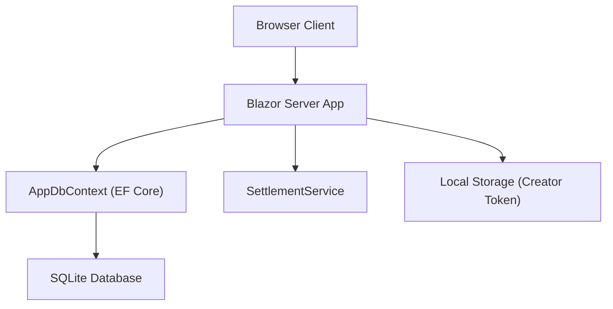
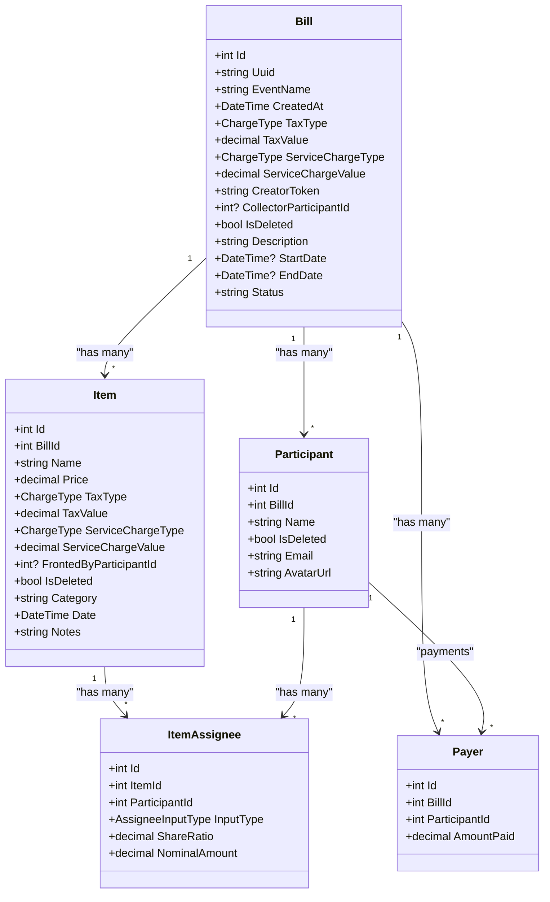
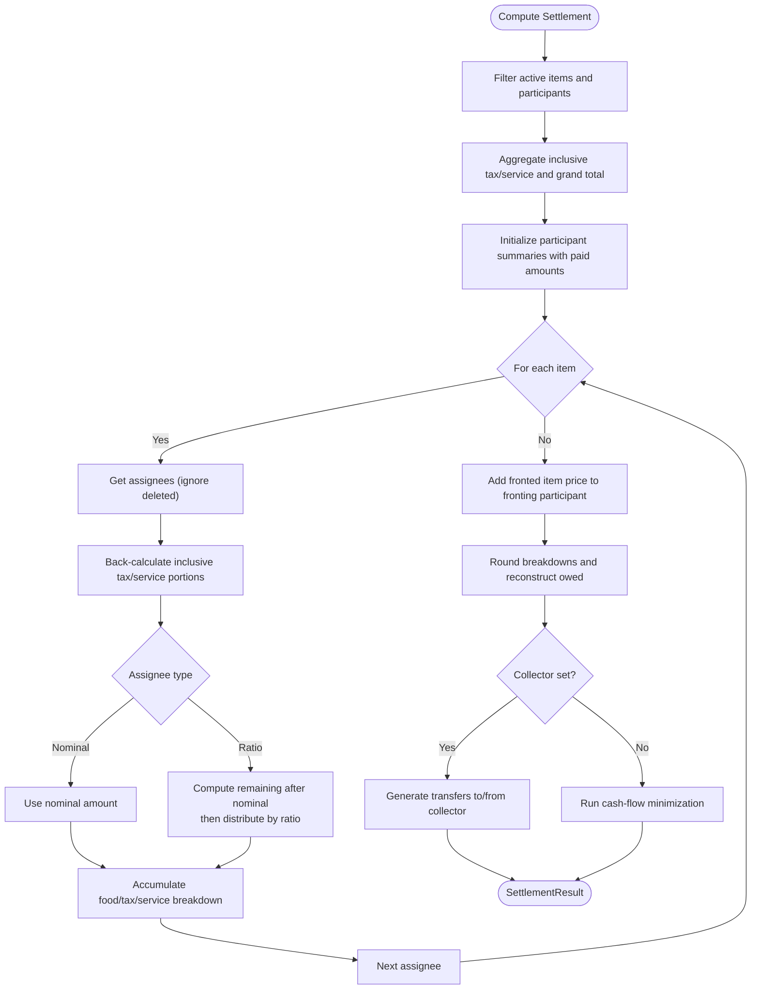
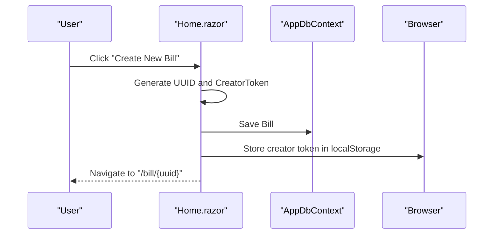
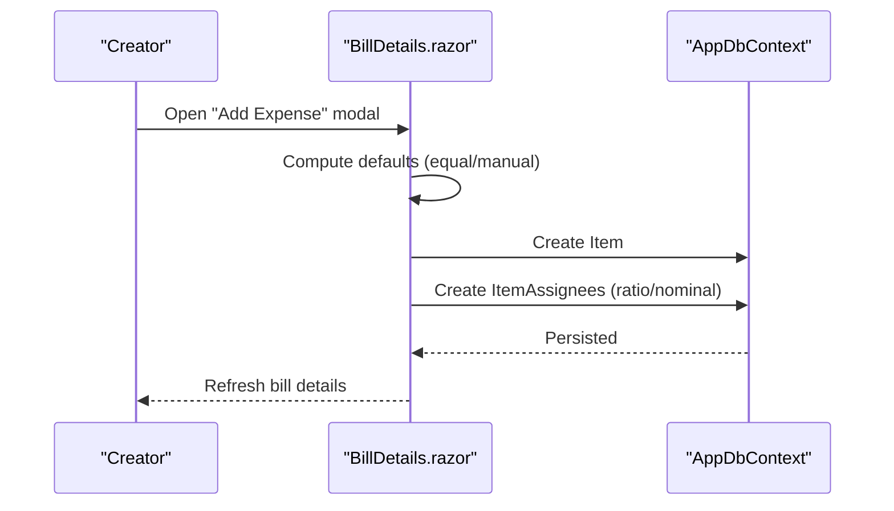
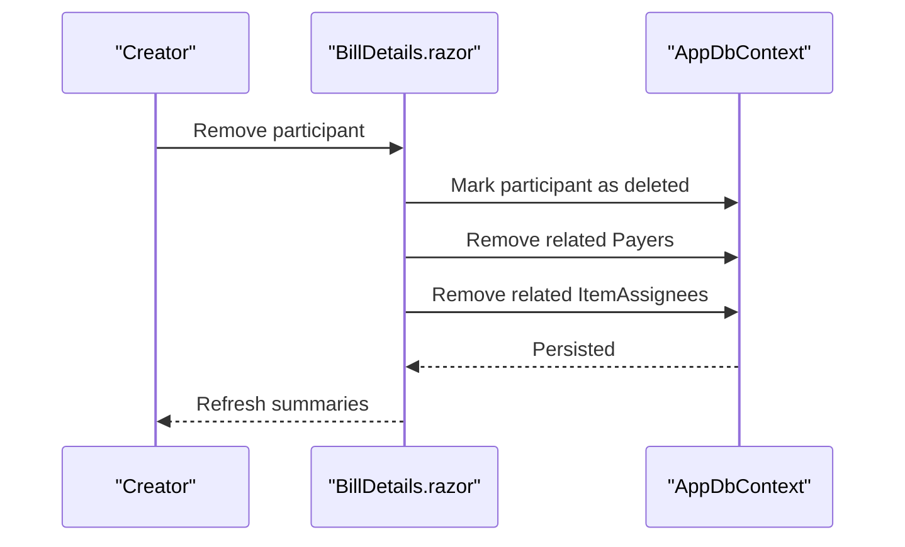
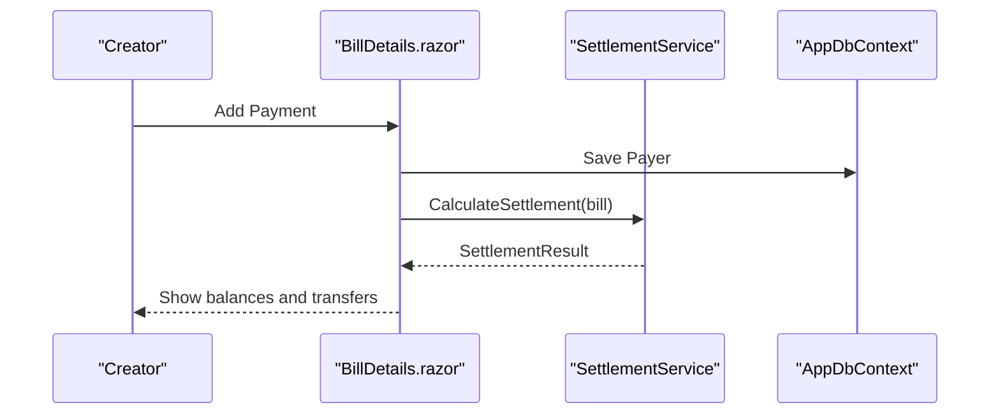
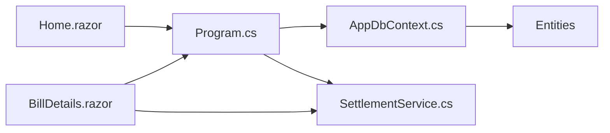

# Features and Functionality

<cite>
**Referenced Files in This Document**
- [Program.cs](file://Program.cs)
- [split_bill.csproj](file://split_bill.csproj)
- [plan.md](file://plan.md)
- [AppDbContext.cs](file://Data/AppDbContext.cs)
- [Bill.cs](file://Data/Entities/Bill.cs)
- [Item.cs](file://Data/Entities/Item.cs)
- [ItemAssignee.cs](file://Data/Entities/ItemAssignee.cs)
- [Participant.cs](file://Data/Entities/Participant.cs)
- [Payer.cs](file://Data/Entities/Payer.cs)
- [SettlementService.cs](file://Services/SettlementService.cs)
- [SettlementServiceTests.cs](file://split_bill.Tests/SettlementServiceTests.cs)
- [Home.razor](file://Components/Pages/Home.razor)
- [BillDetails.razor](file://Components/Pages/BillDetails.razor)
- [MainLayout.razor](file://Components/Layout/MainLayout.razor)
- [Error.razor](file://Components/Pages/Error.razor)
</cite>

## Table of Contents
1. [Introduction](#introduction)
2. [Project Structure](#project-structure)
3. [Core Components](#core-components)
4. [Architecture Overview](#architecture-overview)
5. [Detailed Component Analysis](#detailed-component-analysis)
6. [Dependency Analysis](#dependency-analysis)
7. [Performance Considerations](#performance-considerations)
8. [Troubleshooting Guide](#troubleshooting-guide)
9. [Conclusion](#conclusion)
10. [Appendices](#appendices)

## Introduction
SplitBill is a real-time collaborative web application for transparent and fair expense sharing. It enables users to record expenses, assign participants, configure tax and service charges, and compute settlement instructions that minimize cash flows. The system supports a “no-login” creator/visitor model using a per-session creator token stored in browser local storage. The backend is a .NET 10 Blazor Server app with Entity Framework Core and SQLite, and the frontend is a Blazor interactive server UI.

## Project Structure
High-level structure and responsibilities:
- Data layer: Entity models and database context with soft-deleted query filters and cascading deletes.
- Services: Settlement engine computing totals, balances, and transfer instructions.
- UI: Blazor Server pages for home, bill details, and shared layout/error pages.
- Application bootstrap: Program.cs configures DI, SQLite, and runtime behavior.
- Tests: Unit tests validating settlement calculations.

**Diagram sources**
- [Program.cs:1-73](file://Program.cs#L1-L73)
- [AppDbContext.cs:1-71](file://Data/AppDbContext.cs#L1-L71)
- [SettlementService.cs:1-314](file://Services/SettlementService.cs#L1-L314)
- [Home.razor:1-325](file://Components/Pages/Home.razor#L1-L325)
- [BillDetails.razor:1-1511](file://Components/Pages/BillDetails.razor#L1-L1511)
- [MainLayout.razor:1-12](file://Components/Layout/MainLayout.razor#L1-L12)
- [Error.razor:1-37](file://Components/Pages/Error.razor#L1-L37)

**Section sources**
- [Program.cs:1-73](file://Program.cs#L1-L73)
- [split_bill.csproj:1-34](file://split_bill.csproj#L1-L34)
- [plan.md:1-157](file://plan.md#L1-L157)

## Core Components
- Data models and relationships:
  - Bill aggregates Participants, Items, and Payers; supports event metadata and global tax/service settings.
  - Item records price and per-item tax/service overrides; links to assignees and fronting participant.
  - ItemAssignee defines how an item’s cost is split per participant (ratio or nominal).
  - Participant belongs to a Bill and participates in item splits and payments.
  - Payer records payments made by a participant toward the bill.
- Settlement engine:
  - Computes inclusive tax/service back-calculation, per-item shares, participant summaries, and transfer instructions.
  - Supports a collector role and fallback cash-flow minimization when no collector is set.
- UI:
  - Home page creates a new bill and stores a creator token in local storage.
  - BillDetails page displays and edits items, participants, and payments; computes and shows settlement results.

**Section sources**
- [AppDbContext.cs:18-70](file://Data/AppDbContext.cs#L18-L70)
- [Bill.cs:12-37](file://Data/Entities/Bill.cs#L12-L37)
- [Item.cs:5-27](file://Data/Entities/Item.cs#L5-L27)
- [ItemAssignee.cs:3-21](file://Data/Entities/ItemAssignee.cs#L3-L21)
- [Participant.cs:5-20](file://Data/Entities/Participant.cs#L5-L20)
- [Payer.cs:3-11](file://Data/Entities/Payer.cs#L3-L11)
- [SettlementService.cs:55-232](file://Services/SettlementService.cs#L55-L232)
- [Home.razor:257-288](file://Components/Pages/Home.razor#L257-L288)
- [BillDetails.razor:1090-1118](file://Components/Pages/BillDetails.razor#L1090-L1118)

## Architecture Overview
The system follows a layered architecture:
- Presentation: Blazor Server interactive server components render the UI and handle user interactions.
- Application: Controllers and pages orchestrate data retrieval, persistence, and settlement computations.
- Domain: SettlementService encapsulates the settlement algorithm and business rules.
- Persistence: AppDbContext manages entities and relationships with soft-delete filters.

**Diagram sources**
- [Program.cs:10-16](file://Program.cs#L10-L16)
- [AppDbContext.cs:6-16](file://Data/AppDbContext.cs#L6-L16)
- [SettlementService.cs:43-43](file://Services/SettlementService.cs#L43-L43)
- [Home.razor:281-287](file://Components/Pages/Home.razor#L281-L287)
- [BillDetails.razor:1070-1088](file://Components/Pages/BillDetails.razor#L1070-L1088)

## Detailed Component Analysis

### Data Model and Relationships
The data model enforces referential integrity and soft deletion. Cascading deletes ensure related entities are cleaned up when bills or items are deleted. Global query filters exclude soft-deleted entities from queries.

**Diagram sources**
- [AppDbContext.cs:18-70](file://Data/AppDbContext.cs#L18-L70)
- [Bill.cs:12-37](file://Data/Entities/Bill.cs#L12-L37)
- [Participant.cs:5-20](file://Data/Entities/Participant.cs#L5-L20)
- [Item.cs:5-27](file://Data/Entities/Item.cs#L5-L27)
- [ItemAssignee.cs:3-21](file://Data/Entities/ItemAssignee.cs#L3-L21)
- [Payer.cs:3-11](file://Data/Entities/Payer.cs#L3-L11)

**Section sources**
- [AppDbContext.cs:18-70](file://Data/AppDbContext.cs#L18-L70)
- [Bill.cs:12-37](file://Data/Entities/Bill.cs#L12-L37)
- [Item.cs:5-27](file://Data/Entities/Item.cs#L5-L27)
- [ItemAssignee.cs:3-21](file://Data/Entities/ItemAssignee.cs#L3-L21)
- [Participant.cs:5-20](file://Data/Entities/Participant.cs#L5-L20)
- [Payer.cs:3-11](file://Data/Entities/Payer.cs#L3-L11)

### Settlement Calculation Algorithm
The SettlementService computes:
- Back-calculated inclusive tax and service portions per item.
- Per-item share per assignee (ratio or nominal), with remaining amount distributed proportionally.
- Participant summaries with rounded breakdowns and balanced totals.
- Transfer instructions either via a designated collector or via a cash-flow minimization algorithm.

**Diagram sources**
- [SettlementService.cs:55-232](file://Services/SettlementService.cs#L55-L232)

**Section sources**
- [SettlementService.cs:55-232](file://Services/SettlementService.cs#L55-L232)

### User Workflows

#### 1) Bill Creation Workflow
- User lands on the home page and opens the modal to create a new bill.
- The system generates a UUID and a CreatorToken, persists the Bill, and stores the token in local storage.
- The user is navigated to the bill details page.

**Diagram sources**
- [Home.razor:257-288](file://Components/Pages/Home.razor#L257-L288)

**Section sources**
- [Home.razor:257-288](file://Components/Pages/Home.razor#L257-L288)

#### 2) Expense Recording Workflow
- Creator adds an expense with name, amount, category, date, and who paid.
- Participants are preselected; split mode can be equal or manual.
- Manual mode allows specifying nominal amounts per participant; remaining amount is split by ratio.
- Assignees are persisted along with the item.

**Diagram sources**
- [BillDetails.razor:1245-1285](file://Components/Pages/BillDetails.razor#L1245-L1285)

**Section sources**
- [BillDetails.razor:1245-1285](file://Components/Pages/BillDetails.razor#L1245-L1285)

#### 3) Participant Management Workflow
- Creator can add/remove participants.
- Removing a participant also removes their associated payer records and item assignees.

**Diagram sources**
- [BillDetails.razor:1402-1419](file://Components/Pages/BillDetails.razor#L1402-L1419)

**Section sources**
- [BillDetails.razor:1402-1419](file://Components/Pages/BillDetails.razor#L1402-L1419)

#### 4) Settlement Execution Workflow
- Creator records payments made by participants.
- SettlementService computes totals, balances, and transfer instructions.
- UI displays settlement summary and transfer steps.

**Diagram sources**
- [BillDetails.razor:1360-1376](file://Components/Pages/BillDetails.razor#L1360-L1376)
- [SettlementService.cs:55-232](file://Services/SettlementService.cs#L55-L232)

**Section sources**
- [BillDetails.razor:1360-1376](file://Components/Pages/BillDetails.razor#L1360-L1376)
- [SettlementService.cs:55-232](file://Services/SettlementService.cs#L55-L232)

### Mathematical Models and Business Rules

#### Fair Expense Distribution
- Each item’s price is split among assignees:
  - Nominal mode: assignee gets the specified nominal amount.
  - Ratio mode: remaining amount after nominal is split proportionally by share ratios.
- Tax and service are applied inclusively; SettlementService back-calculates base food cost and distributes tax/service proportionally to each assignee’s share.

#### Tax and Service Calculation Methodologies
- Inclusive back-calculation:
  - Percentage inclusive: portion = total × rate / (100 + rate)
  - Fixed inclusive: portion = min(fixed, total)
- Breakdown per participant is computed using the proportional share of the inclusive tax/service portions.

#### Payment Reconciliation
- Total paid is the sum of all Payer records.
- Payment difference = total paid − grand total.
- A warning threshold is triggered when the absolute difference is greater than or equal to 1.

#### Cash-Flow Minimization
- When no collector is set, the system runs a greedy algorithm:
  - Sort creditors and debtors by absolute balance.
  - Repeatedly transfer the minimum of debtor’s deficit and creditor’s surplus.
  - Rounds transfers to whole currency units.

**Section sources**
- [SettlementService.cs:234-306](file://Services/SettlementService.cs#L234-L306)
- [SettlementService.cs:55-232](file://Services/SettlementService.cs#L55-L232)

### Feature Configuration Options
- Bill-level tax/service:
  - Type: percentage or fixed.
  - Value: configurable per bill; overridden by item-level values when present.
- Item-level tax/service:
  - Optional per-item overrides for tax and service.
- Split modes:
  - Equal split (ratio mode).
  - Manual split (nominal mode).
- Collector role:
  - Optional participant who collects and redistributes funds; otherwise, minimization algorithm is used.

**Section sources**
- [Bill.cs:18-21](file://Data/Entities/Bill.cs#L18-L21)
- [Item.cs:11-14](file://Data/Entities/Item.cs#L11-L14)
- [ItemAssignee.cs:14-16](file://Data/Entities/ItemAssignee.cs#L14-L16)
- [BillDetails.razor:1180-1194](file://Components/Pages/BillDetails.razor#L1180-L1194)
- [SettlementService.cs:189-229](file://Services/SettlementService.cs#L189-L229)

### Edge Case Handling
- Soft deletion:
  - All entities support IsDeleted; query filters exclude deleted rows.
- Zero or missing ratios:
  - Ratio mode safely handles zero total ratios by distributing nothing.
- Rounded balances:
  - Breakdowns are rounded individually; final owed is reconstructed to preserve consistency.
- No participants:
  - Settlement returns empty summaries and transfers.
- Payment mismatch:
  - Payment difference is tracked; a warning flag indicates significant discrepancies.

**Section sources**
- [AppDbContext.cs:26-34](file://Data/AppDbContext.cs#L26-L34)
- [SettlementService.cs:172-184](file://Services/SettlementService.cs#L172-L184)
- [SettlementServiceTests.cs:19-51](file://split_bill.Tests/SettlementServiceTests.cs#L19-L51)

### Real-Time Collaboration and Data Consistency
- Creator/Visitor authorization:
  - Creator token stored in local storage; verified against the Bill record to grant editing capabilities.
- Real-time updates:
  - Blazor Server reactive state refreshes the UI after each mutation (add/remove items, participants, payments).
- Data consistency:
  - Soft delete filters prevent accidental exposure of deleted rows.
  - Cascading deletes maintain referential integrity when removing bills, items, or participants.

**Section sources**
- [Home.razor:281-287](file://Components/Pages/Home.razor#L281-L287)
- [BillDetails.razor:1070-1088](file://Components/Pages/BillDetails.razor#L1070-L1088)
- [AppDbContext.cs:26-34](file://Data/AppDbContext.cs#L26-L34)
- [AppDbContext.cs:49-51](file://Data/AppDbContext.cs#L49-L51)

## Dependency Analysis
- Program.cs registers:
  - DbContext with SQLite.
  - SettlementService as a scoped service.
  - Razor components and static assets.
- AppDbContext configures:
  - Unique index on Bill.Uuid.
  - Global query filters for soft deletes.
  - Cascade deletes for dependent entities.
- UI pages depend on:
  - AppDbContext for persistence.
  - SettlementService for settlement computations.
  - Local storage via JS interop for session authorization.

**Diagram sources**
- [Program.cs:13-16](file://Program.cs#L13-L16)
- [AppDbContext.cs:18-70](file://Data/AppDbContext.cs#L18-L70)
- [SettlementService.cs:43-43](file://Services/SettlementService.cs#L43-L43)
- [Home.razor:1-325](file://Components/Pages/Home.razor#L1-L325)
- [BillDetails.razor:1-1511](file://Components/Pages/BillDetails.razor#L1-L1511)

**Section sources**
- [Program.cs:13-16](file://Program.cs#L13-L16)
- [AppDbContext.cs:18-70](file://Data/AppDbContext.cs#L18-L70)

## Performance Considerations
- Query efficiency:
  - Use Include/ThenInclude to eagerly load related collections only when needed (e.g., bill details).
- Settlement computation:
  - Linear pass over items and assignees; complexity is acceptable for typical group sizes.
- Rounding strategy:
  - Rounds intermediate breakdowns; final owed reconstructed to avoid floating-point drift.
- Database:
  - SQLite is suitable for small to medium workloads; consider indexing strategies if scaling.

## Troubleshooting Guide
- Settlement warnings:
  - Payment difference warning indicates imbalance; reconcile payments or check item prices.
- Missing participants:
  - Ensure participants are not marked deleted; confirm assignees exist for items.
- Authorization issues:
  - Confirm creator token exists in local storage and matches the Bill record.
- UI not updating:
  - Trigger a refresh after mutations; ensure state changes propagate to the UI.

**Section sources**
- [SettlementService.cs:37-37](file://Services/SettlementService.cs#L37-L37)
- [BillDetails.razor:1090-1118](file://Components/Pages/BillDetails.razor#L1090-L1118)
- [Error.razor:1-37](file://Components/Pages/Error.razor#L1-L37)

## Conclusion
SplitBill provides a robust, real-time solution for fair expense sharing. Its modular design separates concerns between UI, domain logic, and persistence, enabling clear extension and maintenance. The settlement engine ensures mathematically sound distributions and minimal cash flows, while the creator/visitor model simplifies collaboration without requiring accounts.

## Appendices

### API and Data Model Reference

- Entities
  - Bill: identifiers, metadata, global tax/service settings, creator token, optional collector.
  - Item: price, inclusive tax/service, category/date/notes, fronting participant.
  - ItemAssignee: assignee input type (ratio/nominal), share ratio, nominal amount.
  - Participant: personal info, bill association.
  - Payer: participant payments toward the bill.

- Settlement Outputs
  - SettlementResult: totals, payment reconciliation, participant summaries, transfer instructions.

- UI Actions
  - Create bill: generate UUID and creator token, persist Bill, navigate to bill page.
  - Add expense: create Item and ItemAssignees; support equal/manual split.
  - Add/remove participant: manage participant lifecycle and related records.
  - Add payment: record Payer and recalculate settlement.

**Section sources**
- [Bill.cs:12-37](file://Data/Entities/Bill.cs#L12-L37)
- [Item.cs:5-27](file://Data/Entities/Item.cs#L5-L27)
- [ItemAssignee.cs:3-21](file://Data/Entities/ItemAssignee.cs#L3-L21)
- [Participant.cs:5-20](file://Data/Entities/Participant.cs#L5-L20)
- [Payer.cs:3-11](file://Data/Entities/Payer.cs#L3-L11)
- [SettlementService.cs:29-41](file://Services/SettlementService.cs#L29-L41)
- [Home.razor:257-288](file://Components/Pages/Home.razor#L257-L288)
- [BillDetails.razor:1245-1285](file://Components/Pages/BillDetails.razor#L1245-L1285)
- [BillDetails.razor:1360-1376](file://Components/Pages/BillDetails.razor#L1360-L1376)
- [BillDetails.razor:1402-1419](file://Components/Pages/BillDetails.razor#L1402-L1419)