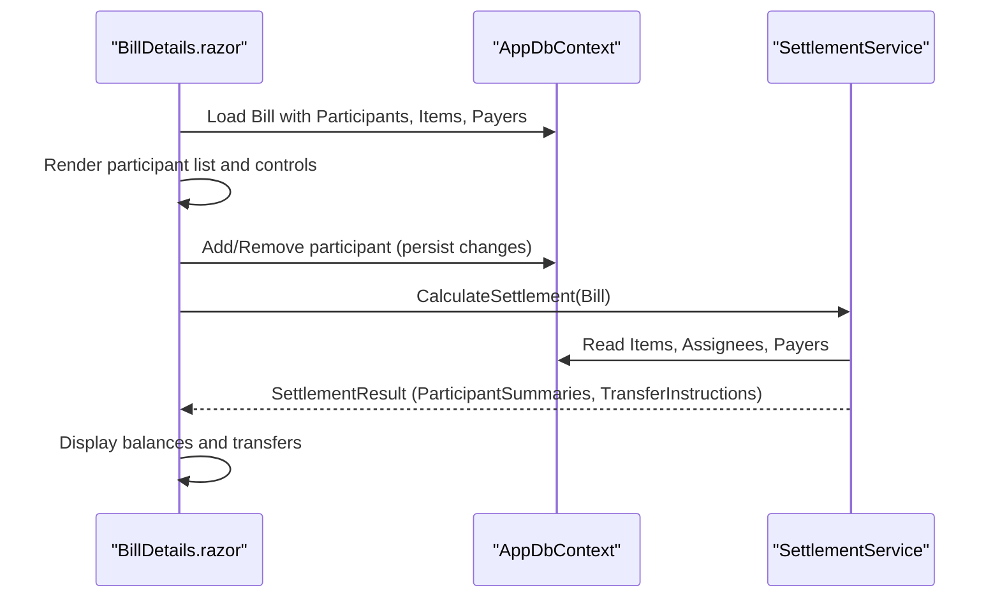
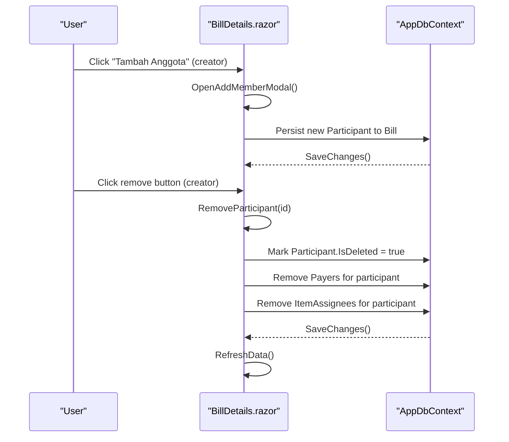
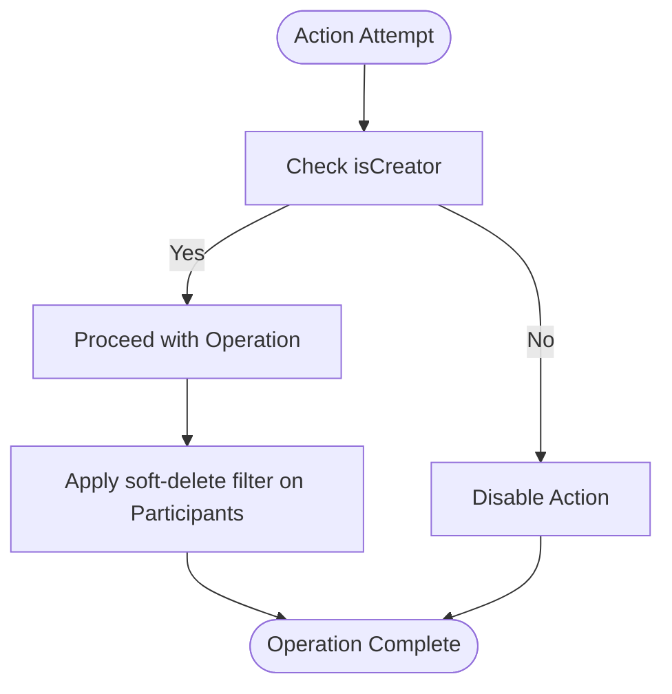
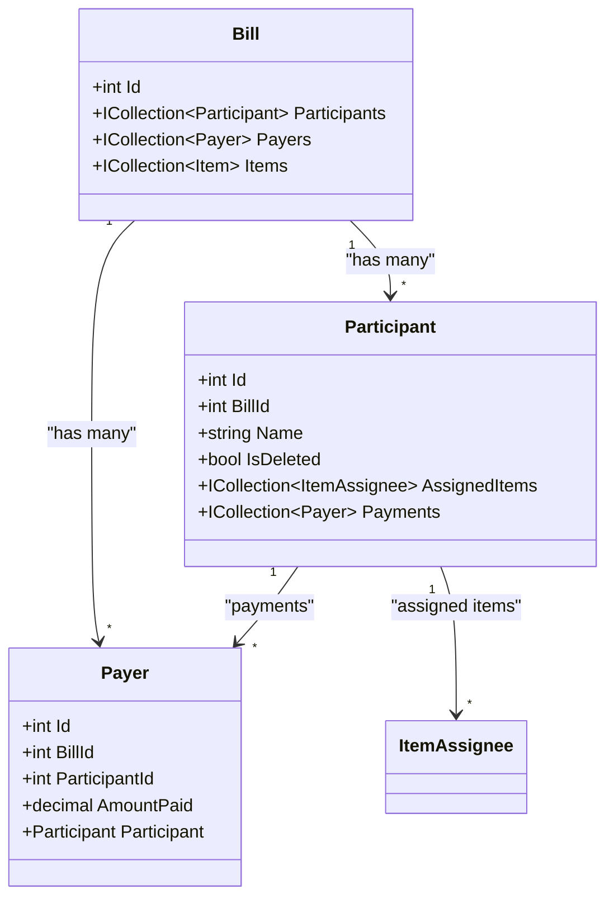
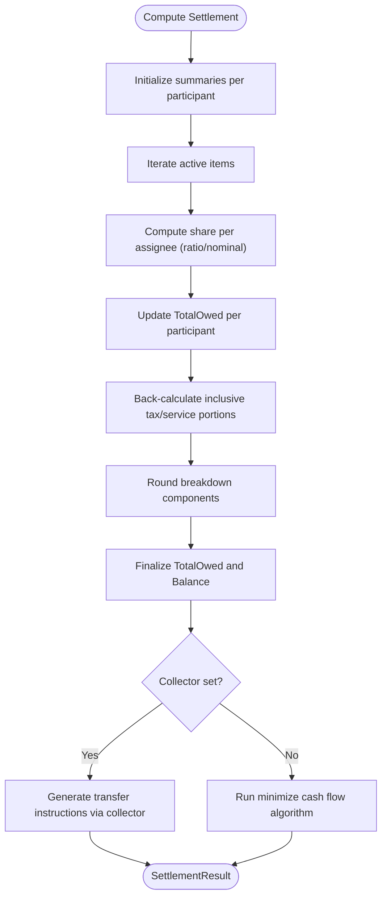
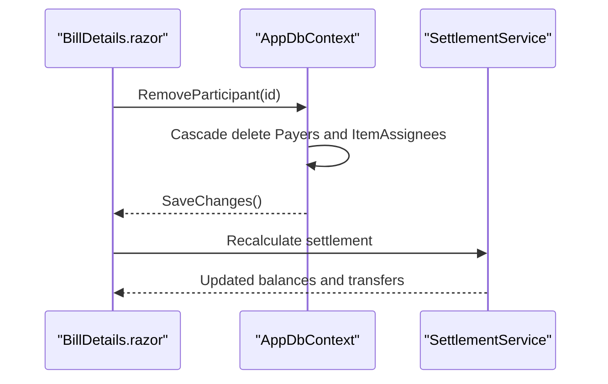
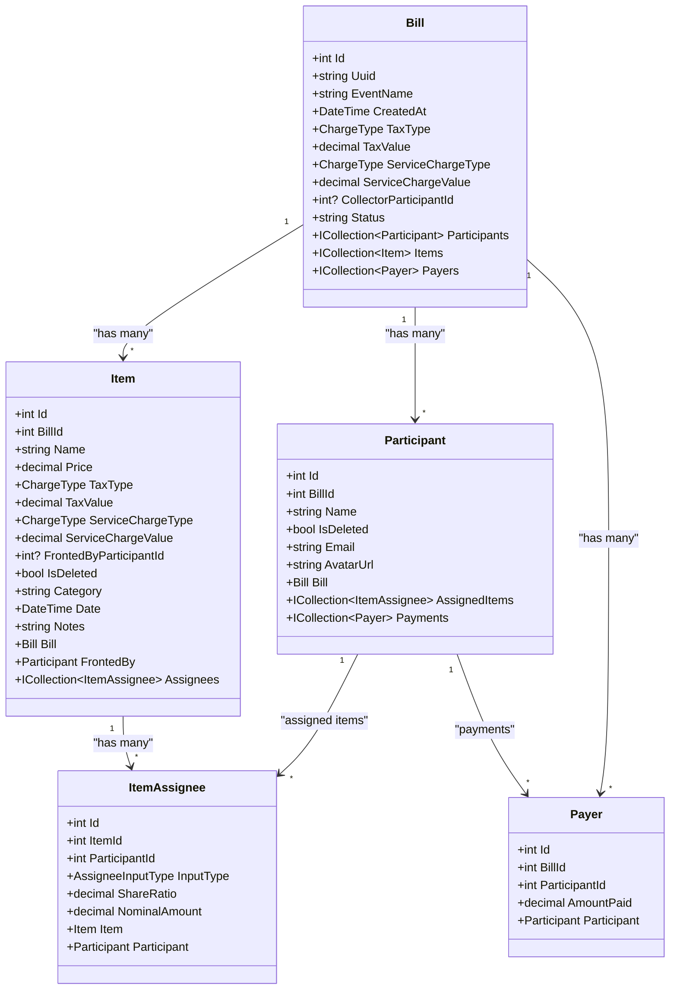

# Participant Management

<cite>
**Referenced Files in This Document**
- [Participant.cs](file://Data/Entities/Participant.cs)
- [Payer.cs](file://Data/Entities/Payer.cs)
- [Bill.cs](file://Data/Entities/Bill.cs)
- [Item.cs](file://Data/Entities/Item.cs)
- [ItemAssignee.cs](file://Data/Entities/ItemAssignee.cs)
- [AppDbContext.cs](file://Data/AppDbContext.cs)
- [SettlementService.cs](file://Services/SettlementService.cs)
- [BillDetails.razor](file://Components/Pages/BillDetails.razor)
- [SettlementServiceTests.cs](file://split_bill.Tests/SettlementServiceTests.cs)
</cite>

## Table of Contents
1. [Introduction](#introduction)
2. [Project Structure](#project-structure)
3. [Core Components](#core-components)
4. [Architecture Overview](#architecture-overview)
5. [Detailed Component Analysis](#detailed-component-analysis)
6. [Dependency Analysis](#dependency-analysis)
7. [Performance Considerations](#performance-considerations)
8. [Troubleshooting Guide](#troubleshooting-guide)
9. [Conclusion](#conclusion)

## Introduction
This document explains the participant management functionality in the application, focusing on how participants are added and removed, how roles and permissions influence actions, how contributions are tracked via Payer entities, and how participant balances are calculated and updated. It also covers the integration with settlement calculations, visibility controls, payment tracking per participant, and how participant changes affect existing expense distributions. The goal is to provide a clear understanding of the participant lifecycle and its impact on financial settlements.

## Project Structure
The participant management system spans several core areas:
- Data model entities define the domain: Bill, Participant, Item, ItemAssignee, and Payer.
- Entity relations are configured in the database context with cascading deletes.
- The settlement service computes balances and transfer instructions based on items, assignees, and payments.
- The UI page orchestrates participant actions (add/remove) and displays settlement outcomes.

```mermaid
graph TB
subgraph "Data Model"
B["Bill"]
P["Participant"]
I["Item"]
IA["ItemAssignee"]
PY["Payer"]
end
subgraph "Application"
DC["AppDbContext"]
SS["SettlementService"]
UI["BillDetails.razor"]
end
B <- --> P
B <- --> I
I <- --> IA
P <- --> IA
B <- --> PY
P <- --> PY
DC --> B
DC --> P
DC --> I
DC --> IA
DC --> PY
UI --> B
UI --> SS
SS --> B
```

**Diagram sources**
- [AppDbContext.cs:18-71](file://Data/AppDbContext.cs#L18-L71)
- [Bill.cs:34-36](file://Data/Entities/Bill.cs#L34-L36)
- [Participant.cs:16-19](file://Data/Entities/Participant.cs#L16-L19)
- [Item.cs:24-26](file://Data/Entities/Item.cs#L24-L26)
- [ItemAssignee.cs:18-21](file://Data/Entities/ItemAssignee.cs#L18-L21)
- [Payer.cs:10-11](file://Data/Entities/Payer.cs#L10-L11)
- [SettlementService.cs:55-232](file://Services/SettlementService.cs#L55-L232)
- [BillDetails.razor:1-200](file://Components/Pages/BillDetails.razor#L1-L200)

**Section sources**
- [AppDbContext.cs:18-71](file://Data/AppDbContext.cs#L18-L71)
- [Bill.cs:12-38](file://Data/Entities/Bill.cs#L12-L38)
- [Participant.cs:5-21](file://Data/Entities/Participant.cs#L5-L21)
- [Item.cs:5-28](file://Data/Entities/Item.cs#L5-L28)
- [ItemAssignee.cs:9-22](file://Data/Entities/ItemAssignee.cs#L9-L22)
- [Payer.cs:3-12](file://Data/Entities/Payer.cs#L3-L12)
- [SettlementService.cs:43-314](file://Services/SettlementService.cs#L43-L314)
- [BillDetails.razor:1-200](file://Components/Pages/BillDetails.razor#L1-L200)

## Core Components
- Participant: Represents a person participating in a bill. Includes identity, association to a bill, visibility flag, and navigation to assigned items and payments.
- ItemAssignee: Defines how an item's cost is attributed to participants, supporting either ratio-based or nominal attribution.
- Payer: Tracks payments made by participants toward the bill, linking payments to participants and bills.
- Bill: Aggregates participants, items, and payments; supports optional collector role and status metadata.
- AppDbContext: Configures entity relationships, cascade deletes, and soft-deletion filters.
- SettlementService: Computes participant balances, total owed/paid, and transfer instructions based on items, assignees, and payments.

Key responsibilities:
- Adding/removing participants is handled in the UI page and cascades to dependent records.
- Balances are computed by summing participant payments and distributing item costs among assignees.
- Settlement integrates with optional collector role and minimizes cash flow when no collector is set.

**Section sources**
- [Participant.cs:5-21](file://Data/Entities/Participant.cs#L5-L21)
- [ItemAssignee.cs:3-22](file://Data/Entities/ItemAssignee.cs#L3-L22)
- [Payer.cs:3-12](file://Data/Entities/Payer.cs#L3-L12)
- [Bill.cs:12-38](file://Data/Entities/Bill.cs#L12-L38)
- [AppDbContext.cs:18-71](file://Data/AppDbContext.cs#L18-L71)
- [SettlementService.cs:8-41](file://Services/SettlementService.cs#L8-L41)

## Architecture Overview
The participant management architecture centers around the Bill domain with Participants, Items, and Payments. The UI triggers participant lifecycle actions, while the settlement engine calculates balances and transfer instructions.



**Diagram sources**
- [BillDetails.razor:1-200](file://Components/Pages/BillDetails.razor#L1-L200)
- [AppDbContext.cs:18-71](file://Data/AppDbContext.cs#L18-L71)
- [SettlementService.cs:55-232](file://Services/SettlementService.cs#L55-L232)

## Detailed Component Analysis

### Participant Lifecycle: Add and Remove
- Add participant: Triggered by the creator in the UI; the page opens a modal to add members and persists the new participant to the bill.
- Remove participant: Only available to the creator; removes the participant and cascades to associated payments and item assignees. Soft deletion is applied to participant records, ensuring historical data remains intact for settlement computations.



**Diagram sources**
- [BillDetails.razor:732-741](file://Components/Pages/BillDetails.razor#L732-L741)
- [BillDetails.razor:1541-1558](file://Components/Pages/BillDetails.razor#L1541-L1558)
- [AppDbContext.cs:29-34](file://Data/AppDbContext.cs#L29-L34)
- [AppDbContext.cs:47-69](file://Data/AppDbContext.cs#L47-L69)

**Section sources**
- [BillDetails.razor:732-741](file://Components/Pages/BillDetails.razor#L732-L741)
- [BillDetails.razor:1541-1558](file://Components/Pages/BillDetails.razor#L1541-L1558)
- [AppDbContext.cs:29-34](file://Data/AppDbContext.cs#L29-L34)
- [AppDbContext.cs:47-69](file://Data/AppDbContext.cs#L47-L69)

### Role Assignments and Permission Management
- Creator role: Only the creator can add or remove participants and manage expenses. This is enforced in the UI by checking a creator flag before enabling actions.
- Visibility: Participants are filtered using a query filter that excludes deleted participants from queries, ensuring visibility controls align with soft deletion semantics.



**Diagram sources**
- [BillDetails.razor:138-147](file://Components/Pages/BillDetails.razor#L138-L147)
- [AppDbContext.cs:29-34](file://Data/AppDbContext.cs#L29-L34)

**Section sources**
- [BillDetails.razor:138-147](file://Components/Pages/BillDetails.razor#L138-L147)
- [AppDbContext.cs:29-34](file://Data/AppDbContext.cs#L29-L34)

### Contribution Tracking via Payer Entities
- Payments are recorded as Payer entries linked to a participant and a bill. Each participant’s total paid is derived from their Payer records.
- Removal of a participant also removes their associated Payer records, preventing orphaned payment data.



**Diagram sources**
- [Bill.cs:34-36](file://Data/Entities/Bill.cs#L34-L36)
- [Participant.cs:16-19](file://Data/Entities/Participant.cs#L16-L19)
- [Payer.cs:3-12](file://Data/Entities/Payer.cs#L3-L12)

**Section sources**
- [Payer.cs:3-12](file://Data/Entities/Payer.cs#L3-L12)
- [BillDetails.razor:1511-1515](file://Components/Pages/BillDetails.razor#L1511-L1515)
- [BillDetails.razor:1517-1527](file://Components/Pages/BillDetails.razor#L1517-L1527)

### Balance Calculation and Settlement Integration
- Participant balances are computed by:
  - Summing total paid from Payer records for each participant.
  - Distributing item prices among assignees (ratio or nominal) and computing totals owed.
  - Applying inclusive tax and service charge breakdowns per item and participant.
  - Rounding and finalizing balances as paid minus owed.
- Optional collector role: If a collector is designated, transfer instructions route through the collector; otherwise, a greedy minimization algorithm determines peer-to-peer transfers.



**Diagram sources**
- [SettlementService.cs:55-232](file://Services/SettlementService.cs#L55-L232)
- [SettlementService.cs:261-306](file://Services/SettlementService.cs#L261-L306)

**Section sources**
- [SettlementService.cs:55-232](file://Services/SettlementService.cs#L55-L232)
- [SettlementService.cs:261-306](file://Services/SettlementService.cs#L261-L306)

### Impact of Participant Changes on Expense Distributions
- Removing a participant removes their ItemAssignee records and Payer records, ensuring no dangling allocations remain after deletion.
- Settlement recalculations exclude deleted participants, maintaining accurate balances and transfer instructions.



**Diagram sources**
- [BillDetails.razor:1541-1558](file://Components/Pages/BillDetails.razor#L1541-L1558)
- [AppDbContext.cs:47-69](file://Data/AppDbContext.cs#L47-L69)
- [SettlementService.cs:55-232](file://Services/SettlementService.cs#L55-L232)

**Section sources**
- [BillDetails.razor:1541-1558](file://Components/Pages/BillDetails.razor#L1541-L1558)
- [AppDbContext.cs:47-69](file://Data/AppDbContext.cs#L47-L69)
- [SettlementService.cs:55-232](file://Services/SettlementService.cs#L55-L232)

### Example Scenarios
- Scenario 1: Adding a participant
  - Creator clicks “Add Member,” enters details, and saves. The participant appears in the participant list and participates in future distributions.
  - Source: [BillDetails.razor:732-741](file://Components/Pages/BillDetails.razor#L732-L741)
- Scenario 2: Removing a participant with existing payments and item shares
  - Creator removes a participant; the system deletes associated Payers and ItemAssignees, then recalculates balances and transfers.
  - Source: [BillDetails.razor:1541-1558](file://Components/Pages/BillDetails.razor#L1541-L1558)
- Scenario 3: Settlement computation with ratios and nominal shares
  - Items are distributed among assignees using ratio or nominal amounts; inclusive tax and service charges are broken down proportionally.
  - Source: [SettlementService.cs:100-158](file://Services/SettlementService.cs#L100-L158)

**Section sources**
- [BillDetails.razor:732-741](file://Components/Pages/BillDetails.razor#L732-L741)
- [BillDetails.razor:1541-1558](file://Components/Pages/BillDetails.razor#L1541-L1558)
- [SettlementService.cs:100-158](file://Services/SettlementService.cs#L100-L158)

## Dependency Analysis
The following diagram shows how entities depend on each other and how the settlement service consumes them.



**Diagram sources**
- [Bill.cs:12-38](file://Data/Entities/Bill.cs#L12-L38)
- [Participant.cs:5-21](file://Data/Entities/Participant.cs#L5-L21)
- [Item.cs:5-28](file://Data/Entities/Item.cs#L5-L28)
- [ItemAssignee.cs:9-22](file://Data/Entities/ItemAssignee.cs#L9-L22)
- [Payer.cs:3-12](file://Data/Entities/Payer.cs#L3-L12)

**Section sources**
- [AppDbContext.cs:18-71](file://Data/AppDbContext.cs#L18-L71)
- [Bill.cs:12-38](file://Data/Entities/Bill.cs#L12-L38)
- [Participant.cs:5-21](file://Data/Entities/Participant.cs#L5-L21)
- [Item.cs:5-28](file://Data/Entities/Item.cs#L5-L28)
- [ItemAssignee.cs:9-22](file://Data/Entities/ItemAssignee.cs#L9-L22)
- [Payer.cs:3-12](file://Data/Entities/Payer.cs#L3-L12)

## Performance Considerations
- Cascading deletes reduce orphaned data and simplify cleanup during participant removal.
- Settlement computations iterate over active items and participants; ensure filtering by IsDeleted avoids unnecessary work.
- Rounding is applied to breakdown components and final totals to maintain UI consistency and avoid floating-point drift.
- Minimizing cash flow reduces transaction count when no collector is set, improving clarity and reducing overhead.

[No sources needed since this section provides general guidance]

## Troubleshooting Guide
Common issues and resolutions:
- Participant not visible after creation: Verify the participant is not marked deleted and that the query filter is applied consistently.
  - Source: [AppDbContext.cs:29-34](file://Data/AppDbContext.cs#L29-L34)
- Participant removal did not delete payments or shares: Confirm cascade delete behavior and that the removal method targets Payers and ItemAssignees for the participant.
  - Source: [BillDetails.razor:1541-1558](file://Components/Pages/BillDetails.razor#L1541-L1558)
  - Source: [AppDbContext.cs:47-69](file://Data/AppDbContext.cs#L47-L69)
- Balances inconsistent after changes: Recompute settlement to reflect the latest participant and payment updates.
  - Source: [SettlementService.cs:55-232](file://Services/SettlementService.cs#L55-L232)
- Tests validating settlement behavior: Review unit tests to confirm expected rounding and distribution logic.
  - Source: [SettlementServiceTests.cs:19-89](file://split_bill.Tests/SettlementServiceTests.cs#L19-L89)

**Section sources**
- [AppDbContext.cs:29-34](file://Data/AppDbContext.cs#L29-L34)
- [BillDetails.razor:1541-1558](file://Components/Pages/BillDetails.razor#L1541-L1558)
- [AppDbContext.cs:47-69](file://Data/AppDbContext.cs#L47-L69)
- [SettlementService.cs:55-232](file://Services/SettlementService.cs#L55-L232)
- [SettlementServiceTests.cs:19-89](file://split_bill.Tests/SettlementServiceTests.cs#L19-L89)

## Conclusion
Participant management in this system is centered on robust entity relationships, soft deletion for visibility control, and comprehensive settlement computation. Creators can add and remove participants safely, with cascading cleanup of related payments and item shares. Settlement calculations accurately distribute item costs and inclusive charges, compute balances, and produce clear transfer instructions—either via a designated collector or through a minimized cash flow algorithm. These mechanisms ensure data consistency and transparency across participant changes and expense distributions.