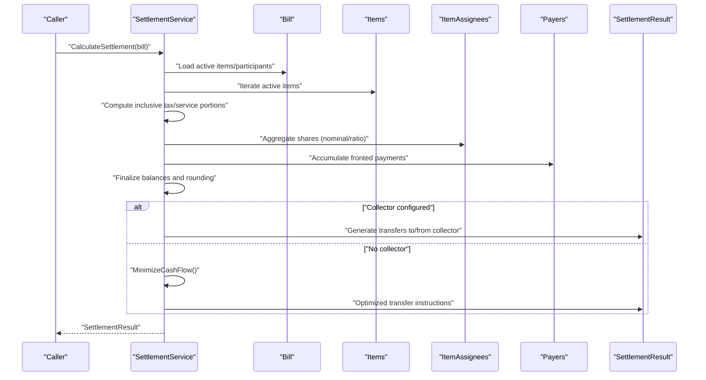
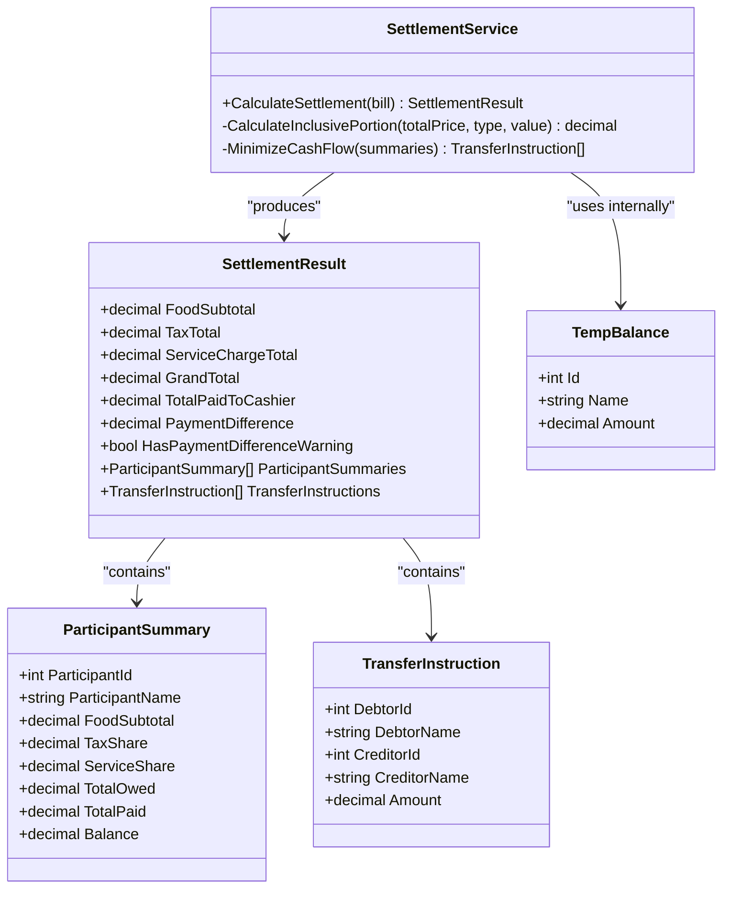
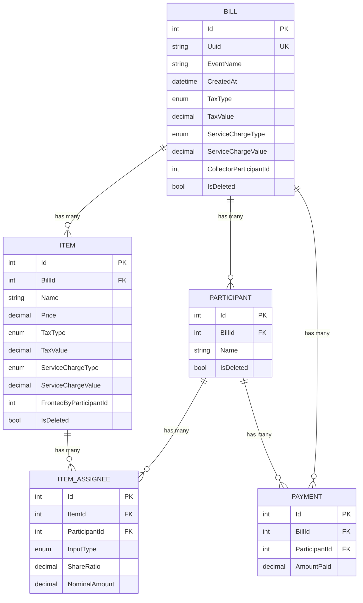
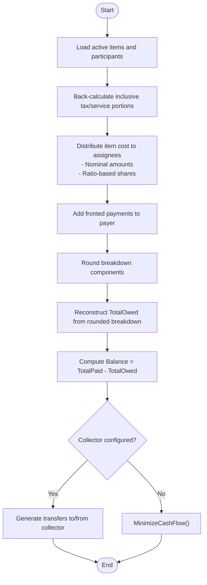
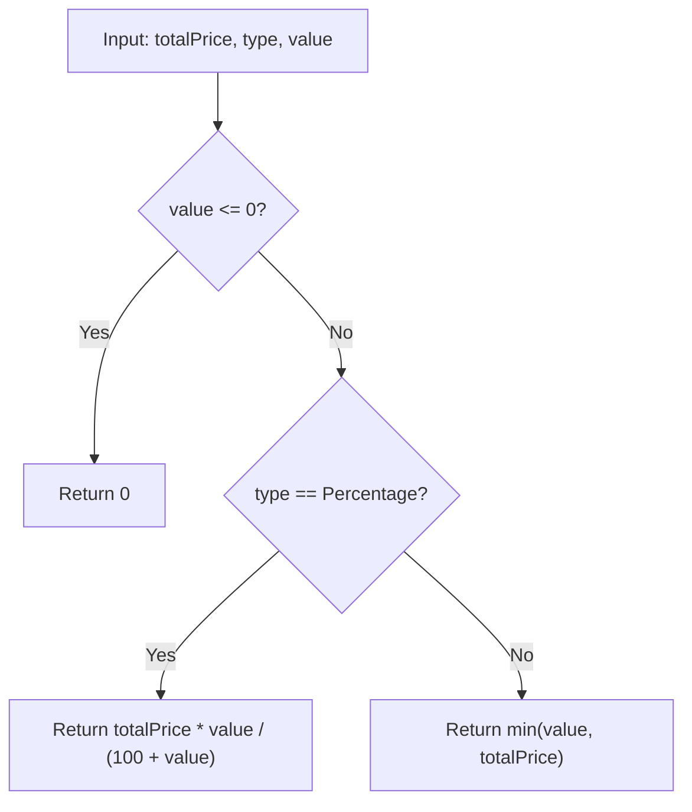
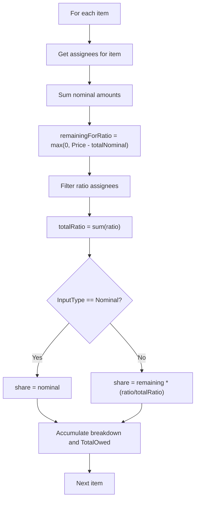
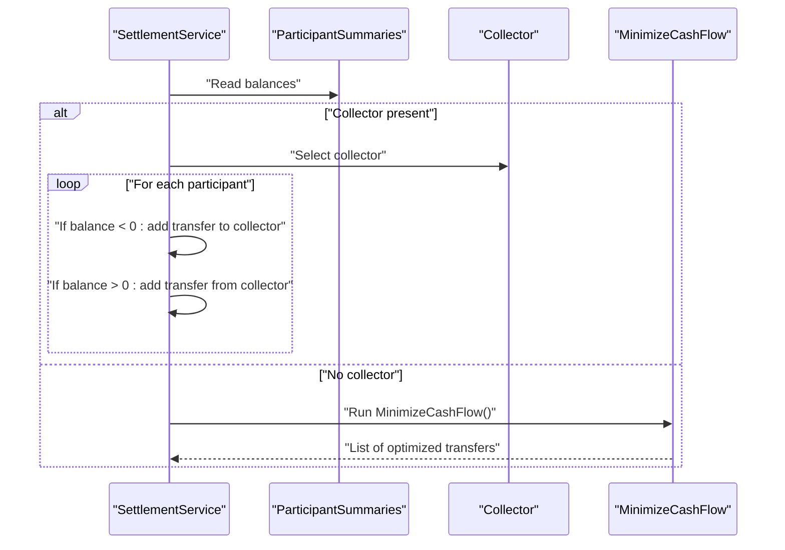
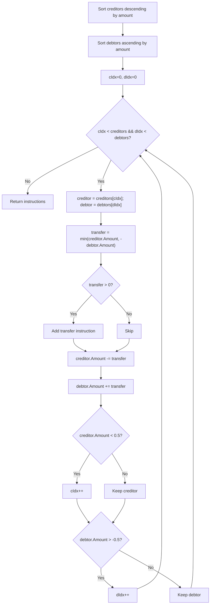

# Settlement Calculation

<cite>
**Referenced Files in This Document**
- [SettlementService.cs](file://Services/SettlementService.cs)
- [Bill.cs](file://Data/Entities/Bill.cs)
- [Participant.cs](file://Data/Entities/Participant.cs)
- [Item.cs](file://Data/Entities/Item.cs)
- [ItemAssignee.cs](file://Data/Entities/ItemAssignee.cs)
- [Payer.cs](file://Data/Entities/Payer.cs)
- [AppDbContext.cs](file://Data/AppDbContext.cs)
- [SettlementServiceTests.cs](file://split_bill.Tests/SettlementServiceTests.cs)
- [Program.cs](file://Program.cs)
</cite>

## Table of Contents
1. [Introduction](#introduction)
2. [Project Structure](#project-structure)
3. [Core Components](#core-components)
4. [Architecture Overview](#architecture-overview)
5. [Detailed Component Analysis](#detailed-component-analysis)
6. [Dependency Analysis](#dependency-analysis)
7. [Performance Considerations](#performance-considerations)
8. [Troubleshooting Guide](#troubleshooting-guide)
9. [Conclusion](#conclusion)
10. [Appendices](#appendices)

## Introduction
This document explains the settlement calculation system used to fairly distribute expenses among participants in shared bills. It covers:
- Mathematical algorithms for computing individual shares, taxes, and service charges
- Transfer optimization to minimize the number of payment transactions
- Balance reconciliation and payment difference reporting
- The service architecture and data model integration
- Edge cases, precision handling, and integration with payment tracking

The system computes participant balances based on items purchased, their proportional shares, and who paid for what. It then generates transfer instructions to settle balances, either via a designated collector or through a cash-flow-minimizing algorithm.

## Project Structure
The settlement logic resides in a dedicated service that operates on domain entities representing bills, items, participants, and payers. The service integrates with an Entity Framework context for persistence and is registered as a scoped service in the application.

```mermaid
graph TB
subgraph "Domain Entities"
Bill["Bill"]
Item["Item"]
ItemAssignee["ItemAssignee"]
Participant["Participant"]
Payer["Payer"]
end
subgraph "Service Layer"
SettlementService["SettlementService"]
end
subgraph "Infrastructure"
AppDbContext["AppDbContext"]
end
Bill < --> Item
Bill < --> Participant
Bill < --> Payer
Item < --> ItemAssignee
ItemAssignee --> Participant
Payer --> Participant
SettlementService --> Bill
SettlementService --> Item
SettlementService --> ItemAssignee
SettlementService --> Participant
SettlementService --> Payer
AppDbContext --> Bill
AppDbContext --> Item
AppDbContext --> ItemAssignee
AppDbContext --> Participant
AppDbContext --> Payer
```

**Diagram sources**
- [AppDbContext.cs:12-16](file://Data/AppDbContext.cs#L12-L16)
- [Bill.cs:34-36](file://Data/Entities/Bill.cs#L34-L36)
- [Item.cs:24-26](file://Data/Entities/Item.cs#L24-L26)
- [ItemAssignee.cs:18-21](file://Data/Entities/ItemAssignee.cs#L18-L21)
- [Participant.cs:16-19](file://Data/Entities/Participant.cs#L16-L19)
- [Payer.cs:10-12](file://Data/Entities/Payer.cs#L10-L12)
- [SettlementService.cs:55-232](file://Services/SettlementService.cs#L55-L232)

**Section sources**
- [Program.cs:16](file://Program.cs#L16)
- [AppDbContext.cs:12-70](file://Data/AppDbContext.cs#L12-L70)

## Core Components
- SettlementService: Computes participant balances and transfer instructions from bill data.
- Domain entities: Bill, Item, ItemAssignee, Participant, Payer define the data model.
- AppDbContext: Configures entity relations and query filters.

Key responsibilities:
- Parse bill-level and item-level tax/service charges (percentage or fixed)
- Compute each participant’s owed amount from item shares (nominal or ratio)
- Account for who paid for items (fronted payments)
- Produce participant summaries and transfer instructions
- Minimize cash flow when no collector is designated

**Section sources**
- [SettlementService.cs:43-314](file://Services/SettlementService.cs#L43-L314)
- [Bill.cs:12-37](file://Data/Entities/Bill.cs#L12-L37)
- [Item.cs:5-27](file://Data/Entities/Item.cs#L5-L27)
- [ItemAssignee.cs:9-21](file://Data/Entities/ItemAssignee.cs#L9-L21)
- [Participant.cs:5-20](file://Data/Entities/Participant.cs#L5-L20)
- [Payer.cs:3-12](file://Data/Entities/Payer.cs#L3-L12)

## Architecture Overview
The settlement process is a pure calculation pipeline that transforms bill data into settlement results. It does not mutate persistent state; instead, it produces summaries and transfer instructions that can be persisted or presented to users.



**Diagram sources**
- [SettlementService.cs:55-232](file://Services/SettlementService.cs#L55-L232)
- [Bill.cs:34-36](file://Data/Entities/Bill.cs#L34-L36)
- [Item.cs:24-26](file://Data/Entities/Item.cs#L24-L26)
- [ItemAssignee.cs:18-21](file://Data/Entities/ItemAssignee.cs#L18-L21)
- [Payer.cs:10-12](file://Data/Entities/Payer.cs#L10-L12)

## Detailed Component Analysis

### SettlementService
The service orchestrates the settlement computation and returns a SettlementResult containing:
- Financial breakdown totals
- Per-participant summaries
- Transfer instructions

Core algorithms:
- Inclusive portion calculation for tax/service
- Proportional sharing (nominal vs ratio)
- Balance reconciliation and rounding
- Cash flow minimization



**Diagram sources**
- [SettlementService.cs:29-41](file://Services/SettlementService.cs#L29-L41)
- [SettlementService.cs:8-18](file://Services/SettlementService.cs#L8-L18)
- [SettlementService.cs:20-27](file://Services/SettlementService.cs#L20-L27)
- [SettlementService.cs:308-313](file://Services/SettlementService.cs#L308-L313)

**Section sources**
- [SettlementService.cs:55-232](file://Services/SettlementService.cs#L55-L232)
- [SettlementService.cs:243-259](file://Services/SettlementService.cs#L243-L259)
- [SettlementService.cs:261-306](file://Services/SettlementService.cs#L261-L306)

### Data Model and Relationships
The domain model defines how bills, items, participants, and payments relate to each other. The service relies on these relationships to compute balances and transfers.



**Diagram sources**
- [Bill.cs:12-37](file://Data/Entities/Bill.cs#L12-L37)
- [Item.cs:5-27](file://Data/Entities/Item.cs#L5-L27)
- [Participant.cs:5-20](file://Data/Entities/Participant.cs#L5-L20)
- [Payer.cs:3-12](file://Data/Entities/Payer.cs#L3-L12)
- [ItemAssignee.cs:9-21](file://Data/Entities/ItemAssignee.cs#L9-L21)
- [AppDbContext.cs:35-69](file://Data/AppDbContext.cs#L35-L69)

**Section sources**
- [AppDbContext.cs:18-70](file://Data/AppDbContext.cs#L18-L70)

### Calculation Workflow
The settlement workflow proceeds in several stages:

1. Initialize totals and participant summaries
2. Compute inclusive tax/service portions per item
3. Distribute item costs to assignees (nominal or ratio)
4. Account for fronted payments
5. Finalize balances and rounding
6. Generate transfer instructions (via collector or minimized cash flow)



**Diagram sources**
- [SettlementService.cs:55-232](file://Services/SettlementService.cs#L55-L232)
- [SettlementService.cs:261-306](file://Services/SettlementService.cs#L261-L306)

**Section sources**
- [SettlementService.cs:55-232](file://Services/SettlementService.cs#L55-L232)

### Inclusive Portion Calculation
The system supports two inclusive charge types:
- Percentage inclusive: tax/service computed as a percentage of the total price
- Fixed inclusive: a fixed amount subtracted from the total price

The calculation reverses the inclusive pricing to isolate tax/service portions from the total price.



**Diagram sources**
- [SettlementService.cs:243-259](file://Services/SettlementService.cs#L243-L259)

**Section sources**
- [SettlementService.cs:243-259](file://Services/SettlementService.cs#L243-L259)

### Share Distribution (Nominal vs Ratio)
Each item’s cost is distributed among assignees:
- Nominal input: assignee receives the specified nominal amount
- Ratio input: remaining amount is split proportionally by share ratios



**Diagram sources**
- [SettlementService.cs:103-158](file://Services/SettlementService.cs#L103-L158)

**Section sources**
- [SettlementService.cs:103-158](file://Services/SettlementService.cs#L103-L158)

### Balance Reconciliation and Rounding
- Breakdown components are rounded to whole units
- TotalOwed is reconstructed from rounded breakdown to preserve consistency
- Balance equals TotalPaid minus TotalOwed

Precision handling ensures UI displays remain coherent.

**Section sources**
- [SettlementService.cs:171-184](file://Services/SettlementService.cs#L171-L184)

### Transfer Instructions Generation
There are two modes:
- Collector mode: All transfers go to/from a designated collector
- Cash flow minimization: Optimal pairwise transfers to settle balances



**Diagram sources**
- [SettlementService.cs:188-229](file://Services/SettlementService.cs#L188-L229)
- [SettlementService.cs:261-306](file://Services/SettlementService.cs#L261-L306)

**Section sources**
- [SettlementService.cs:188-229](file://Services/SettlementService.cs#L188-L229)
- [SettlementService.cs:261-306](file://Services/SettlementService.cs#L261-L306)

### Cash Flow Minimization Algorithm
The algorithm:
- Partitions participants into creditors (positive balance) and debtors (negative balance)
- Uses two pointers to pair largest creditor with largest debtor
- Transfers the minimum of their absolute balances
- Rounds transfers to whole units and continues until balanced



**Diagram sources**
- [SettlementService.cs:261-306](file://Services/SettlementService.cs#L261-L306)

**Section sources**
- [SettlementService.cs:261-306](file://Services/SettlementService.cs#L261-L306)

### Payment Difference and Warning
The system reports a payment difference equal to total paid minus grand total. A warning flag indicates significant discrepancies (threshold ≥ 1).

**Section sources**
- [SettlementService.cs:83-84](file://Services/SettlementService.cs#L83-L84)
- [SettlementService.cs:37](file://Services/SettlementService.cs#L37)

## Dependency Analysis
- SettlementService depends on domain entities and their navigation properties
- AppDbContext configures cascading deletes and query filters for soft-deleted records
- The service is registered as a scoped dependency in Program.cs


**Diagram sources**
- [Program.cs:16](file://Program.cs#L16)
- [SettlementService.cs:55-232](file://Services/SettlementService.cs#L55-L232)
- [AppDbContext.cs:12-16](file://Data/AppDbContext.cs#L12-L16)

**Section sources**
- [Program.cs:16](file://Program.cs#L16)
- [AppDbContext.cs:18-70](file://Data/AppDbContext.cs#L18-L70)

## Performance Considerations
- Complexity: O(N_items + N_participants + N_assignees) for the main computation
- Memory: Linear in the number of active items and participants
- Rounding: Applied once per participant summary to reduce floating-point drift
- Minimization: Two-pointer technique yields O(C + D) transfers where C and D are counts of creditors and debtors

[No sources needed since this section provides general guidance]

## Troubleshooting Guide
Common issues and resolutions:
- No participants: Returns empty summaries and transfers; verify participant inclusion
- Zero or negative tax/service values: Inclusive portion calculation defaults to zero
- Mixed input types: Ensure nominal and ratio inputs are consistent per item
- Precision differences: Rounded balances reconstruct TotalOwed; minor discrepancies are expected
- Payment difference warnings: Investigate mismatch between total paid and grand total

Validation examples are covered in tests.

**Section sources**
- [SettlementServiceTests.cs:19-51](file://split_bill.Tests/SettlementServiceTests.cs#L19-L51)
- [SettlementServiceTests.cs:53-157](file://split_bill.Tests/SettlementServiceTests.cs#L53-L157)

## Conclusion
The settlement calculation system provides a robust, mathematically sound approach to distributing shared expenses. It handles inclusive taxes and service charges, supports flexible share allocation (nominal and ratio), reconciles balances precisely, and optimizes transfer sequences to minimize transaction overhead. The design cleanly separates calculation from persistence, enabling straightforward integration with payment tracking systems.

[No sources needed since this section summarizes without analyzing specific files]

## Appendices

### Example Scenarios

- Scenario A: Equal splits with mixed charges
  - Three participants share items with a percentage tax and a fixed service charge
  - Alice pays for all items; Bob and Charlie receive equal transfers to settle balances
  - See assertions for breakdowns and transfer amounts

  **Section sources**
  - [SettlementServiceTests.cs:53-157](file://split_bill.Tests/SettlementServiceTests.cs#L53-L157)

- Scenario B: Unequal nominal shares
  - One participant pays a larger nominal amount for an item; others split the remainder
  - Balances reflect exact nominal allocations plus proportional shares

  **Section sources**
  - [SettlementService.cs:138-148](file://Services/SettlementService.cs#L138-L148)

- Scenario C: Fronted payments
  - A participant fronts an item; their TotalPaid increases accordingly
  - Their balance reflects both their own shares and the fronted amount

  **Section sources**
  - [SettlementService.cs:161-169](file://Services/SettlementService.cs#L161-L169)

- Scenario D: Cash flow minimization without collector
  - When no collector is set, the algorithm pairs largest creditors and debtors
  - Results in fewer transfers than collector-based routing

  **Section sources**
  - [SettlementService.cs:228](file://Services/SettlementService.cs#L228)
  - [SettlementService.cs:261-306](file://Services/SettlementService.cs#L261-L306)

### Edge Cases
- No participants: Empty result with payment difference warning
- Deleted entities: Soft-deleted records are excluded from calculations
- Zero/negative inclusive values: Inclusive portion treated as zero
- Rounding thresholds: Balances are rounded to whole units; minimal drift preserved

**Section sources**
- [SettlementService.cs:59-60](file://Services/SettlementService.cs#L59-L60)
- [SettlementService.cs:37](file://Services/SettlementService.cs#L37)
- [SettlementService.cs:175-182](file://Services/SettlementService.cs#L175-L182)