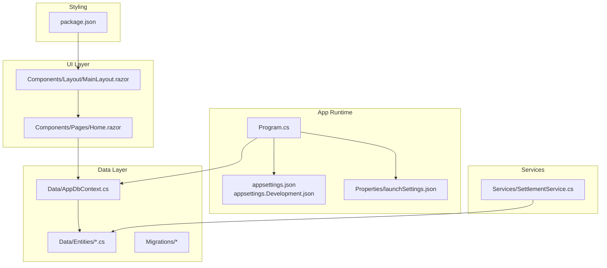
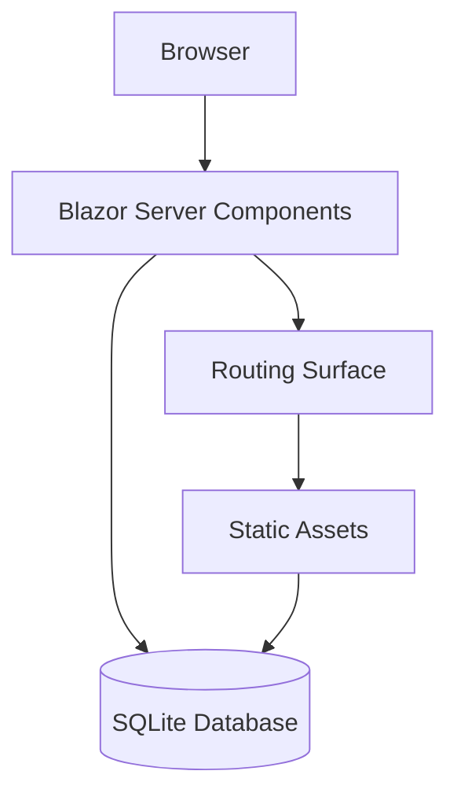
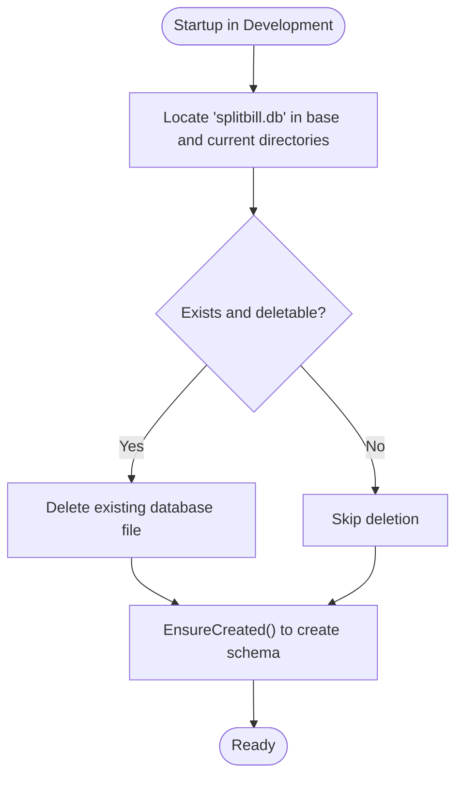
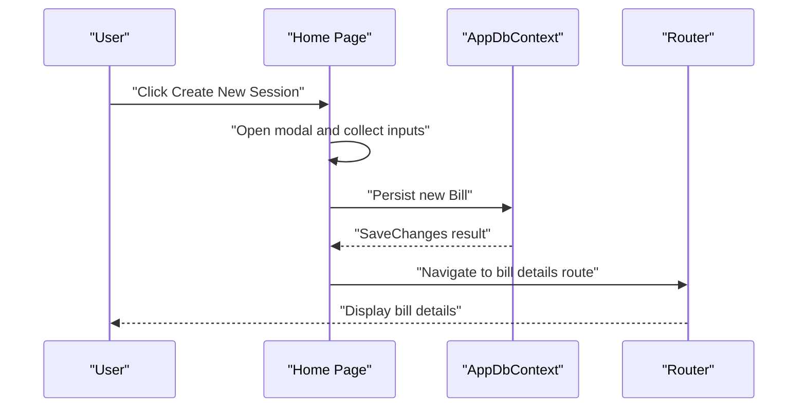
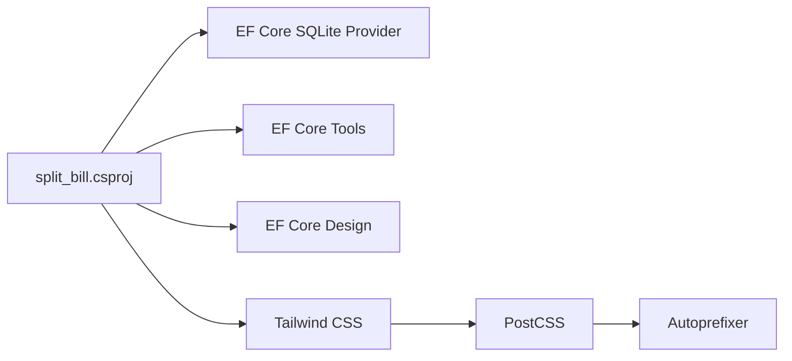
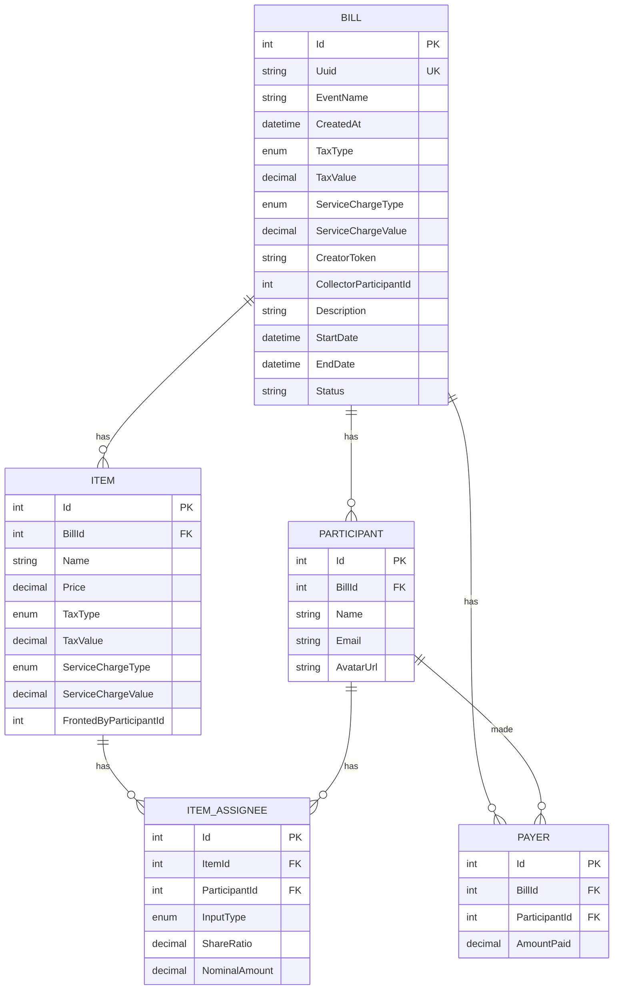

# Getting Started

<cite>
**Referenced Files in This Document**
- [Program.cs](file://Program.cs)
- [split_bill.csproj](file://split_bill.csproj)
- [appsettings.json](file://appsettings.json)
- [appsettings.Development.json](file://appsettings.Development.json)
- [package.json](file://package.json)
- [Properties/launchSettings.json](file://Properties/launchSettings.json)
- [Data/AppDbContext.cs](file://Data/AppDbContext.cs)
- [Data/Entities/Bill.cs](file://Data/Entities/Bill.cs)
- [Data/Entities/Participant.cs](file://Data/Entities/Participant.cs)
- [Data/Entities/Item.cs](file://Data/Entities/Item.cs)
- [Data/Entities/ItemAssignee.cs](file://Data/Entities/ItemAssignee.cs)
- [Data/Entities/Payer.cs](file://Data/Entities/Payer.cs)
- [Services/SettlementService.cs](file://Services/SettlementService.cs)
- [Components/Layout/MainLayout.razor](file://Components/Layout/MainLayout.razor)
- [Components/Pages/Home.razor](file://Components/Pages/Home.razor)
</cite>

## Table of Contents
1. [Introduction](#introduction)
2. [Project Structure](#project-structure)
3. [Core Components](#core-components)
4. [Architecture Overview](#architecture-overview)
5. [Detailed Component Analysis](#detailed-component-analysis)
6. [Dependency Analysis](#dependency-analysis)
7. [Performance Considerations](#performance-considerations)
8. [Troubleshooting Guide](#troubleshooting-guide)
9. [Conclusion](#conclusion)
10. [Appendices](#appendices)

## Introduction
This guide helps you install, configure, and run SplitBill locally. It covers prerequisites, step-by-step installation, environment configuration, database initialization, and the first-time user workflow to create a bill, add participants, and record expenses. It also includes troubleshooting tips and verification steps to ensure a smooth setup.

## Project Structure
SplitBill is a .NET 10 Blazor Server application with:
- A client-side Blazor UI built with Razor components
- Entity Framework Core using SQLite for persistence
- Tailwind CSS for styling, compiled via npm scripts
- A settlement service that computes balances and transfer instructions

Key runtime and configuration files:
- Application entrypoint and DI registration
- Project file specifying .NET 10 target and EF Core packages
- Environment settings for logging and hosts
- NPM scripts for Tailwind CSS compilation
- Launch profiles for local development

**Diagram sources**
- [Program.cs:1-73](file://Program.cs#L1-L73)
- [appsettings.json:1-10](file://appsettings.json#L1-L10)
- [appsettings.Development.json:1-9](file://appsettings.Development.json#L1-L9)
- [Properties/launchSettings.json:1-24](file://Properties/launchSettings.json#L1-L24)
- [Components/Layout/MainLayout.razor:1-12](file://Components/Layout/MainLayout.razor#L1-L12)
- [Components/Pages/Home.razor:1-325](file://Components/Pages/Home.razor#L1-L325)
- [Data/AppDbContext.cs:1-71](file://Data/AppDbContext.cs#L1-L71)
- [Data/Entities/Bill.cs:1-38](file://Data/Entities/Bill.cs#L1-L38)
- [Data/Entities/Participant.cs:1-21](file://Data/Entities/Participant.cs#L1-L21)
- [Data/Entities/Item.cs:1-28](file://Data/Entities/Item.cs#L1-L28)
- [Data/Entities/ItemAssignee.cs:1-22](file://Data/Entities/ItemAssignee.cs#L1-L22)
- [Data/Entities/Payer.cs:1-12](file://Data/Entities/Payer.cs#L1-L12)
- [Services/SettlementService.cs:1-314](file://Services/SettlementService.cs#L1-L314)
- [package.json:1-20](file://package.json#L1-L20)

**Section sources**
- [Program.cs:1-73](file://Program.cs#L1-L73)
- [split_bill.csproj:1-34](file://split_bill.csproj#L1-L34)
- [appsettings.json:1-10](file://appsettings.json#L1-L10)
- [appsettings.Development.json:1-9](file://appsettings.Development.json#L1-L9)
- [package.json:1-20](file://package.json#L1-L20)
- [Properties/launchSettings.json:1-24](file://Properties/launchSettings.json#L1-L24)

## Core Components
- Application entrypoint configures services, registers the DbContext with SQLite, and sets up the development lifecycle to initialize the database schema.
- The UI is a Blazor Server app with interactive server render mode.
- The data model centers around Bill, Participant, Item, ItemAssignee, and Payer with cascading deletes and soft-deleted filters.
- The settlement service computes totals, participant balances, and optimized transfer instructions.

**Section sources**
- [Program.cs:10-21](file://Program.cs#L10-L21)
- [Data/AppDbContext.cs:12-16](file://Data/AppDbContext.cs#L12-L16)
- [Data/Entities/Bill.cs:12-37](file://Data/Entities/Bill.cs#L12-L37)
- [Data/Entities/Participant.cs:5-20](file://Data/Entities/Participant.cs#L5-L20)
- [Data/Entities/Item.cs:5-27](file://Data/Entities/Item.cs#L5-L27)
- [Data/Entities/ItemAssignee.cs:9-21](file://Data/Entities/ItemAssignee.cs#L9-L21)
- [Data/Entities/Payer.cs:3-11](file://Data/Entities/Payer.cs#L3-L11)
- [Services/SettlementService.cs:43-232](file://Services/SettlementService.cs#L43-L232)

## Architecture Overview
The app runs as a Blazor Server application with:
- A static asset pipeline for Tailwind CSS
- A SQLite database initialized automatically in development
- A routing surface for interactive components
- A settlement engine that operates on loaded bills and participants

**Diagram sources**
- [Program.cs:66-70](file://Program.cs#L66-L70)
- [package.json:8-9](file://package.json#L8-L9)
- [Data/AppDbContext.cs:6-10](file://Data/AppDbContext.cs#L6-L10)

## Detailed Component Analysis

### Prerequisites
- Operating system: Windows recommended for the included launch settings.
- .NET 10 SDK installed.
- Node.js and npm for Tailwind CSS compilation.
- Optional: Visual Studio or VS Code with C# and .NET support.

Verification steps:
- Confirm dotnet SDK version and availability.
- Confirm npm and Node.js availability.

**Section sources**
- [split_bill.csproj:4-4](file://split_bill.csproj#L4-L4)
- [package.json:1-20](file://package.json#L1-L20)
- [Properties/launchSettings.json:1-24](file://Properties/launchSettings.json#L1-L24)

### Step-by-Step Installation
1. Clone or download the repository to your machine.
2. Restore .NET dependencies:
   - Run the standard restore command for the solution.
3. Install Node.js dependencies:
   - From the repository root, run the npm install command to fetch Tailwind and related dev dependencies.
4. Build Tailwind CSS:
   - The project includes an npm script to compile Tailwind CSS into the static output folder. Ensure the script runs during build or manually execute the build script.
5. Build and run the .NET project:
   - Use the standard .NET run command or launch through your IDE.

Environment configuration:
- The project defines launch profiles for http and https with a preferred port for local development.
- Logging and host allowances are configured via appsettings files.

**Section sources**
- [split_bill.csproj:29-31](file://split_bill.csproj#L29-L31)
- [package.json:8-9](file://package.json#L8-L9)
- [Properties/launchSettings.json:4-21](file://Properties/launchSettings.json#L4-L21)
- [appsettings.json:1-10](file://appsettings.json#L1-L10)
- [appsettings.Development.json:1-9](file://appsettings.Development.json#L1-L9)

### Database Initialization
- In development, the application attempts to remove existing SQLite database files and ensures the schema is created before startup.
- The DbContext uses SQLite and exposes entity sets for Bills, Participants, Items, ItemAssignees, and Payers.

**Diagram sources**
- [Program.cs:27-53](file://Program.cs#L27-L53)
- [Data/AppDbContext.cs:6-10](file://Data/AppDbContext.cs#L6-L10)

**Section sources**
- [Program.cs:27-53](file://Program.cs#L27-L53)
- [Data/AppDbContext.cs:12-16](file://Data/AppDbContext.cs#L12-L16)

### Running the Application Locally
- Launch the application using the configured launch profile that opens the browser to the preferred local URL.
- The app serves static assets and maps Blazor components for interactive server rendering.

Access details:
- The default URL is configured in the launch settings.
- HTTPS and HTTP profiles are available.

**Section sources**
- [Properties/launchSettings.json:4-21](file://Properties/launchSettings.json#L4-L21)
- [Program.cs:18-20](file://Program.cs#L18-L20)
- [Program.cs:66-70](file://Program.cs#L66-L70)

### First-Time User Workflow
1. Open the home page.
2. Click the primary action button to open the modal for creating a new bill.
3. Fill in the event name and optional details.
4. Submit the form to create a new bill session and navigate to the bill details page.
5. Add participants to the bill.
6. Record expenses (items) and assign shares among participants.
7. Review balances and transfer instructions generated by the settlement service.

**Diagram sources**
- [Components/Pages/Home.razor:241-288](file://Components/Pages/Home.razor#L241-L288)
- [Data/AppDbContext.cs:12-16](file://Data/AppDbContext.cs#L12-L16)

**Section sources**
- [Components/Pages/Home.razor:1-325](file://Components/Pages/Home.razor#L1-L325)
- [Data/Entities/Bill.cs:12-37](file://Data/Entities/Bill.cs#L12-L37)

### Creating the First Bill
- Use the modal on the home page to enter the event name and optional description/dates.
- The system generates a short UUID and a creator token for the session.
- After saving, the UI navigates to the bill details page.

**Section sources**
- [Components/Pages/Home.razor:257-288](file://Components/Pages/Home.razor#L257-L288)

### Adding Participants
- Navigate to the bill details page after creating a bill.
- Use the UI controls to add participants to the bill.
- Participants are persisted via the DbContext and filtered by soft-delete semantics.

**Section sources**
- [Data/Entities/Participant.cs:5-20](file://Data/Entities/Participant.cs#L5-L20)
- [Data/AppDbContext.cs:13-16](file://Data/AppDbContext.cs#L13-L16)

### Recording Expenses
- On the bill details page, add items with pricing and tax/service charge configurations.
- Assign participants to items using either nominal amounts or ratios.
- Optionally mark a participant as the one who paid for the item.
- The settlement service aggregates totals and computes balances.

**Section sources**
- [Data/Entities/Item.cs:5-27](file://Data/Entities/Item.cs#L5-L27)
- [Data/Entities/ItemAssignee.cs:9-21](file://Data/Entities/ItemAssignee.cs#L9-L21)
- [Data/Entities/Payer.cs:3-11](file://Data/Entities/Payer.cs#L3-L11)
- [Services/SettlementService.cs:55-232](file://Services/SettlementService.cs#L55-L232)

### Accessing the Application
- The launch settings define http and https profiles with environment variables set to Development.
- The application binds to the configured URLs and serves static assets and Blazor components.

**Section sources**
- [Properties/launchSettings.json:4-21](file://Properties/launchSettings.json#L4-L21)
- [Program.cs:18-20](file://Program.cs#L18-L20)
- [Program.cs:66-70](file://Program.cs#L66-L70)

## Dependency Analysis
External dependencies and build targets:
- .NET 10 target framework
- Entity Framework Core providers and tools for SQLite
- Tailwind CSS and related dev dependencies
- NPM script to compile Tailwind CSS into static assets

**Diagram sources**
- [split_bill.csproj:10-20](file://split_bill.csproj#L10-L20)
- [package.json:14-18](file://package.json#L14-L18)

**Section sources**
- [split_bill.csproj:10-20](file://split_bill.csproj#L10-L20)
- [package.json:14-18](file://package.json#L14-L18)

## Performance Considerations
- SQLite is suitable for local development and small-scale usage. For larger datasets, consider migrating to a server database.
- The settlement service performs calculations in memory; keep the number of items and participants reasonable for interactive responsiveness.
- Tailwind CSS compilation is handled via npm scripts; ensure builds are executed to avoid stale styles.

## Troubleshooting Guide
Common setup issues and resolutions:
- Port conflicts:
  - The launch settings specify a preferred port. Change the application URL in the launch settings if the port is in use.
- Missing Node.js dependencies:
  - Run the npm install command to fetch Tailwind and related dev dependencies.
- Tailwind CSS not applied:
  - Ensure the Tailwind build script runs during build or execute the script manually to generate the stylesheet.
- Database lock or permission errors:
  - In development, the app attempts to delete the database file if present. If locked, close other processes using the file and retry.
- Blazor components not loading:
  - Verify the static asset pipeline and ensure the Blazor components are mapped and served.

Verification steps:
- Confirm the app starts and navigates to the home page.
- Create a test bill and verify navigation to the bill details page.
- Add a participant and an item, then confirm the settlement summary updates.

**Section sources**
- [Properties/launchSettings.json:4-21](file://Properties/launchSettings.json#L4-L21)
- [package.json:8-9](file://package.json#L8-L9)
- [Program.cs:27-53](file://Program.cs#L27-L53)
- [Program.cs:66-70](file://Program.cs#L66-L70)
- [Components/Pages/Home.razor:257-288](file://Components/Pages/Home.razor#L257-L288)

## Conclusion
You now have the prerequisites, installation steps, and operational guidance to run SplitBill locally. Use the first-time workflow to create a bill, add participants, and record expenses. If issues arise, consult the troubleshooting section and verify environment configuration and database initialization.

## Appendices
- Data model overview for quick reference:
  - Bill: session metadata, taxes, service charges, creator token, and navigation to Participants, Items, Payers.
  - Participant: belongs to a Bill, has assigned items and payments.
  - Item: belongs to a Bill, pricing with tax/service, assignees, and optional fronting participant.
  - ItemAssignee: defines how an item’s cost is split per participant (ratio or nominal).
  - Payer: records payments made by participants toward the bill.

**Diagram sources**
- [Data/Entities/Bill.cs:12-37](file://Data/Entities/Bill.cs#L12-L37)
- [Data/Entities/Participant.cs:5-20](file://Data/Entities/Participant.cs#L5-L20)
- [Data/Entities/Item.cs:5-27](file://Data/Entities/Item.cs#L5-L27)
- [Data/Entities/ItemAssignee.cs:9-21](file://Data/Entities/ItemAssignee.cs#L9-L21)
- [Data/Entities/Payer.cs:3-11](file://Data/Entities/Payer.cs#L3-L11)
- [Data/AppDbContext.cs:12-16](file://Data/AppDbContext.cs#L12-L16)