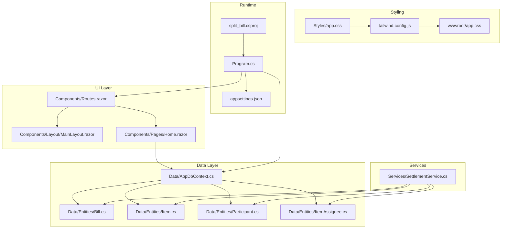
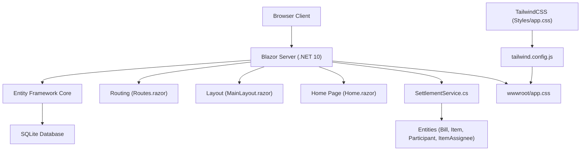
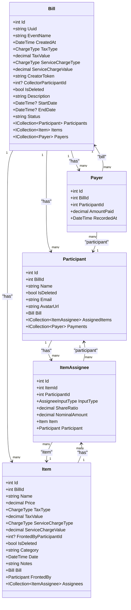
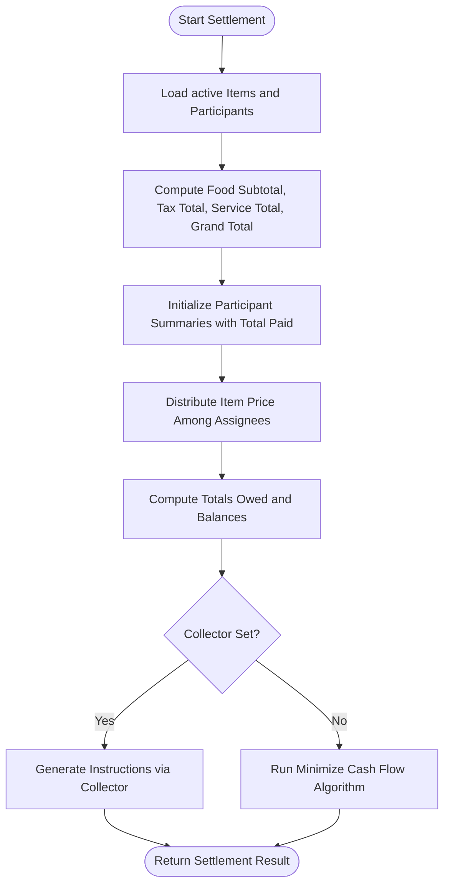
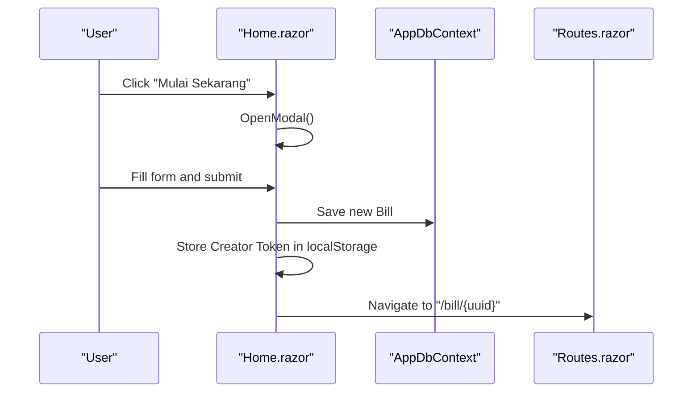
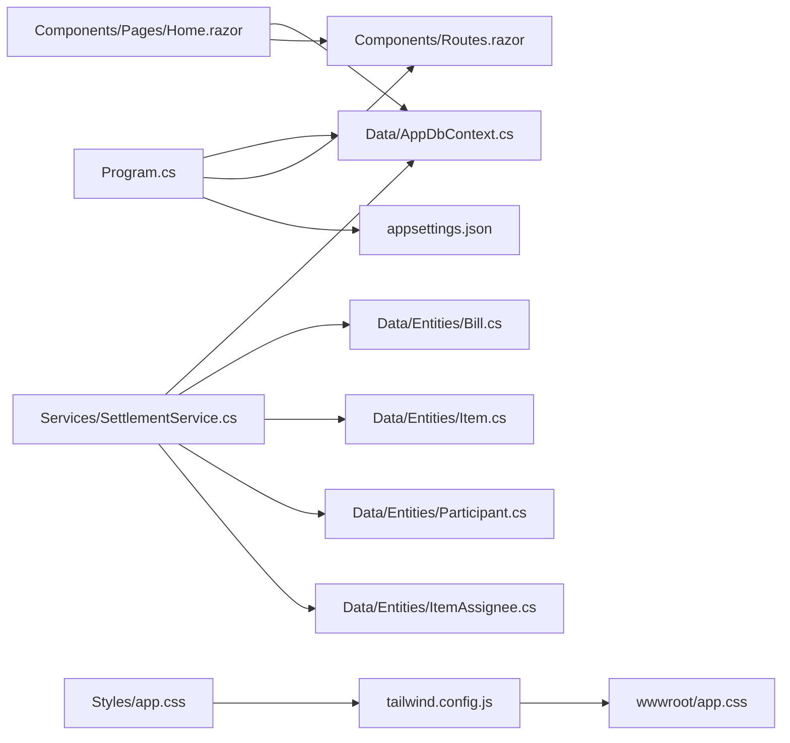

# Project Overview

<cite>
**Referenced Files in This Document**
- [Program.cs](file://Program.cs)
- [split_bill.csproj](file://split_bill.csproj)
- [appsettings.json](file://appsettings.json)
- [plan.md](file://plan.md)
- [package.json](file://package.json)
- [tailwind.config.js](file://tailwind.config.js)
- [Styles/app.css](file://Styles/app.css)
- [wwwroot/app.css](file://wwwroot/app.css)
- [Components/Layout/MainLayout.razor](file://Components/Layout/MainLayout.razor)
- [Components/Routes.razor](file://Components/Routes.razor)
- [Components/Pages/Home.razor](file://Components/Pages/Home.razor)
- [Data/AppDbContext.cs](file://Data/AppDbContext.cs)
- [Data/Entities/Bill.cs](file://Data/Entities/Bill.cs)
- [Data/Entities/Item.cs](file://Data/Entities/Item.cs)
- [Data/Entities/Participant.cs](file://Data/Entities/Participant.cs)
- [Data/Entities/ItemAssignee.cs](file://Data/Entities/ItemAssignee.cs)
- [Services/SettlementService.cs](file://Services/SettlementService.cs)
</cite>

## Table of Contents
1. [Introduction](#introduction)
2. [Project Structure](#project-structure)
3. [Core Components](#core-components)
4. [Architecture Overview](#architecture-overview)
5. [Detailed Component Analysis](#detailed-component-analysis)
6. [Dependency Analysis](#dependency-analysis)
7. [Performance Considerations](#performance-considerations)
8. [Troubleshooting Guide](#troubleshooting-guide)
9. [Conclusion](#conclusion)
10. [Appendices](#appendices)

## Introduction
SplitBill is an expense splitting platform designed to track shared expenses and optimize payment distributions among group members. It enables users to create bill sessions, record items with participants, and compute fair settlements that minimize the number of transfers required. The application targets everyday scenarios such as trips, shared meals, and group activities where accurate and transparent cost allocation matters.

Key capabilities:
- Create and manage bill sessions with metadata (event name, dates, description)
- Add items with pricing and assignees (participants) using either proportional ratios or fixed nominal amounts
- Compute participant totals, tax/service breakdowns, and net balances
- Generate transfer instructions to settle debts efficiently

Technology stack:
- Blazor Server for interactive UI and real-time updates
- Entity Framework Core with SQLite for data persistence
- TailwindCSS for responsive styling and theming
- .NET 10 runtime

Audience and use cases:
- Friends splitting dinner bills
- Roommates dividing recurring expenses
- Families or teams organizing trips and outings
- Anyone needing a no-login, frictionless way to track shared costs and settle balances

## Project Structure
The project follows a layered structure with clear separation between UI, data, services, and styling:
- UI layer: Blazor Server components and pages under Components/
- Data layer: Entity models and DbContext under Data/
- Business logic: Settlement calculations under Services/
- Styling: TailwindCSS integration via Styles/ and compiled output in wwwroot/
- Build and tooling: .NET project file, npm scripts, and Tailwind config

**Diagram sources**
- [Program.cs:1-73](file://Program.cs#L1-L73)
- [split_bill.csproj:1-34](file://split_bill.csproj#L1-L34)
- [appsettings.json:1-10](file://appsettings.json#L1-L10)
- [Components/Routes.razor:1-7](file://Components/Routes.razor#L1-L7)
- [Components/Layout/MainLayout.razor:1-12](file://Components/Layout/MainLayout.razor#L1-L12)
- [Components/Pages/Home.razor:1-325](file://Components/Pages/Home.razor#L1-L325)
- [Data/AppDbContext.cs:1-71](file://Data/AppDbContext.cs#L1-L71)
- [Data/Entities/Bill.cs:1-38](file://Data/Entities/Bill.cs#L1-L38)
- [Data/Entities/Item.cs:1-28](file://Data/Entities/Item.cs#L1-L28)
- [Data/Entities/Participant.cs:1-21](file://Data/Entities/Participant.cs#L1-L21)
- [Data/Entities/ItemAssignee.cs:1-22](file://Data/Entities/ItemAssignee.cs#L1-L22)
- [Services/SettlementService.cs:1-314](file://Services/SettlementService.cs#L1-L314)
- [Styles/app.css](file://Styles/app.css)
- [tailwind.config.js](file://tailwind.config.js)
- [wwwroot/app.css](file://wwwroot/app.css)

**Section sources**
- [Program.cs:1-73](file://Program.cs#L1-L73)
- [split_bill.csproj:1-34](file://split_bill.csproj#L1-L34)
- [appsettings.json:1-10](file://appsettings.json#L1-L10)
- [Components/Routes.razor:1-7](file://Components/Routes.razor#L1-L7)
- [Components/Layout/MainLayout.razor:1-12](file://Components/Layout/MainLayout.razor#L1-L12)
- [Components/Pages/Home.razor:1-325](file://Components/Pages/Home.razor#L1-L325)
- [Data/AppDbContext.cs:1-71](file://Data/AppDbContext.cs#L1-L71)
- [Data/Entities/Bill.cs:1-38](file://Data/Entities/Bill.cs#L1-L38)
- [Data/Entities/Item.cs:1-28](file://Data/Entities/Item.cs#L1-L28)
- [Data/Entities/Participant.cs:1-21](file://Data/Entities/Participant.cs#L1-L21)
- [Data/Entities/ItemAssignee.cs:1-22](file://Data/Entities/ItemAssignee.cs#L1-L22)
- [Services/SettlementService.cs:1-314](file://Services/SettlementService.cs#L1-L314)
- [Styles/app.css](file://Styles/app.css)
- [tailwind.config.js](file://tailwind.config.js)
- [wwwroot/app.css](file://wwwroot/app.css)

## Core Components
This section introduces the primary building blocks that define SplitBill’s functionality.

- Application bootstrap and DI registration
  - Registers Blazor components, Entity Framework with SQLite, and the settlement service
  - Configures development behavior (schema creation, local database deletion)
  - Sets up static assets, routing, and HTTPS/HSTS in production

- Data model and persistence
  - AppDbContext defines entity sets and relationships
  - Entities represent bills, participants, items, assignees, and payers
  - Soft-delete filters and cascade deletes ensure data integrity

- Settlement engine
  - Computes participant totals, tax/service portions, and balances
  - Generates transfer instructions either via a designated collector or via a cash-flow minimization algorithm

- UI and routing
  - Routes and layout define the Blazor Server rendering pipeline
  - Home page provides a landing experience and initiates bill creation

Practical examples
- Creating a trip bill with three participants and multiple items
- Adding items with mixed assignment modes (ratio and nominal)
- Generating settlement instructions after recording payments

**Section sources**
- [Program.cs:1-73](file://Program.cs#L1-L73)
- [Data/AppDbContext.cs:1-71](file://Data/AppDbContext.cs#L1-L71)
- [Data/Entities/Bill.cs:1-38](file://Data/Entities/Bill.cs#L1-L38)
- [Data/Entities/Item.cs:1-28](file://Data/Entities/Item.cs#L1-L28)
- [Data/Entities/Participant.cs:1-21](file://Data/Entities/Participant.cs#L1-L21)
- [Data/Entities/ItemAssignee.cs:1-22](file://Data/Entities/ItemAssignee.cs#L1-L22)
- [Services/SettlementService.cs:1-314](file://Services/SettlementService.cs#L1-L314)
- [Components/Routes.razor:1-7](file://Components/Routes.razor#L1-L7)
- [Components/Layout/MainLayout.razor:1-12](file://Components/Layout/MainLayout.razor#L1-L12)
- [Components/Pages/Home.razor:1-325](file://Components/Pages/Home.razor#L1-L325)

## Architecture Overview
SplitBill uses a straightforward, cohesive architecture:
- UI: Blazor Server renders Razor components and handles interactivity
- Domain: Entities encapsulate the bill, items, participants, and assignees
- Persistence: Entity Framework Core manages SQLite storage
- Business logic: SettlementService computes balances and transfer instructions
- Styling: TailwindCSS compiles styles during build

**Diagram sources**
- [Program.cs:1-73](file://Program.cs#L1-L73)
- [Components/Routes.razor:1-7](file://Components/Routes.razor#L1-L7)
- [Components/Layout/MainLayout.razor:1-12](file://Components/Layout/MainLayout.razor#L1-L12)
- [Components/Pages/Home.razor:1-325](file://Components/Pages/Home.razor#L1-L325)
- [Data/AppDbContext.cs:1-71](file://Data/AppDbContext.cs#L1-L71)
- [Data/Entities/Bill.cs:1-38](file://Data/Entities/Bill.cs#L1-L38)
- [Data/Entities/Item.cs:1-28](file://Data/Entities/Item.cs#L1-L28)
- [Data/Entities/Participant.cs:1-21](file://Data/Entities/Participant.cs#L1-L21)
- [Data/Entities/ItemAssignee.cs:1-22](file://Data/Entities/ItemAssignee.cs#L1-L22)
- [Services/SettlementService.cs:1-314](file://Services/SettlementService.cs#L1-L314)
- [Styles/app.css](file://Styles/app.css)
- [tailwind.config.js](file://tailwind.config.js)
- [wwwroot/app.css](file://wwwroot/app.css)

## Detailed Component Analysis

### Data Model and Relationships
The data model centers around a Bill session containing Participants, Items, ItemAssignees, and Payers. Relationships and constraints ensure referential integrity and cascading deletes.

**Diagram sources**
- [Data/Entities/Bill.cs:1-38](file://Data/Entities/Bill.cs#L1-L38)
- [Data/Entities/Participant.cs:1-21](file://Data/Entities/Participant.cs#L1-L21)
- [Data/Entities/Item.cs:1-28](file://Data/Entities/Item.cs#L1-L28)
- [Data/Entities/ItemAssignee.cs:1-22](file://Data/Entities/ItemAssignee.cs#L1-L22)
- [Data/AppDbContext.cs:1-71](file://Data/AppDbContext.cs#L1-L71)

**Section sources**
- [Data/Entities/Bill.cs:1-38](file://Data/Entities/Bill.cs#L1-L38)
- [Data/Entities/Participant.cs:1-21](file://Data/Entities/Participant.cs#L1-L21)
- [Data/Entities/Item.cs:1-28](file://Data/Entities/Item.cs#L1-L28)
- [Data/Entities/ItemAssignee.cs:1-22](file://Data/Entities/ItemAssignee.cs#L1-L22)
- [Data/AppDbContext.cs:1-71](file://Data/AppDbContext.cs#L1-L71)

### Settlement Calculation Workflow
The settlement engine computes totals, taxes, and balances, then produces transfer instructions. The process includes:
- Aggregating item prices and back-calculating tax/service portions
- Distributing item costs among assignees using either nominal or ratio-based sharing
- Summing participant payments and computing balances
- Producing transfer instructions either via a designated collector or via a greedy minimization algorithm

**Diagram sources**
- [Services/SettlementService.cs:55-232](file://Services/SettlementService.cs#L55-L232)

**Section sources**
- [Services/SettlementService.cs:1-314](file://Services/SettlementService.cs#L1-L314)

### UI Creation Flow (Beginner-Friendly)
The Home page provides a guided flow to create a new bill session:
- Users click “Start Now” to open a modal
- They enter event details (name, description, dates)
- On submission, a new bill is created with a unique identifier and creator token
- The user is navigated to the bill details page

**Diagram sources**
- [Components/Pages/Home.razor:241-288](file://Components/Pages/Home.razor#L241-L288)
- [Data/AppDbContext.cs:12-16](file://Data/AppDbContext.cs#L12-L16)
- [Components/Routes.razor:1-7](file://Components/Routes.razor#L1-L7)

**Section sources**
- [Components/Pages/Home.razor:1-325](file://Components/Pages/Home.razor#L1-L325)
- [Data/AppDbContext.cs:1-71](file://Data/AppDbContext.cs#L1-L71)
- [Components/Routes.razor:1-7](file://Components/Routes.razor#L1-L7)

### Technical Highlights for Experienced Developers
- Blazor Server interactivity and SignalR transport enable real-time updates without complex client-side state management
- Entity Framework Core with SQLite offers simplicity and portability; migrations and snapshot files support iterative schema evolution
- TailwindCSS integration via npm scripts ensures efficient CSS compilation and hot-reload during development
- Soft-delete filters and cascade deletes simplify data lifecycle management
- SettlementService implements a robust algorithm that supports inclusive tax/service calculations and flexible assignee input types

**Section sources**
- [Program.cs:1-73](file://Program.cs#L1-L73)
- [split_bill.csproj:29-31](file://split_bill.csproj#L29-L31)
- [Data/AppDbContext.cs:18-70](file://Data/AppDbContext.cs#L18-L70)
- [Services/SettlementService.cs:43-314](file://Services/SettlementService.cs#L43-L314)

## Dependency Analysis
High-level dependencies:
- Program.cs registers services and configures the HTTP pipeline
- Components depend on Data for entity access and Services for business logic
- TailwindCSS depends on Tailwind config and compiles to wwwroot for runtime consumption

**Diagram sources**
- [Program.cs:1-73](file://Program.cs#L1-L73)
- [Components/Pages/Home.razor:1-325](file://Components/Pages/Home.razor#L1-L325)
- [Data/AppDbContext.cs:1-71](file://Data/AppDbContext.cs#L1-L71)
- [Services/SettlementService.cs:1-314](file://Services/SettlementService.cs#L1-L314)
- [Styles/app.css](file://Styles/app.css)
- [tailwind.config.js](file://tailwind.config.js)
- [wwwroot/app.css](file://wwwroot/app.css)

**Section sources**
- [Program.cs:1-73](file://Program.cs#L1-L73)
- [Components/Pages/Home.razor:1-325](file://Components/Pages/Home.razor#L1-L325)
- [Data/AppDbContext.cs:1-71](file://Data/AppDbContext.cs#L1-L71)
- [Services/SettlementService.cs:1-314](file://Services/SettlementService.cs#L1-L314)
- [Styles/app.css](file://Styles/app.css)
- [tailwind.config.js](file://tailwind.config.js)
- [wwwroot/app.css](file://wwwroot/app.css)

## Performance Considerations
- SQLite is well-suited for small to medium workloads typical of expense splitting; keep item counts reasonable for frequent real-time updates
- Settlement computations are linear in the number of items and participants; avoid excessive granularity for very large groups
- TailwindCSS compilation occurs during build; leverage watch mode for rapid iteration during development
- Blazor Server streaming and SignalR help reduce payload sizes; avoid unnecessary re-rendering by structuring components thoughtfully

[No sources needed since this section provides general guidance]

## Troubleshooting Guide
Common issues and resolutions:
- Database initialization in development
  - The application attempts to delete existing databases and recreate schema during development startup
  - If conflicts occur, ensure no process holds the database file open

- Routing and 404 handling
  - Non-existent routes render a dedicated Not Found page
  - Ensure route definitions align with component placement

- Static assets and CSS
  - TailwindCSS compiles from Styles/app.css to wwwroot/app.css
  - Verify npm scripts and Tailwind configuration are present and functional

- Authentication and session access
  - Creator access is determined by a stored creator token in localStorage
  - Confirm token storage and retrieval via JavaScript interop

**Section sources**
- [Program.cs:26-53](file://Program.cs#L26-L53)
- [Components/Routes.razor:1-7](file://Components/Routes.razor#L1-L7)
- [package.json:6-10](file://package.json#L6-L10)
- [tailwind.config.js](file://tailwind.config.js)
- [wwwroot/app.css](file://wwwroot/app.css)

## Conclusion
SplitBill delivers a focused, no-login solution for splitting shared expenses. Its Blazor Server UI, SQLite-backed data model, and efficient settlement algorithm combine to offer an intuitive experience for both beginners and developers. The modular architecture and clear separation of concerns make it straightforward to extend and maintain.

[No sources needed since this section summarizes without analyzing specific files]

## Appendices

### Practical Examples
- Scenario: Three friends go on a trip and split a meal
  - Create a bill session, add participants, record items with proportional sharing, and review transfer instructions
- Scenario: Mixed sharing (some items paid by one person, others split)
  - Use nominal amounts for specific items and ratios for shared costs; the settlement engine accounts for both
- Scenario: Group travel with varying contributions
  - Record payments made by participants; the system computes balances and suggests minimal transfers

[No sources needed since this section provides general guidance]