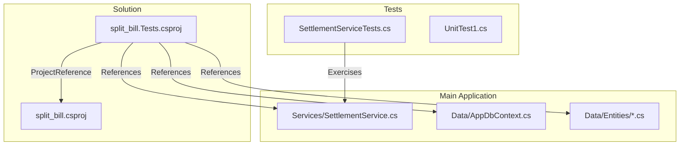
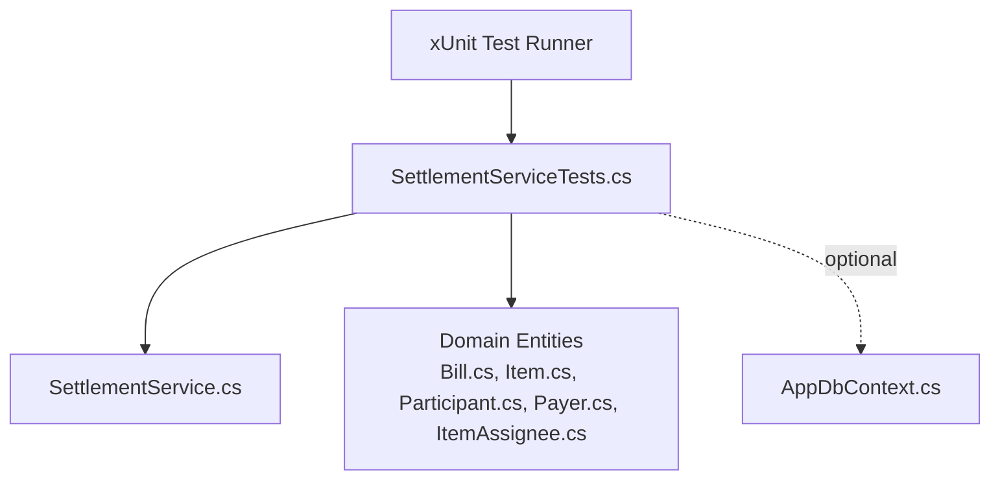
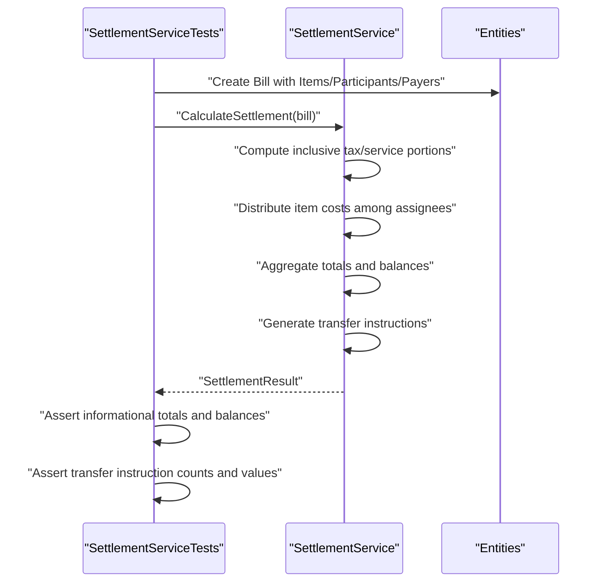
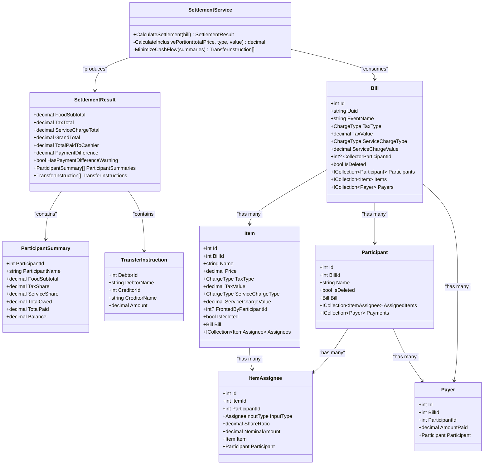
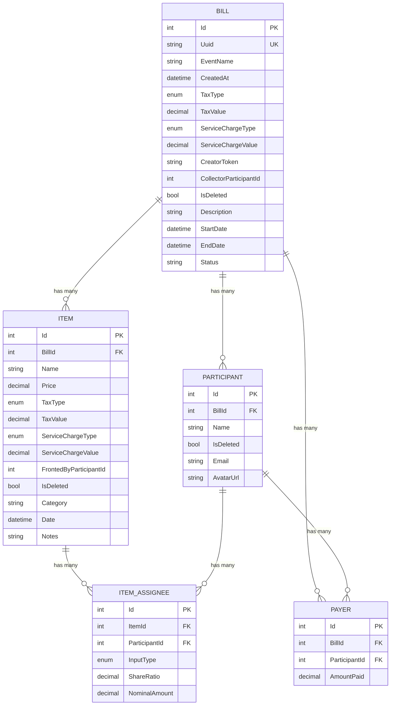
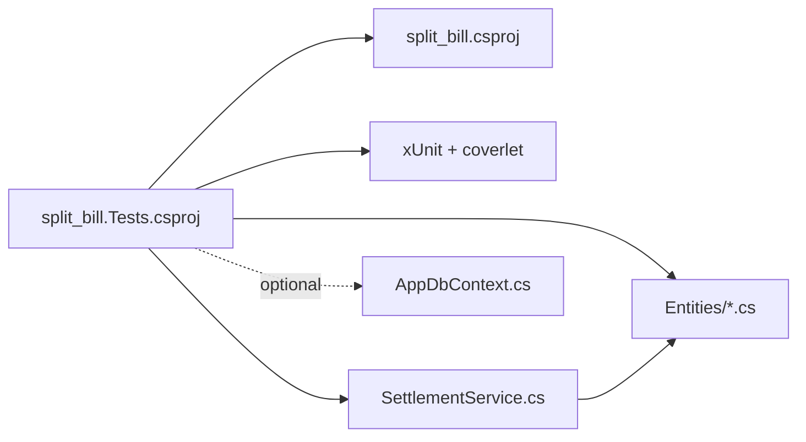

# Testing Strategy

<cite>
**Referenced Files in This Document**
- [split_bill.Tests.csproj](file://split_bill.Tests/split_bill.Tests.csproj)
- [SettlementServiceTests.cs](file://split_bill.Tests/SettlementServiceTests.cs)
- [UnitTest1.cs](file://split_bill.Tests/UnitTest1.cs)
- [SettlementService.cs](file://Services/SettlementService.cs)
- [AppDbContext.cs](file://Data/AppDbContext.cs)
- [Bill.cs](file://Data/Entities/Bill.cs)
- [Item.cs](file://Data/Entities/Item.cs)
- [Participant.cs](file://Data/Entities/Participant.cs)
- [Payer.cs](file://Data/Entities/Payer.cs)
- [ItemAssignee.cs](file://Data/Entities/ItemAssignee.cs)
- [split_bill.csproj](file://split_bill.csproj)
</cite>

## Table of Contents
1. [Introduction](#introduction)
2. [Project Structure](#project-structure)
3. [Core Components](#core-components)
4. [Architecture Overview](#architecture-overview)
5. [Detailed Component Analysis](#detailed-component-analysis)
6. [Dependency Analysis](#dependency-analysis)
7. [Performance Considerations](#performance-considerations)
8. [Troubleshooting Guide](#troubleshooting-guide)
9. [Conclusion](#conclusion)
10. [Appendices](#appendices)

## Introduction
This document describes SplitBill's testing strategy and implementation. It covers the unit testing framework setup using xUnit, test organization patterns, service testing approaches, and practical guidance for testing Blazor components, service-layer logic, and database integration. It also outlines continuous integration testing expectations, code coverage requirements, contributor guidelines, edge-case testing, and performance testing considerations.

## Project Structure
The solution consists of:
- A web application project targeting .NET 10 with Entity Framework Core and SQLite.
- A dedicated test project configured for xUnit with SDK-style packaging and coverage collection via coverlet.

Key characteristics:
- The test project references the main application project to exercise production code.
- The test project includes xUnit, the Visual Studio runner, and coverlet for code coverage.
- The main project configures Entity Framework Core with SQLite and Tailwind compilation hooks.

**Diagram sources**
- [split_bill.csproj:1-34](file://split_bill.csproj#L1-L34)
- [split_bill.Tests.csproj:1-25](file://split_bill.Tests/split_bill.Tests.csproj#L1-L25)
- [SettlementService.cs:1-314](file://Services/SettlementService.cs#L1-L314)
- [AppDbContext.cs:1-71](file://Data/AppDbContext.cs#L1-L71)
- [SettlementServiceTests.cs:1-159](file://split_bill.Tests/SettlementServiceTests.cs#L1-L159)

**Section sources**
- [split_bill.csproj:1-34](file://split_bill.csproj#L1-L34)
- [split_bill.Tests.csproj:1-25](file://split_bill.Tests/split_bill.Tests.csproj#L1-L25)

## Core Components
This section documents the testing components currently present and how they are organized.

- Test project configuration
  - Targets .NET 10, disables packability, and includes xUnit, Visual Studio runner, and coverlet.
  - References the main application project to enable testing of production code.

- Example service under test
  - SettlementService encapsulates settlement calculation logic, participant summaries, and transfer instructions.
  - Provides explicit methods for inclusive tax/service portion calculations and cash-flow minimization.

- Test suite
  - SettlementServiceTests contains two focused tests validating empty participants and equal splits scenarios.
  - Additional placeholder test UnitTest1 exists but is currently unimplemented.

- Data model and persistence
  - AppDbContext defines entity sets and query filters for soft-deleted records.
  - Entities represent bills, items, participants, payers, and item assignees with navigation properties.

**Section sources**
- [split_bill.Tests.csproj:1-25](file://split_bill.Tests/split_bill.Tests.csproj#L1-L25)
- [SettlementService.cs:43-232](file://Services/SettlementService.cs#L43-L232)
- [SettlementServiceTests.cs:1-159](file://split_bill.Tests/SettlementServiceTests.cs#L1-L159)
- [UnitTest1.cs:1-11](file://split_bill.Tests/UnitTest1.cs#L1-L11)
- [AppDbContext.cs:6-71](file://Data/AppDbContext.cs#L6-L71)
- [Bill.cs:12-38](file://Data/Entities/Bill.cs#L12-L38)
- [Item.cs:5-28](file://Data/Entities/Item.cs#L5-L28)
- [Participant.cs:5-21](file://Data/Entities/Participant.cs#L5-L21)
- [Payer.cs:3-12](file://Data/Entities/Payer.cs#L3-L12)
- [ItemAssignee.cs:9-22](file://Data/Entities/ItemAssignee.cs#L9-L22)

## Architecture Overview
The testing architecture centers on xUnit-driven unit tests that exercise service logic in isolation. Tests construct domain entities and pass them to SettlementService methods, asserting calculated results. For database integration, tests can leverage an in-memory or SQLite provider to validate persistence and query filtering behavior.

**Diagram sources**
- [SettlementServiceTests.cs:1-159](file://split_bill.Tests/SettlementServiceTests.cs#L1-L159)
- [SettlementService.cs:43-232](file://Services/SettlementService.cs#L43-L232)
- [AppDbContext.cs:6-71](file://Data/AppDbContext.cs#L6-L71)
- [Bill.cs:12-38](file://Data/Entities/Bill.cs#L12-L38)
- [Item.cs:5-28](file://Data/Entities/Item.cs#L5-L28)
- [Participant.cs:5-21](file://Data/Entities/Participant.cs#L5-L21)
- [Payer.cs:3-12](file://Data/Entities/Payer.cs#L3-L12)
- [ItemAssignee.cs:9-22](file://Data/Entities/ItemAssignee.cs#L9-L22)

## Detailed Component Analysis

### SettlementServiceTests
This test class validates SettlementService behavior across two scenarios:
- No participants: verifies informational totals and warnings when no participant data is supplied.
- Equal splits: constructs a bill with participants, items, assignees, and payments, then asserts balances, taxes, service charges, and transfer instructions.

Test organization patterns demonstrated:
- Arrange-Act-Assert structure for each scenario.
- Explicit assertions on monetary fields with rounding considerations.
- Assertions on collection counts and cross-field consistency (e.g., payment difference vs. grand total).

Mock strategies for database dependencies:
- Current tests instantiate SettlementService directly and supply in-memory entities.
- To test database integration, replace constructor dependencies with an in-memory or SQLite-backed DbContext using a factory pattern or dependency injection container configured for tests.

Test data management:
- Construct entities inline per test method to keep tests self-contained.
- Use distinct identifiers and values to avoid cross-test interference.

Assertion patterns:
- Round monetary values before comparison to mitigate floating-point precision differences.
- Verify both informational totals and derived balances.
- Validate transfer instruction counts and relationships.

Edge case testing considerations:
- Zero or negative amounts.
- Empty collections and null references.
- Mixed assignee input types (ratio and nominal).
- Unbalanced payments and collectors.

**Diagram sources**
- [SettlementServiceTests.cs:19-51](file://split_bill.Tests/SettlementServiceTests.cs#L19-L51)
- [SettlementService.cs:55-232](file://Services/SettlementService.cs#L55-L232)

**Section sources**
- [SettlementServiceTests.cs:1-159](file://split_bill.Tests/SettlementServiceTests.cs#L1-L159)
- [SettlementService.cs:43-232](file://Services/SettlementService.cs#L43-L232)

### SettlementService
SettlementService orchestrates settlement computation:
- Computes inclusive tax/service portions from item prices.
- Distributes item costs among assignees using either nominal or ratio-based sharing.
- Aggregates participant totals, balances, and payment differences.
- Generates transfer instructions either via a designated collector or via a cash-flow minimization algorithm.

**Diagram sources**
- [SettlementService.cs:8-314](file://Services/SettlementService.cs#L8-L314)
- [Bill.cs:12-38](file://Data/Entities/Bill.cs#L12-L38)
- [Item.cs:5-28](file://Data/Entities/Item.cs#L5-L28)
- [Participant.cs:5-21](file://Data/Entities/Participant.cs#L5-L21)
- [Payer.cs:3-12](file://Data/Entities/Payer.cs#L3-L12)
- [ItemAssignee.cs:9-22](file://Data/Entities/ItemAssignee.cs#L9-L22)

**Section sources**
- [SettlementService.cs:43-232](file://Services/SettlementService.cs#L43-L232)

### Data Model and DbContext
AppDbContext configures:
- Entity sets for bills, participants, items, item assignees, and payers.
- Unique index on Bill.Uuid and global query filters to exclude soft-deleted entities.
- Cascade delete relationships for hierarchical entities.

**Diagram sources**
- [AppDbContext.cs:12-71](file://Data/AppDbContext.cs#L12-L71)
- [Bill.cs:12-38](file://Data/Entities/Bill.cs#L12-L38)
- [Item.cs:5-28](file://Data/Entities/Item.cs#L5-L28)
- [Participant.cs:5-21](file://Data/Entities/Participant.cs#L5-L21)
- [Payer.cs:3-12](file://Data/Entities/Payer.cs#L3-L12)
- [ItemAssignee.cs:9-22](file://Data/Entities/ItemAssignee.cs#L9-L22)

**Section sources**
- [AppDbContext.cs:6-71](file://Data/AppDbContext.cs#L6-L71)

### Conceptual Overview
This section provides general guidance for testing Blazor components, service-layer logic, and database integration without mapping to specific source files.

- Blazor component testing
  - Use a testing framework capable of rendering Razor components (e.g., a Blazor-specific testing library).
  - Mock service dependencies injected into components.
  - Render components under test, trigger events, and assert DOM updates and state changes.

- Service-layer testing
  - Keep services pure where possible; inject external dependencies (e.g., databases) via interfaces.
  - Use factories or dependency injection containers configured for tests.
  - Assert deterministic outcomes for given inputs and boundary conditions.

- Database integration testing
  - Prefer in-memory providers for speed; fall back to SQLite for realistic behavior.
  - Seed test data via transactions or migrations; isolate tests with unique identifiers.
  - Validate query filters, cascade deletes, and index constraints.

## Dependency Analysis
The test project depends on the main application project and the xUnit ecosystem. The service under test depends on domain entities and performs calculations without external persistence concerns. For database integration, tests can depend on AppDbContext and its configured relationships.

**Diagram sources**
- [split_bill.Tests.csproj:1-25](file://split_bill.Tests/split_bill.Tests.csproj#L1-L25)
- [split_bill.csproj:1-34](file://split_bill.csproj#L1-L34)
- [SettlementService.cs:43-232](file://Services/SettlementService.cs#L43-L232)
- [AppDbContext.cs:6-71](file://Data/AppDbContext.cs#L6-L71)

**Section sources**
- [split_bill.Tests.csproj:1-25](file://split_bill.Tests/split_bill.Tests.csproj#L1-L25)
- [split_bill.csproj:1-34](file://split_bill.csproj#L1-L34)

## Performance Considerations
- Unit tests should remain fast; avoid real network or disk I/O.
- For service-layer tests, minimize allocations and reuse test data builders.
- For database integration tests, use in-memory providers for speed; SQLite is suitable for realistic behavior.
- Keep test suites maintainable by focusing on representative scenarios and avoiding redundant permutations.

## Troubleshooting Guide
Common issues and resolutions:
- Missing coverage reports
  - Ensure coverlet is included in the test project and configured to collect coverage during test runs.
- Assertion failures on monetary values
  - Round values consistently before comparison to avoid precision errors.
- Entity relationship errors in integration tests
  - Verify foreign keys and cascade configurations in AppDbContext.
  - Confirm that soft-deleted records are filtered out by query filters.

**Section sources**
- [split_bill.Tests.csproj:10-15](file://split_bill.Tests/split_bill.Tests.csproj#L10-L15)
- [SettlementServiceTests.cs:43-51](file://split_bill.Tests/SettlementServiceTests.cs#L43-L51)

## Conclusion
SplitBill employs xUnit for unit testing, with a clear separation between the main application and test projects. The current test suite exercises core service logic with explicit assertions and demonstrates good Arrange-Act-Assert patterns. To expand coverage, introduce Blazor component tests, database integration tests using in-memory or SQLite providers, and continuous integration pipelines that enforce coverage thresholds. Contributor guidelines should emphasize deterministic assertions, isolated test data, and performance-conscious test design.

## Appendices

### Continuous Integration and Coverage
- CI pipeline
  - Run xUnit tests with coverlet collecting coverage.
  - Enforce minimum coverage thresholds for branches, lines, and methods.
  - Fail builds on coverage regressions.
- Coverage configuration
  - Configure coverlet to include all assemblies except tests.
  - Exclude generated code and auto-generated files from coverage metrics.

### Testing Guidelines for Contributors
- Naming conventions
  - Use descriptive test names following the pattern: [UnitOfWork_StateUnderTest_ExpectedBehavior].
- Organization
  - Group related tests in classes named after the unit under test.
  - Place tests in a separate project with clear project references.
- Assertions
  - Prefer equality checks with tolerance for monetary values.
  - Validate both positive and negative outcomes.
- Edge cases
  - Include zero/negative amounts, missing data, and invalid combinations.
- Database tests
  - Use in-memory providers for speed; SQLite for realism.
  - Seed data deterministically; clean up after each test.

### Edge Case Testing Checklist
- Monetary precision and rounding.
- Empty or null collections.
- Mixed assignee input types (ratio and nominal).
- Unbalanced payments and collectors.
- Soft-deleted records visibility.
- Cascade delete behavior.

### Performance Testing Considerations
- Measure service computation time for large bills with many items and participants.
- Profile database queries for complex scenarios.
- Optimize algorithms that scale with participant count and item complexity.