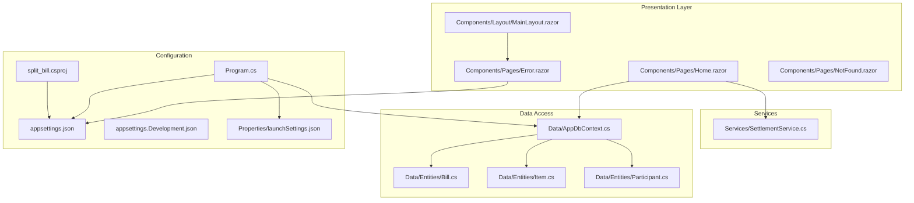
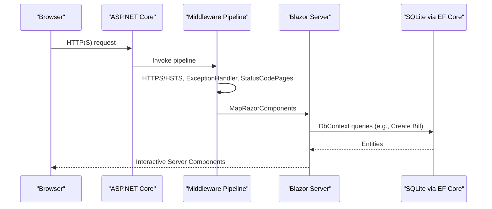
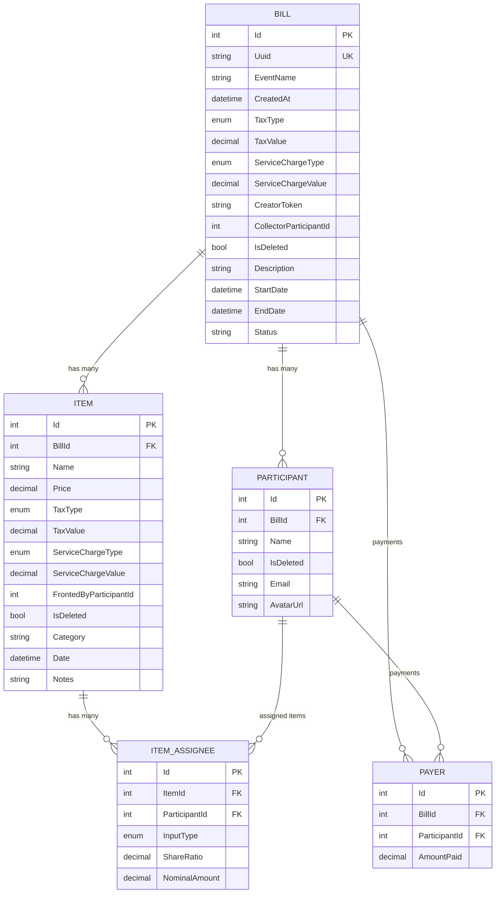
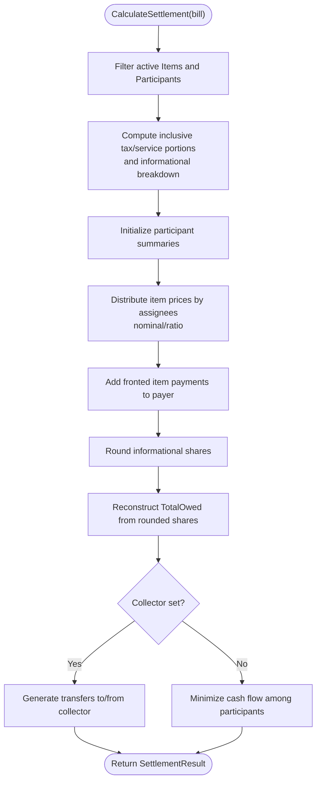
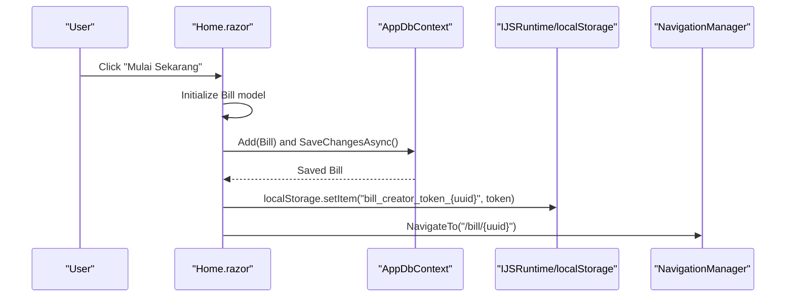
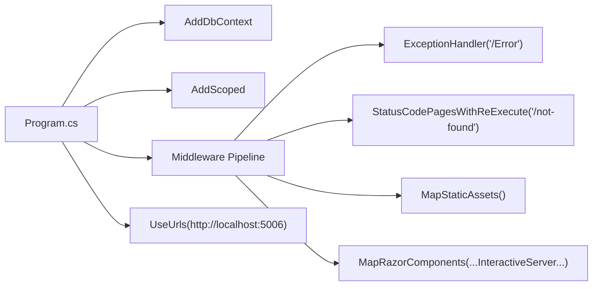

# Troubleshooting and FAQ

<cite>
**Referenced Files in This Document**
- [Program.cs](file://Program.cs)
- [appsettings.json](file://appsettings.json)
- [appsettings.Development.json](file://appsettings.Development.json)
- [split_bill.csproj](file://split_bill.csproj)
- [Properties/launchSettings.json](file://Properties/launchSettings.json)
- [Data/AppDbContext.cs](file://Data/AppDbContext.cs)
- [Data/Entities/Bill.cs](file://Data/Entities/Bill.cs)
- [Data/Entities/Item.cs](file://Data/Entities/Item.cs)
- [Data/Entities/Participant.cs](file://Data/Entities/Participant.cs)
- [Services/SettlementService.cs](file://Services/SettlementService.cs)
- [Components/Pages/Home.razor](file://Components/Pages/Home.razor)
- [Components/Layout/MainLayout.razor](file://Components/Layout/MainLayout.razor)
- [Components/Pages/Error.razor](file://Components/Pages/Error.razor)
- [Components/Pages/NotFound.razor](file://Components/Pages/NotFound.razor)
</cite>

## Table of Contents
1. [Introduction](#introduction)
2. [Project Structure](#project-structure)
3. [Core Components](#core-components)
4. [Architecture Overview](#architecture-overview)
5. [Detailed Component Analysis](#detailed-component-analysis)
6. [Dependency Analysis](#dependency-analysis)
7. [Performance Considerations](#performance-considerations)
8. [Troubleshooting Guide](#troubleshooting-guide)
9. [Conclusion](#conclusion)
10. [Appendices](#appendices)

## Introduction
This document provides comprehensive troubleshooting guidance and FAQs for SplitBill, a Blazor Server application using ASP.NET Core and Entity Framework Core with a SQLite backend. It covers installation and setup issues, database connectivity and migrations, runtime errors, debugging techniques for Blazor Server, Entity Framework pitfalls, performance tuning, browser compatibility, deployment failures, configuration errors, feature limitations, data migration, customization options, diagnostics, and logging strategies.

## Project Structure
SplitBill follows a layered structure:
- Presentation: Razor components under Components/
- Data: Entity models and DbContext under Data/
- Services: Business logic under Services/
- Configuration: appsettings.json, launchSettings.json, project file
- Static assets: wwwroot and node_modules for Tailwind-based styling

**Diagram sources**
- [Program.cs](file://Program.cs)
- [appsettings.json](file://appsettings.json)
- [appsettings.Development.json](file://appsettings.Development.json)
- [Properties/launchSettings.json](file://Properties/launchSettings.json)
- [split_bill.csproj](file://split_bill.csproj)
- [Data/AppDbContext.cs](file://Data/AppDbContext.cs)
- [Data/Entities/Bill.cs](file://Data/Entities/Bill.cs)
- [Data/Entities/Item.cs](file://Data/Entities/Item.cs)
- [Data/Entities/Participant.cs](file://Data/Entities/Participant.cs)
- [Services/SettlementService.cs](file://Services/SettlementService.cs)
- [Components/Pages/Home.razor](file://Components/Pages/Home.razor)
- [Components/Layout/MainLayout.razor](file://Components/Layout/MainLayout.razor)
- [Components/Pages/Error.razor](file://Components/Pages/Error.razor)
- [Components/Pages/NotFound.razor](file://Components/Pages/NotFound.razor)

**Section sources**
- [Program.cs](file://Program.cs)
- [split_bill.csproj](file://split_bill.csproj)
- [Properties/launchSettings.json](file://Properties/launchSettings.json)

## Core Components
- Program.cs: Application startup, DI registration, middleware pipeline, development database lifecycle, and server URL binding.
- Data/AppDbContext.cs: Entity model configuration, indexes, soft-deleted filters, and cascade delete rules.
- Services/SettlementService.cs: Core settlement calculation logic, inclusive tax/service computation, participant summaries, and minimal cash flow transfers.
- Components/Pages/Home.razor: Entry page for creating bills, injecting DbContext, navigation, and localStorage usage.
- Components/Layout/MainLayout.razor: Global layout and Blazor error overlay.
- Components/Pages/Error.razor and NotFound.razor: Error and 404 pages wired in middleware.

Key configuration highlights:
- SQLite provider configured with a local file database.
- Development mode deletes existing database files and ensures schema creation.
- Middleware pipeline sets up HTTPS redirection, exception handling, static assets, anti-forgery, and status code re-execution.

**Section sources**
- [Program.cs](file://Program.cs)
- [Data/AppDbContext.cs](file://Data/AppDbContext.cs)
- [Services/SettlementService.cs](file://Services/SettlementService.cs)
- [Components/Pages/Home.razor](file://Components/Pages/Home.razor)
- [Components/Layout/MainLayout.razor](file://Components/Layout/MainLayout.razor)
- [Components/Pages/Error.razor](file://Components/Pages/Error.razor)
- [Components/Pages/NotFound.razor](file://Components/Pages/NotFound.razor)

## Architecture Overview
The application uses Blazor Server with interactive server render mode. Data access is handled by Entity Framework Core against SQLite. The middleware pipeline configures HTTPS, error handling, and static asset serving.

**Diagram sources**
- [Program.cs](file://Program.cs)
- [Data/AppDbContext.cs](file://Data/AppDbContext.cs)
- [Components/Pages/Home.razor](file://Components/Pages/Home.razor)

## Detailed Component Analysis

### Database Context and Entities
- AppDbContext registers DbSet<T> for Bill, Participant, Item, ItemAssignee, and Payer.
- Unique index on Bill.Uuid and soft-delete filters applied to Bill, Participant, and Item.
- Cascade deletes configured for related entities.
- Development initialization deletes existing database files and runs EnsureCreated.

**Diagram sources**
- [Data/AppDbContext.cs](file://Data/AppDbContext.cs)
- [Data/Entities/Bill.cs](file://Data/Entities/Bill.cs)
- [Data/Entities/Item.cs](file://Data/Entities/Item.cs)
- [Data/Entities/Participant.cs](file://Data/Entities/Participant.cs)

**Section sources**
- [Data/AppDbContext.cs](file://Data/AppDbContext.cs)
- [Data/Entities/Bill.cs](file://Data/Entities/Bill.cs)
- [Data/Entities/Item.cs](file://Data/Entities/Item.cs)
- [Data/Entities/Participant.cs](file://Data/Entities/Participant.cs)

### Settlement Calculation Logic
SettlementService computes inclusive tax/service portions, distributes item costs among assignees, aggregates totals, and generates transfer instructions either via a designated collector or via a minimized cash flow algorithm.

**Diagram sources**
- [Services/SettlementService.cs](file://Services/SettlementService.cs)

**Section sources**
- [Services/SettlementService.cs](file://Services/SettlementService.cs)

### Blazor Server Page Lifecycle and Data Access
Home.razor injects DbContext and NavigationManager, creates a new Bill with generated identifiers, persists to the database, stores a creator token in localStorage, and navigates to the bill route.

**Diagram sources**
- [Components/Pages/Home.razor](file://Components/Pages/Home.razor)
- [Data/AppDbContext.cs](file://Data/AppDbContext.cs)

**Section sources**
- [Components/Pages/Home.razor](file://Components/Pages/Home.razor)

## Dependency Analysis
- Program.cs registers:
  - Blazor interactive server components
  - AppDbContext with SQLite provider
  - SettlementService scoped
  - Kestrel URL binding
  - Middleware pipeline with exception handling, HTTPS, static assets, anti-forgery, and status code re-execution
- Development-specific behavior deletes existing database files and ensures schema creation.
- Project references Entity Framework Core providers and tools.

**Diagram sources**
- [Program.cs](file://Program.cs)

**Section sources**
- [Program.cs](file://Program.cs)
- [split_bill.csproj](file://split_bill.csproj)

## Performance Considerations
- Database:
  - Soft-deleted entities rely on query filters; ensure appropriate indexing on foreign keys and Uuid for fast lookups.
  - Consider adding indexes for frequent filter/search columns if needed.
- Blazor Server:
  - Interactive server mode can increase server memory and bandwidth usage; monitor session counts and long polling overhead.
  - Minimize unnecessary re-renders by structuring state updates efficiently.
- Entity Framework:
  - Prefer explicit includes or projections for large queries.
  - Avoid loading excessive navigation properties when not needed.
- Static Assets:
  - Ensure Tailwind compilation runs during build to avoid runtime CSS generation delays.

[No sources needed since this section provides general guidance]

## Troubleshooting Guide

### Installation and Setup
Common issues and resolutions:
- Missing .NET runtime or SDK:
  - Ensure the target framework matches installed .NET version.
  - Verify implicit usings and nullable settings are supported.
- Node.js and Tailwind:
  - Tailwind build is executed conditionally when node_modules exists; install Node.js and run npm install if Tailwind CSS is not built.
- Package restore failures:
  - Clear NuGet cache and retry restore.
  - Ensure internet connectivity and correct feeds.

**Section sources**
- [split_bill.csproj](file://split_bill.csproj)

### Database Connectivity and Schema Issues
Symptoms:
- Application fails to start in development with database errors.
- Data not persisted or schema missing.

Resolutions:
- Development behavior:
  - Existing database files are deleted automatically during development startup; if deletion fails due to lock, close other processes using the file and retry.
  - Ensure EnsureCreated runs after deletion to create schema.
- Provider configuration:
  - SQLite provider is registered with a local file connection string; verify file path accessibility and permissions.
- Migrations:
  - Migrations exist under Migrations; if schema drift occurs, scaffold and apply migrations using EF Core tools.

**Section sources**
- [Program.cs](file://Program.cs)
- [Data/AppDbContext.cs](file://Data/AppDbContext.cs)

### Runtime Errors and Exceptions
Symptoms:
- Unhandled exceptions show a generic error page.
- Blazor error overlay appears with reload option.

Resolutions:
- Enable development mode locally to reveal detailed error information.
- Use the error page guidance to set the environment variable and restart the application.
- Review logs for stack traces and correlation IDs.

**Section sources**
- [Components/Layout/MainLayout.razor](file://Components/Layout/MainLayout.razor)
- [Components/Pages/Error.razor](file://Components/Pages/Error.razor)
- [appsettings.json](file://appsettings.json)
- [appsettings.Development.json](file://appsettings.Development.json)

### Blazor Server Debugging Techniques
Techniques:
- Enable developer error pages by setting the environment to Development locally.
- Use browser dev tools to inspect network requests, SignalR transport, and component rendering.
- Inspect localStorage usage for creator tokens and session data.
- Add logging around data access and navigation to trace execution.

**Section sources**
- [Components/Pages/Error.razor](file://Components/Pages/Error.razor)
- [Components/Pages/Home.razor](file://Components/Pages/Home.razor)
- [appsettings.Development.json](file://appsettings.Development.json)

### Entity Framework Issues
Common problems:
- Missing indexes or filters causing slow queries.
- Cascade delete behavior unexpectedly removing related records.
- Soft-deleted entities not filtering properly.

Resolutions:
- Review model configuration for unique indexes and query filters.
- Confirm cascade delete rules align with intended data lifecycle.
- Ensure query filters are respected by using appropriate LINQ operators and avoiding bypasses.

**Section sources**
- [Data/AppDbContext.cs](file://Data/AppDbContext.cs)

### Performance Problems
Symptoms:
- Slow page loads or long-running calculations.
- High memory usage in Blazor Server sessions.

Resolutions:
- Optimize settlement calculations by reducing allocations and avoiding redundant computations.
- Limit data returned to the client; use projections or pagination.
- Monitor server resources and adjust hosting limits.

**Section sources**
- [Services/SettlementService.cs](file://Services/SettlementService.cs)

### Browser Compatibility Issues
Symptoms:
- Features not working in older browsers.
- JavaScript interop failing.

Resolutions:
- Ensure modern browser support for Blazor Server and interactive features.
- Test with supported browsers and versions.
- Validate localStorage availability and permissions.

**Section sources**
- [Components/Pages/Home.razor](file://Components/Pages/Home.razor)

### Deployment Failures
Symptoms:
- Application starts but serves blank pages or throws runtime errors.
- Static assets not found.

Resolutions:
- Verify environment variables and appsettings for production.
- Ensure HTTPS redirection and HSTS are configured appropriately for the deployment platform.
- Confirm static assets are published and mapped correctly.

**Section sources**
- [Program.cs](file://Program.cs)
- [appsettings.json](file://appsettings.json)

### Configuration Errors
Symptoms:
- Wrong URLs or ports.
- Logging level not capturing sufficient detail.

Resolutions:
- Adjust Kestrel URLs in program code and launch settings.
- Set logging levels in appsettings for diagnostics.
- Validate AllowedHosts and CORS policies if applicable.

**Section sources**
- [Program.cs](file://Program.cs)
- [Properties/launchSettings.json](file://Properties/launchSettings.json)
- [appsettings.json](file://appsettings.json)

### Feature Limitations and Known Constraints
- SQLite provider limitations compared to SQL Server or PostgreSQL.
- Soft-deleted entities require consistent query filters.
- Minimal cash flow transfer algorithm minimizes transfers but may not reflect real-world payment order.

**Section sources**
- [Data/AppDbContext.cs](file://Data/AppDbContext.cs)
- [Services/SettlementService.cs](file://Services/SettlementService.cs)

### Data Migration and Integrity
- Use EF Core migrations to evolve schema safely.
- Back up the SQLite database before applying migrations in production-like environments.
- Validate data after migration by running representative queries.

**Section sources**
- [Data/AppDbContext.cs](file://Data/AppDbContext.cs)

### Customization Options
- Modify logging levels and categories in appsettings.
- Extend entity models and DbContext as needed.
- Customize middleware pipeline for additional security or diagnostics.

**Section sources**
- [appsettings.json](file://appsettings.json)
- [Program.cs](file://Program.cs)

### Diagnostic Commands and Logging Strategies
Commands:
- Run the application in Development to enable detailed error pages.
- Use browser dev tools Network tab to inspect SignalR and HTTP traffic.
- Check server logs for exceptions and warnings.

Logging:
- Configure logging levels in appsettings to capture warnings and errors.
- In development, increase verbosity temporarily to diagnose issues.

**Section sources**
- [appsettings.json](file://appsettings.json)
- [appsettings.Development.json](file://appsettings.Development.json)
- [Components/Pages/Error.razor](file://Components/Pages/Error.razor)

## Conclusion
This guide consolidates actionable steps to troubleshoot SplitBill across installation, database, runtime, Blazor Server, Entity Framework, performance, browser compatibility, deployment, configuration, and customization. Use the provided diagnostics and logging strategies to isolate issues quickly and apply targeted fixes.

## Appendices

### Frequently Asked Questions (FAQ)
- Why does the app delete the database on startup?
  - In development, the app attempts to remove existing database files and ensures a fresh schema to simplify iteration.
- How do I enable detailed error messages?
  - Set the environment to Development locally so the error page shows detailed information.
- Why am I seeing soft-deleted records?
  - Query filters are applied to exclude deleted entities; ensure your queries respect these filters.
- Can I switch to SQL Server or PostgreSQL?
  - Yes, by changing the provider and connection string; ensure migrations and model configurations remain compatible.
- How do I customize logging?
  - Adjust logging levels in appsettings.json and appsettings.Development.json.

**Section sources**
- [Program.cs](file://Program.cs)
- [appsettings.json](file://appsettings.json)
- [appsettings.Development.json](file://appsettings.Development.json)
- [Data/AppDbContext.cs](file://Data/AppDbContext.cs)