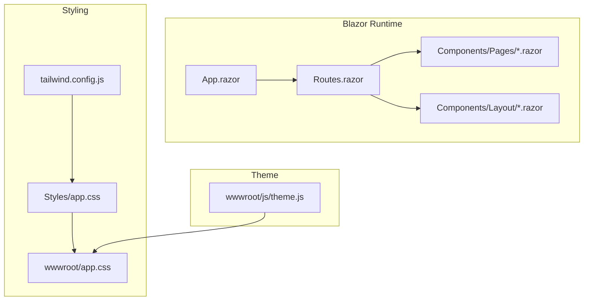
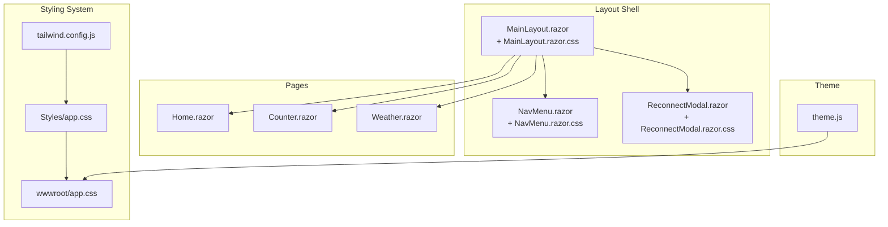
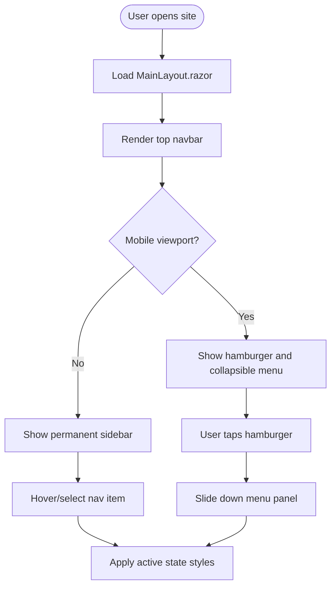
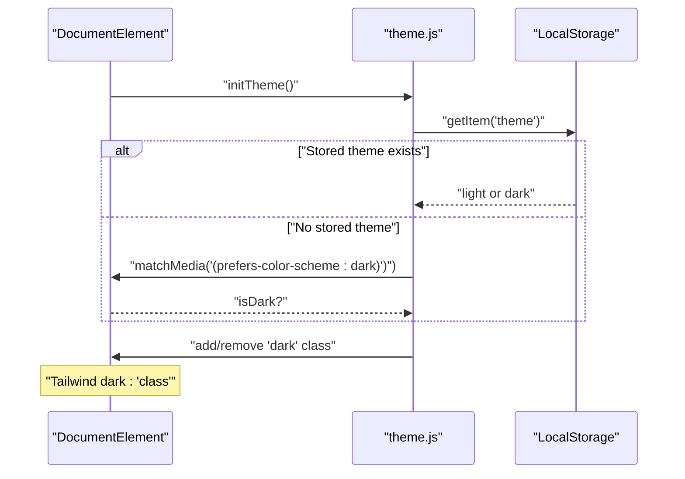
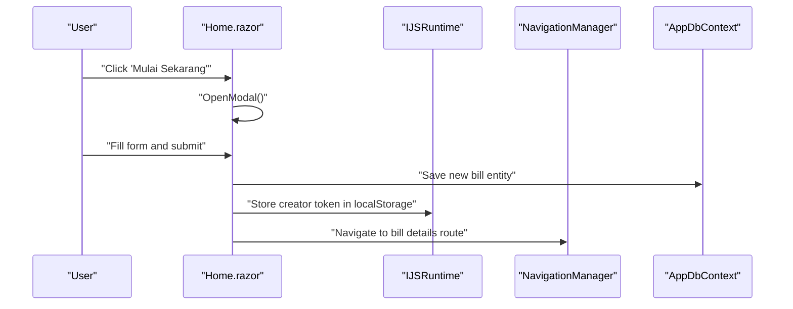
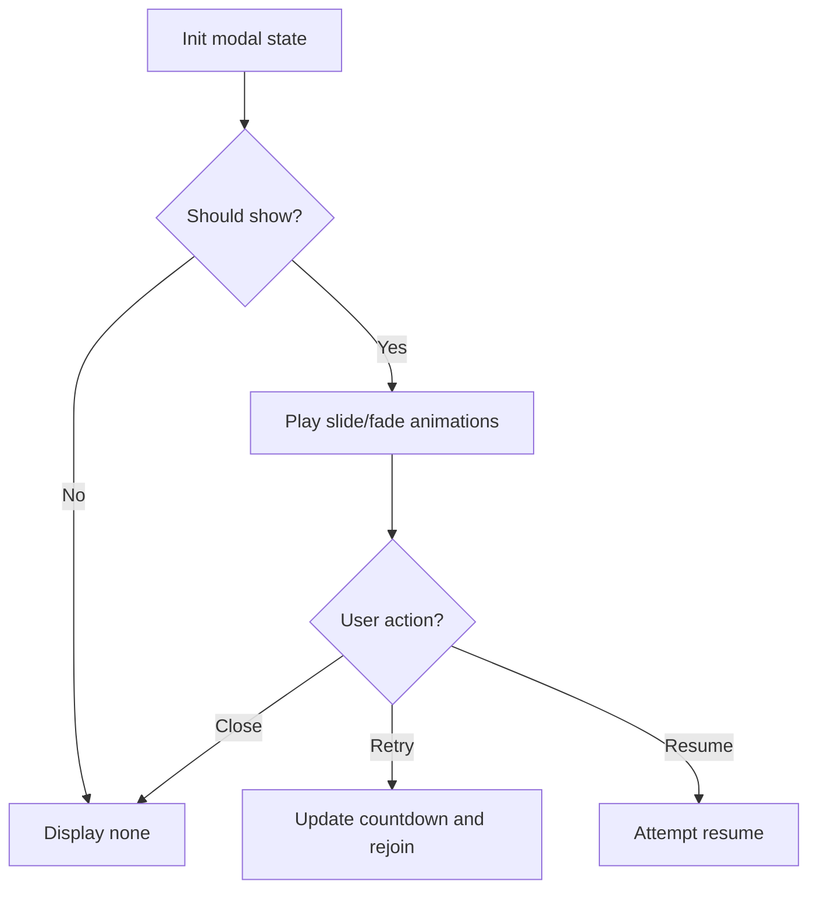
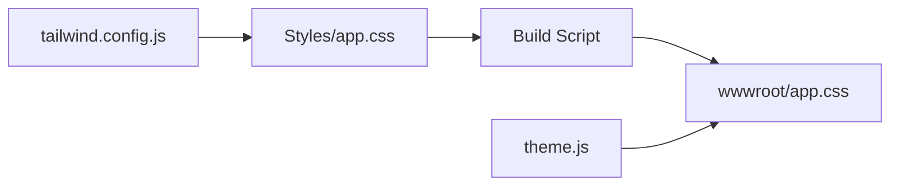

# User Interface

<cite>
**Referenced Files in This Document**
- [MainLayout.razor](file://Components/Layout/MainLayout.razor)
- [MainLayout.razor.css](file://Components/Layout/MainLayout.razor.css)
- [NavMenu.razor](file://Components/Layout/NavMenu.razor)
- [NavMenu.razor.css](file://Components/Layout/NavMenu.razor.css)
- [ReconnectModal.razor](file://Components/Layout/ReconnectModal.razor)
- [ReconnectModal.razor.css](file://Components/Layout/ReconnectModal.razor.css)
- [Home.razor](file://Components/Pages/Home.razor)
- [Counter.razor](file://Components/Pages/Counter.razor)
- [Weather.razor](file://Components/Pages/Weather.razor)
- [tailwind.config.js](file://tailwind.config.js)
- [Styles/app.css](file://Styles/app.css)
- [wwwroot/app.css](file://wwwroot/app.css)
- [theme.js](file://wwwroot/js/theme.js)
- [package.json](file://package.json)
- [Program.cs](file://Program.cs)
</cite>

## Table of Contents
1. [Introduction](#introduction)
2. [Project Structure](#project-structure)
3. [Core Components](#core-components)
4. [Architecture Overview](#architecture-overview)
5. [Detailed Component Analysis](#detailed-component-analysis)
6. [Dependency Analysis](#dependency-analysis)
7. [Performance Considerations](#performance-considerations)
8. [Troubleshooting Guide](#troubleshooting-guide)
9. [Conclusion](#conclusion)
10. [Appendices](#appendices)

## Introduction
This document describes SplitBill’s user interface, focusing on the responsive design system built with TailwindCSS, component styling patterns, theme switching, layout architecture, navigation, interactive elements, and state management in Blazor components. It also covers accessibility, cross-browser compatibility, performance optimization, and mobile responsiveness with touch interaction patterns.

## Project Structure
SplitBill organizes UI under Components/Layout and Components/Pages, with TailwindCSS-driven styling compiled into wwwroot/app.css. Theme switching is implemented via a small JavaScript module that toggles a CSS class on the root element. The build process compiles Tailwind layers and animations, and the runtime integrates Blazor interactive server components.

**Diagram sources**
- [tailwind.config.js:1-22](file://tailwind.config.js#L1-L22)
- [Styles/app.css:1-70](file://Styles/app.css#L1-L70)
- [wwwroot/app.css:1-2472](file://wwwroot/app.css#L1-L2472)
- [theme.js:1-36](file://wwwroot/js/theme.js#L1-L36)

**Section sources**
- [Program.cs:10-11](file://Program.cs#L10-L11)
- [package.json:6-10](file://package.json#L6-L10)
- [tailwind.config.js:1-22](file://tailwind.config.js#L1-L22)

## Core Components
- Main layout wrapper sets global background, text color, font family, and anti-aliasing. It hosts the page body and a global error UI.
- Navigation sidebar provides a collapsible mobile-friendly menu with icons and active-state highlighting.
- Reconnect modal handles transient connection states with animated transitions and user actions.
- Home page composes a responsive hero, feature cards, footer, and a form modal with validation and submission.
- Counter and Weather pages illustrate minimal Blazor interactivity and data rendering.

Key styling patterns:
- Tailwind utilities for responsive breakpoints, spacing, typography, shadows, and transitions.
- Layered animations (fade-in, slide-up, floating cards) implemented via Tailwind and custom keyframes.
- Dark mode enabled via a CSS class strategy with persistent preference storage.

**Section sources**
- [MainLayout.razor:1-12](file://Components/Layout/MainLayout.razor#L1-L12)
- [MainLayout.razor.css:1-99](file://Components/Layout/MainLayout.razor.css#L1-L99)
- [NavMenu.razor:1-31](file://Components/Layout/NavMenu.razor#L1-L31)
- [NavMenu.razor.css:1-106](file://Components/Layout/NavMenu.razor.css#L1-L106)
- [ReconnectModal.razor:1-32](file://Components/Layout/ReconnectModal.razor#L1-L32)
- [ReconnectModal.razor.css:1-158](file://Components/Layout/ReconnectModal.razor.css#L1-L158)
- [Home.razor:1-325](file://Components/Pages/Home.razor#L1-L325)
- [Counter.razor:1-19](file://Components/Pages/Counter.razor#L1-L19)
- [Weather.razor:1-64](file://Components/Pages/Weather.razor#L1-L64)

## Architecture Overview
The UI architecture centers on:
- Layout shell with sticky header and optional sidebar.
- Page-level components with isolated styling and state.
- TailwindCSS as the design system with custom animations and dark mode support.
- JavaScript bridge for theme persistence and initialization.

**Diagram sources**
- [MainLayout.razor:1-12](file://Components/Layout/MainLayout.razor#L1-L12)
- [MainLayout.razor.css:1-99](file://Components/Layout/MainLayout.razor.css#L1-L99)
- [NavMenu.razor:1-31](file://Components/Layout/NavMenu.razor#L1-L31)
- [NavMenu.razor.css:1-106](file://Components/Layout/NavMenu.razor.css#L1-L106)
- [ReconnectModal.razor:1-32](file://Components/Layout/ReconnectModal.razor#L1-L32)
- [ReconnectModal.razor.css:1-158](file://Components/Layout/ReconnectModal.razor.css#L1-L158)
- [Home.razor:1-325](file://Components/Pages/Home.razor#L1-L325)
- [Counter.razor:1-19](file://Components/Pages/Counter.razor#L1-L19)
- [Weather.razor:1-64](file://Components/Pages/Weather.razor#L1-L64)
- [tailwind.config.js:1-22](file://tailwind.config.js#L1-L22)
- [Styles/app.css:1-70](file://Styles/app.css#L1-L70)
- [wwwroot/app.css:1-2472](file://wwwroot/app.css#L1-L2472)
- [theme.js:1-36](file://wwwroot/js/theme.js#L1-L36)

## Detailed Component Analysis

### Layout and Navigation
- Sticky top bar with brand and call-to-action; responsive breakpoint adjusts alignment and spacing.
- Collapsible sidebar with hamburger toggle using a pure CSS approach (checkbox hack) for mobile; remains expanded on wider screens with scrolling support.
- Active nav highlighting and hover states for accessibility and clarity.

**Diagram sources**
- [MainLayout.razor.css:39-77](file://Components/Layout/MainLayout.razor.css#L39-L77)
- [NavMenu.razor.css:1-106](file://Components/Layout/NavMenu.razor.css#L1-L106)

**Section sources**
- [MainLayout.razor.css:1-99](file://Components/Layout/MainLayout.razor.css#L1-L99)
- [NavMenu.razor:1-31](file://Components/Layout/NavMenu.razor#L1-L31)
- [NavMenu.razor.css:1-106](file://Components/Layout/NavMenu.razor.css#L1-L106)

### Theme Switching and Dark Mode
- JavaScript module persists user preference in local storage and applies a CSS class to the root element.
- Tailwind is configured to use a class-based dark mode strategy.
- Initial theme detection respects OS preference when no user preference is stored.

**Diagram sources**
- [theme.js:1-36](file://wwwroot/js/theme.js#L1-L36)
- [tailwind.config.js](file://tailwind.config.js#L3)

**Section sources**
- [theme.js:1-36](file://wwwroot/js/theme.js#L1-L36)
- [tailwind.config.js:1-22](file://tailwind.config.js#L1-L22)

### Home Page: Composition, Forms, and Animations
- Sticky header with logo and primary action.
- Hero section with animated text and floating illustrations.
- Feature cards with hover effects and subtle shadows.
- Modal dialog for creating a new bill session with validation and navigation.
- State managed locally in the component with event handlers for open/close and submit.

**Diagram sources**
- [Home.razor:237-301](file://Components/Pages/Home.razor#L237-L301)

**Section sources**
- [Home.razor:1-325](file://Components/Pages/Home.razor#L1-L325)

### Reconnect Modal: Transient States and UX
- Uses native dialog element with custom styles and animations.
- Visibility controlled by CSS classes toggled via JavaScript.
- Provides retry and resume actions with clear messaging for different failure modes.

**Diagram sources**
- [ReconnectModal.razor.css:1-158](file://Components/Layout/ReconnectModal.razor.css#L1-L158)

**Section sources**
- [ReconnectModal.razor:1-32](file://Components/Layout/ReconnectModal.razor#L1-L32)
- [ReconnectModal.razor.css:1-158](file://Components/Layout/ReconnectModal.razor.css#L1-L158)

### Accessibility and Cross-Browser Compatibility
- Semantic HTML and ARIA attributes present where needed (e.g., aria-labels on table headers).
- Focus styles and hover states improve keyboard and pointer accessibility.
- CSS resets normalize baseline across browsers; Tailwind utilities ensure consistent spacing and typography.
- iOS-specific adjustments (e.g., tap highlight removal) and form control normalization reduce platform inconsistencies.

**Section sources**
- [Weather.razor:17-22](file://Components/Pages/Weather.razor#L17-L22)
- [wwwroot/app.css:146-165](file://wwwroot/app.css#L146-L165)
- [wwwroot/app.css:305-330](file://wwwroot/app.css#L305-L330)
- [wwwroot/app.css:406-421](file://wwwroot/app.css#L406-L421)

## Dependency Analysis
- TailwindCSS configuration defines content globs to scan Blazor components and static assets, ensuring purge-safe builds.
- Styles/app.css layers define base, components, utilities, and custom animations.
- The build script compiles Styles/app.css into wwwroot/app.css.
- Theme.js depends on DOM APIs and localStorage; Tailwind dark mode relies on a class on the root element.

**Diagram sources**
- [tailwind.config.js:1-22](file://tailwind.config.js#L1-L22)
- [Styles/app.css:1-70](file://Styles/app.css#L1-L70)
- [package.json:6-10](file://package.json#L6-L10)
- [theme.js:1-36](file://wwwroot/js/theme.js#L1-L36)

**Section sources**
- [tailwind.config.js:1-22](file://tailwind.config.js#L1-L22)
- [Styles/app.css:1-70](file://Styles/app.css#L1-L70)
- [package.json:6-10](file://package.json#L6-L10)
- [wwwroot/app.css:1-2472](file://wwwroot/app.css#L1-L2472)

## Performance Considerations
- Minimize unnecessary reflows by leveraging Tailwind’s utility-first approach and avoiding dynamic class concatenation in loops.
- Keep animations lightweight; the existing animations use transforms and opacity for GPU acceleration.
- Use lazy loading for images and defer non-critical scripts.
- Prefer CSS containment and isolation for heavy components to limit paint areas.
- Tailwind purging (via content globs) reduces CSS payload; ensure all component paths are included.

[No sources needed since this section provides general guidance]

## Troubleshooting Guide
- Theme not applying on initial load:
  - Verify the theme initialization runs early and that the root element receives the dark class when applicable.
  - Confirm localStorage key/value and OS preference fallback logic.
- Dark mode not persisting:
  - Check that the theme setter writes to localStorage and toggles the class on the root element.
- Layout shifts or inconsistent spacing:
  - Ensure Tailwind utilities are applied consistently and that custom animations do not introduce layout thrashing.
- Modal not closing or overlapping:
  - Confirm backdrop click handlers and event propagation are correctly wired.
- Build errors for Tailwind:
  - Run the build/watch script to regenerate wwwroot/app.css from Styles/app.css.

**Section sources**
- [theme.js:1-36](file://wwwroot/js/theme.js#L1-L36)
- [ReconnectModal.razor.css:1-158](file://Components/Layout/ReconnectModal.razor.css#L1-L158)
- [package.json:6-10](file://package.json#L6-L10)

## Conclusion
SplitBill’s UI leverages TailwindCSS for a consistent, responsive design system, complemented by a small JavaScript theme manager and robust Blazor component patterns. The layout supports both mobile and desktop experiences, while interactive elements and modals provide clear feedback. Following the outlined accessibility, compatibility, and performance recommendations will help maintain a high-quality user experience across devices and browsers.

[No sources needed since this section summarizes without analyzing specific files]

## Appendices

### Responsive Breakpoints and Patterns
- Mobile-first design with explicit breakpoints for sidebar behavior and content layout.
- Grid and flex utilities enable adaptive card layouts and hero sections.

**Section sources**
- [MainLayout.razor.css:39-77](file://Components/Layout/MainLayout.razor.css#L39-L77)
- [Home.razor:124-160](file://Components/Pages/Home.razor#L124-L160)

### Touch Interaction Patterns
- Hamburger menu uses a checkbox hack for collapsible behavior without JavaScript.
- Buttons and controls use hover and active states; ensure sufficient touch target sizes and spacing.

**Section sources**
- [NavMenu.razor.css:1-106](file://Components/Layout/NavMenu.razor.css#L1-L106)
- [Home.razor:23-56](file://Components/Pages/Home.razor#L23-L56)