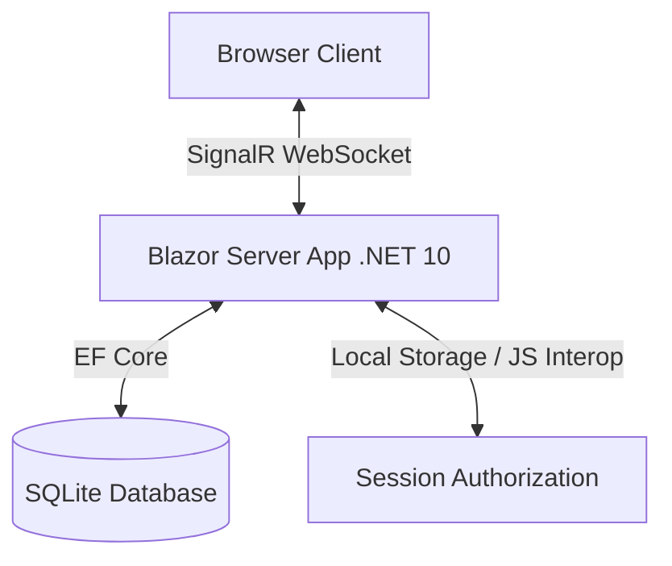

# Implementation Plan - SplitBill App

Implementation plan for SplitBill App, a frictionless web application to split bills accurately and transparently, built using .NET 10 (Blazor Server), Entity Framework Core (SQLite), and Tailwind CSS.

## User Review Required

> [!IMPORTANT]
> **Tailwind CSS Version Selection**
> We need to select the Tailwind CSS version. We recommend using **Tailwind v4** since it represents the latest standard, features a highly optimized Rust compiler, and uses CSS-only configuration rather than a JS configuration file. However, if you have a preference for **Tailwind v3**, please let us know.
>
> **Project Initialization**
> We plan to initialize the Blazor Server project directly in the workspace root `d:\Santo File\Antigravity\split_bill`.

## Open Questions

> [!NOTE]
> **Tax & Service Type Support**
> Should tax and service charges be entered as a **percentage** (e.g., 10% tax, 5% service charge), a **flat fixed amount** (e.g., Rp 20.000 tax), or **both**? 
> We propose supporting both percentage and fixed amount types, which makes the app extremely versatile for different receipt formats.

---

## Proposed Architecture & Tech Stack

### 1. Database Schema (SQLite + EF Core)

We will use Entity Framework Core with SQLite. Here are the proposed database entities:

- **`Bill`**: Represents a billing session.
  - `Id` (int, PK)
  - `Uuid` (string, Unique Index, e.g., short UUID)
  - `EventName` (string)
  - `CreatedAt` (DateTime)
  - `TaxType` (Enum: Percentage / Fixed)
  - `TaxValue` (decimal)
  - `ServiceChargeType` (Enum: Percentage / Fixed)
  - `ServiceChargeValue` (decimal)
  - `CreatorToken` (string, generated Guid to authorize the creator)
  - `IsDeleted` (bool, soft delete flag)

- **`Participant`**: A person involved in the bill.
  - `Id` (int, PK)
  - `BillId` (int, FK)
  - `Name` (string)
  - `IsDeleted` (bool, soft delete flag)

- **`Item`**: A food/beverage or expense item.
  - `Id` (int, PK)
  - `BillId` (int, FK)
  - `Name` (string)
  - `Price` (decimal)
  - `IsDeleted` (bool, soft delete flag)

- **`ItemAssignee`**: Maps items to participants.
  - `Id` (int, PK)
  - `ItemId` (int, FK)
  - `ParticipantId` (int, FK)
  - `ShareRatio` (decimal - for custom proportion, defaults to 1.0)

- **`Payer`**: Records payments made to the cashier.
  - `Id` (int, PK)
  - `BillId` (int, FK)
  - `ParticipantId` (int, FK)
  - `AmountPaid` (decimal)

---

### 2. Session Management (Creator vs. Viewer)

To maintain a frictionless "no-login" experience:
1. **Creation**: When a user creates a bill, we generate a unique `CreatorToken` (Guid) and store it in the `Bill` table.
2. **Local Storage**: The browser saves this token in `localStorage` under `bill_creator_token_{uuid}`.
3. **Authorization**: When rendering `/bill/{uuid}`, Blazor Server retrieves this token from the client's `localStorage` via JS Interop:
   - If it matches the database's `CreatorToken`, the user is granted **Creator** access (can add/edit items, participants, payers).
   - If it doesn't match or is missing, the user is in **Viewer** mode (read-only, can only view totals and the settlement instructions).

---

### 3. Settlement Engine (Greedy Algorithm)

The settlement engine will run the **Minimize Cash Flow** algorithm to compute the most optimal transfer routes:

1. **Calculate Food Subtotal**:
   For each item, divide its price among its assignees (proportional to their `ShareRatio`). Sum these shares for each participant to get their food subtotal $Subtotal_i$.

2. **Distribute Tax & Service Charges Proportional to Consumption**:
   - Total food subtotal: $TotalSubtotal = \sum Subtotal_i$.
   - **Percentage-based**:
     - $Tax_i = Subtotal_i \times (TaxPercent / 100)$
     - $Service_i = Subtotal_i \times (ServicePercent / 100)$
   - **Fixed-amount**:
     - $Tax_i = TotalTax \times \frac{Subtotal_i}{TotalSubtotal}$
     - $Service_i = TotalService \times \frac{Subtotal_i}{TotalSubtotal}$
   - Total Owed: $Owed_i = Subtotal_i + Tax_i + Service_i$.

3. **Calculate Net Balances**:
   - Total Paid: $Paid_i$ is the sum of payments by participant $i$ as a `Payer`.
   - Net Balance: $Balance_i = Paid_i - Owed_i$.
     - If $Balance_i > 0$: **Creditor** (deserves money back).
     - If $Balance_i < 0$: **Debtor** (owes money).

4. **Greedy Matching (Minimize Cash Flow)**:
   - Separate participants into `Creditors` and `Debtors` lists.
   - Loop until all balances are resolved:
     - Find the maximum creditor (most positive balance) and maximum debtor (most negative balance).
     - Calculate transfer amount: $Amount = \min(|Balance_{Debtor}|, Balance_{Creditor})$.
     - Record transfer instruction: `Debtor pays Amount to Creditor`.
     - Update balances: $Balance_{Debtor} \leftarrow Balance_{Debtor} + Amount$, $Balance_{Creditor} \leftarrow Balance_{Creditor} - Amount$.

---

### 4. UI/UX Design System (Corporate & Techy Dark/Light Mode)

We will craft a highly polished, responsive, and tactile interface:
- **Design Aesthetic**: Slate/zinc background, glowing subtle borders, clean monospace figures for financial amounts.
- **Mobile First**: Single-column scroll layout optimized for phones, with sticky footer buttons for quick actions.
- **Visual Validation Warnings**: A prominent, amber-glowing warning banner when the total cash paid by payers $\neq$ total bill cost (items + tax + service).
- **Quick Add**: "Quick Add" Participant input field with Enter-key trigger.
- **Transitions**: Smooth animations on state changes (adding an item, assigning participants, displaying transfers).

---

## Proposed Changes

We will create a Blazor Web App with SQLite and Tailwind CSS in the workspace.

### [NEW] [Database Context & Models](file:///d:/Santo%20File/Antigravity/split_bill/Data)
- Database context `AppDbContext.cs`
- Entity classes: `Bill.cs`, `Participant.cs`, `Item.cs`, `ItemAssignee.cs`, `Payer.cs`.

### [NEW] [Settlement Service](file:///d:/Santo%20File/Antigravity/split_bill/Services)
- `SettlementService.cs` implementing the Greedy cash-flow minimization algorithm.

### [NEW] [Blazor Components & Pages](file:///d:/Santo%20File/Antigravity/split_bill/Components)
- `Home.razor` (Landing page for bill creation)
- `BillDetails.razor` (Interactive bill editor and summary page)
- Shared layouts and styling components (supporting light/dark mode transition)

---

## Verification Plan

### Automated Tests
- We will write a set of unit tests for `SettlementService` verifying that the greedy algorithm successfully resolves complex splitting scenarios and returns optimal transfers.
- Command: `dotnet test`

### Manual Verification
- Run the Blazor application using `dotnet watch` or `dotnet run`.
- Verify the mobile responsive layout, creation of new bills, UUID generation, items/participants editing (Creator mode), copy-link view (Viewer mode), and real-time computation of settlement instructions.
